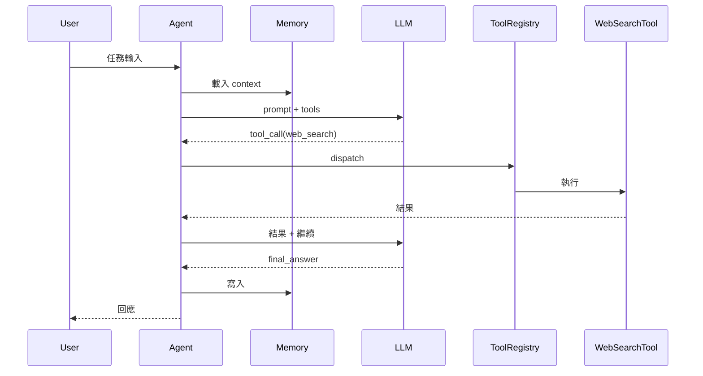

<!--
AGENT INSTRUCTIONS — Agentic Project Template
=============================================
Same usage as backend.md. This template focuses on:
- Agent control flow (ReAct / Plan-Execute / state machine)
- Prompt management
- Tool / function registry
- Memory architecture
- LLM provider abstraction

Write in Traditional Chinese (繁體中文).
-->

=== FILE: README.md ===

---
repo: <owner>/<repo>
type: agentic
studied_at: YYYY-MM-DD
commit_sha: <short-sha>
language: <primary-language>
framework: <例如 langgraph / crewai / autogen / 自製>
agent_style: <single-agent | multi-agent | orchestrator+workers>
stars: <approximate>
status: active | maintenance | archived
---

# <repo-name> · 概覽

<!-- AGENT: 一句話描述。Agentic 專案常被混為一談,務必精準。 -->

## 解決什麼問題

<!-- 它讓 agent 系統的哪一塊變簡單?例如:
     - 簡化 multi-agent 協作
     - 提供 stateful agent 的執行框架
     - 把 LLM provider 切換變透明
     - 提供 evaluation / tracing 工具
   -->

## 為什麼值得研究

<!-- AGENT: 從以下面向挑 2-3 點:
     - 架構選擇有特色(例如把 agent 表示為 graph、state machine)
     - 處理某個棘手問題的方式(例如 long-context、tool 失敗、agent 跑飛)
     - 在 agent 生態系中的定位獨特
   -->

## Agent 系統定位

| 面向 | 選擇 |
|---|---|
| Agent 風格 | <ReAct / Plan-Execute / Graph / State machine / Workflow> |
| 數量 | <single / multi-agent> |
| 編排方式 | <hardcoded / declarative / LLM-decided> |
| Memory | <stateless / session / cross-session> |
| Tool calling | <native function calling / prompt-based / 自製 protocol> |

## 技術棧一句話

`<language>` + `<agent framework>` + `<LLM provider>` + `<其他>`

## 健康度信號

- ⭐ Stars: ~<數字>
- 📅 最後 commit: <日期>
- 👥 主要維護者: <人數或組織>
- 🔄 commit 頻率: <每週/每月活躍程度>

## 我會在後續筆記中回答的問題

- ?
- ?
- ?


=== FILE: 1-architecture.md ===

---
repo: <owner>/<repo>
file: 1-architecture
---

# <repo-name> · 架構

## Agent 系統高層圖

```mermaid
<!-- AGENT: 畫出 agent 的核心結構。
     若是 single agent: 展示其 loop 與週邊組件
     若是 multi-agent: 展示 agents 之間的關係
     重點是 agent、tools、memory、LLM 怎麼互動 -->
flowchart TB
    User --> AgentLoop
    AgentLoop --> LLM
    AgentLoop --> ToolRegistry
    AgentLoop --> Memory
    ToolRegistry --> Tools[個別 Tools]
    Memory --> ShortTerm[Short-term]
    Memory --> LongTerm[Long-term]
```

## Agent 控制流

<!-- AGENT: 這是 agentic 專案的核心。詳細說明 agent 怎麼「想 → 動 → 觀察」。 -->

### 主迴圈位置

[REF: path:line]

### 控制流類型

- **是 ReAct、Plan-Execute、graph,還是其他?**:
- **終止條件**:<max iterations? LLM 回傳特定 token? 達成目標時? [REF: path:line]>
- **錯誤處理**:<tool 失敗怎麼辦?LLM 超時怎麼辦?[REF: path:line]>

### 一個 turn 的具體流程

<!-- AGENT: 用 pseudo-code 描述一個 turn 從開始到結束做了什麼 -->

```
1. 從 memory 載入 context
2. 把 user input + memory + tool descriptions 組成 prompt
3. 呼叫 LLM
4. 解析 response: 是 tool call 還是 final answer?
5. 若是 tool call → 執行 → 把結果加回 message list → 回到 step 2
6. 若是 final answer → 寫入 memory → 結束
```

## Prompt 管理

<!-- AGENT: prompt 在這個 repo 怎麼被組織,是學習重點 -->

- **System prompts 放在哪**:[REF: path]
- **是否使用 template 引擎**:<例如 Jinja2、自製、純字串拼接>
- **是否有 prompt 版本控制**:<git 追、有 versioning 機制、無>
- **典型 prompt 結構**:
  ```
  <展示一個代表性的 system prompt 結構,可截短>
  ```
- **動態組裝邏輯**:[REF: path:line]

## Tool / Function 系統

- **Tool 註冊方式**:[REF: path:line] — <裝飾器 / class-based / config>
- **Tool schema 定義**:<JSON Schema / Pydantic / 自製格式>
- **Tool 呼叫協定**:<LLM native function calling / 解析文字 / 結構化輸出>
- **內建 Tools 清單**:
  | Tool | 用途 | 程式碼 |
  |---|---|---|
  | <name> | <purpose> | [REF: path] |
- **Tool 錯誤處理**:[REF: path:line] — <retry? 餵回 LLM 讓它調整?>
- **Tool 權限 / 安全**:[REF: path:line] 或「無」

## Memory 架構

<!-- AGENT: Memory 是 agent 系統的關鍵差異化點 -->

### Short-term(對話內)

- **儲存形式**:<list of messages / state object / 其他>
- **截斷策略**:<window / summarization / 無>
- **位置**:[REF: path:line]

### Long-term(跨對話)

- **是否有**:<是 / 否>
- **儲存後端**:<vector DB / SQL / file / 其他> [REF: path]
- **寫入時機**:<每個 turn / 主動 / 被動 / 由 LLM 決定>
- **讀取策略**:<相似度檢索 / 關鍵字 / 全部載入>

### State 管理

- **是否可中斷續跑**:<是 / 否> [REF: path:line]
- **State 序列化方式**:<JSON / pickle / 自製>

## LLM Provider 抽象

- **抽象方式**:<adapter / interface / 直接綁定>
- **支援的 providers**:<列舉>
- **切換 provider 需要改的地方**:[REF: path:line]
- **是否有 fallback**:<是 / 否>

## Multi-agent(若適用)

- **Agents 數量與角色**:
- **編排者**:<另一個 agent / hardcoded / graph engine>[REF: path:line]
- **訊息傳遞**:<shared state / message passing / blackboard>
- **衝突解決**:<怎麼處理意見不一致>[UNVERIFIED] 若不確定

## 觀測性與評估

- **Tracing**:<LangSmith / Langfuse / 自製 / 無>[REF: path]
- **Token / cost 追蹤**:[REF: path:line]
- **內建 evaluation**:<是否有 eval framework>[REF: path]

## 安全與護欄

- **Input validation**:[REF: path:line]
- **Tool 權限控制**:[REF: path:line]
- **Cost / iteration 上限**:[REF: path:line]
- **Prompt injection 防護**:<有 / 無 / 部分>[UNVERIFIED]

## 測試策略

- **怎麼測試非確定性的 agent**:[REF: path]
- **是否有 deterministic test mode**:<例如 mock LLM>
- **覆蓋率重點**:


=== FILE: 2-code-walkthrough.md ===

---
repo: <owner>/<repo>
file: 2-code-walkthrough
---

# <repo-name> · 程式碼追蹤

<!-- AGENT: 挑一個 agent 接受任務 → 多次思考與工具呼叫 → 給出答案的完整流程。
     至少要包含一次 tool call。 -->

## 追蹤的場景

**任務**: <例如「使用者問: 找出最近 7 天 GitHub trending 的 agent 框架」>

**預期的 agent 行為**:
<!-- 列出 agent 應該大概執行的步驟 -->
1. 呼叫 web search tool
2. 解析結果
3. 過濾條件
4. 整理輸出

## 流程圖



## 逐步追蹤

### Step 1: 任務進入 Agent

入口點: [REF: path:line]

agent 怎麼接收輸入、做了什麼前置處理:

### Step 2: Prompt 組裝

[REF: path:line]

system prompt + tool descriptions + memory + user input 是怎麼被組合的。

**值得學的地方**:
<!-- 例如:有沒有 prompt 壓縮?動態調整 tool list? -->

### Step 3: LLM 呼叫

[REF: path:line]

- 用的是哪個 provider 抽象
- streaming 還是 blocking
- 重試策略

### Step 4: Response 解析

[REF: path:line]

LLM 回傳之後怎麼判斷「這是 tool call 還是 final answer」。

### Step 5: Tool 執行

[REF: path:line]

dispatch 邏輯、參數驗證、實際呼叫、結果包裝。

**錯誤路徑**:tool 失敗時的行為[REF: path:line]

### Step 6: 結果餵回 LLM

[REF: path:line]

結果怎麼變成 message 加入 history。

### Step 7: 終止判斷

[REF: path:line]

什麼條件讓 loop 結束。

### Step 8: Memory 寫入

[REF: path:line]

哪些東西被持久化、哪些被丟掉。

## 想學更多時,在哪裡下中斷點

- agent loop 起點: [REF: path:line]
- LLM call 前一刻(看完整 prompt): [REF: path:line]
- Tool dispatch: [REF: path:line]
- Memory 讀寫: [REF: path:line]

## 沒追蹤到但值得留意的分支

<!-- AGENT: 例如多 agent 協作、interrupt、resume、平行 tool call -->


=== FILE: 3-key-patterns.md ===

---
repo: <owner>/<repo>
file: 3-key-patterns
---

# <repo-name> · 值得偷學的設計

## Pattern 1: <名稱>

**是什麼**:

**為什麼有效**:

**程式碼位置**:[REF: path:line]

**何時可以借用**:

**注意事項**:

---

## Pattern 2: <名稱>

...

---

## Agent 設計的哲學觀察

<!-- AGENT: 這個專案的作者群對 agent 的看法是什麼?
     例如:
     - 偏好「agent 應該被高度約束」還是「agent 應該被信任」
     - 偏好聲明式編排還是讓 LLM 自由發揮
     - 對 prompt engineering 的態度
   -->

## 跟其他 agent 框架比較

<!-- AGENT: 簡短對照,只列出最關鍵的差異點。
     若這是第一個學的 agent 框架,可以跳過此節。 -->

| 面向 | 本 repo | 對照組 |
|---|---|---|


=== FILE: 9-questions.md ===

---
repo: <owner>/<repo>
file: 9-questions
---

# <repo-name> · 未解問題

## 還沒搞懂的設計決策

- [ ] <問題>
  - 我目前的推測:[UNVERIFIED]
  - 相關程式碼:[REF: path:line]

## 想問維護者的問題

- ?

## 下次再看時的待辦

- [ ] 深入研究 <X 子系統>
- [ ] 跑跑看 <Y 場景> 觀察實際行為
- [ ] 對照 <另一個 agent 框架> 的同類功能

## 跨專案對照備忘

<!-- AGENT: agentic 領域 pattern 重複率高,特別留意這節 -->

- <做法 X> 跟 <另一個 repo> 類似 → 候選 pattern
