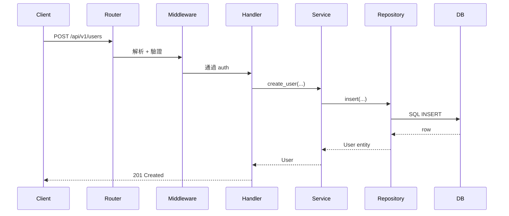

<!--
AGENT INSTRUCTIONS — Backend Project Template
=============================================
This file contains the skeleton for ALL FIVE notes files for a backend
repo. When using this template:

1. Split this file into the five separate markdown files listed below
2. Each section header marked with === FILE: xxx.md === starts a new file
3. Remove all <!-- AGENT: ... --> comments in the final output
4. Replace all [REF: path:line] placeholders with full GitHub links pinned to commit SHA
5. Keep [UNVERIFIED] markers — they signal honest uncertainty
6. Write in Traditional Chinese (繁體中文) as the primary language
-->

=== FILE: 00-overview.md ===

---
repo: <owner>/<repo>
type: backend
studied_at: YYYY-MM-DD
commit_sha: <short-sha>
language: <primary-language>
framework: <main-framework>
stars: <approximate>
status: active | maintenance | archived
---

# <repo-name> · 概覽

<!-- AGENT: 一句話描述這個專案。不要抄 README 第一行,要更精煉。 -->

## 解決什麼問題

<!-- AGENT: 兩三句話。重點是「沒有這個專案時痛點是什麼」,而不是「這個專案有什麼功能」。 -->

## 為什麼值得研究

<!-- AGENT: 從以下面向挑 2-3 點:
     - 架構選擇有特色(例如非典型分層、特殊的非同步設計)
     - 在生態系中佔有重要地位
     - 處理某個棘手問題的方式值得借鏡
     - 程式碼品質高、測試完整、文件好,適合當學習對象 -->

## 技術棧一句話

`<language>` + `<framework>` + `<db>` + `<其他關鍵依賴>`

## 健康度信號

- ⭐ Stars: ~<數字>
- 📅 最後 commit: <日期>
- 👥 主要維護者: <人數或組織>
- 🔄 commit 頻率: <每週/每月活躍程度>
- 📦 最新版本: <version>(<日期>)

## 我會在後續筆記中回答的問題

<!-- AGENT: 列 3-5 個具體問題,作為後續四份筆記的引導 -->

- ?
- ?
- ?


=== FILE: 01-architecture.md ===

---
repo: <owner>/<repo>
file: 01-architecture
---

# <repo-name> · 架構

## 高層架構圖

```mermaid
<!-- AGENT: 用 Mermaid 畫出最高層的架構。優先用 flowchart 或 C4-style component diagram。
     重點是「哪些模組存在、它們如何通訊」,不是檔案結構。 -->
flowchart LR
    Client --> API
    API --> Service
    Service --> Repository
    Repository --> DB[(Database)]
```

## 分層說明

<!-- AGENT: 對於上圖每個關鍵節點,用一個小節說明:
     - 它的職責
     - 對應的程式碼位置 [REF: path:line]
     - 它跟相鄰層的契約(輸入/輸出) -->

### <Layer 1 name>

職責:
程式碼位置: [REF: path/to/dir]
與相鄰層的契約:

### <Layer 2 name>

...

## 關鍵設計決策

<!-- AGENT: 列 3-5 個重要的設計決策。格式: 決策 → 推測理由 → trade-off。
     如果理由是推測,標註 [UNVERIFIED]。 -->

### 決策 1: <一句話描述>

- **是什麼**:
- **推測的理由**:[UNVERIFIED]
- **Trade-off**:
- **相關程式碼**:[REF: path:line]

## API 路由概覽

<!-- AGENT: 列出主要 API 端點,按資源分組。不要列全部,挑代表性的。 -->

| Method | Path | 用途 | Handler |
|---|---|---|---|
| GET | `/api/v1/...` | ... | [REF: path:line] |

## 資料層

- **ORM / Query Builder**: <名稱> [REF: path]
- **Migration 工具**: <名稱>
- **主要 Models / Schema**:
  - `<Model 1>` [REF: path:line] — 用途
  - `<Model 2>` [REF: path:line] — 用途
- **特殊設計**:<例如 soft delete、event sourcing、CQRS,等等 [UNVERIFIED] 標註若不確定>

## 中介層 / 橫切關注點

- **認證 / 授權**: [REF: path:line] — <策略>
- **Logging**: [REF: path:line] — <用什麼套件、輸出格式>
- **Error handling**: [REF: path:line] — <統一錯誤格式?>
- **Rate limiting**: [REF: path:line] 或「沒有」
- **CORS / 安全 headers**: [REF: path:line]

## 外部依賴

| 依賴 | 用途 | 抽象方式 |
|---|---|---|
| <例如 Redis> | <快取 / queue> | <直接呼叫 / adapter pattern> [REF: path] |

## 非同步處理

<!-- AGENT: 如果有 background job、queue、scheduled task,在這裡說明。沒有就寫「無」。 -->

## 可觀測性

- **Metrics**: <Prometheus? StatsD? 無?>
- **Tracing**: <OpenTelemetry? 無?>
- **Health check**: [REF: path:line] 或「無」

## 測試策略

- **測試框架**:
- **覆蓋層次**:unit / integration / e2e 各佔比例
- **Mock 策略**:[REF: path 示範]
- **特別之處**:<例如有 contract test、fuzz test、property-based test>


=== FILE: 02-code-walkthrough.md ===

---
repo: <owner>/<repo>
file: 02-code-walkthrough
---

# <repo-name> · 程式碼追蹤

<!-- AGENT: 挑一條最具代表性的「請求 → 回應」路徑,完整追蹤一遍。
     選擇標準: 涵蓋最多分層、最能展現架構特色。 -->

## 追蹤的場景

**場景**: <例如 「使用者註冊新帳號」>

**對應的 HTTP 請求**:
```http
POST /api/v1/users
Content-Type: application/json

{
  "email": "...",
  "password": "..."
}
```

## 流程圖



## 逐步追蹤

### Step 1: 路由分派

請求到達 [REF: path/to/router.py:42],路由表把它對應到 handler `xxx`。

**值得注意的地方**:
<!-- AGENT: 例如「路由是用裝飾器註冊,還是用 routing table 集中宣告」 -->

### Step 2: 中介層

<!-- AGENT: 列出請求依序經過哪些 middleware,每個做什麼 -->

1. [REF: path:line] — <middleware 名稱> — <用途>
2. ...

### Step 3: Handler

[REF: path:line] 接收驗證後的請求,主要做:

1. 提取 input
2. 呼叫 service 層
3. 包裝 response

**設計觀察**:
<!-- AGENT: handler 厚還是薄?有沒有奇怪的職責? -->

### Step 4: Service / Business Logic

<!-- AGENT: 這通常是最有設計含量的一層,多花一點筆墨 -->

[REF: path:line]

**核心邏輯**:

**值得學的設計**:

### Step 5: 資料層

<!-- AGENT: ORM 呼叫、SQL 構造、是否有 unit of work / transaction 管理 -->

[REF: path:line]

### Step 6: 回應構造

[REF: path:line]

## 想學更多時,在哪裡下中斷點

- 想看請求剛進入: [REF: path:line]
- 想看商業邏輯入口: [REF: path:line]
- 想看 DB 操作: [REF: path:line]
- 想看錯誤如何被捕捉: [REF: path:line]

## 沒追蹤到但值得留意的分支

<!-- AGENT: 例如錯誤路徑、權限不足的分支、非同步觸發的後續動作 -->


=== FILE: 03-key-patterns.md ===

---
repo: <owner>/<repo>
file: 03-key-patterns
---

# <repo-name> · 值得偷學的設計

<!-- AGENT: 列 3-7 個 pattern。寧可少而精,不要列一堆軟弱觀察。
     每個 pattern 都要回答: 什麼、為何有效、哪裡用、何時可移植。 -->

## Pattern 1: <名稱>

**是什麼**:
<!-- 一兩句話描述這個設計 -->

**為什麼有效**:
<!-- 它解決了什麼問題?為什麼這種解法比常見替代方案好? -->

**程式碼位置**:[REF: path:line]

**何時可以借用**:
<!-- 在什麼樣的專案 / 情境下,這個 pattern 也適用? -->

**注意事項**:
<!-- 套用時的常見坑 -->

---

## Pattern 2: <名稱>

...

---

## Pattern 3: <名稱>

...

---

## 整體設計品味的觀察

<!-- AGENT: 從整個 repo 看,作者群偏好的設計風格是什麼?
     例如「偏好顯式優於隱式」、「拒絕過度抽象」、「測試覆蓋驅動設計」等。
     這節是主觀觀察,沒有標準答案。 -->


=== FILE: 99-questions.md ===

---
repo: <owner>/<repo>
file: 99-questions
---

# <repo-name> · 未解問題

## 還沒搞懂的設計決策

<!-- AGENT: 列出觀察到但沒能完全理解的設計選擇 -->

- [ ] <問題>
  - 我目前的推測:[UNVERIFIED]
  - 相關程式碼:[REF: path:line]

## 想問維護者的問題

<!-- AGENT: 如果有機會問核心開發者,我會問什麼? -->

- ?

## 下次再看時的待辦

<!-- AGENT: 這次跳過了哪些值得深入的子系統? -->

- [ ] 深入研究 <X 模組>
- [ ] 比較 <這個專案的某做法> 與 <其他專案的做法>

## 跨專案對照備忘

<!-- AGENT: 這個 repo 的某個做法讓我聯想到其他學過的 repo 嗎?
     如果這個 pattern 在第 3 個 repo 出現了,就抽到 _patterns/ 去。 -->

- <做法 X> 跟 <另一個 repo 的做法> 類似,值得寫成 pattern
