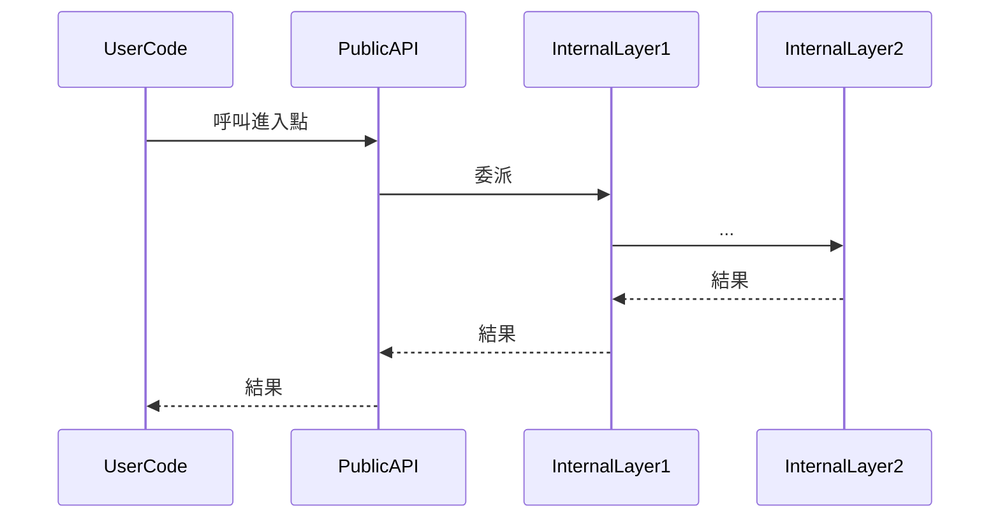

<!--
AGENT INSTRUCTIONS — Library / SDK Template
=============================================
For projects that are primarily libraries (SDKs, frameworks, dev tools)
rather than applications. Focuses on:
- Public API design
- Extension points
- Versioning & release strategy
- Documentation patterns

Write in Traditional Chinese (繁體中文).
-->

=== FILE: 00-overview.md ===

---
repo: <owner>/<repo>
type: library
studied_at: YYYY-MM-DD
commit_sha: <short-sha>
language: <primary-language>
category: <web-framework / orm / sdk / cli-tool / build-tool / 其他>
api_style: <imperative / declarative / fluent / callback>
stars: <approximate>
status: active | maintenance | archived
---

# <repo-name> · 概覽

## 解決什麼問題

<!-- AGENT: Library 的 value proposition 通常很明確,寫得精準 -->

## 為什麼值得研究

<!-- AGENT: 對 library 而言,值得研究的點通常是:
     - 公開 API 的設計品味
     - 內部如何達成「外表簡單、內部強大」
     - 擴充機制(plugin / middleware / hook)的設計
     - 對破壞性變更的處理
   -->

## API 風格一句話

<!-- 例如「fluent builder + lazy evaluation」、「decorator-driven + 反射」 -->

## 技術棧一句話

`<language>` + `<key dependency 1>` + `<key dependency 2>`

## 健康度信號

- ⭐ Stars: ~<數字>
- 📅 最後 commit: <日期>
- 📦 最新版本: <version>(<日期>)
- 📈 Release 頻率: <每月 / 每季 / 不定期>
- 🔄 SemVer 遵循狀況: <嚴格 / 寬鬆 / 不明>

## 我會在後續筆記中回答的問題

- ?
- ?
- ?


=== FILE: 01-architecture.md ===

---
repo: <owner>/<repo>
file: 01-architecture
---

# <repo-name> · 架構

## 高層架構

```mermaid
<!-- AGENT: library 的圖通常是「公開 API 表層 + 內部執行核心」的對照 -->
flowchart TB
    UserCode --> PublicAPI[公開 API]
    PublicAPI --> Core[核心執行]
    Core --> ExtensionPoints[擴充點]
    Core --> Internals[內部模組]
```

## 公開 API 結構

<!-- AGENT: 列出 library 暴露給使用者的主要進入點 -->

| 進入點 | 用途 | 位置 |
|---|---|---|
| `<package>.func_or_class` | <用途> | [REF: path:line] |

### 典型用法

```python
<!-- AGENT: 展示一段典型的使用程式碼,讓讀者一眼理解風格 -->
```

## 內部分層

<!-- AGENT: 對應上面圖中每個內部節點 -->

### <Layer / Module 名稱>

- 職責:
- 位置: [REF: path]
- 對其他層的依賴:

## 擴充機制

<!-- AGENT: library 的擴充性是學習重點 -->

- **擴充類型**:<plugin / middleware / hook / subclass / config>
- **註冊方式**:[REF: path:line]
- **內建擴充範例**:[REF: path]
- **官方文件對應**:<連結或路徑>

## 公開 vs 內部界線

- **`__all__` / `index.ts` exports**:[REF: path:line]
- **被視為內部的東西**:<例如 `_xxx` 命名規則 / `internal/` 資料夾>[REF: path]
- **破壞性變更的處理**:<deprecation warnings / 版本標記 / changelog>[REF: path]

## 配置系統(若適用)

- **Config 入口**:[REF: path:line]
- **配置來源優先級**:<例如 env > file > defaults>
- **驗證機制**:[REF: path:line]

## 跟外部世界的接觸面

- **CLI**(若有):[REF: path]
- **環境變數**:[REF: path]
- **檔案系統使用**:<讀 / 寫的位置慣例>
- **網路請求**:<是否有、何時發生>

## 測試策略

- **單元測試覆蓋面**:[REF: path]
- **整合 / e2e 測試**:[REF: path]
- **是否使用 property-based / fuzz**:
- **CI 矩陣**:<跨 Python/Node 版本、跨平台>[REF: path]

## 發布與版本管理

- **版本策略**:<SemVer 嚴格 / SemVer 寬鬆 / CalVer / 其他>
- **Changelog**:[REF: path]
- **Release 流程**:<手動 / 自動化 GitHub Actions>[REF: path]
- **支援版本範圍**:<最舊到最新 runtime / framework 版本>


=== FILE: 02-code-walkthrough.md ===

---
repo: <owner>/<repo>
file: 02-code-walkthrough
---

# <repo-name> · 程式碼追蹤

<!-- AGENT: Library 的追蹤通常是「使用者呼叫一個典型 API → 內部怎麼運作」 -->

## 追蹤的場景

**使用者程式碼**:
```python
<!-- 展示一段典型呼叫,例如建立一個 client、執行一個查詢 -->
```

## 流程圖



## 逐步追蹤

### Step 1: 公開 API 接入

[REF: path:line]

值得注意:
- 參數驗證在這層做還是下推
- 是否有快速失敗

### Step 2: <下一層>

[REF: path:line]

...

### Step N: 結果包裝回傳

[REF: path:line]

## 想學更多時,在哪裡下中斷點

- 公開 API 入口: [REF: path:line]
- 核心邏輯: [REF: path:line]
- 擴充點被呼叫處: [REF: path:line]

## 沒追蹤到但值得留意

<!-- AGENT: 例如錯誤路徑、async 變體、不同模式的分支 -->


=== FILE: 03-key-patterns.md ===

---
repo: <owner>/<repo>
file: 03-key-patterns
---

# <repo-name> · 值得偷學的設計

## Pattern 1: <名稱>

**是什麼**:

**為什麼有效**:

**程式碼位置**:[REF: path:line]

**何時可以借用**:

**注意事項**:

---

## Pattern 2: <名稱>

...

---

## API 設計品味的觀察

<!-- AGENT: library 的 API 設計品味是學習重點。例如:
     - 偏好顯式參數還是 config object
     - 對 magic / convention-over-configuration 的態度
     - 怎麼處理 async / sync 雙模式
     - 錯誤訊息設計
   -->

## 對相容性的態度

<!-- AGENT: 觀察 changelog 與 commit history,判斷:
     - 多常引入 breaking change
     - deprecation 流程多久
     - 對「醜但相容」vs「美但破壞」的取捨
   -->


=== FILE: 99-questions.md ===

---
repo: <owner>/<repo>
file: 99-questions
---

# <repo-name> · 未解問題

## 還沒搞懂的設計決策

- [ ] <問題>
  - 我目前的推測:[UNVERIFIED]
  - 相關程式碼:[REF: path:line]

## 想問維護者的問題

- ?

## 下次再看時的待辦

- [ ] 探索 <某擴充機制> 的真實用例
- [ ] 對照 <某競品> 的同類 API

## 跨專案對照備忘

- <API 設計手法> 跟 <另一個 library> 類似 → 候選 pattern
