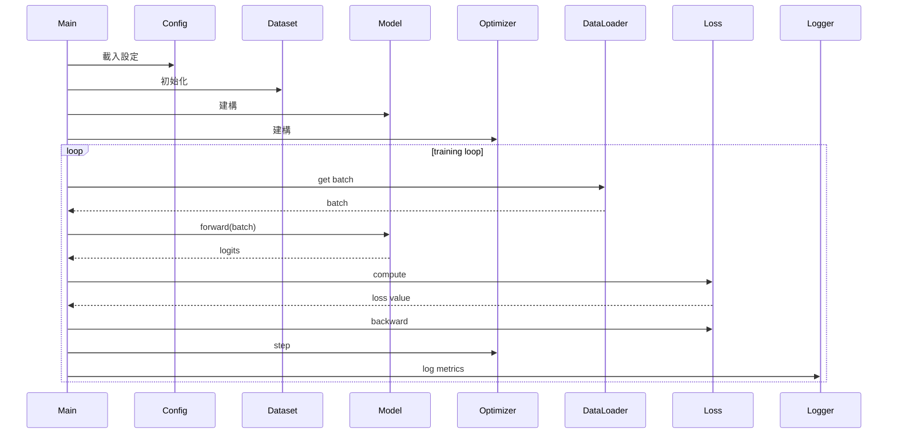

<!--
AGENT INSTRUCTIONS — ML/DL Project Template
=============================================
Same usage as backend.md. This template focuses on:
- Dataset pipeline
- Model architecture
- Training loop
- Experiment management
- Reproducibility

Write in Traditional Chinese (繁體中文).
-->

=== FILE: 00-overview.md ===

---
repo: <owner>/<repo>
type: ml-dl
studied_at: YYYY-MM-DD
commit_sha: <short-sha>
language: <主要 python? 還有 CUDA / Triton?>
framework: <PyTorch / JAX / TF / 自製>
task: <classification / generation / RL / 多模態 / 其他>
paper: <對應論文 arXiv ID 或「無」>
stars: <approximate>
status: active | maintenance | archived
---

# <repo-name> · 概覽

## 解決什麼問題

<!-- AGENT: ML 專案要區分:
     - 是論文 implementation 還是 production-grade library
     - 是 baseline 還是 SOTA 追求
     - 是研究用還是落地用
   -->

## 為什麼值得研究

<!-- AGENT: 可能的原因:
     - 論文重要,implementation 又乾淨
     - 訓練技巧值得學
     - 程式碼量小但概念完整(像 nanoGPT)
     - 分散式訓練實作完善
     - 資料 pipeline 設計巧妙
   -->

## 任務與資料

| 面向 | 值 |
|---|---|
| 任務類型 | <supervised / self-supervised / RL / unsupervised> |
| 輸入 | <text / image / audio / multi-modal> |
| 輸出 | <classes / sequences / images / 其他> |
| 主要資料集 | <dataset 名稱與來源> |
| 評估指標 | <accuracy / F1 / BLEU / FID / 其他> |

## 模型一句話

<!-- 例如「decoder-only transformer,~125M 參數,SwiGLU + RoPE」 -->

## 對應論文(若適用)

- **論文**:<標題> ([arXiv](https://arxiv.org/abs/...))
- **這份 implementation 跟論文的偏離**:<列出 known deviations [UNVERIFIED]>

## 健康度信號

- ⭐ Stars: ~<數字>
- 📅 最後 commit: <日期>
- 👥 主要維護者: <人數或組織>
- 🔬 是否仍對應最新 paper / 已被新方法取代

## 我會在後續筆記中回答的問題

- ?
- ?
- ?


=== FILE: 01-architecture.md ===

---
repo: <owner>/<repo>
file: 01-architecture
---

# <repo-name> · 架構

## 系統高層圖

```mermaid
<!-- AGENT: 畫出 data → model → loss → optimizer 的關係,
     以及 training / eval / inference 三條路徑的差異 -->
flowchart LR
    Dataset --> DataLoader
    DataLoader --> Model
    Model --> Loss
    Loss --> Optimizer
    Optimizer -.update.-> Model
    Model --> Eval[Eval / Inference]
```

## 資料管線

### 資料來源

- **資料集**:<名稱> [REF: path/to/dataset.py]
- **下載 / 準備腳本**:[REF: path]
- **資料格式**:<例如 .arrow / .parquet / .jsonl / 圖片資料夾>

### 預處理

- **位置**:[REF: path:line]
- **主要步驟**:
  1. ...
  2. ...
- **是否離線 vs 線上**:<在 dataloader 即時做,還是預先處理存檔>

### Augmentation

- **位置**:[REF: path:line]
- **主要手法**:<列舉>

### DataLoader 設計

- **Batch 構造**:[REF: path:line]
- **特殊處理**:<bucketing / dynamic padding / curriculum / 其他>
- **多卡分配**:<DistributedSampler / 自製>

## 模型架構

### 整體結構

[REF: path:line] — 主要 model 類別

<!-- AGENT: 列出 model 的高層 forward 流程 -->

```
forward(x):
    1. Embedding
    2. Backbone(N layers)
    3. Head
    return logits
```

### 關鍵元件

| 元件 | 位置 | 備註 |
|---|---|---|
| <Attention 變體> | [REF: path:line] | <flash attention? grouped query?> |
| <Norm 層> | [REF: path:line] | <LayerNorm / RMSNorm> |
| <Position encoding> | [REF: path:line] | <RoPE / ALiBi / learned> |
| <Activation> | [REF: path:line] | <GELU / SwiGLU> |

### 關鍵超參數

```python
# 從 config 抽取代表性的值 [REF: path]
hidden_size = ...
num_layers = ...
num_heads = ...
context_length = ...
vocab_size = ...
```

### 跟原論文的差異

<!-- AGENT: 列出 implementation 跟 paper 的差異與推測理由 -->
- ?[UNVERIFIED]

## 訓練流程

### 訓練腳本入口

[REF: path:line]

### 訓練迴圈核心

[REF: path:line]

<!-- AGENT: 用 pseudo-code 描述一個 step -->
```
for batch in dataloader:
    1. forward
    2. loss
    3. backward
    4. gradient accumulation / clipping
    5. optimizer step
    6. lr scheduler step
    7. logging
```

### Optimizer & Scheduler

- **Optimizer**:<AdamW / Lion / Adafactor> [REF: path:line]
- **Learning rate schedule**:<cosine / linear warmup> [REF: path:line]
- **Weight decay 策略**:<是否對 bias / norm 排除>[REF: path:line]

### Loss

- **Loss function**:[REF: path:line]
- **是否有 auxiliary loss**:

### 分散式訓練

- **策略**:<DDP / FSDP / DeepSpeed / 自製>[REF: path]
- **Mixed precision**:<fp16 / bf16 / fp8> [REF: path]
- **Gradient accumulation**:[REF: path:line]
- **Gradient checkpointing**:<有 / 無>[REF: path]

### Checkpoint 機制

- **存檔頻率**:<每 N steps / 每 epoch>
- **存什麼**:<model / optimizer / scheduler / rng state>
- **位置**:[REF: path:line]
- **Resume 邏輯**:[REF: path:line]

## 評估

- **Eval loop 位置**:[REF: path:line]
- **指標計算**:[REF: path:line]
- **是否有 held-out set 自動評估**:
- **是否有 downstream benchmark integration**:

## 推論

- **Inference 腳本**:[REF: path]
- **跟 training forward 的差異**:<eval mode / no_grad / KV cache>
- **是否有量化 / 加速**:<無 / GPTQ / AWQ / 其他>

## 實驗管理

- **Config 系統**:<Hydra / YAML / dataclass / argparse>[REF: path]
- **實驗追蹤**:<W&B / MLflow / TensorBoard / 無>[REF: path:line]
- **如何啟動一次實驗**:
  ```bash
  <典型命令>
  ```

## 可重現性

- **Random seed 設定**:[REF: path:line]
- **Determinism flags**:<是否設 cudnn.deterministic 等>[REF: path]
- **環境鎖定**:<requirements.txt / pyproject / conda env>
- **資料版本控制**:<DVC / commit hash / 無>[UNVERIFIED]

## 測試

- **是否有單元測試**:<有 / 無>[REF: path]
- **測試什麼**:<dataloader / model forward / 個別 op>


=== FILE: 02-code-walkthrough.md ===

---
repo: <owner>/<repo>
file: 02-code-walkthrough
---

# <repo-name> · 程式碼追蹤

<!-- AGENT: ML 專案的追蹤通常是「一個訓練 step」或「一次 inference」,挑最有代表性的。 -->

## 追蹤的場景

**場景**: <例如「從 random init 開始,訓練一個 step」>

**啟動命令**:
```bash
<典型命令,例如 python train.py --config configs/small.yaml>
```

## 流程圖



## 逐步追蹤

### Step 1: 進入點與 config 載入

[REF: path:line]

config 怎麼被解析、override 機制。

### Step 2: 資料集與 dataloader 構造

[REF: path:line]

注意:
- 預處理在何時發生
- workers 數量怎麼決定
- 是否做 prefetch

### Step 3: 模型構造

[REF: path:line]

- 初始化策略 [REF: path:line]
- 載入預訓練 weights(若適用)[REF: path:line]
- 放到 device / 包成 DDP [REF: path:line]

### Step 4: 一個 training step

#### 4.1 取 batch

[REF: path:line]

#### 4.2 Forward

[REF: path:line]

值得注意:
- 是否使用 autocast
- 是否 cache 任何中間值

#### 4.3 Loss 計算

[REF: path:line]

#### 4.4 Backward

[REF: path:line]

- gradient accumulation 處理 [REF: path:line]
- gradient clipping [REF: path:line]

#### 4.5 Optimizer step

[REF: path:line]

#### 4.6 Logging

[REF: path:line]

### Step 5: Eval(若一併追蹤)

[REF: path:line]

## 想學更多時,在哪裡下中斷點

- 想看一個 batch 長什麼樣: [REF: path:line]
- 想看 forward 內部各層輸出: [REF: path:line]
- 想看 gradient 大小: optimizer step 之前 [REF: path:line]
- 想看 checkpoint 存了什麼: [REF: path:line]

## 沒追蹤到但值得留意

<!-- AGENT: distributed init、failure recovery、inference path 等 -->


=== FILE: 03-key-patterns.md ===

---
repo: <owner>/<repo>
file: 03-key-patterns
---

# <repo-name> · 值得偷學的設計

## Pattern 1: <名稱>

**是什麼**:

**為什麼有效**:

**程式碼位置**:[REF: path:line]

**何時可以借用**:

**注意事項**:

---

## Pattern 2: <名稱>

...

---

## ML 工程品味的觀察

<!-- AGENT: 例如:
     - 對 abstraction 的態度(像 nanoGPT 那樣盡量扁平 vs 像 transformers 那樣高度抽象)
     - 對效能跟可讀性的取捨
     - 對可重現性的重視程度
   -->


=== FILE: 99-questions.md ===

---
repo: <owner>/<repo>
file: 99-questions
---

# <repo-name> · 未解問題

## 還沒搞懂的設計決策

- [ ] <問題>
  - 我目前的推測:[UNVERIFIED]
  - 相關程式碼:[REF: path:line]

## 想驗證的論文 claim

<!-- AGENT: ML 專案特別會有「論文這樣說但 code 這樣寫」的疑問 -->

- [ ] <某 claim>: 論文說 X,但 code 實際是 Y[REF: path:line]

## 想問維護者的問題

- ?

## 下次再看時的待辦

- [ ] 跑一次 training 觀察 loss 曲線
- [ ] 對照 <某論文 / 某 repo> 的同類實作
- [ ] 深入研究 <X 模組,例如 attention 或 dataloader>

## 跨專案對照備忘

- <做法 X> 跟 <另一個 repo> 的做法相似 → 候選 pattern
