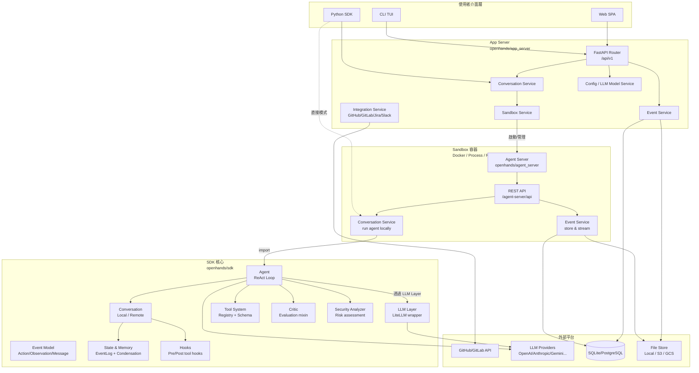
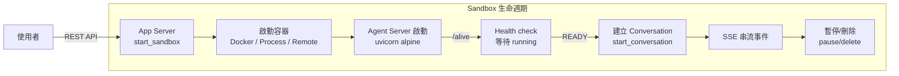
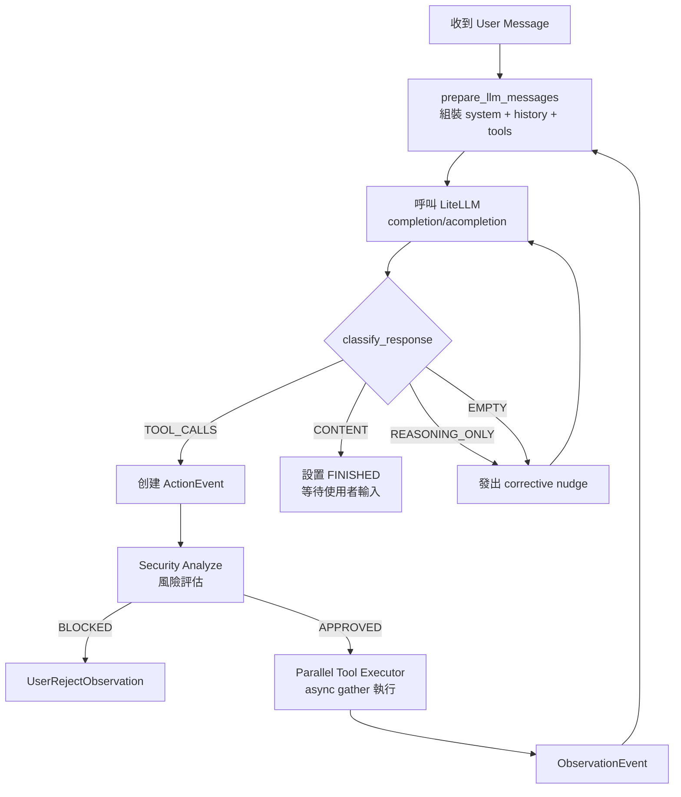
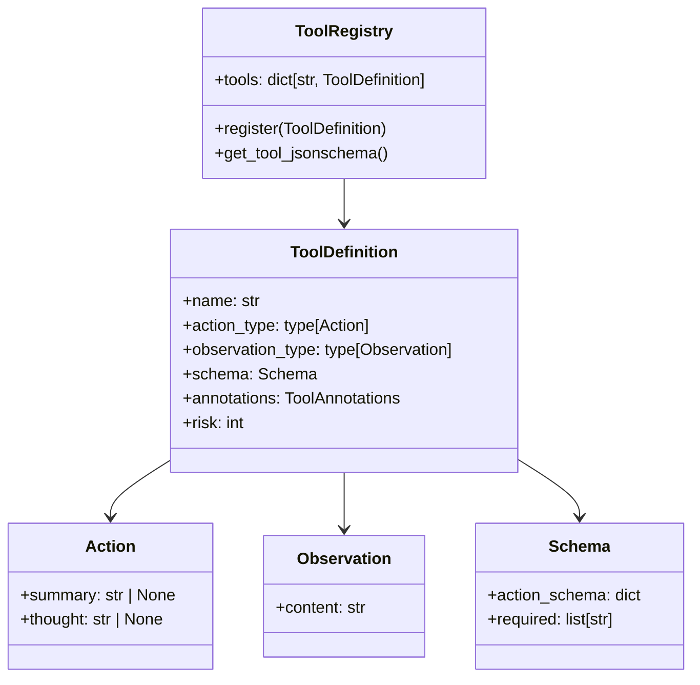

# OpenHands · 架構

## 系統高層圖

OpenHands 的架構可以用兩層來理解：**部署層**（agent 怎麼被裝進沙箱執行）與 **SDK 層**（agent 內部怎麼 Run）。



### 圖意說明

這張圖展示 OpenHands 的四層架構：使用者介面 → App Server（API 層） → Sandbox 中的 Agent Server → SDK 核心。特別值得注意的是 agent 不直接在 app server process 中執行，而是在獨立的 sandbox 容器中透過 agent-server REST API 管理。這與多數 agent 框架（LangGraph、AutoGen）不同，它們的 agent 是 library-level 的存在。

## Namespace Package 架構

這是 OpenHands 最不常見的設計決策。一個 `pip install openhands-ai` 會安裝 4 個獨立套件，每個都有各自的 `openhands/` 子目錄:

```python
# openhands/__init__.py（主 repo）
__path__ = __import__('pkgutil').extend_path(__path__, __name__)
```
[`openhands/__init__.py:4`](https://github.com/All-Hands-AI/OpenHands/blob/7ea2aed/openhands/__init__.py#L4)

| 套件 | 路徑 | 職責 |
|---|---|---|
| 主 repo | `openhands/app_server/` | FastAPI app、frontend 服務、enterprise 功能 |
| openhands-sdk | `openhands/sdk/` | Agent 核心引擎、LLM 層、Tool 系統、Conversation |
| openhands-tools | `openhands/tools/` | 內建工具實作（Terminal、FileEditor、browser_use 等） |
| openhands-agent-server | `openhands/agent_server/` | 沙箱內的 agent 服務器（FastAPI + 在地 conversation） |

**為什麼這樣設計？** [UNVERIFIED] 推測有幾個可能：

1. **CLI 二進制分發** — agent-server 可以被打包成 PyInstaller binary，單獨放入 Docker image，不需要整個 repo 的依賴
2. **關注點分離** — SDK 可被外部專案 import（`from openhands.sdk import Agent`），不需要整個 app server
3. **API 兼容性管理** — sdk、tools、agent-server 可獨立版本化

**Trade-off**：命名空間衝突風險高 — 任何一個套件新增的模組都可能與其他套件同名。

## App Server 層

App Server 是一個 FastAPI 應用（[`openhands/app_server/app.py:54`](https://github.com/All-Hands-AI/OpenHands/blob/7ea2aed/openhands/app_server/app.py#L54)），提供 `/api/v1/` 下的 REST API。

### 路由結構

[`openhands/app_server/v1_router.py:24-37`](https://github.com/All-Hands-AI/OpenHands/blob/7ea2aed/openhands/app_server/v1_router.py#L24-L37) 展示了 API 路由：

| 路徑 | 職責 |
|---|---|
| `/api/v1/conversation/` | Conversation CRUD + start task |
| `/api/v1/conversation/{id}/events/` | Event 讀取/搜尋 |
| `/api/v1/sandbox/` | Sandbox CRUD |
| `/api/v1/settings/` | LLM 設定 |
| `/api/v1/secrets/` | Secret 管理 |
| `/api/v1/user/` | 使用者管理 + skills |
| `/api/v1/webhook/` | Webhook callbacks |
| `/api/v1/git/` | Git 整合 |
| `/api/v1/config/` | Config API |
| `/api/v1/web-client/` | Web client config |
| `/mcp` | MCP 相容端點 |

### 依賴注入模式

App Server 使用 injector pattern 來管理服務的依賴關係（[`openhands/app_server/config.py:193-239`](https://github.com/All-Hands-AI/OpenHands/blob/7ea2aed/openhands/app_server/config.py#L193-L239)）。`AppServerConfig` 定義了所有可注入的服務，`config_from_env()` 根據環境變數決定每種服務的實作。這使得：

- 同一個 abstraction 可以有不同的實作（例如 `EventService` 有 filesystem / AWS / GCP 三種後端）
- 測試時可以 injection mock

## Sandbox 系統

Sandbox 是 OpenHands 最核心的架構選擇 — agent 不直接在 app server process 中執行。



### Sandbox 服務抽象

[`openhands/app_server/sandbox/sandbox_service.py:29-232`](https://github.com/All-Hands-AI/OpenHands/blob/7ea2aed/openhands/app_server/sandbox/sandbox_service.py#L29-L232) 定義了 `SandboxService` 抽象介面，有三種實作：

| 實作 | 啟動方式 | 用途 |
|---|---|---|
| `DockerSandboxService` | Docker 容器（含 agent-server image） | 預設，最完整的隔離 |
| `ProcessSandboxService` | 本地子 process | 開發/testing，不需 Docker |
| `RemoteSandboxService` | 遠端 API（remote runtime URL） | 雲端部署 |

### Agent Server

沙箱內的 agent-server（[`openhands-agent-server`](https://github.com/All-Hands-AI/OpenHands/blob/7ea2aed/openhands/agent_server/conversation_service.py)）是一個在容器內執行的 FastAPI 服務，提供：

- `POST /agent-server/api/conversations/` — 啟動 conversation
- `GET /agent-server/api/conversations/{id}/events/stream` — SSE 串流事件
- `DELETE /agent-server/api/conversations/{id}` — 清理 conversation

App Server 與 Agent Server 之間透過 HTTP API 通訊，不共用 process 或記憶體。

## SDK 核心層

### Agent 控制流

Agent 的核心是 ReAct loop（在 [`openhands/sdk/agent/agent.py`](https://github.com/All-Hands-AI/OpenHands/blob/7ea2aed/openhands-sdk/openhands/sdk/agent/agent.py)），使用分類 + 分發模式處理 LLM response：



回應分類邏輯：[`openhands/sdk/agent/response_dispatch.py:53-77`](https://github.com/All-Hands-AI/OpenHands/blob/7ea2aed/openhands-sdk/openhands/sdk/agent/response_dispatch.py#L53-L77)

四種分類：
1. **TOOL_CALLS** — 有 tool_calls → 建立 ActionEvent → 安全檢查 → 平行執行
2. **CONTENT** — 有文字內容 → 視為最終回應，設 FINISHED
3. **REASONING_ONLY** — 只有推理過程（thinking blocks）→ 發 corrective nudge 要求產生 tool call
4. **EMPTY** — 空的 → 同上

### Tool 系統

Tool 系統的核心抽象在 [`openhands/sdk/tool/tool.py`](https://github.com/All-Hands-AI/OpenHands/blob/7ea2aed/openhands-sdk/openhands/sdk/tool/tool.py)，定義了 `Action`、`Observation`、`Schema` 三層：



支援的 Tool 類型包括（來自 `openhands-tools`）：

| Tool | 用途 | 關鍵設計 |
|---|---|---|
| `TerminalTool` | Shell 指令執行 | 透過 tmux session 維持狀態 |
| `FileEditorTool` | 檔案編輯 | 基於 diff/patch 的編輯 |
| `BrowserUseTool` | 瀏覽器自動化 | Playwright + browsergym |
| `GlobTool` | 檔案搜尋 | 基於 ripgrep |
| `GrepTool` | 內容搜尋 | 基於 ripgrep |
| `DelegateTool` | subagent 委派 | 啟動子 agent |
| `ApplyPatchTool` | patch 應用 | 基於 whatthepatch |
| `TaskTrackerTool` | 任務追蹤 | 簡易 TODO 管理 |

### LLM 抽象層

LLM 層基於 LiteLLM（[`openhands/sdk/llm/llm.py`](https://github.com/All-Hands-AI/OpenHands/blob/7ea2aed/openhands-sdk/openhands/sdk/llm/llm.py)），封裝了：

- **Provider 切換** — 透過 LiteLLM 的 model prefix（`openai/`、`anthropic/`、`bedrock/` 等）
- **Responses API 支援** — 支援 OpenAI Responses API（streaming events 處理）
- **Fallback 策略** — `FallbackStrategy` 支援 provider chain
- **Token 追蹤** — cost 與 token 計數
- **Auth 抽象** — `AuthMethod` 支援 API key、AWS、GCP、Azure 等多種認證
- **Streaming** — 支援非同步與同步 streaming

### Event 模型

Event 是 OpenHands 的資料基石，所有 agent 互動都被表示為 Event（[`openhands/sdk/event/__init__.py`](https://github.com/All-Hands-AI/OpenHands/blob/7ea2aed/openhands-sdk/openhands/sdk/event)）：

| Event 類型 | 觸發時機 |
|---|---|
| `MessageEvent` | 使用者或 agent 發送訊息 |
| `ActionEvent` | Agent 決定執行某個 tool |
| `ObservationEvent` | Tool 執行後的觀察結果 |
| `SystemPromptEvent` | System prompt 被設定 |
| `AgentErrorEvent` | Agent 發生錯誤 |
| `TokenEvent` | Token 使用報告 |
| `ConversationStateUpdateEvent` | Conversation state 變化 |

### Memory / State

不同於多數 agent 框架用 dict 或 Pydantic model 管理 state，OpenHands 使用 **EventLog** — 一個 file-backed 的 events list，支援：

- **序列化** — 所有 events 以 JSON 存於檔案系統
- **Lazy loading** — 大量 events（30k+）不會全部載入記憶體
- **Search** — 透過 EventService 按 kind / timestamp 搜尋
- **Condensation** — 可壓縮長對話歷史為 summary

### Hooks 系統

[`openhands/sdk/hooks/`](https://github.com/All-Hands-AI/OpenHands/blob/7ea2aed/openhands-sdk/openhands/sdk/hooks) 提供 pre/post hook：

- Pre-tool hook — 在 tool 執行前檢查（安全、權限）
- Post-tool hook — 在 tool 執行後處理（log、callback）
- Hook 可被 plugins 擴展

### Critic

CriticMixin（[`openhands/sdk/agent/critic_mixin.py`](https://github.com/All-Hands-AI/OpenHands/blob/7ea2aed/openhands-sdk/openhands/sdk/agent/critic_mixin.py)）提供了可選的自我評估機制：

- 在每次 tool call 後或 final answer 後，啟動獨立的 critic LLM call
- Critic 可以「評分」agent 的動作質量
- 支援 `finish_and_message` 與 `action` 兩種 mode

## 觀測性

- **Laminar** — 整合 laminar-ai 做 observability
- **OpenTelemetry** — OTLP exporter 支援
- **Event system** — 所有 events 可持久化、搜尋
- **Token / cost 追蹤** — `TokenEvent` 記錄每次 LLM call 的花費

## Enterprise 層

`enterprise/` 目錄包含開源但需授權的功能：

- **整合** — GitHub/GitLab/Bitbucket/Jira/Slack 整合
- **Auth** — Keycloak/RBAC/SSO 支援
- **Webhook** — 事件驅動的 webhook callback
- **Sync** — 跨團隊的設定同步
- **Telemetry** — PostHog analytics

## 安全架構

- **Security Analyzer** — 使用 LLM 評估 tool call 的風險等級
- **Confirmation Policy** — 可設定的確認策略（always / never / risk-based）
- **Secret 管理** — 環境變數與 file-based secret store
- **Input sanitization** — 基本輸入檢查（[`openhands/agent_server/_secrets_exposure.py`](https://github.com/All-Hands-AI/OpenHands/blob/7ea2aed/openhands-agent-server/openhands/agent_server/_secrets_exposure.py)）

## 測試策略

- `tests/unit/` — 單元測試
- `tests/unit/integrations/` — 整合測試（各 integration provider）
- `tests/e2e/` — 端到端測試（Playwright）
- CI 使用 `pytest-xdist` 平行執行
