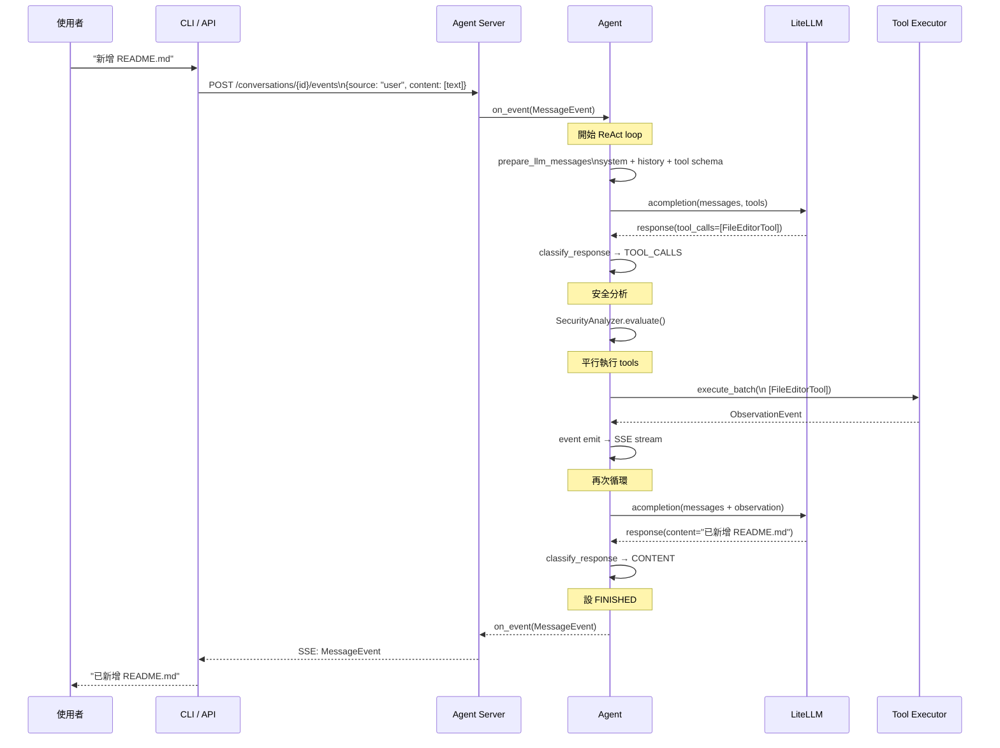

# OpenHands · 程式碼追蹤

## 追蹤的場景

**任務**: 使用者透過 CLI 或 API 發送指令（例如「在專案中新增一個 README.md」），帶動一次完整的 agent ReAct 循環。

**預期的 agent 行為**:
1. 使用者輸入進入 Agent Server（或 LocalConversation）
2. Agent 組裝 prompt（system + history + tools schema）
3. Agent 呼叫 LLM
4. LLM 回傳 tool call（例如 `FileEditorTool`）
5. Agent 安全分析 → 執行 tool → 取得觀察結果
6. 結果餵回 message list → 再次呼叫 LLM
7. LLM 回傳 final answer（Content response）
8. Conversation 狀態設為 FINISHED，結果串流回使用者

## 流程圖



## 逐步追蹤

### Step 1: 任務進入 Agent

入口點: [`openhands/sdk/conversation/impl/local_conversation.py`](https://github.com/All-Hands-AI/OpenHands/blob/7ea2aed/openhands-sdk/openhands/sdk/conversation/impl/local_conversation.py)

當使用者透過 SDK 呼叫 `conversation.send_message()` 或 `conversation.run()`，`LocalConversation` 的 `_run_agent` 方法觸發 agent loop:

```python
def _run_agent(
    self,
    agent: AgentBase,
    on_event: ConversationCallbackType,
    on_token: ConversationTokenCallbackType | None = None,
) -> None:
```

[`local_conversation.py:770`](https://github.com/All-Hands-AI/OpenHands/blob/7ea2aed/openhands-sdk/openhands/sdk/conversation/impl/local_conversation.py#L770)

這個 loop 會持續直到 `state.execution_status` 為 FINISHED、ERROR、或 AWAITING_INPUT。

### Step 2: Prompt 組裝

[`openhands/sdk/agent/utils.py`](https://github.com/All-Hands-AI/OpenHands/blob/7ea2aed/openhands-sdk/openhands/sdk/agent/utils.py)

`prepare_llm_messages` 負責把 system prompt、對話歷史、tool descriptions 組裝成 LLM 需要的格式。

System prompt 來自 Jinja2 template（[`openhands/sdk/agent/prompts/system_prompt.j2`](https://github.com/All-Hands-AI/OpenHands/blob/7ea2aed/openhands-sdk/openhands/sdk/agent/prompts/system_prompt.j2)），支援條件式渲染（interactive mode、long-horizon、planning mode）並包含安全政策與技術哲學。

### Step 3: LLM 呼叫

[`openhands/sdk/agent/utils.py:amake_llm_completion`](https://github.com/All-Hands-AI/OpenHands/blob/7ea2aed/openhands-sdk/openhands/sdk/agent/utils.py)

LLM 呼叫透過 LiteLLM 進行：

```python
async def amake_llm_completion(...) -> LLMResponse:
    response = await llm.acompletion(
        messages=messages,
        tools=tools if include_tools else None,
        ...
    )
```

LiteLLM 的 `acompletion` 會根據 `model` 參數（例如 `openai/gpt-4o`、`anthropic/claude-sonnet-4`）自動路由到對應 provider。支援 streaming（SSE）與 blocking 模式。

**重試策略**: LLM 層使用 tenacity 包裹，處理 `RateLimitError`、`ServiceUnavailableError`、`APIConnectionError` 等 transient 錯誤。

### Step 4: Response 解析

[`openhands/sdk/agent/response_dispatch.py:53-77`](https://github.com/All-Hands-AI/OpenHands/blob/7ea2aed/openhands-sdk/openhands/sdk/agent/response_dispatch.py#L53-L77)

`classify_response` 決定回應類型：

```python
def classify_response(message: Message) -> LLMResponseType:
    if message.tool_calls:
        return LLMResponseType.TOOL_CALLS
    if any(isinstance(c, TextContent) and c.text.strip() for c in message.content):
        return LLMResponseType.CONTENT
    if message.reasoning_content is not None or message.thinking_blocks:
        return LLMResponseType.REASONING_ONLY
    return LLMResponseType.EMPTY
```

### Step 5: Tool 執行

[`openhands/sdk/agent/agent.py:158-230`](https://github.com/All-Hands-AI/OpenHands/blob/7ea2aed/openhands-sdk/openhands/sdk/agent/agent.py#L158-L230)

`_ActionBatch.prepare` 處理工具執行流程：

1. **截斷** — 若 LLM 同時回傳 `FinishTool` 與其他 tools，只執行到第一個 `FinishTool`
2. **Blocked action 檢查** — 檢查 state 中是否有 blocked action（被 hook 阻擋）
3. **平行執行** — `ParallelToolExecutor.execute_batch` 使用 `asyncio.gather` 同時執行多個 tools

**錯誤路徑**: Tool 執行失敗時返回 `AgentErrorEvent`，agent 會把錯誤訊息傳回 LLM 讓它調整策略。如果 security analyzer 判定動作不安全，會發出 `UserRejectObservation`，內容包含拒絕理由。

[`openhands/sdk/agent/agent.py:174-176`](https://github.com/All-Hands-AI/OpenHands/blob/7ea2aed/openhands-sdk/openhands/sdk/agent/agent.py#L174-L176)

### Step 6: 結果餵回 LLM

執行完 tool 後，ActionEvent 與 ObservationEvent 都透過 `on_event` callback 發出，並加入 conversation 的 message list。新的 LLM call 會包含完整的 tool call history，讓 LLM 看到自己的 actions 與結果。

### Step 7: 終止判斷

終止條件在 `_handle_content_response` 中：

[`openhands/sdk/agent/response_dispatch.py:282-294`](https://github.com/All-Hands-AI/OpenHands/blob/7ea2aed/openhands-sdk/openhands/sdk/agent/response_dispatch.py#L282-L294)

```python
def _handle_content_response(self, message, llm_response, conversation, state, on_event):
    self._emit_message_event(message, llm_response, conversation, on_event)
    state.execution_status = ConversationExecutionStatus.FINISHED
```

此外，`max_iteration_per_run`（預設 500）達到時也會強制終止。Stuck detector 會監測 monologue（連續的 reasoning-only 或 empty responses）並發出 InterruptEvent。

### Step 8: Memory 寫入

Events 透過 `EventLog`（file-backed Sequence）序列化到檔案系統。在 Agent Server 中，EventService 同時寫入 SQLite/PostgreSQL 與 file system。Conversation level 的 state（execution_status、title、metadata）寫入 SQL database。

## 想學更多時，在哪裡下中斷點

- Agent loop 起點: [`openhands/sdk/conversation/impl/local_conversation.py:770`](https://github.com/All-Hands-AI/OpenHands/blob/7ea2aed/openhands-sdk/openhands/sdk/conversation/impl/local_conversation.py#L770) — `_run_agent`
- LLM call 前一刻（看完整 prompt）: [`openhands/sdk/agent/utils.py`](https://github.com/All-Hands-AI/OpenHands/blob/7ea2aed/openhands-sdk/openhands/sdk/agent/utils.py) — `amake_llm_completion`
- Response 分類: [`openhands/sdk/agent/response_dispatch.py:53`](https://github.com/All-Hands-AI/OpenHands/blob/7ea2aed/openhands-sdk/openhands/sdk/agent/response_dispatch.py#L53) — `classify_response`
- Tool dispatch: [`openhands/sdk/agent/agent.py:158`](https://github.com/All-Hands-AI/OpenHands/blob/7ea2aed/openhands-sdk/openhands/sdk/agent/agent.py#L158) — `_ActionBatch.prepare`
- Sandbox 啟動: [`openhands/app_server/sandbox/sandbox_service.py:60`](https://github.com/All-Hands-AI/OpenHands/blob/7ea2aed/openhands/app_server/sandbox/sandbox_service.py#L60) — `start_sandbox`

## 沒追蹤到但值得留意的分支

- **Delegation** — Subagent 可以透過 `DelegateTool` 啟動子 conversation，這個路徑會建立一個新的 `LocalConversation` 實例在相同 workspace 中運行。實作在 `openhands/sdk/subagent/`
- **Remote conversation** — `RemoteConversation` 透過 HTTP 與 agent server 通訊，而非直接呼叫 SDK
- **Interrupt/resume** — Conversation 可被 interrupt（PauseEvent），然後 resume，state 從 EventLog 恢復
- **Iterative refinement** — 某些任務（如程式碼審查）會在 FinishTool 被觸發時，以 LLM 決定是否需要繼續迭代
