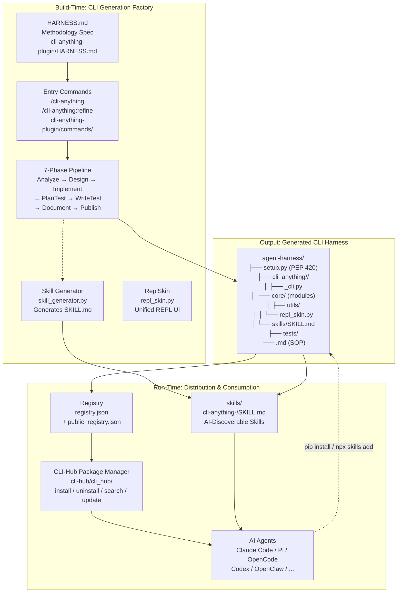
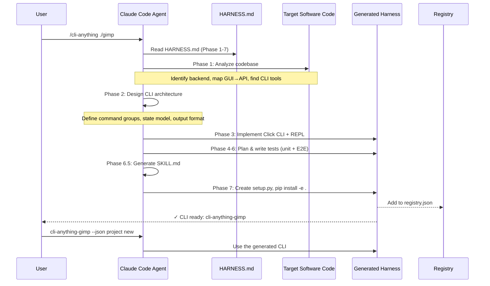

# CLI-Anything · 架構

## 高層架構

CLI-Anything 的系統架構可以從兩個層面來看：**建構時**（build-time）是 CLI 產生工廠，**執行時**（run-time）是分發與被 AI agent 消費的生態系統。

### 關鍵設計決策 1：PEP 420 Namespace Packages

**CLI-Anything 不做一個巨大的 CLI，而是產出 50+ 個獨立套件，共用 `cli_anything.*` namespace。**

每個產出的 CLI（如 `cli-anything-blender`）是一個獨立的 pip 套件，透過 PEP 420 implicit namespace packages 共享 `cli_anything` 根命名空間。`cli_anything/` 目錄**沒有 `__init__.py`**——這是 PEP 420 的約定，讓多個獨立套件可以共同貢獻子包到同一個 namespace 下。

- **替代方案**: 單一 monolith 套件 + plugin registry（像 `pre-commit` 的做法）
- **取捨**: PEP 420 讓每個 CLI 可獨立安裝、獨立版本化，但也要求 `setup.py` 正確配置 `find_namespace_packages(include=["cli_anything.*"])`。使用者若只裝一個 CLI 看不到任何好處——這個設計是為「裝了 5+ 個 CLI」的使用者情境設計的
- **位置**: [`cli-anything-plugin/commands/cli-anything.md`](https://github.com/HKUDS/CLI-Anything/blob/436a4f5c42452b86b64fe0373e1ed67a4347a18a/cli-anything-plugin/commands/cli-anything.md#L80-L85)

### 關鍵設計決策 2：HARNESS.md 作為 method-driven 的 CLI 產生器

**與其寫一個「產生 CLI 的程式」，CLI-Anything 寫了一份「讓 agent 遵循的方法論」，然後 agent 照著實作。**

HARNESS.md 不是被程式讀取的文件——它是**給 AI agent 讀的 SOP**。7 個階段（Analyze → Design → Implement → Plan Tests → Write Tests → Document → Publish）每一步都有具體的操作指令、程式碼範例、測試規格。當你在 Claude Code 中下 `/cli-anything ./gimp`，本質上是 agent 讀 HARNESS.md → 依 SOP 逐步執行。

- **替代方案**: 寫一個程式碼產生器（如 cookiecutter、yeoman），用 template + user input 產生 CLI
- **取捨**: method-driven 的優點是彈性——agent 可以針對每個軟體微調實作細節。缺點是**結果品質完全取決於 agent 對 HARNESS.md 的理解力**，不像 code generator 那樣保證一致。CLI-Anything 用統一的 REPL Skin、強制的測試覆蓋、SKILL.md generator 來降低不一致性
- **位置**: [`cli-anything-plugin/HARNESS.md`](https://github.com/HKUDS/CLI-Anything/blob/436a4f5c42452b86b64fe0373e1ed67a4347a18a/cli-anything-plugin/HARNESS.md)

### 關鍵設計決策 3：雙角色架構（Plugin/Commands vs CLI-Hub）

**CLI-Anything 同時是「CLI 產生器」和「CLI 套件管理器」——但這兩個角色用完全不同的技術棧實作。**

- **產生器（Plugin）** ：在 Claude Code 內以 `.claude-plugin/` 格式存在，透過 `/cli-anything` slash command 觸發。這是 agent-to-agent 的溝通——一個 agent（Claude Code）照著 SOP 幫另一個 agent 產 CLI。
- **套件管理器（CLI-Hub）** ：以 `pip install cli-anything-hub` 安裝的獨立 Python CLI，提供 `cli-hub install/search/list` 等命令。這是人（或 agent）用來發現和安裝既有 CLI 的工具。

兩個角色透過 `registry.json`（~50 個 harness CLI）和 `public_registry.json`（第三方 CLI）連結。

- **替代方案**: 整合成一個 CLI（如 `brew` 的單一二進位）
- **取捨**: 分離讓產生器和套件管理器可以獨立迭代。產生器依附在 Claude Code plugin 生態，套件管理器用傳統 pip 分發。缺點是使用者需要理解「產生一套新的 CLI」和「安裝一套既有 CLI」是兩回事
- **位置**: [`cli-hub/cli_hub/cli.py`](https://github.com/HKUDS/CLI-Anything/blob/436a4f5c42452b86b64fe0373e1ed67a4347a18a/cli-hub/cli_hub/cli.py) 與 [`cli-anything-plugin/.claude-plugin/plugin.json`](https://github.com/HKUDS/CLI-Anything/blob/436a4f5c42452b86b64fe0373e1ed67a4347a18a/cli-anything-plugin/.claude-plugin/plugin.json)

## 資料流圖：從「我要 GIMP 的 CLI」到產出完成

### 每一步的關鍵觀察

1. **Phase 1（分析）是最不可靠的一步**——agent 需要從原始碼推斷軟體的 API surface。如果軟體沒有清楚的邏輯/UI 分離（如 MVC / MVVM），分析結果會大幅影響後續品質。HARNESS.md 給了具體的檢查清單：找 backend engine → 找 data model → 找現有 CLI tools → 找 command/undo system
2. **Phase 6.5（SKILL.md 生成）是讓整個設計閉環的關鍵**——產出的 CLI 如果不被 AI agent 發現就沒用。SKILL.md 遵循 skill-creator 方法論，讓 agent 可以自動讀取 CLI 的能力描述
3. **Phase 7（PyPI 發布）** 使用 `pip install -e .` 本地安裝驗證，部署策略是透過 git subdirectory pip install（不是上傳到 PyPI，雖然可以這麼做）

## 跨平台支援

CLI-Anything 的 plugin/command 支援了 **8+ 個 AI coding agent 平台**：

| 平台 | 整合方式 | 優點 | 限制 |
|---|---|---|---|
| **Claude Code** | `.claude-plugin/` marketplace | 原生 `/cli-anything` 命令 | 需 Claude Code subscription |
| **Pi** | `.pi-extension/` 全域安裝 | `/cli-anything` 命令在 Pi 內 | 需手動 install.sh |
| **OpenCode** | `opencode-commands/*.md` | 簡單檔案複製即可 | 無 autocomplete |
| **Codex** | `codex-skill/` skill 安裝 | 可用自然語言描述 | Install 需重啟 |
| **OpenClaw** | `openclaw-skill/SKILL.md` | 標準 Skill 發現機制 | 需手動拷貝 |
| **Qodercli** | `qoder-plugin/` JSON 配置 | `/cli-anything` 命令 | 需註冊 plugin |
| **Goose** | 透過 CLI provider | 可移植 | 間接使用 |
| **GitHub Copilot CLI** | 尚未正式支援 | - | - |

## 外部依賴最小化策略

- **核心 CLI**: 只依賴 `Click`（命令框架）+ `prompt_toolkit`（REPL 模式）
- **REPL Skin**: 零外部依賴的核心樣式（用 ANSI escape codes），`prompt_toolkit` 是 optional 的
- **CLI-Hub**: 依賴 `requests`（registry 讀取）+ `Click`（命令框架）
- **每個 harness**: 除了 Python 標準庫，**不額外依賴**——backend 整合是透過 `subprocess.run()` 呼叫實際軟體的 CLI

## 測試策略

- **每個 harness 強制包含**: unit tests + E2E tests（真實檔案、真實 backend 呼叫）+ subprocess tests（模擬 agent 使用）
- **E2E 實體檢查**: 不只是 exit code，還會驗證 magic bytes、ZIP 結構、檔案格式、pixel 層級、duration、spectral comparison——輸出不被信任，必須驗證
- **子進程測試**: 用 `_resolve_cli()` helper 模擬 agent 透過 CLI 使用 harness，不硬編碼路徑
- **位置**: [`cli-anything-plugin/HARNESS.md`](https://github.com/HKUDS/CLI-Anything/blob/436a4f5c42452b86b64fe0373e1ed67a4347a18a/cli-anything-plugin/HARNESS.md#L142-L217)

## 發布與版本管理

- **版本策略**: 套件各自獨立版本（每個 harness 有自己的 `version` field）
- **CLI-Hub**: `cli-hub` 單獨版本化管理（`__version__`）
- **Plugin**: 無版本（視為 CI 持續交付）
- **更新**: `cli-hub update <name>` 透過 `pip install --upgrade` 更新
