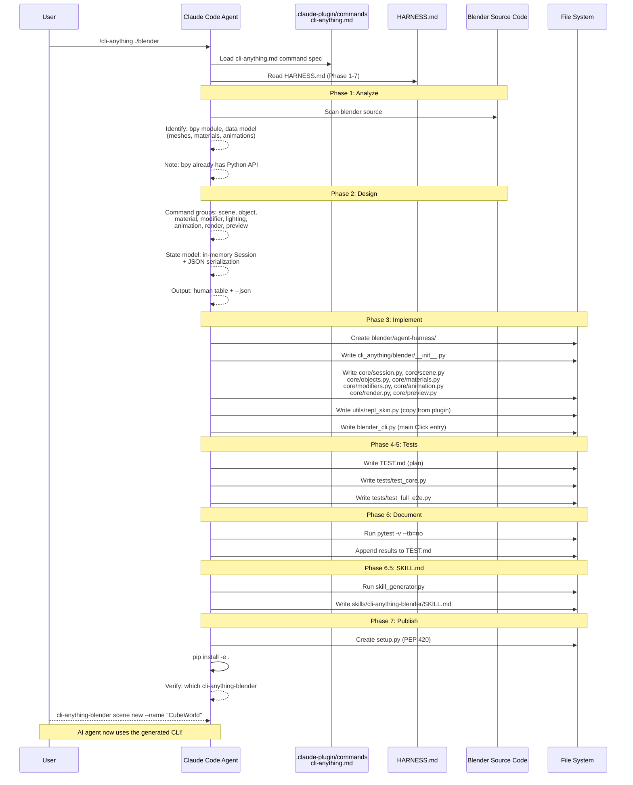
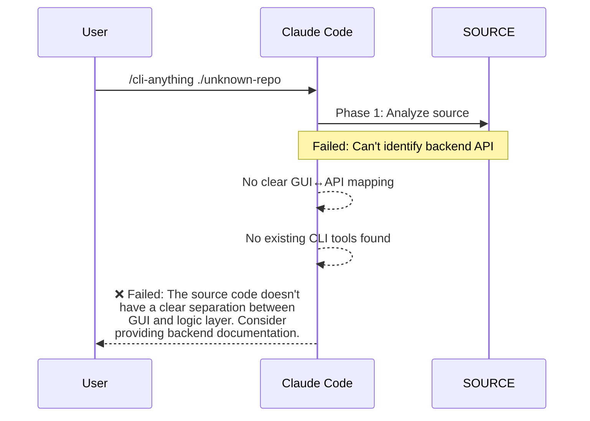

# CLI-Anything · 程式碼追蹤

## 追蹤的場景

我們追蹤「**使用 Claude Code 的 `/cli-anything` 命令為 Blender 產生 CLI**」這條完整路徑——從使用者下達一個 slash command，到產出一個可安裝的 `cli-anything-blender` CLI 並實際使用它。

這是 CLI-Anything 最核心的使用場景，也是它與傳統程式碼產生器最大的不同點：**整個產生過程是由 AI agent 閱讀一份 SOP 後自主執行的**。

```text
使用者: /cli-anything ./blender
        ↓
Claude Code 讀取 HARNESS.md
        ↓
7-phase pipeline 依序執行
        ↓
產出 cli-anything-blender 完整 CLI
```

## 流程圖



## 逐步追蹤

### Step 1: Plugin 命令載入

`cli-anything.md` 是 Claude Code plugin 的入口命令定義。它指定了 `/cli-anything <software-path-or-repo>` 的語法、參數含義、以及「**在開始任何事之前，你必須先讀 HARNESS.md**」的強制約束。

[`cli-anything-plugin/commands/cli-anything.md`](https://github.com/HKUDS/CLI-Anything/blob/436a4f5c42452b86b64fe0373e1ed67a4347a18a/cli-anything-plugin/commands/cli-anything.md#L5-L7)

```markdown
## CRITICAL: Read HARNESS.md First

**Before doing anything else, you MUST read `./HARNESS.md`.** It defines the
complete methodology, architecture standards, and implementation patterns.
```

這個文件的關鍵在於它是一個**給 agent 讀的規格文件**，而不是一個可以解析執行的腳本。CLI-Anything 選擇了 method-driven（agent 自主讀 SOP 執行）而非 program-driven（寫一個 CLI builder script）。這意味著：

- **優點**: 靈活——agent 可以針對不同軟體的特性微調實作
- **風險**: agent 可能跳過或誤讀 HARNESS.md 的某些段落 → 用「CRITICAL」這樣的關鍵字來加強約束

### Step 2: HARNESS.md 方法論解析

HARNESS.md 定義了完整的 7-phase pipeline。它的結構很特別——是一份給 agent 閱讀的 **SOP（Standard Operating Procedure）**，而不是給人類開發者的文件。

[`cli-anything-plugin/HARNESS.md`](https://github.com/HKUDS/CLI-Anything/blob/436a4f5c42452b86b64fe0373e1ed67a4347a18a/cli-anything-plugin/HARNESS.md#L1-L8)

每個 phase 都包含：
- **具體的操作指令**（「Phase 1: 找 backend engine → mapping GUI actions → 找 data model → 找 CLI tools → catalog command/undo system」）
- **程式碼範例**（Phase 3 直接給出 Click CLI 的骨架、REPL skin import 方式、backend 模組的風格局）
- **測試規格**（Phase 4-5 定義 unit test 和 E2E test 的最低要求，包含子進程測試的 `_resolve_cli()` helper）

值得注意的一點：HARNESS.md 是寫給 **Claude Code / Codex 等 coding agent** 讀的，不是給人讀的。它的語言假設讀者是一個有完整檔案系統和 subprocess 能力的 agent，能自主分析程式碼、撰寫測試、執行 pip install。

### Step 3: Phase 3 — Click CLI 實作

Blender 的 CLI 入口檔案 `blender_cli.py` 是一個標準的 Click 應用，展示了產出 CLI 的風格。

[`blender/agent-harness/cli_anything/blender/blender_cli.py`](https://github.com/HKUDS/CLI-Anything/blob/436a4f5c42452b86b64fe0373e1ed67a4347a18a/blender/agent-harness/cli_anything/blender/blender_cli.py#L1-L50)

```python
#!/usr/bin/env python3
"""Blender CLI — A stateful command-line interface for 3D scene editing."""

from cli_anything.blender.core.session import Session
from cli_anything.blender.core import scene as scene_mod
from cli_anything.blender.core import objects as obj_mod
from cli_anything.blender.core import materials as mat_mod
# ...

_session: Optional[Session] = None
_json_output = False
_repl_mode = False

def get_session() -> Session:
    global _session
    if _session is None:
        _session = Session()
    return _session
```

這個模式的設計決策：

- **Global session object**: 所有命令共享一個 global `_session`，讓 CLI 可以在有狀態和無狀態模式之間切換。REPL 模式中 session 維持在記憶體中；單次命令模式可以透過 `--json` 輸出格式來組合
- **`_json_output` flag**: 全局控制輸出格式，所有命令都檢查這個 flag 來決定回傳 human-readable 還是 machine-readable 輸出
- **Modular core**: 每個子系統（scene / objects / materials / ...）都是一個獨立 Python module

### Step 4: REPL Skin — 統一的終端介面

`repl_skin.py` 是 CLI-Anything 最被低估的元件。它提供了一個統一的 UI 層，讓所有產出的 CLI 都有一致的視覺風格。

[`cli-anything-plugin/repl_skin.py`](https://github.com/HKUDS/CLI-Anything/blob/436a4f5c42452b86b64fe0373e1ed67a4347a18a/cli-anything-plugin/repl_skin.py#L106-L157)

```python
class ReplSkin:
    def __init__(self, software: str, version: str = "1.0.0", ...):
        self.software = software.lower().replace("-", "_")
        self.display_name = software.replace("_", " ").title()
        self.accent = _ACCENT_COLORS.get(self.software, _DEFAULT_ACCENT)
```

關鍵設計：
- **軟體專屬色系**: `_ACCENT_COLORS` dict 為每個軟體指定不同顏色，強化了品牌感
- **零外部依賴核心**: ANSI escape codes 直接硬編碼（`_GREEN = "\033[38;5;78m"`），`prompt_toolkit` 是 optional
- **SKILL.md 路徑自動偵測**: 先找 repo-root 的 `skills/<skill-id>/SKILL.md`，再 fallback 到 packaged 版本
- **Banner 元資訊**: 開機畫面顯示 install command、skill path，方便 AI agent 閱讀

### Step 5: Skill Generator — 讓 AI agent 發現 CLI

`skill_generator.py` 從 CLI harness 的 metadata 自動產生 SKILL.md。這是讓整個設計閉環的關鍵——產出的 CLI 如果沒有被 AI agent 發現的機制，就只是另一個命令列工具。

[`cli-anything-plugin/skill_generator.py`](https://github.com/HKUDS/CLI-Anything/blob/436a4f5c42452b86b64fe0373e1ed67a4347a18a/cli-anything-plugin/skill_generator.py#L1-L100)

```python
@dataclass
class SkillMetadata:
    skill_name: str
    skill_description: str
    software_name: str
    skill_intro: str
    version: str
    command_groups: list[CommandGroup]
    examples: list[Example]

def extract_cli_metadata(harness_path: str) -> SkillMetadata:
    harness_path = Path(harness_path)
    # Find the cli_anything/<software> directory
    cli_anything_dir = harness_path / "cli_anything"
```

產生器從 README 和 CLI source 中提取命令資訊、群組結構、使用範例，產出 YAML frontmatter + Markdown body 的 SKILL.md。這讓 CLI 可以被 `npx skills add` 自動發現和安裝。

### Step 6: CLI-Hub — 套件管理層

CLI-Hub 是一個隸屬於同個 repo 的獨立 Python 套件，提供了搜尋、安裝、更新、解除安裝 CLI 的功能。

[`cli-hub/cli_hub/cli.py`](https://github.com/HKUDS/CLI-Anything/blob/436a4f5c42452b86b64fe0373e1ed67a4347a18a/cli-hub/cli_hub/cli.py#L1-L100)

```python
@click.group(invoke_without_command=True)
@click.option("--version", is_flag=True)
@click.pass_context
def main(ctx, version):
    """cli-hub — Download and manage CLI-Anything harnesses and public CLIs."""

@main.command()
@click.argument("name")
def install(name):
    success, msg = install_cli(name)
    if success:
        click.secho(f"✓ {msg}", fg="green")
```

關鍵設計：
- **雙 registry**: `registry.json`（harness CLI）和 `public_registry.json`（第三方 CLI）分離，由 `_source` tag 區分
- **安裝分派**: `installer.py` 根據 `_source` 決定用 pip 還是 npm 安裝
- **快取**: 1 小時 TTL 的本地快取 registry 資料

## 失敗路徑



最常見的失敗模式：**如果目標軟體的邏輯層和 UI 層沒有清楚分離**，Phase 1 的分析就會失敗。HARNESS.md 的 Phase 1 給了具體的應對策略（找 backend engine → map GUI actions → 找 data model），但沒有給保證成功的方案——這是 method-driven 方法的固有風險。

## 想學更多時，在哪裡下中斷點

- **Plugin entry**: [`cli-anything-plugin/commands/cli-anything.md`](https://github.com/HKUDS/CLI-Anything/blob/436a4f5c42452b86b64fe0373e1ed67a4347a18a/cli-anything-plugin/commands/cli-anything.md)
- **Methodology SOP**: [`cli-anything-plugin/HARNESS.md`](https://github.com/HKUDS/CLI-Anything/blob/436a4f5c42452b86b64fe0373e1ed67a4347a18a/cli-anything-plugin/HARNESS.md)
- **REPL Skin 實作**: [`cli-anything-plugin/repl_skin.py`](https://github.com/HKUDS/CLI-Anything/blob/436a4f5c42452b86b64fe0373e1ed67a4347a18a/cli-anything-plugin/repl_skin.py)
- **Skill 產生器**: [`cli-anything-plugin/skill_generator.py`](https://github.com/HKUDS/CLI-Anything/blob/436a4f5c42452b86b64fe0373e1ed67a4347a18a/cli-anything-plugin/skill_generator.py)
- **CLI-Hub entry**: [`cli-hub/cli_hub/cli.py`](https://github.com/HKUDS/CLI-Anything/blob/436a4f5c42452b86b64fe0373e1ed67a4347a18a/cli-hub/cli_hub/cli.py)
- **Registry 實作**: [`cli-hub/cli_hub/registry.py`](https://github.com/HKUDS/CLI-Anything/blob/436a4f5c42452b86b64fe0373e1ed67a4347a18a/cli-hub/cli_hub/registry.py)
- **Blender CLI 範例**: [`blender/agent-harness/cli_anything/blender/blender_cli.py`](https://github.com/HKUDS/CLI-Anything/blob/436a4f5c42452b86b64fe0373e1ed67a4347a18a/blender/agent-harness/cli_anything/blender/blender_cli.py)

## 沒追蹤到但值得留意

- **Preview 機制**: `preview_bundle.py` 和 `previews/` 機制支援 agent 在 CLI 中產生 preview 產物（HTML/MP4/PNG），讓 agent 能「看到」自己的操作結果。`docs/PREVIEW_PROTOCOL.md` 定義了 preview 協定
- **Refine 循環**: `/cli-anything:refine` 命令支援迭代改進已產生的 CLI，進行 gap analysis 後補上缺失的命令。這形成了一個「build → test → refine」的開發循環
- **Live Preview**: 部分軟體支援 `preview live` 模式，agent 可以在操作過程中即時看到輸出的變化（如 FreeCAD 的 CAD 繪圖）
