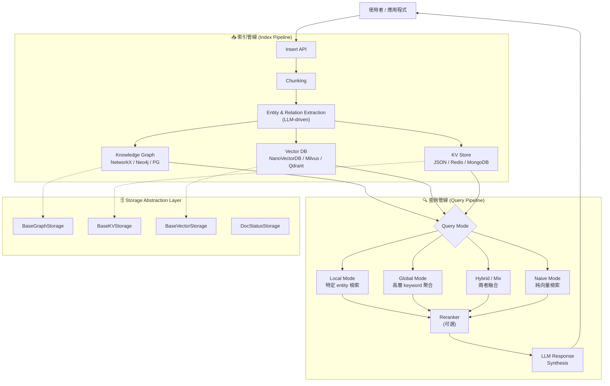

# LightRAG · 架構

## 系統高層圖



## 資料管線控制流

LightRAG 採用 **index-then-query** 兩階段架構，不同於 agent 常見的 ReAct loop。

### 索引階段 (Insert Pipeline)

入口：[`LightRAG.ainsert()`](https://github.com/hkuds/lightrag/blob/3bf2297/lightrag/lightrag.py#L1237)

```
1. 接收原始文件文字
2. 依 token size chunking（預設 1200 tokens，overlap 100）
3. 對每個 chunk，用 LLM 提取 entities 與 relations
4. 將 entities/relations 寫入 Knowledge Graph（graph storage）
5. 將 entities/relations/chunks 的 embedding 寫入 Vector DB
6. 將 metadata 寫入 KV Store
7. 更新文件處理狀態（DocStatusStorage）
```

核心提取邏輯在 [`lightrag/operate.py`](https://github.com/hkuds/lightrag/blob/3bf2297/lightrag/operate.py) 的 `extract_entities()` 函數。

### 查詢階段 (Query Pipeline)

入口：[`LightRAG.query()`](https://github.com/hkuds/lightrag/blob/3bf2297/lightrag/lightrag.py#L1300)

```
1. 用 LLM 從使用者 query 提取 high-level + low-level keywords
2. 依 mode（local/global/hybrid/mix/naive）決定檢索策略：
   a. local: 用 entity keyword 查 Vector DB → 從 Graph 取得相鄰 entities
   b. global: 用 high-level keyword 查 relation embeddings
   c. hybrid: local + global 結果合併
   d. mix: KG entities/relations + 原始 text chunks 同時檢索
   e. naive: 只檢索 text chunks（傳統 RAG）
3. （可選）Reranker 過濾
4. 將檢索結果放入 context，呼叫 LLM 生成回答
5. 支援 streaming response
```

### 控制流類型

- **是 ReAct、Plan-Execute、graph,還是其他?**: 不是 agent loop。LightRAG 是 **deterministic pipeline**，所有步驟的編排順序在程式碼中固定，不讓 LLM 決定下一步要做什麼。
- **終止條件**: 管線執行完畢即結束，不涉及重複迭代
- **錯誤處理**: 以 `PipelineCancelledException` ([`lightrag/exceptions.py`](https://github.com/hkuds/lightrag/blob/3bf2297/lightrag/exceptions.py)) 機制處理管線中斷，支援 checkpoint 恢復

## 四層儲存抽象

這是最值得細看的設計。儲存後端定義在 [`lightrag/kg/__init__.py`](https://github.com/hkuds/lightrag/blob/3bf2297/lightrag/kg/__init__.py)：

| 抽象層 | Base Class | 內建實作 | 用途 |
|---|---|---|---|
| **Graph Storage** | [`BaseGraphStorage`](https://github.com/hkuds/lightrag/blob/3bf2297/lightrag/base.py#L400) | NetworkX, Neo4j, PG (AGE), MongoDB, Memgraph, OpenSearch | 儲存 entities/nodes + relations/edges |
| **KV Storage** | [`BaseKVStorage`](https://github.com/hkuds/lightrag/blob/3bf2297/lightrag/base.py#L355) | JSON file, Redis, PG, MongoDB, OpenSearch | 文件全文、entity metadata、LLM cache |
| **Vector Storage** | [`BaseVectorStorage`](https://github.com/hkuds/lightrag/blob/3bf2297/lightrag/base.py#L218) | NanoVectorDB, Milvus, PGVector, Faiss, Qdrant, MongoDB | entity/relation/chunk embeddings |
| **DocStatus Storage** | `DocStatusStorage` | JSON file, Redis, PG, MongoDB, OpenSearch | 文件處理狀態追蹤 |

## Storage 的即插即用設計

每個 LightRAG instance 透過 constructor 參數（`kv_storage`、`vector_storage`、`graph_storage`、`doc_status_storage`）指定要用哪個實作。Implementation 的載入由 [`_get_storage_class()`](https://github.com/hkuds/lightrag/blob/3bf2297/lightrag/lightrag.py#L1177) 處理，內建實作直接 import，第三方實作走動態 import。

同一個後端可以扮演多個角色。例如 PostgreSQL 同時實作了 `PGKVStorage`、`PGVectorStorage`、`PGGraphStorage`（利用 Postgres + AGE extension），都在 [`lightrag/kg/postgres_impl.py`](https://github.com/hkuds/lightrag/blob/3bf2297/lightrag/kg/postgres_impl.py) 中。

註冊機制在 [`STORAGES`](https://github.com/hkuds/lightrag/blob/3bf2297/lightrag/kg/__init__.py#L113) dict 中，實作名稱對應到模組路徑。

## Prompt 管理

所有 prompt 集中在 [`lightrag/prompt.py`](https://github.com/hkuds/lightrag/blob/3bf2297/lightrag/prompt.py) 的 `PROMPTS` dict 中：

| Key | 用途 |
|---|---|
| `entity_extraction_system_prompt` | 引導 LLM 從文件 chunk 提取 entities + relations |
| `entity_extraction_user_prompt` | 使用者訊息的提取 prompt |
| `entity_continue_extraction_user_prompt` | Gleaning：補充提取上次遺漏的 entities |
| `summarize_entity_descriptions` | 多個 chunk 的 entity description 合併 |
| `rag_response` | KG-based query 的回答合成 |
| `naive_rag_response` | 純向量檢索的回答合成 |
| `keywords_extraction` | 從使用者 query 提取 keywords |
| `fail_response` | 無相關 context 時的 fallback |

## LLM Provider 抽象

LightRAG 不採用 class-based adapter pattern，而是使用 **function callback injection**：

```python
@dataclass
class LightRAG:
    llm_model_func: Callable[..., object] | None = field(default=None)
    embedding_func: EmbeddingFunc | None = field(default=None)
```

每個 provider 模組（如 [`lightrag/llm/openai.py`](https://github.com/hkuds/lightrag/blob/3bf2297/lightrag/llm/openai.py)、[`lightrag/llm/ollama.py`](https://github.com/hkuds/lightrag/blob/3bf2297/lightrag/llm/ollama.py)）提供一個工廠函數，傳回符合簽章的 callable。切換 provider 時只要換傳入的 function 即可，不需要改 LightRAG class 本身。

支援的 providers：OpenAI、Ollama、Gemini、Anthropic、Azure OpenAI、HuggingFace、vLLM、Jina、Zhipu、Bedrock、LiteLLM/LlamaIndex 等。

## 多工作空間 (Workspace)

LightRAG 支援透過 `workspace` 參數隔離多個儲存命名空間，實作在 [`lightrag/namespace.py`](https://github.com/hkuds/lightrag/blob/3bf2297/lightrag/namespace.py)。同一個 working_dir 可以包含多個 workspace 的資料，透過 namespace prefix 區分。

## 觀測性

- **Tracing**: Langfuse 整合
- **Evaluation**: 整合 RAGAS（Retrieval Augmented Generation Assessment）
- **LLM Cache**: 內建 LLM response cache，可儲存在 KV storage 中避免重複 API 呼叫

## 測試策略

tests 目錄包含約 40+ 個測試檔，涵蓋：
- 各 storage backend 的整合測試（PostgreSQL、MongoDB、Qdrant、Milvus、Neo4j、OpenSearch）
- 非同步管線測試
- Entity extraction 測試
- 安全性測試（Cypher injection、CWE 測試）
