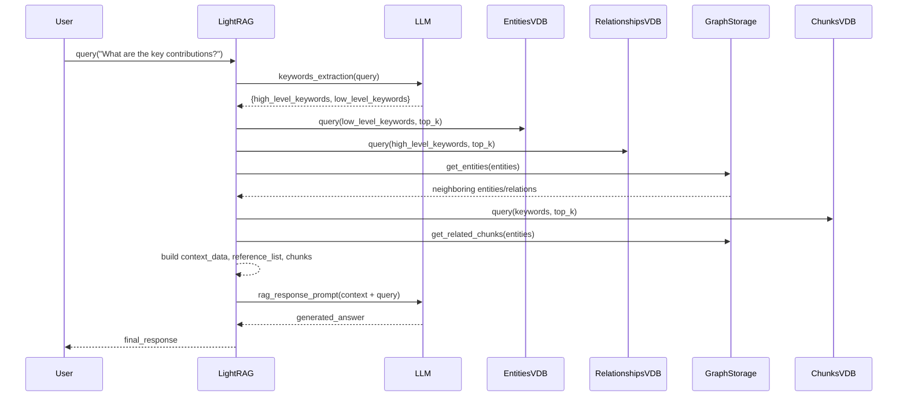

# LightRAG · 程式碼追蹤

## 追蹤的場景

**任務**: 使用者問「What are the key contributions of the LightRAG paper?」（查詢 LightRAG 論文的關鍵貢獻）

**預期的系統行為**:
1. 使用者 query 進入 query pipeline
2. 對 query 進行 keyword extraction（high-level + low-level）
3. 依 query mode（此處用預設 `mix`）從 KG 和 Vector DB 雙重檢索
4. 將檢索結果組合成 LLM context
5. LLM 生成回答

## 流程圖



## 逐步追蹤

### Step 0: LightRAG 初始化

lightrag 套件公開的 API 只有 `LightRAG` 與 `QueryParam` ([`lightrag/__init__.py:5`](https://github.com/hkuds/lightrag/blob/3bf2297/lightrag/__init__.py#L5))。

使用者的程式碼：
```python
from lightrag import LightRAG, QueryParam

rag = LightRAG(
    working_dir="./storage",
    llm_model_func=gpt_4o_complete,    # function callback
    embedding_func=EmbeddingFunc(...),
)
```

初始化時發生的事情 ([`lightrag/lightrag.py:531-755`](https://github.com/hkuds/lightrag/blob/3bf2297/lightrag/lightrag.py#L531))：
1. 建立 `storage` 子系統：`llm_response_cache`、`text_chunks`、`full_docs`、`full_entities`、`full_relations`、`entities_vdb`、`relationships_vdb`、`chunks_vdb`、`chunk_entity_relation_graph`、`doc_status`
2. 對 `llm_model_func` 與 `embedding_func` 套用 `priority_limit_async_func_call` wrapper（控制並發數）

### Step 1: Query 進入

使用者呼叫 `rag.query("What are the key contributions of the LightRAG paper?")`

入口點：[`LightRAG.query()`](https://github.com/hkuds/lightrag/blob/3bf2297/lightrag/lightrag.py#L1301)（同步 wrapper），內部呼叫 [`LightRAG.aquery()`](https://github.com/hkuds/lightrag/blob/3bf2297/lightrag/lightrag.py#L1315)

**值得學的地方**：同步/sync wrapper 模式 — `aquery()` 是 async，`query()` 用 `always_get_an_event_loop()` 取得 event loop 並 `run_until_complete`。這讓同一個 API 可以在 async 和 sync 環境都使用。

### Step 2: Keyword Extraction

[`lightrag/lightrag.py:1320`](https://github.com/hkuds/lightrag/blob/3bf2297/lightrag/lightrag.py#L1320)

```python
async def aquery(self, query: str, param: QueryParam = QueryParam()):
    # ... (streaming handling) ...
    # Keyword extraction
    keywords = await self._handle_keywords(query, param)
```

[`_handle_keywords()`](https://github.com/hkuds/lightrag/blob/3bf2297/lightrag/lightrag.py#L1580) 用 `PROMPTS["keywords_extraction"]` prompt 呼叫 LLM，取得 JSON 格式的 `{high_level_keywords: [...], low_level_keywords: [...]}`。

Prompt 定義在：[`lightrag/prompt.py:374-396`](https://github.com/hkuds/lightrag/blob/3bf2297/lightrag/prompt.py#L374)

### Step 3: Query Mode 分發

[`lightrag/lightrag.py:1326-1347`](https://github.com/hkuds/lightrag/blob/3bf2297/lightrag/lightrag.py#L1326) — 依據 `param.mode` 分發：

```python
if param.mode == "local":
    response = await kg_query(...)  # entities-focused
elif param.mode == "global":
    response = await kg_query(..., mode="global")  # relations-focused
elif param.mode in ("hybrid", "mix"):
    # 合併 local + global 結果
    local_result = await kg_query(..., mode="local")
    global_result = await kg_query(..., mode="global")
    mix_result = await naive_query(...)  # 原始文字 chunk 檢索
    # 三組結果合併
elif param.mode == "naive":
    response = await naive_query(...)
```

### Step 4: KG Query 內部（以 local mode 為例）

核心實作在 [`lightrag/operate.py`](https://github.com/hkuds/lightrag/blob/3bf2297/lightrag/operate.py) 的 `kg_query()`。

Local mode 的做法：

1. **Entity vector retrieval** — 用 low-level keywords 查 `entities_vdb`，取得 top_k 個實體
2. **Graph expansion** — 對這些實體，從 `chunk_entity_relation_graph` 取得它們的相鄰實體和關係
3. **Entity description synthesis** — 從 `full_entities` 取出 entity descriptions 並合併
4. **Text chunk retrieval** — 從 graph 取得這些實體關聯的 text chunks，到 `chunks_vdb` 做向量檢索
5. **Context 組裝** — 使用 `PROMPTS["kg_query_context"]` 將 entities、relations、text chunks 格式化為 context

Global mode 的差異：
- 用 high-level keywords 查 `relationships_vdb`（而非 `entities_vdb`）
- 取得的是全局的關係描述，聚焦於高層次概念

### Step 5: Response Synthesis

檢索結果組合成 context 後，用 `PROMPTS["rag_response"]` prompt 呼叫 LLM。

Prompt 定義在：[`lightrag/prompt.py:224-276`](https://github.com/hkuds/lightrag/blob/3bf2297/lightrag/prompt.py#L224)

這個 prompt 包含清晰的指令金字塔：
1. 從 Knowledge Graph Data 和 Document Chunks 提取事實
2. 只使用 context 內的資訊
3. 需要生成引用（reference_id → document title mapping）
4. 回應格式控制（`response_type` 參數）
5. References section 格式嚴格約束

### Step 6: 結果返回

支援 streaming 與 non-streaming 兩種模式：

- **Streaming**: 透過 `AsyncIterator[str]` 逐步傳回 LLM token（[`lightrag/lightrag.py:1360-1375`](https://github.com/hkuds/lightrag/blob/3bf2297/lightrag/lightrag.py#L1360)）
- **Non-streaming**: 直接傳回完整字串

## 想學更多時,在哪裡下中斷點

- query pipeline 起點: [`lightrag/lightrag.py:1315`](https://github.com/hkuds/lightrag/blob/3bf2297/lightrag/lightrag.py#L1315) — `aquery()`
- Keyword extraction 產出的原始 LLM response: `_handle_keywords()` 內部
- KG query 的主邏輯: [`lightrag/operate.py`](https://github.com/hkuds/lightrag/blob/3bf2297/lightrag/operate.py) 中的 `kg_query()`
- Entity extraction prompt 組裝: `extract_entities()` 在 `lightrag/operate.py`

## 沒追蹤到但值得留意的分支

- **文件刪除**: 支援透過 `adelete_by_doc_id()` 刪除文件，會自動觸發 KG 重建
- **Merge**: `amerge_by_doc_ids()` 合併多份文件的 entities/relations
- **LLM cache**: 所有 LLM 呼叫經過 `hashing_kv` 快取（透過 `handle_cache()` 在 `lightrag/utils.py`）
