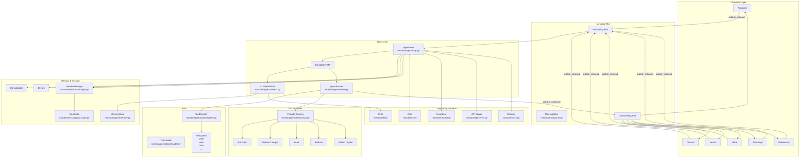
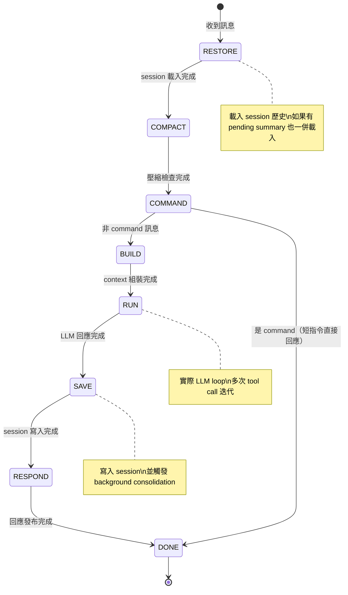

# Nanobot · 架構

## 高層元件圖



**圖意說明**：Nanobot 的架構以 MessageBus 為中心，所有外部頻道的訊息都透過 `publish_inbound` 進入 Inbound Queue，由 AgentLoop 消費處理。AgentLoop 內部由 TurnState 狀態機驅動，經過 ContextBuilder 組裝 system prompt → AgentRunner 執行 LLM loop（多次思考 + tool call 迭代）→ 結果寫入 Session → 透過 Outbound Queue 發布回頻道。ToolRegistry 與 Provider Factory 是兩個關鍵的 plugin 點，分別負責工具的發現與 LLM provider 的建立。

## TurnState 狀態機流程圖



**圖意說明**：Nanobot 的 TurnState 狀態機定義了從收到訊息到回應的 8 個階段。每個階段有明確的進入條件和退出事件。`COMMAND` 階段有兩個分支路徑：「dispatch」進入 BUILD 開始正常 agent 處理，「shortcut」直接跳到 DONE（例如 `/status` 這種不需要 LLM 的指令）。`RUN` 是實際的 LLM 迭代 loop，可能包含多次 tool call。

## Agent 控制流

### 主迴圈位置

[`nanobot/agent/loop.py:789`](https://github.com/HKUDS/nanobot/blob/ccbc0bb/nanobot/agent/loop.py#L789)

### TurnState 狀態機

Nanobot 最顯著的設計選擇是把 agent loop 實作為一個**顯式狀態機**，而不是傳統的 `while True: think() → act() → observe()` 架構：

```python
class TurnState(Enum):
    RESTORE = auto()   # 從 session 載入歷史
    COMPACT = auto()   # 檢查是否需要壓縮
    COMMAND  = auto()  # 檢查是否為 slash command
    BUILD    = auto()  # 組裝 system prompt + context
    RUN      = auto()  # 執行 LLM loop with tools
    SAVE     = auto()  # 寫入 session
    RESPOND  = auto()  # 發布回應
    DONE     = auto()  # 結束
```

狀態轉換表定義在 [`nanobot/agent/loop.py:149`](https://github.com/HKUDS/nanobot/blob/ccbc0bb/nanobot/agent/loop.py#L149)：

```python
_TRANSITIONS = {
    (TurnState.RESTORE, "ok"): TurnState.COMPACT,
    (TurnState.COMPACT, "ok"): TurnState.COMMAND,
    (TurnState.COMMAND, "dispatch"): TurnState.BUILD,
    (TurnState.COMMAND, "shortcut"): TurnState.DONE,
    (TurnState.BUILD, "ok"): TurnState.RUN,
    (TurnState.RUN, "ok"): TurnState.SAVE,
    (TurnState.SAVE, "ok"): TurnState.RESPOND,
    (TurnState.RESPOND, "ok"): TurnState.DONE,
}
```

**設計取捨**：State machine loop 比起純 ReAct loop 的優勢是每個階段有明確的 entry/exit point，方便掛 hook、trace、和 checkpoint。代價是程式碼分散在 `loop.py` 各處而非一個連續的 `async def run()`。但 Nanobot 透過 `TurnTraceEntry`（`loop.py:74`）記錄每個階段的耗時與錯誤，讓這個分散不至於變成黑箱。

### 一個 turn 的具體流程

```
1. RESTORE: 從 SessionManager 讀取 session 歷史（如有）
2. COMPACT: AutoCompact 檢查是否超過 session TTL，需要壓縮
3. COMMAND: 檢查訊息是否為 /slash command，若是直接分發
4. BUILD: ContextBuilder 組裝 system prompt（identity + skills + memory + tools）
5. RUN: AgentRunner.run() 開始 LLM loop
   a. 組裝 messages（system + session history + user input）
   b. Context governance（microcompact → snip → tool_result_budget）
   c. 呼叫 LLM provider
   d. 解析 response：tool call? → 執行工具 → 回到 b
   e. 若是 final answer → 儲存結果
6. SAVE: 將整個 turn 的 messages 寫入 session
7. RESPOND: 透過 MessageBus 發布 OutboundMessage
8. DONE: 清理資源
```

### 錯誤處理

- **Tool 執行失敗**：結果以 tool message 形式餵回 LLM，讓 LLM 決定如何處理（retry / 換工具 / 放棄）
- **LLM 超時**：可透過 `NANOBOT_LLM_TIMEOUT_S` 環境變數設定，預設由 `runner_wall_llm_timeout_s()` 根據 session metadata 動態計算
- **Provider retry**：內建 retry 策略（`base.py:97`），支援 transient error 偵測（429/500/502/503/504/timeout），以及 non-retryable 錯誤（quota/insufficient_balance）
- **Max iterations**：達到 `max_iterations` 時強制終止 loop，但仍輸出已累積的 content

## Prompt 管理

- **System prompts 放在哪**：[`nanobot/templates/`](https://github.com/HKUDS/nanobot/blob/ccbc0bb/nanobot/templates/)
- **Template 引擎**：Jinja2（透過 `utils/prompt_templates.py` 載入）
- **主要模板檔案**：`identity.md`（核心身份）、`platform_policy.md`（平台政策）、`tool_contract.md`（工具使用規範）、`skills_section.md`（技能章節）、`HEARTBEAT.md`（心跳提示）
- **是否有 prompt 版本控制**：透過 git 追蹤，模板檔與程式碼一起版本管理
- **動態組裝邏輯**：[`nanobot/agent/context.py:37`](https://github.com/HKUDS/nanobot/blob/ccbc0bb/nanobot/agent/context.py#L37) — `build_system_prompt()` 依序組合 identity → bootstrap files（AGENTS.md / SOUL.md / USER.md）→ tool contract → memory → skills → recent history → session summary

## Tool / Function 系統

- **Tool 註冊方式**：[`nanobot/agent/tools/loader.py:30`](https://github.com/HKUDS/nanobot/blob/ccbc0bb/nanobot/agent/tools/loader.py#L30) — 透過 `pkgutil.iter_modules` 自動掃描 `nanobot/agent/tools/` 下的所有 module，找出繼承 `Tool` base class 的 class 並自動註冊
- **Tool schema 定義**：每個 Tool class 透過 `parameters()` 方法回傳 JSON Schema，或是透過 Pydantic 模型自動生成
- **Tool 呼叫協定**：LLM native function calling（OpenAI 格式 + Anthropic 格式皆支援，由 provider 層處理轉換）
- **內建 Tools 清單**（[`nanobot/agent/tools/`](https://github.com/HKUDS/nanobot/blob/ccbc0bb/nanobot/agent/tools/)）：

| Tool | 用途 | 程式碼 |
|------|------|--------|
| `read_file` / `write_file` / `edit_file` | 檔案讀寫編輯 | [`filesystem.py`](https://github.com/HKUDS/nanobot/blob/ccbc0bb/nanobot/agent/tools/filesystem.py) |
| `exec` / `exec_session` | Shell 執行（含 sandbox） | [`shell.py`](https://github.com/HKUDS/nanobot/blob/ccbc0bb/nanobot/agent/tools/shell.py) |
| `web_search` / `web_fetch` | 網路搜尋與頁面抓取 | [`web.py`](https://github.com/HKUDS/nanobot/blob/ccbc0bb/nanobot/agent/tools/web.py) |
| `cron` | 排程任務管理 | [`cron.py`](https://github.com/HKUDS/nanobot/blob/ccbc0bb/nanobot/agent/tools/cron.py) |
| `spawn` | 建立 subagent | [`spawn.py`](https://github.com/HKUDS/nanobot/blob/ccbc0bb/nanobot/agent/tools/spawn.py) |
| `long_task` | 長時間任務 / sustained goal | [`long_task.py`](https://github.com/HKUDS/nanobot/blob/ccbc0bb/nanobot/agent/tools/long_task.py) |
| `generate_image` | 圖片生成 | [`image_generation.py`](https://github.com/HKUDS/nanobot/blob/ccbc0bb/nanobot/agent/tools/image_generation.py) |
| `apply_patch` | 程式碼 patch 套用 | [`apply_patch.py`](https://github.com/HKUDS/nanobot/blob/ccbc0bb/nanobot/agent/tools/apply_patch.py) |
| `message` | 發送訊息給使用者 | [`message.py`](https://github.com/HKUDS/nanobot/blob/ccbc0bb/nanobot/agent/tools/message.py) |
| `my` / `self` | Agent 自我修改 | [`self.py`](https://github.com/HKUDS/nanobot/blob/ccbc0bb/nanobot/agent/tools/self.py) |

- **Tool 錯誤處理**：[`nanobot/agent/runner.py:339`](https://github.com/HKUDS/nanobot/blob/ccbc0bb/nanobot/agent/runner.py#L339) — tool 執行結果正常化後以 tool role message 加入 messages，LLM 在下一個 iteration 看到結果並決定下一步
- **Tool 權限 / 安全**：[`nanobot/security/`](https://github.com/HKUDS/nanobot/blob/ccbc0bb/nanobot/security/) — PTH file guard（防止寫入敏感路徑）、workspace restriction、shell allow-list

## Memory 架構

### Short-term（對話內）

- **儲存形式**：`Session` dataclass 內的 `messages: list[dict]`，搭配 `SessionManager` 以 JSON 格式序列化到磁碟
- **截斷策略**：`AutoCompact`（`nanobot/agent/autocompact.py`）基於 TTL 自動壓縮過期 session；`Consolidator`（`nanobot/agent/memory.py:444`）在 token budget 接近上限時將舊 messages 交由 LLM 總結為摘要，存入 `history.jsonl`
- **最大訊息數上限**：預設 120 條 messages，超過時觸發 consolidation

### Long-term（跨對話）

- **有**：`Dream` 兩階段記憶系統（`nanobot/agent/memory.py`）
- **儲存後端**：檔案系統（`MEMORY.md` + `history.jsonl`）+ `GitStore`（`nanobot/utils/gitstore.py`）提供版本控制
- **寫入時機**：非同步 background，透過 cursor 追蹤已處理的 history entries
- **讀取策略**：system prompt 組裝時，`ContextBuilder` 讀取 `MEMORY.md` 的內容以及未處理的 history entries 作為「Recent History」區塊

### Dream 兩階段記憶

第一階段提取新的事實寫入 `MEMORY.md`，第二階段跨條目交叉比對以消除矛盾。這是 Nanobot 跟其他輕量 agent 框架最顯著的差異點——多數框架要嘛不做長期記憶，要嘛只做簡單的 KV 儲存。

## LLM Provider 抽象

- **抽象方式**：[`nanobot/providers/base.py:92`](https://github.com/HKUDS/nanobot/blob/ccbc0bb/nanobot/providers/base.py#L92) — `LLMProvider` ABC 定義 `chat()` 與 `chat_stream()` 介面
- **支援的 providers**：Anthropic、OpenAI Compatible、Azure OpenAI、AWS Bedrock、GitHub Copilot、OpenAI Codex、FallbackProvider（支援多 provider 降級）
- **切換 provider 需要改的地方**：只需改 `config.json` 中的 provider 名稱與 API key，不需要動程式碼
- **是否有 fallback**：有 — `FallbackProvider`（`nanobot/providers/fallback_provider.py`）支援 inline fallback 與 `fallback_models` 陣列

## 跨模組通訊模式

**MessageBus**（[`nanobot/bus/queue.py:8`](https://github.com/HKUDS/nanobot/blob/ccbc0bb/nanobot/bus/queue.py#L8)）：

```python
class MessageBus:
    def __init__(self):
        self.inbound: asyncio.Queue[InboundMessage] = asyncio.Queue()
        self.outbound: asyncio.Queue[OutboundMessage] = asyncio.Queue()
```

**設計取捨**：純 `asyncio.Queue` 比 event bus / pub-sub 更簡單——不需要 subscriber 管理、不需要 event type registry、不需要 dispatcher。代價是：只能 single-consumer（只有 AgentLoop 消費 inbound），沒有 broadcast 能力。但對於 Nanobot 的架構（一個 agent 消費所有訊息），這個簡化的 trade-off 是對的。

## 並行模型

- **Cross-session concurrency**：不同 session 的訊息可並行處理，透過 `_session_locks`（per-session `asyncio.Lock`）確保單一 session 內的序列性
- **Global concurrency gate**：`NANOBOT_MAX_CONCURRENT_REQUESTS`（預設 3）限制同時進行的 agent turn 數量
- **Mid-turn injection**：當一個 session 正在處理中，新的訊息會進入 `_pending_queues[session_key]`，在 tool 執行完後被 `_drain_injections()` 消費，實現 mid-turn 插入

## 安全與護欄

- **Workspace restriction**：`restrict_to_workspace` 配置選項，限制 agent 的檔案操作範圍
- **Shell sandbox**：[`nanobot/agent/tools/sandbox.py`](https://github.com/HKUDS/nanobot/blob/ccbc0bb/nanobot/agent/tools/sandbox.py) — 支援多種 sandbox 後端（local、Docker、SSH）
- **PTH guard**：[`nanobot/security/`](https://github.com/HKUDS/nanobot/blob/ccbc0bb/nanobot/security/) — 防止寫入 `/etc/passwd` 等敏感路徑
- **Dual check**：CLI 入口和工具執行雙重檢查
- **Cost / iteration 上限**：`max_iterations` 與 `context_window_tokens` 可配置

## 主要設計決策與 Trade-off

### 決策 1：MessageBus over EventBus

Nanobot 選擇 `asyncio.Queue` 作為頻道與 agent 之間的通訊媒介，而非用 pub/sub event bus。

- **選擇理由**：單一 consumer 不需要 broadcast 能力，Queue 更簡單、無 subscriber 管理開銷
- **放棄的**：無法同時有多個 consumers、無法動態加入/移除 subscribers
- **判斷**：對於 single-agent 架構是正確的 trade-off。如果未來要支援 multi-agent，可能需要改成 EventBus

### 決策 2：顯式 State Machine over 隱式 Loop

`TurnState` enum + `_TRANSITIONS` dict 讓 agent loop 的每個階段有明確的邊界。

- **選擇理由**：方便加 hook、trace、checkpoint；知道「在哪個階段掛掉」而不是「loop 裡某處拋異常」
- **放棄的**：程式碼分散在 `loop.py` 各處的 `_on_RESTORE()`、`_on_RUN()` 等方法，閱讀路徑不如連續的 `async def run()` 直觀
- **判斷**：對 production agent 是值得的。`run()` method 本質上是 `_driver()`，而真正的邏輯在狀態 handler 裡

### 決策 3：Context Governance as Multi-Layer Pipeline

每次 LLM call 前執行多層 context 治理，而非僅簡單的 token counting。

- **選擇理由**：`_microcompact` 壓縮冗餘的 tool result、`_snip_history` 從頭部裁剪歷史、`_apply_tool_result_budget` 限制單一 tool result 大小——每層處理不同 edge case
- **放棄的**：效能開銷、程式碼複雜度
- **判斷**：考慮到 LLM 對 context pollution 的敏感度，這個投資值得。但 pipeline 順序（microcompact → snip → result_budget）需要謹慎，因為 snip 可能創造新的 orphan tool results

## 觀測性與評估

- **Tracing**：支援 LangSmith（optional dependency）
- **Token / cost 追蹤**：內建 `_last_usage` 與 `_accumulate_usage()` 追蹤每次 LLM call 的 token 用量
- **Agent progress hook**：[`nanobot/agent/progress_hook.py`](https://github.com/HKUDS/nanobot/blob/ccbc0bb/nanobot/agent/progress_hook.py) — lifecycle hook 系統，支援 before_iteration、after_iteration、on_stream、before_execute_tools 等掛鉤點
- **內建 evaluation**：無專屬 eval 系統，但 tests 目錄有 pytest 測試覆蓋非確定性 agent 行為

## 測試策略

- **測試非確定性的 agent**：透過 mock provider（繼承 `LLMProvider`）回傳預先定義的 response 序列
- **是否有 deterministic test mode**：無獨立 flag，但 tools 和 runner 的單元測試覆蓋率高
- **覆蓋率重點**：runner 的 context governance pipeline、memory 的原子寫入、provider 的 retry 策略、channel 的 message 格式化
