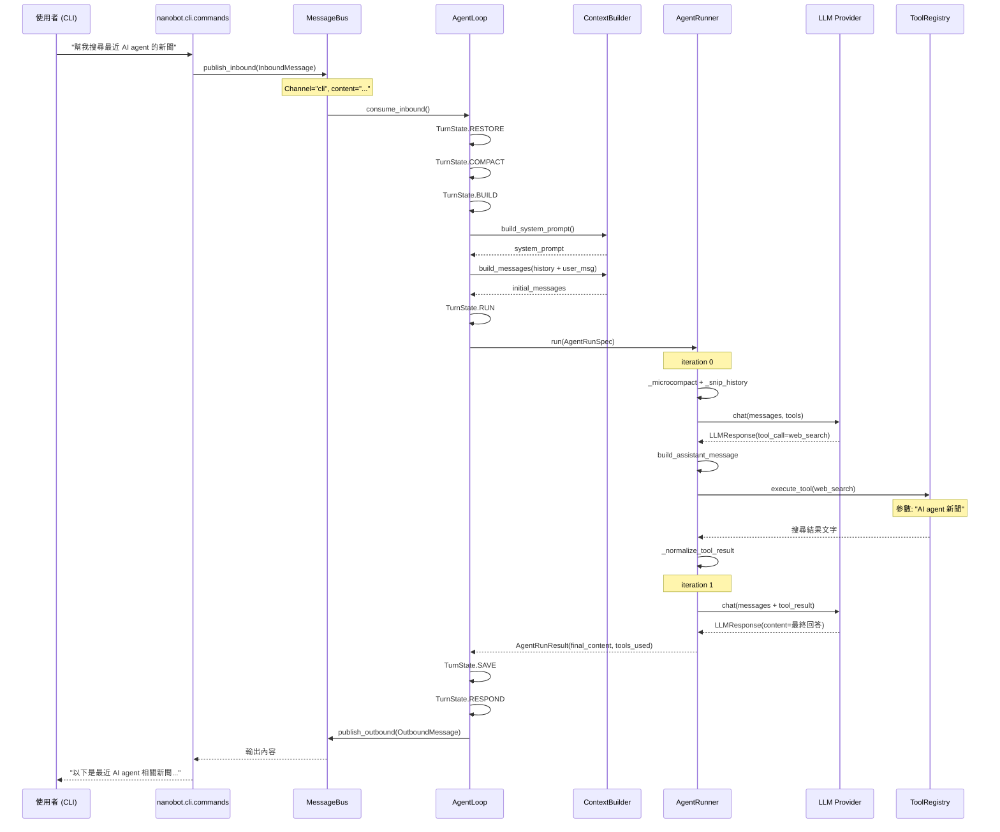

# Nanobot · 程式碼追蹤

## 追蹤的場景

**任務**：使用者在 CLI 輸入 `"幫我搜尋最近 AI agent 的新聞"`，Nanobot 執行搜尋並回傳結果。

**預期的 agent 行為**：
1. 接收使用者輸入
2. 載入 session 歷史與 memory
3. 組裝 system prompt + 工具定義
4. LLM 決定呼叫 web_search tool
5. 執行 web_search
6. 將結果餵回 LLM
7. LLM 整理最終回答
8. 寫入 session 並回傳結果

## 流程圖



## 逐步追蹤

### Step 1: 訊息進入系統

入口點：[`nanobot/cli/commands.py`](https://github.com/HKUDS/nanobot/blob/ccbc0bb/nanobot/cli/commands.py)

CLI 入口使用 typer 框架，使用者的輸入被封裝為 `InboundMessage` 後送入 MessageBus 的 inbound queue。

```python
# InboundMessage 結構
@dataclass
class InboundMessage:
    channel: str         # "cli"
    sender_id: str       # 使用者識別
    chat_id: str         # "direct"
    content: str         # "幫我搜尋最近 AI agent 的新聞"
    media: list[str]     # []
    session_key_override: str | None = None
```

**值得學的地方**：`session_key` 的計算邏輯——預設為 `{channel}:{chat_id}`（例如 `cli:direct`），支援 `session_key_override` 讓頻道可以指定不同的 session key（例如 Discord thread 可以有自己的 session），也支援 `unified_session` 模式強制所有頻道共用 `unified:default`。

### Step 2: AgentLoop 主迴圈接收訊息

[`nanobot/agent/loop.py:789`](https://github.com/HKUDS/nanobot/blob/ccbc0bb/nanobot/agent/loop.py#L789)

```python
async def run(self) -> None:
    self._running = True
    await self._connect_mcp()
    while self._running:
        try:
            msg = await asyncio.wait_for(self.bus.consume_inbound(), timeout=1.0)
        except asyncio.TimeoutError:
            self.auto_compact.check_expired(...)
            continue
        ...
        task = asyncio.create_task(self._dispatch(msg))
```

主迴圈的設計很精妙：每秒檢查一次 inbound queue，如果在 timeout 內沒有訊息就順便跑 auto_compact 檢查過期 session。這讓 timeout 從錯誤變成輪詢機會，而非浪費的等待。

**Mid-turn injection 的關鍵邏輯**（`loop.py:825`）：

```python
if effective_key in self._pending_queues:
    # 已有活躍任務，新訊息進入 pending queue
    self._pending_queues[effective_key].put_nowait(pending_msg)
    continue
```

如果該 session 正在處理中（有 active task），新訊息會被塞進 pending queue，在下一次 tool 執行完後由 `_drain_injections()` 消費。這實現了「使用者可以在 agent 執行工具時插入新的指示」的功能。

### Step 3: TurnState 狀態機驅動

[`nanobot/agent/loop.py:63`](https://github.com/HKUDS/nanobot/blob/ccbc0bb/nanobot/agent/loop.py#L63)

`_dispatch()` 方法（`loop.py:864`）依序執行狀態機的各個階段。以我們的場景來說，最關鍵的階段是 `TurnState.BUILD → TurnState.RUN`：

**BUILD**：呼叫 `_build_initial_messages()` 組裝 messages
**RUN**：呼叫 `_run_agent_loop()` 實際執行 LLM 迭代

### Step 4: Context 組裝

[`nanobot/agent/context.py:37`](https://github.com/HKUDS/nanobot/blob/ccbc0bb/nanobot/agent/context.py#L37)

`build_system_prompt()` 依序組合：
1. **Identity**（`_get_identity()`）：從 Jinja2 模板渲染 agent 身份描述，包含 workspace 路徑、OS/runtime 資訊
2. **Bootstrap files**（`AGENTS.md` / `SOUL.md` / `USER.md`）：從 workspace 根目錄讀取自訂檔案，讓使用者可以透過檔案直接影響 agent 行為
3. **Tool contract**（`tool_contract.md`）：定義工具使用的規範
4. **Memory**：從 `MEMORY.md` 讀取長期記憶
5. **Skills**：always-loaded skills + 可選 skills 的清單
6. **Recent history**：從 `history.jsonl` 讀取 Dream 尚未處理的 entries
7. **Session summary**：如果有的話（來自 consolidation）

**值得學的地方**：bootstrap files 的設計讓使用者可以透過撰寫檔案來調整 agent 行為，不需編輯程式碼。這跟 Hermes Agent 的 skills 系統原理相同——但 Nanobot 把它更直接地暴露為系統 prompt 的一部分。

### Step 5: AgentRunner 執行 LLM Loop

[`nanobot/agent/runner.py:250`](https://github.com/HKUDS/nanobot/blob/ccbc0bb/nanobot/agent/runner.py#L250)

`run()` 方法的核心是 `for iteration in range(spec.max_iterations)` 迴圈。每次迭代：

#### 5a: Context Governance（每次 LLM call 前）

[`runner.py:273-280`](https://github.com/HKUDS/nanobot/blob/ccbc0bb/nanobot/agent/runner.py#L273)

```python
messages_for_model = self._drop_orphan_tool_results(messages)
messages_for_model = self._backfill_missing_tool_results(messages_for_model)
messages_for_model = self._microcompact(messages_for_model)
messages_for_model = self._apply_tool_result_budget(spec, messages_for_model)
messages_for_model = self._snip_history(spec, messages_for_model)
messages_for_model = self._drop_orphan_tool_results(messages_for_model)
messages_for_model = self._backfill_missing_tool_results(messages_for_model)
```

這是最值得研究的程式碼區塊之一。每次 LLM call 前，messages 經過五層處理：

1. **`_drop_orphan_tool_results`**：移除沒有對應 tool_call 的 tool role message（避免孤兒 tool result 污染 context）
2. **`_backfill_missing_tool_results`**：為找不到 tool result 的 tool_call 補上 `[Tool result unavailable...]` 佔位符（避免 LLM 看到一個沒有對應結果的 tool_call）
3. **`_microcompact`**：對 `read_file`、`exec`、`grep`、`find_files`、`web_search`、`web_fetch` 等「內容可能很長」的工具結果，丟棄中間行，保留頭尾
4. **`_apply_tool_result_budget`**：確保每個 tool result 不超過 `max_tool_result_chars`
5. **`_snip_history`**：當 prompt 總長度超過 token budget 時，從最舊的 messages 開始裁剪。使用 `estimate_prompt_tokens_chain` 進行 token 估算

[UNVERIFIED] Context governance pipeline 的順序設計——`_microcompact` 在 `_snip_history` 之前，可能是因為 microcompact 減少的是單一 tool result 的內部冗餘，而 snip 移除的是整個 messages。若先 snip 再 microcompact，已移除的 messages 就沒有機會被 compact 了。

#### 5b: LLM 呼叫

[`runner.py:294`](https://github.com/HKUDS/nanobot/blob/ccbc0bb/nanobot/agent/runner.py#L294) — 透過 `self._request_model()` 呼叫 provider 的 `chat()`

回應包含：
- `response.content` — 文字內容
- `response.tool_calls` — 工具呼叫請求
- `response.reasoning_content` — 推理過程（支援 Kimi、DeepSeek-R1、MiMo 等）
- `response.thinking_blocks` — Anthropic extended thinking
- `response.finish_reason` — 終止原因

#### 5c: Tool 執行

當 `response.should_execute_tools` 為 True 時：

[`runner.py:312-344`](https://github.com/HKUDS/nanobot/blob/ccbc0bb/nanobot/agent/runner.py#L312)

```python
assistant_message = build_assistant_message(response.content, tool_calls=[...])
messages.append(assistant_message)
results, new_events, fatal_error = await self._execute_tools(spec, response.tool_calls, ...)
for tool_call, result in zip(response.tool_calls, results):
    tool_message = {"role": "tool", "tool_call_id": tool_call.id, ...}
    messages.append(tool_message)
```

在我們的場景中，LLM 會在第一次 iteration 回傳 `tool_call(name="web_search", arguments={"query": "AI agent 最新新聞"})`。

`_execute_tools()` 的並行執行邏輯：如果 LLM 一次要求多個 tool call，Nanobot 會**並行執行**它們（`concurrent_tools=True`），透過 `asyncio.gather` 批次處理。

**值得學的地方**：`_normalize_tool_result()` 處理了各種工具回傳格式——str、dict、list、甚至 exception——統一轉換為可序列化的 tool message content。

### Step 6: 結果餵回 LLM

Tool 執行結果以 `role: "tool"` message 加入 messages。LLM 在下一個 iteration 看到結果，決定是要繼續呼叫工具還是給出最終答案。

### Step 7: 終止判斷

Agent loop 在以下條件終止：
- LLM 回傳 `finish_reason="stop"` 且沒有 tool call → 正常完成
- 達到 `max_iterations` → 強制終止，`stop_reason="max_iterations"`
- Fatal tool error → `stop_reason="tool_error"`
- 回傳空的 content 超過 `_MAX_EMPTY_RETRIES`（=2）次 → 發出 recovery message
- Content 長度超過 context window 超過 `_MAX_LENGTH_RECOVERIES`（=3）次 → 回退重試

**值得學的地方**：`empty_content_retries` 和 `length_recovery_count` 的計數器會在所有 tool call 成功時歸零（`runner.py:391`），避免同一輪的 tool 執行結果導致錯誤的退卻。

### Step 8: Memory 寫入

[`nanobot/agent/loop.py`] — 在 TurnState.SAVE 階段，將整個 turn 的 messages 寫入 SessionManager，由 SessionManager 序列化到磁碟。

## 想學更多時，在哪裡下中斷點

- Agent loop 起點：[`nanobot/agent/loop.py:789`](https://github.com/HKUDS/nanobot/blob/ccbc0bb/nanobot/agent/loop.py#L789) — `run()` 方法
- LLM call 前一刻（看完整 prompt）：[`nanobot/agent/runner.py:294`](https://github.com/HKUDS/nanobot/blob/ccbc0bb/nanobot/agent/runner.py#L294) — `_request_model()` 被呼叫的地方
- Context governance 處理前：[`nanobot/agent/runner.py:273`](https://github.com/HKUDS/nanobot/blob/ccbc0bb/nanobot/agent/runner.py#L273)
- Tool dispatch：[`nanobot/agent/runner.py:339`](https://github.com/HKUDS/nanobot/blob/ccbc0bb/nanobot/agent/runner.py#L339) — `_execute_tools()`
- Memory 讀取：[`nanobot/agent/context.py:37`](https://github.com/HKUDS/nanobot/blob/ccbc0bb/nanobot/agent/context.py#L37) — `build_system_prompt()`
- Session 儲存：[`nanobot/session/manager.py`](https://github.com/HKUDS/nanobot/blob/ccbc0bb/nanobot/session/manager.py) — `SessionManager.save()`

## 沒追蹤到但值得留意的分支

- **Subagent 協作**：當 agent 呼叫 `spawn` tool，AgentRunner 的 loop 會暫停並等待 subagent 完成。結果透過 pending queue 注入回主 loop
- **Sustained goal（/goal）**：`nanobot/session/goal_state.py` 實作了長期目標追蹤，狀態持久化到 session metadata，在每次 turn 開始時注入到 context
- **Mid-turn injection**：使用者在 agent 執行工具時發送的新訊息，透過 `_pending_queues` 被 `_drain_injections()` 消費
- **Provider fallback**：當主要 provider 失敗時，`FallbackProvider` 會嘗試 inline fallback 或 `fallback_models` 中的備用模型
