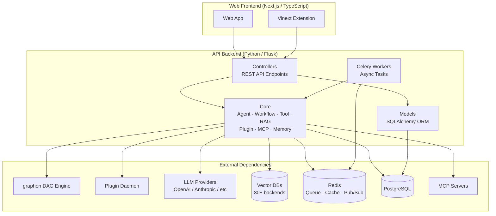
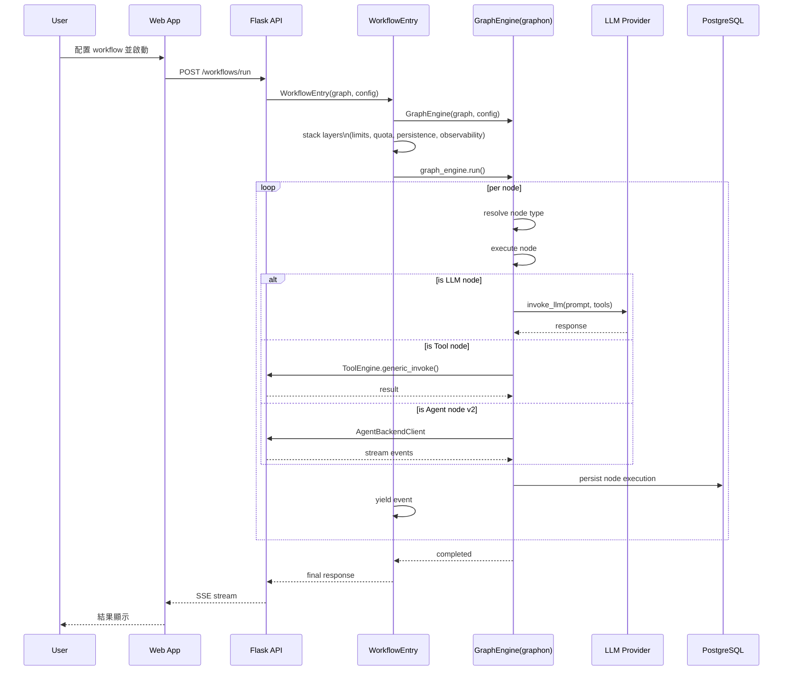
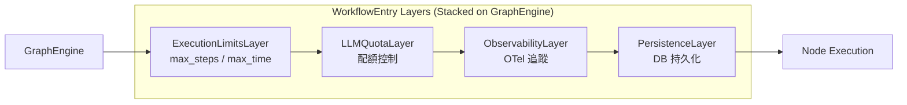

# Dify · 架構

## 高層模組圖

Dify 是前後端分離的 monorepo，核心是 Python Flask API 後端，前端是 Next.js TypeScript 應用，兩者透過 REST API + WebSocket (Socket.IO) 通訊。



### 圖意說明

Dify 的模組結構大致分四層：

1. **Frontend** — Next.js + 自研 Vinext 擴展系統，負責視覺化 workflow 編輯器、對話介面、設定面板
2. **API Controllers** — Flask-RESTx 定義的 REST API 端點，分 console（管理後台）、service_api（外部服務）、web（前端）、MCP（MCP 協定）、inner_api（內部）五個命名空間
3. **Core** — 業務邏輯核心，包含 agent runner、workflow entry、tool 系統、RAG pipeline、plugin 整合、MCP 客戶端、memory 管理等
4. **External** — graphon DAG 引擎（外部套件）、Plugin Daemon（獨立行程）、LLM providers、vector DB、Redis、PostgreSQL

**關鍵觀察**：graphon 是**外部套件**（`graphon==0.4.0`），不是 Dify 自研——這意味著 Dify 的核心 workflow 執行依賴於一個外部社群維護的 DAG 引擎。Plugin Daemon 是獨立行程，不和主 API 共用記憶空間，這是 production 環境的選擇。

## 資料流：一次 Workflow 請求



### 圖意說明

Workflow 執行的核心路徑經過三層抽象：

Dify API 收到請求後建立 `WorkflowEntry`，這是整段流程的關鍵整合層（[`workflow_entry.py:139`](https://github.com/langgenius/dify/blob/72ee50c/api/core/workflow/workflow_entry.py#L139)）。它負責：
1. 建立 `GraphEngine` 實例（來自 graphon）
2. 堆疊 middleware-like 的 layers（quota / limits / observability / persistence）
3. 逐個 node 驅動執行、yield 事件

事件透過 `generator` 機制傳回 `WorkflowBasedAppRunner`（[`workflow_app_runner.py`](https://github.com/langgenius/dify/blob/72ee50c/api/core/app/apps/workflow_app_runner.py#L396)），後者用 Python 3.10+ 的 `match` 語法將 graphon 事件映射為 queue events 再經 SSE 推送前端。

**串流處理次數**：從使用者請求到最終 UI 更新，資料經過：HTTP → Flask app → queue → GraphEngine → LLM API → GraphEngine → queue → persistence → SSE → Socket.IO → 前端。整條鏈路經過多次序列化/反序列化。

## Agent 節點設計（v1 vs v2）

```mermaid
flowchart LR
  subgraph v1["Agent Node v1 (Legacy)"]
    A1_Node[AgentNode\nworkflow/nodes/agent/]
    A1_Strategy[Strategy Plugin\nstrategy/base.py]
    A1_Runner[Agent Runner\ncot / fc runner]
  end

  subgraph v2["Agent Node v2 (Current)"]
    A2_Node[AgentNode\nworkflow/nodes/agent_v2/]
    A2_Resolver[BindingResolver\nbinding_resolver.py]
    A2_RB[RuntimeRequestBuilder\nruntime_request_builder.py]
    A2_Backend[Agent Backend\n(External Service)]
    A2_Adapter[OutputAdapter\noutput_adapter.py]
  end

  A1_Node --> A1_Strategy
  A1_Strategy --> A1_Runner
  A1_Runner --> LLM[(LLM)]

  A2_Node --> A2_Resolver
  A2_Resolver --> A2_RB
  A2_RB --> A2_Backend
  A2_Backend --> A2_Adapter
  A2_Adapter --> LLM
```

### 圖意說明

Dify 的 Agent 節點有兩個版本，反映了架構的演進：

**v1**（[`nodes/agent/agent_node.py`](https://github.com/langgenius/dify/blob/72ee50c/api/core/workflow/nodes/agent/agent_node.py)）— 使用 plugin 策略（`AgentStrategy.Plugin`）直接在 API 行程內執行 agent。策略透過 `PluginAgentClient` 呼叫 Plugin Daemon，實際的 ReAct/FC loop 在 plugin 側執行。

**v2**（[`nodes/agent_v2/agent_node.py`](https://github.com/langgenius/dify/blob/72ee50c/api/core/workflow/nodes/agent_v2/agent_node.py)）— 使用外部的 **Agent Backend** 服務來執行 agent。`BindingResolver` 負責將 workflow 變數映射到 agent binding，`RuntimeRequestBuilder` 建構 agent runtime 請求，`OutputAdapter` 將結果轉換回 workflow 格式。v2 將 agent 的實際執行邏輯**完全抽離到獨立服務**，讓 Dify API 行程不再承擔 agent loop 的計算壓力和記憶體使用。

這兩個版本並存於程式碼中，且皆可透過 `node_type + node_version` 選擇（[`node_factory.py:127`](https://github.com/langgenius/dify/blob/72ee50c/api/core/workflow/node_factory.py#L127)），但 v2 顯然是當前發展方向。

## Layers 架構

graphon 的 `GraphEngine` 支援 middleware-like 的 layer 堆疊：



Layers 的堆疊順序有意義：`ExecutionLimitsLayer` 在最外層（先檢查限制），`LLMQuotaLayer` 在內層（控制 LLM 呼叫頻率與配額），`ObservabilityLayer` 再內層（追蹤節點執行），`PersistenceLayer` 在最內層（將結果寫入 DB）。這種「洋蔥模型」確保 quota 檢查和限制在節點真正執行前就完成，減少不必要的資源浪費。

## 關鍵設計決策

### 1. 採用外部 graphon DAG 引擎而非自幹

**決策**：`graphon==0.4.0` 是外部 PyPI 套件，Dify 透過 `WorkflowEntry` 整合層與之互動，而非從零實作 workflow 引擎。

**trade-off**：
- ✅ 圖靈完備的 DAG 執行、平行節點支援、layer 系統都不需要自己維護
- ✅ graphon 的 `GraphEngine` 支援多種 command channel（`InMemoryChannel` / `RedisChannel`），滿足本地與分散式兩種場景
- ❌ 依賴外部套件的演進方向，版本升級可能引入 breaking changes
- ❌ 需要一層 `DifyNodeFactory` 做 node 轉接（graphon 的 node 類別 vs Dify 的實作）
- ❌ `graphon` 社群較小（[UNVERIFIED]）— 查不到明確的 stars/contributor 資料，如果維護中斷，Dify 需要 fork 或替換

### 2. Plugin Daemon 隔離而非 sandboxed import

**決策**：Plugin 程式碼透過獨立 HTTP 服務（Plugin Daemon）執行，不走 Python import 機制。

**trade-off**：
- ✅ Plugin crash 不會影響主 API 行程
- ✅ Plugin 資源限制（CPU / memory / time）可在 daemon 層級施加，不受 GIL 影響
- ✅ 支援非 Python 的 plugin（如 Go / Rust daemon），雖然目前主要是 Python
- ❌ 每次 plugin 調用都多一次 HTTP round-trip（latency penalty）
- ❌ 需要維護 API 與 daemon 之間的 backward-invocation 通道（plugin 需要反過來呼叫 API 的 model / tool 能力）
- ❌ 部署複雜度增加（多一個服務要管）

### 3. RAG Pipeline 作為 Workflow 的子類型

**決策**：Pipeline app 本質上是 `WorkflowType.pipeline` 的 workflow，使用同一套 `WorkflowEntry` / graphon 引擎，但在變數系統上擴充了 document 相關的 system variables。

**trade-off**：
- ✅ 資料處理 pipeline 可以完全復用 DAG 引擎（平行處理、狀態管理、錯誤處理）
- ✅ Legacy dataset 可以透過 `RagPipelineTransformService` 無痛轉換為 pipeline YAML
- ❌ Pipeline 的執行模式（一次文件 → 一個 pipeline run）跟 workflow（一次請求 → 一次 workflow）在語意上不同，但共用同一套執行器，可能讓某些 edge case 的除錯變複雜
- ❌ Pipeline 的佇列管理（`TenantIsolatedTaskQueue`）和 workflow 的同步執行使用不同的機制——這到底是必要差異還是可統一，值得觀察

### 4. FC 優先、CoT 備援的雙態 Agent

**決策**：在 [`app_runner.py:185-186`](https://github.com/langgenius/dify/blob/72ee50c/api/core/app/apps/agent_chat/app_runner.py#L185) 自動檢查 model schema 的 feature flags，若支援 `MULTI_TOOL_CALL` 或 `TOOL_CALL` 就使用 FunctionCallAgentRunner，否則 fallback 到 CotChatAgentRunner。

**trade-off**：
- ✅ 使用者完全不需要知道 FC vs CoT 的差異——對 LLM 新手極友善
- ✅ 單一程式碼路徑就可以支援從 GPT-4 到開源模型（有些沒有 tool calling）的廣泛模型
- ❌ 自動切換的邏輯隱藏在 `app_runner.py` 內部，使用者無法強制指定 agent 策略（除非寫 plugin strategy）
- ❌ FC 和 CoT 的 prompt 模板完全不同（FC 傳 `tools=` 參數給 LLM，CoT 靠文字描述），切換時 prompt engineering 的成果無法移植

### 5. 28+ Vector DB 後端的 entry-point 註冊

**決策**：每個 VDB 後端是獨立的 pip package，透過 `importlib.metadata.entry_points` group `dify.vector_backends` 動態發現。

**trade-off**：
- ✅ 後端可以獨立發布和版本管理——新增一個 VDB 不需要改 Dify 核心程式碼
- ✅ 使用 entry_points 機制，比傳統 plugin folder 更 Pythonic
- ❌ 使用者需要安裝對應的 dependency（`pip install dify-vdb-pgvector` 之類），安裝體驗不如 bundle 順暢
- ❌ 29 個後端的品質參差不齊——有些是核心維護者寫的（pgvector、qdrant），有些只是社群貢獻

## 失敗模式

- **Plugin Daemon 不可用**：所有 plugin-based tool / agent 調用會失敗，backwards invocation 鏈路中斷
- **graphon 版本不相容**：如果 `WorkflowEntry` 使用的 API 在新版 graphon 被棄用，整個 workflow 引擎會中斷
- **LLM API 超時**：`ExecutionLimitsLayer` 的 `max_time` 配置決定了 workflow 層的超時，但單次 LLM 呼叫的超時在 `ModelInstance` 層處理，兩者可能不一致
- **Redis 不可用**：影響 Celery 任務佇列、command channel（暫停/恢復）、cache、plugin daemon 通訊——幾乎所有非同步路徑都依賴 Redis
