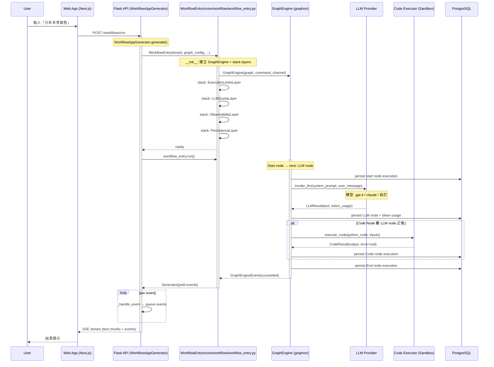

# Dify · 程式碼追蹤

## 追蹤的場景

**任務**: Workflow 應用收到使用者輸入「請分析本季銷售數據」，觸發 workflow 執行，經過 LLM 節點 → Code 節點 → 輸出結果。

**預期的執行路徑**:
1. 使用者透過 Web App 送出請求
2. Flask API 接收並建立 WorkflowEntry
3. Workflow 引擎 (graphon) 依 DAG 順序執行節點
4. LLM 節點呼叫 LLM provider
5. Code 節點執行 Python 程式碼
6. 結果串流回前端

## 流程圖



### 圖意說明

這條路徑的核心是 `WorkflowEntry` 作為 graphon 與 Dify 之間的橋樑。`WorkflowAppGenerator.generate()`（[`apps/workflow/app_generator.py`](https://github.com/langgenius/dify/blob/72ee50c/api/core/app/apps/workflow/app_generator.py)）是入口，它建立 `WorkflowEntry` 後，透過 `GraphEngine.run()` 獲取 generator，再將每個 `GraphEngineEvent` 透過 `_handle_event` 轉換為 `QueueEvent` 經 SSE 推送前端。

整條鏈路經過 3 層序列化/反序列化：
1. HTTP request（JSON → Flask request object）
2. Queue events（Dify event → queue → SSE）
3. DB persistence（每個節點執行結果 → SQLAlchemy ORM → PostgreSQL）

## 逐步追蹤

### Step 1: 請求進入 API

入口點: [`controllers/console/workflow/run.py:42`](https://github.com/langgenius/dify/blob/72ee50c/api/controllers/console/app/workflow/run.py#L42) — Flask-RESTx handler 接收 POST 請求，驗證輸入後委派給 `WorkflowAppGenerator.generate()`。

`WorkflowAppGenerator` 實作在 [`apps/workflow/app_generator.py:130-200`](https://github.com/langgenius/dify/blob/72ee50c/api/core/app/apps/workflow/app_generator.py#L130)：
- 決定 invoke_from（debug / 正式執行）
- 處理 resume state（若 workflow 之前被暫停）
- 建立 system variables（`build_system_variables` in `workflow_entry.py:81-91`）
- 初始化 `VariablePool`
- 確定 `root_node_id`
- 建立 `Graph.init()` 建立 DAG

**值得學的地方**: `WorkflowBasedAppRunner._init_graph()`（[`apps/workflow_app_runner.py:111`](https://github.com/langgenius/dify/blob/72ee50c/api/core/app/apps/workflow_app_runner.py#L111)）在初始化 graph 時同時處理了 `DifyGraphInitContext`、`DifyNodeFactory`、`Graph.init()` 三個層次的建構——這是 Dify 整合 graphon 的關鍵接合點。

### Step 2: WorkflowEntry 初始化

[`workflow_entry.py:139-220`](https://github.com/langgenius/dify/blob/72ee50c/api/core/workflow/workflow_entry.py#L139)

```python
class WorkflowEntry:
    def __init__(self, tenant_id, app_id, workflow_id, graph_config, ...):
        # 1. Call depth 檢查（防止遞迴過深）
        if call_depth > WORKFLOW_CALL_MAX_DEPTH:
            raise ValueError(...)  # line 173-175

        # 2. 建立 command channel（workflow 用 Redis, 其他用 InMemory）
        command_channel = InMemoryChannel()  # or RedisChannel for production
        # line 178-181

        # 3. 建立 child engine builder（支援 workflow as tool）
        child_engine_builder = _WorkflowChildEngineBuilder(...)  # line 184

        # 4. 建立 GraphEngine
        graph_engine = GraphEngine(
            graph=graph,
            graph_runtime_state=runtime_state,
            command_channel=command_channel,
            graph_engine_config=engine_config,
        )  # line 185-197

        # 5. 堆疊 layers
        if dify_config.DEBUG:
            graph_engine.layer(DebugLoggingLayer)  # line 200-201
        graph_engine.layer(ExecutionLimitsLayer(
            max_steps=workflow_max_execution_steps,
            max_time=workflow_max_execution_time,
        ))  # line 203-210
        graph_engine.layer(LLMQuotaLayer(...))  # line 212
        graph_engine.layer(ObservabilityLayer(...))  # line 214
```

**哪一步最容易出問題？**: Call depth 檢查（第 1 步）。如果 `WORKFLOW_CALL_MAX_DEPTH` 設定太小，合法的嵌套 workflow（如 workflow-as-tool 遞迴呼叫）會被意外擋住。如果太大，真正的無限遞迴會耗盡資源。

### Step 3: GraphEngine 執行 DAG

[`graphon` 內部] — `GraphEngine.run()` 是 generator，依 DAG 拓樸順序逐個執行 node。

graphon 的 `Graph` 物件儲存了所有 nodes 與 edges。執行順序由 DAG 的 topological sort 決定。Start node 是入口，由 `is_start_node_type()` 判斷（[`node_factory.py:141`](https://github.com/langgenius/dify/blob/72ee50c/api/core/workflow/node_factory.py#L141)）。

每個 node 執行前，graphon 會：
1. 從 `VariablePool` 讀取輸入變數
2. 呼叫 `NodeFactory.create_node()` 建立 node 實例
3. 執行 `node._run()`

Dify 的 `DifyNodeFactory.create_node()`（[`node_factory.py:366`](https://github.com/langgenius/dify/blob/72ee50c/api/core/workflow/node_factory.py#L366)）根據 node type 注入不同依賴：
- LLM node → 注入 `credentials_provider`、`model_factory`、`model_instance`
- Tool node → 注入 `tool_file_manager`、`runtime`
- Code node → 注入 `code_executor`、`code_limits`
- Agent node → 注入 `binding_resolver`、`runtime_request_builder`

### Step 4: LLM Node 執行

LLM node 的執行透過 `DifyPreparedLLM`（[`node_runtime.py:143`](https://github.com/langgenius/dify/blob/72ee50c/api/core/workflow/node_runtime.py#L143)）包裝 `ModelInstance`。

```python
class DifyPreparedLLM(LLMProtocol):
    def invoke_llm(
        self,
        prompt_messages: list[PromptMessage],
        model_parameters: dict,
        tools: list[PromptMessageTool] | None,
        ...
    ) -> Generator[LLMResultChunk, None, None] | LLMResult:
```

這層將 Dify 的 `ModelInstance` 適配到 graphon 的 `LLMProtocol`，使 graphon 引擎不需要知道 Dify 的 LLM provider 實作細節。

**同步 vs 非同步**: `invoke_llm` 同時支援串流（返回 generator）和阻塞（返回 `LLMResult`）兩種模式，由 LLM node 的 `stream` 配置決定。在串流模式下，每個 `LLMResultChunk` 透過 graphon 的事件系統傳遞並最終推送前端。

### Step 5: Code Node 執行

Code node 執行 Python 程式碼（[`helper/code_executor/code_executor.py`](https://github.com/langgenius/dify/blob/72ee50c/api/core/helper/code_executor/code_executor.py)）。

Dify 的 code 執行透過 sandbox 進行，支援 Python 3 和 JavaScript 兩種語言。Transformer 層（`python3_transformer.py` / `javascript_transformer.py`）將使用者程式碼包裝為安全的執行格式，限制可用的 module 和系統呼叫。

**序列化次數**: Code node 的輸入從 `VariablePool` 讀取時有一次反序列化（JSON string → Python dict），執行的結果回到 `VariablePool` 時有一次序列化（Python dict → JSON string）。這個來回在複雜 workflow 中可能迭代多次。

### Step 6: 事件處理與串流輸出

graphon 的 generator 事件通過 `WorkflowBasedAppRunner._handle_event()`（[`apps/workflow_app_runner.py:396`](https://github.com/langgenius/dify/blob/72ee50c/api/core/app/apps/workflow_app_runner.py#L396)）處理。這是一個 300+ 行的 `match` 陳述式，覆蓋所有事件類型：

```python
match event:
    case GraphRunStartedEvent():  → QueueWorkflowStartedEvent
    case GraphRunSucceededEvent(): → QueueWorkflowSucceededEvent
    case GraphNodeStartedEvent(): → QueueNodeStartedEvent
    case GraphNodeSucceededEvent(): → QueueNodeSucceededEvent
    case GraphNodeFailedEvent(): → QueueNodeFailedEvent
    case GraphEngineEvent() where event.is_text: → QueueTextChunkEvent
    case GraphIterationEvent(): → QueueIterationStartedEvent / QueueIterationNextEvent
```

每個事件透過 `queue_manager.publish()` 發佈到 Celery 或直接推送（SSE）。

### Step 7: 終止判斷

graphon 的 `Graph.run()` 會在所有節點執行完畢（所有 leaf node 都完成）後自然終止。但也可能因為以下原因提前結束：

- `ExecutionLimitsLayer` 的 `max_steps` 或 `max_time` 觸發
- LLM 配額不足（`LLMQuotaLayer`）
- 使用者手動暫停/停止（透過 `CommandChannel`）
- 任一節點拋出無法 recover 的例外

### Step 8: 結果持久化

每個節點的執行結果（inputs / outputs / metadata / token_usage）透過 `PersistenceLayer` 寫入 PostgreSQL。`WorkflowRun` 和 `WorkflowNodeExecution` 兩個 table 記錄了完整的執行歷程，支援斷點恢復和歷史查閱。

## 想學更多時，在哪裡下中斷點

- Workflow 執行起點: [`workflow_entry.py:222`](https://github.com/langgenius/dify/blob/72ee50c/api/core/workflow/workflow_entry.py#L222) — `WorkflowEntry.run()`
- graphon 引擎初始化後、執行前: [`workflow_entry.py:185-197`](https://github.com/langgenius/dify/blob/72ee50c/api/core/workflow/workflow_entry.py#L185) — GraphEngine 建立
- 節點建立前一刻（查看 injected dependencies）: [`node_factory.py:366`](https://github.com/langgenius/dify/blob/72ee50c/api/core/workflow/node_factory.py#L366) — `DifyNodeFactory.create_node()`
- LLM 呼叫前一刻（查看完整 prompt）: [`node_runtime.py:143`](https://github.com/langgenius/dify/blob/72ee50c/api/core/workflow/node_runtime.py#L143) — `DifyPreparedLLM.invoke_llm()`
- 事件推送前端前: [`workflow_app_runner.py:396`](https://github.com/langgenius/dify/blob/72ee50c/api/core/app/apps/workflow_app_runner.py#L396) — `_handle_event()`

## 沒追蹤到但值得留意的分支

- **Failure path**: 節點執行失敗時，`GraphNodeFailedEvent` 的傳播方式——Dify 是否支援 conditional error handling 還是整個 workflow 直接中止？（[`workflow_app_runner.py:589`](https://github.com/langgenius/dify/blob/72ee50c/api/core/app/apps/workflow_app_runner.py#L589) 附近是 error event 處理邏輯）
- **Agent 節點 v2 路徑**: 透過 `AgentBackendClient` 與外部 agent backend 通訊的完整流程 — 這條路徑涉及 HTTP/gRPC 通訊和串流事件適配，和上面的 InProcess 路徑完全不同
- **Pipeline app**: RAG pipeline 的變數系統（`RAGPipelineVariable`）是 workflow 變數的超集，增加了 document_id / batch / dataset_id 等——使得 pipeline 的執行可以跟 document 的生命週期綁定
