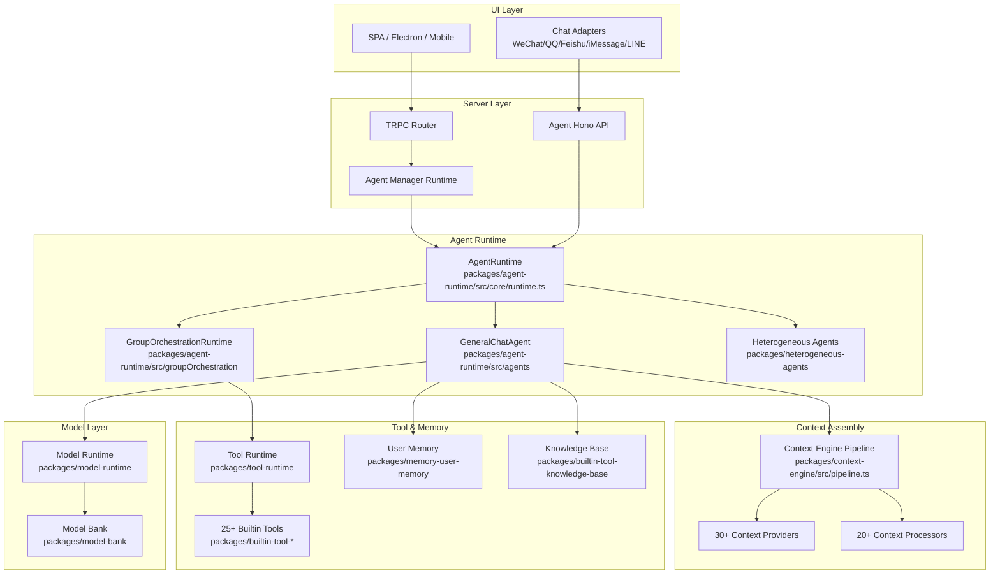
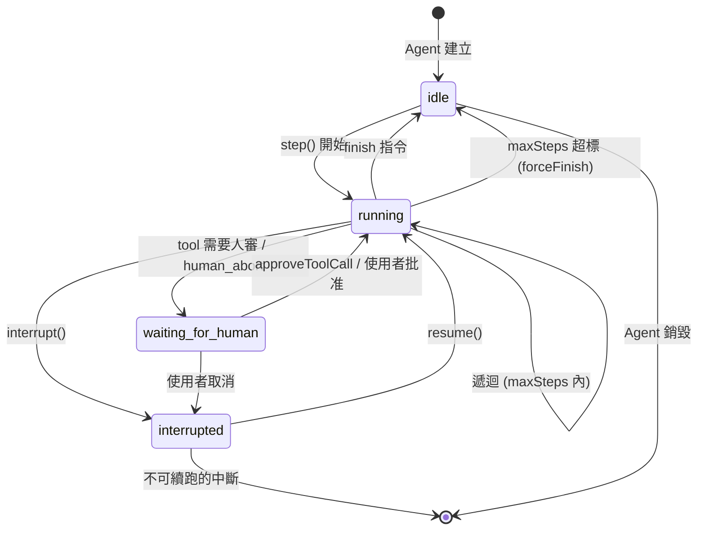

# LobeHub · 架構

## Agent 系統高層圖

LobeHub 的 agent 系統由四個主要層次構成：



### 圖意說明

這張圖展示 LobeHub 的四層架構。最上層是入口（SPA 網頁、Electron 桌面、以及 6 種 IM 平台 adapter），透過 TRPC 或 Agent Hono API 進入 Server Layer。Server Layer 的 Agent Manager Runtime 負責 agent CRUD 並將執行委派給 Agent Runtime。Agent Runtime 本身有三種 agent 類型：單一 GeneralChatAgent（標準 Plan→Execute loop）、GroupOrchestrationRuntime（群組多 agent 編排）、Heterogeneous Agents（外部 CLI agent 如 Claude Code）。在執行前，Context Engine 的 pipeline 將 context providers 與 processors 串接組裝成最終 prompt。Tool/Memory/Model 層則提供執行所需的基礎能力。

## Agent 狀態機

Agent 在執行過程中會經歷不同狀態，以下是完整的狀態轉換：



### 圖意說明

這個狀態機展示的是 `AgentState.status` 的五種可能值：`idle`、`running`、`waiting_for_human`、`interrupted`、`done`。Agent 啟動時從 `idle` 開始，每次 `step()` 進入 `running`。當 tool 需要人工審查時進入 `waiting_for_human`（此時上層 loop 不再呼叫 step），等待使用者批准後回到 `running`。`interrupt()` 方法支援暫停與續跑（透過 `resume()`），這在長時間運行的 agent 任務中很有用。`forceFinish` 機制讓超過 maxSteps 的 agent 在完成當前 tool 後優雅結束，而非硬中斷。

## Agent 控制流

### 主迴圈位置

[`packages/agent-runtime/src/core/runtime.ts:25`](https://github.com/lobehub/lobehub/blob/bcc31ca/packages/agent-runtime/src/core/runtime.ts#L25)

### 控制流類型

- **Plan→Execute 風格**，每步由 `AgentRuntime.step()` 處理。跟 ReAct 的主要差異在於，instruction 的產生（由 `Agent.runner()` 實作的「腦」）與執行（由 `AgentRuntime.executors` 處理的「引擎」）是分離的。
- **終止條件**：[`packages/agent-runtime/src/core/runtime.ts:90-98`](https://github.com/lobehub/lobehub/blob/bcc31ca/packages/agent-runtime/src/core/runtime.ts#L90-L98)：`maxSteps` 限制，超過時設 `forceFinish=true`，讓正在執行的 tool 完成後才強制結束（優雅降級而非暴力中斷）。
- **錯誤處理**：[`packages/agent-runtime/src/core/runtime.ts:224-229`](https://github.com/lobehub/lobehub/blob/bcc31ca/packages/agent-runtime/src/core/runtime.ts#L224-L229)：catch block 內 `stepCount` 仍增加，避免無限錯誤循環。但沒有 retry 邏輯——tool 失敗回傳的不是 exception，而是 tool result message。

### 一個 turn 的具體流程（GeneralChatAgent）

```
1. AgentRuntime.step() ：
   - clone state，stepCount++
   - 檢查 maxSteps（超標則 forceFinish）
2. 由 GeneralChatAgent.runner() 決定下一步指令：
   a. init / user_input phase：
      - 檢查 context 是否需要 compression（超過 threshold）
      - 需要壓縮 → compress_context 指令
      - 否則 → call_llm 指令（帶 messages + tools）
   b. llm_result phase：
      - 解析 LLM 回傳：有無 tool_calls？
      - 無 tool_calls → finish
      - 有 tool_calls → checkInterventionNeeded() 判斷哪些要人審
        - 不需要審的 → call_tools_batch（立即執行）
        - 需要審的 → request_human_approve（等人批准）
        - 混合型的 → 兩個指令都發（先跑安全的，審查待批的）
   c. tools_batch_result / tool_result phase：
      - 工具執行結果回來 → 再次檢查 pending intervention
      - 沒 pending → call_llm（把結果餵回 LLM）
      - 有 pending → 繼續等（waiting_for_human）
   d. compress_context phase：
      - 執行 context compression → call_llm
   e. human_abort phase：
      - 使用者取消 → resolve_aborted_tools 或直接 finish
3. 依序執行每個 instruction 的 executor
4. 回傳 events + newState + nextContext
```

## Prompt 管理

- **System prompts 放在哪**：[`src/locales/default/`](https://github.com/lobehub/lobehub/blob/bcc31ca/src/locales/default/) 的 namespace 檔案中，如 `agent.ts`、`auth.ts`
- **是否使用 template 引擎**：Context Engine 的 `InputTemplate` processor ([`packages/context-engine/src/processors/InputTemplate.ts`](https://github.com/lobehub/lobehub/blob/bcc31ca/packages/context-engine/src/processors/InputTemplate.ts)) 處理系統角色模板
- **動態組裝邏輯**：由 Context Engine pipeline 執行，每個 processor 處理一層 context 的注入（system role、tool list、memory、knowledge、plan、todo、date 等約 30 個 provider）

## Tool / Function 系統

- **Tool 註冊方式**：[`packages/context-engine/src/engine/tools/`](https://github.com/lobehub/lobehub/blob/bcc31ca/packages/context-engine/src/engine/tools/) — ToolResolver + ManifestLoader 解析每個 plugin/tool 的 manifest
- **Tool schema 定義**：MCP manifest 格式（JSON Schema），每個 tool 有 `api` 陣列定義 API 的 name、description、parameters
- **Tool 呼叫協定**：LLM native function calling（OpenAI 格式）→ 經過 ToolArgumentsRepairer 修復常見的 JSON 錯誤 → ToolNameResolver 解析工具名稱
- **內建 Tools 清單**（選取部分）：

| Tool Package | 用途 | 程式碼 |
|---|---|---|
| builtin-tool-knowledge-base | 知識庫 RAG | `packages/builtin-tool-knowledge-base/` |
| builtin-tool-memory | 用戶記憶存取 | `packages/builtin-tool-memory/` |
| builtin-tool-web-browsing | 網頁瀏覽 | `packages/builtin-tool-web-browsing/` |
| builtin-tool-claude-code | 呼叫 Claude Code 子行程 | `packages/builtin-tool-claude-code/` |
| builtin-tool-cloud-sandbox | 雲端沙箱執行 | `packages/builtin-tool-cloud-sandbox/` |
| builtin-tool-agent-builder | 動態建立 agent | `packages/builtin-tool-agent-builder/` |
| builtin-tool-self-iteration | Agent 自我迭代 | `packages/builtin-tool-self-iteration/` |
| builtin-tool-calculator | 計算器 | `packages/builtin-tool-calculator/` |
| builtin-tool-task | 任務管理 | `packages/builtin-tool-task/` |

- **Tool 錯誤處理**：錯誤不以 exception 形式傳播，而是包成 tool result message 回傳給 LLM，由 LLM 決定下一步。ToolArgumentsRepairer（[`packages/context-engine/src/engine/tools/ToolArgumentsRepairer.ts`](https://github.com/lobehub/lobehub/blob/bcc31ca/packages/context-engine/src/engine/tools/ToolArgumentsRepairer.ts)）會自動修復常見的 JSON 引數格式錯誤。
- **Tool 權限 / 安全**：[`packages/agent-runtime/src/agents/GeneralChatAgent.ts:125-259`](https://github.com/lobehub/lobehub/blob/bcc31ca/packages/agent-runtime/src/agents/GeneralChatAgent.ts#L125-L259) — 五層 intervention checker

### 人機協作干預系統（Intervention System）

這是 LobeHub 最完整的子系統之一，由 `GeneralChatAgent.checkInterventionNeeded()` 實作。對每個被 LLM 提出的 tool call，依序檢查：

1. **Global security blacklist**：全域黑名單，由 `state.securityBlacklist` 或 `DEFAULT_SECURITY_BLACKLIST` 定義。比對 tool args 內容（例如檔案路徑、URL 模式）
2. **Headless mode**：全自動模式，跳過所有干預（適合背景排程任務）
3. **manifest-level dynamic resolver**：由 tool 自己的 `dynamic` config 定義，執行自訂 resolver function 決定是否需要干預
4. **Always policy**：tool 的 static config 中宣告 `always` 的 API，無論何時都要人審
5. **User config mode**：根據 `approvalMode`（manual / allow-list / auto-run）決定行為

這種架構讓不同敏感度的 tool 可以設定不同的安全閾值，`calculator` 可以 auto-run，但 `cloud-sandbox` / `file-write` 可能需要人審。

## Memory 架構

### Short-term（對話內）

- **儲存形式**：`AgentState.messages` ([`packages/agent-runtime/src/types/state.ts`](https://github.com/lobehub/lobehub/blob/bcc31ca/packages/agent-runtime/src/types/state.ts))
- **截斷策略**：Context Engine 的 `HistoryTruncate` processor + compress_context 指令。超過 `maxWindowToken` 時，啟動 compression summary

### Long-term（跨對話）

- **是否有**：是
- **儲存後端**：PostgreSQL（Drizzle ORM）
- **寫入時機**：主動式，由 `packages/memory-user-memory/` 管理，LLM 可透過 `builtin-tool-memory` 工具存取
- **讀取策略**：由 `UserMemoryInjector` ([`packages/context-engine/src/providers/UserMemoryInjector.ts`](https://github.com/lobehub/lobehub/blob/bcc31ca/packages/context-engine/src/providers/UserMemoryInjector.ts)) 在 context 組裝時注入相關記憶

### State 管理

- **是否可中斷續跑**：是。[`packages/agent-runtime/src/core/runtime.ts:256-342`](https://github.com/lobehub/lobehub/blob/bcc31ca/packages/agent-runtime/src/core/runtime.ts#L256-L342) — `interrupt()` 與 `resume()` 方法完整支援中斷與續跑
- **State 序列化方式**：`structuredClone()`，無自訂序列化格式

## LLM Provider 抽象

- **抽象方式**：`modelRuntime` 介面（`(payload) => AsyncIterable<Chunk>`），定義在 Agent interface 上。[`packages/model-runtime/`](https://github.com/lobehub/lobehub/blob/bcc31ca/packages/model-runtime/) + `packages/model-bank/` 管理 provider/model 清單
- **支援的 providers**：OpenAI、Azure OpenAI、Claude、Gemini、DeepSeek、Grok 等數十個 LLM provider
- **切換 provider 需要改的地方**：透過 runtimeConfig 傳入，agent 不直接綁定特定 provider

## Multi-agent

- **Agents 數量與角色**：可任意數量的 agent group，支援「Assistant Group」與「Agent Council」兩種模式
- **編排者**：[`GroupOrchestrationRuntime`](https://github.com/lobehub/lobehub/blob/bcc31ca/packages/agent-runtime/src/groupOrchestration/GroupOrchestrationRuntime.ts) + `GroupOrchestrationSupervisor` — Supervisor 是 state machine，接收 executor 的結果，決定下一步指令
- **訊息傳遞**：shared state（AgentState messages）
- **衝突解決**：採用「Agent Council」群組模式（`packages/context-engine/src/processors/AgentCouncilFlatten.ts`），多個 agent 輪流發言，類似會議討論 [UNVERIFIED] — 從 processor 名稱推測，實際運作需進一步測試

### Heterogeneous Agents 整合

[`packages/heterogeneous-agents/`](https://github.com/lobehub/lobehub/blob/bcc31ca/packages/heterogeneous-agents/) 支援把 Claude Code、Codex 等外部 CLI agent 當作子 agent 雇用。實作方式：

1. 將任務描述轉換為 CLI agent 的標準輸入
2. 透過 `spawnAgent.ts` 執行子程序
3. 串流 stdout → 解碼為 `StreamChunkData` events
4. 監控檔案變更（CodexFileChangeTracker）回傳結果

## 觀測性與評估

- **Tracing**：[`packages/observability-otel/`](https://github.com/lobehub/lobehub/blob/bcc31ca/packages/observability-otel/) — OpenTelemetry 追蹤
- **Token / cost 追蹤**：內建 `Usage` / `Cost` 物件，Agent 可提供 `calculateUsage` / `calculateCost` 回呼
- **內建 evaluation**：[`packages/eval-dataset-parser/`](https://github.com/lobehub/lobehub/blob/bcc31ca/packages/eval-dataset-parser/) + `packages/eval-rubric/` — 支援評估資料集解析與評分

## 安全與護欄

- **Input validation**：Context Engine pipeline 的 `MessageCleanup`、`DisabledToolCallFilter` ([`packages/context-engine/src/processors/`](https://github.com/lobehub/lobehub/blob/bcc31ca/packages/context-engine/src/processors/))
- **Tool 權限控制**：五層 intervention（見上節）
- **Cost / iteration 上限**：[`packages/agent-runtime/src/core/runtime.ts:90-98`](https://github.com/lobehub/lobehub/blob/bcc31ca/packages/agent-runtime/src/core/runtime.ts#L90-L98) — maxSteps；`AgentState.costLimit` — cost limit
- **SSRF 防護**：[`packages/ssrf-safe-fetch/`](https://github.com/lobehub/lobehub/blob/bcc31ca/packages/ssrf-safe-fetch/) — 安全 fetch 封裝

## 測試策略

- **怎麼測試非確定性的 agent**：使用 `agent-mock` package (`packages/agent-mock/`) 模擬 LLM 回應
- **是否有 deterministic test mode**：是，透過 inject mock modelRuntime
- **覆蓋率重點**：每個 processor、resolver、executor 都有獨立 unit test（Vitest）。E2E 使用 Cucumber + Playwright

## 架構的關鍵設計取捨

1. **Context Engine pipeline vs 直接拼接 prompt**：LobeHub 選擇把 prompt 組裝拆成 30+ 可組合的 processor/provider，而非在一個龐大函數中拼接。好處是可擴展、可測試、可獨立開關。代價是追蹤「最終 prompt 長怎樣」需要理解整條 pipeline，debug 較複雜。

2. **GeneralChatAgent 的決策 vs AgentRuntime 的執行分離**：`runner()` 決定「下一步做什麼」，`executors` 決定「怎麼做」。這種分離讓你可以換掉「腦」（runner）而不動「引擎」（executor），或反過來。對比 LangGraph 的 graph-based 方法，LobeHub 更接近函數式狀態機。

3. **MCP-based tool registry vs 自訂 tool protocol**：選擇 MCP 協定讓任何第三方 MCP server 都能作為 tool 註冊，生態相容性更高。但 MCP 的 manifest 格式在某些場景（如 arguments repair）需要額外工作。

4. **State 用 structuredClone 而非 Immer**：效能取捨。LobeHub 的 AgentState 在單次 step 內會被 clone 多次（每個 instruction 一次），`structuredClone` 的開銷在極長 message list 下可能顯著。若無效能問題，這個選擇保持了最小依賴。
