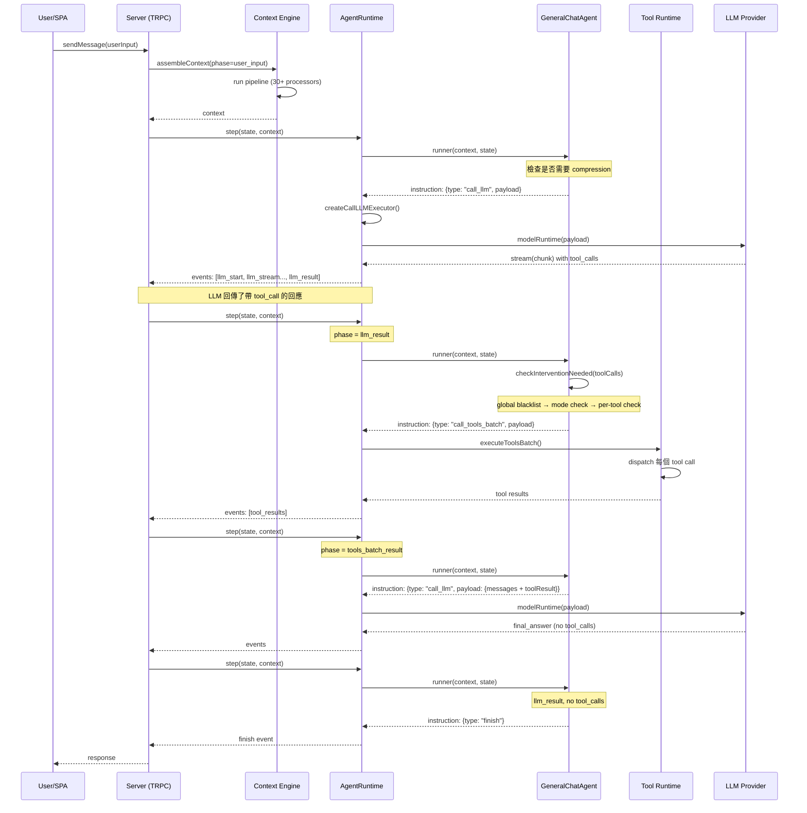

# LobeHub · 程式碼追蹤

## 追蹤的場景

**任務**：使用者輸入「幫我查詢天氣」，agent 需要呼叫一個搜尋工具、處理結果、回傳答案。

**預期的 agent 行為**：
1. 使用者的訊息進入系統（user_input phase）
2. Agent 呼叫 LLM，LLM 回覆一個 tool call
3. LobeHub 檢查該 tool call 是否需要人機干預
4. 不需要干預 → 執行搜尋工具
5. 將搜尋結果餵回 LLM
6. LLM 產生最終答案
7. Agent 結束

## 流程圖



## 逐步追蹤

### Step 1: 訊息進入系統（user_input phase）

入口點：[`src/services/chat/index.ts`](https://github.com/lobehub/lobehub/blob/bcc31ca/src/services/chat/) — chat service 處理使用者送出的訊息。訊息透過 TRPC router 進入 Server Layer。

AgentRuntime 此時收到 `context.phase === 'user_input'`，狀態是初始的（status = idle, messages = []）。

關鍵決策在第 91 行：[`packages/agent-runtime/src/core/runtime.ts:90-98`](https://github.com/lobehub/lobehub/blob/bcc31ca/packages/agent-runtime/src/core/runtime.ts#L90-L98) — 檢查 maxSteps。若 stepCount 首次超過限制（forceFinish = false → true），不直接中斷，而是設 `forceFinish = true` 讓當前 tool 執行完畢後才強制結束。

### Step 2: Context 組裝

Context Engine 執行 pipeline：[`packages/context-engine/src/pipeline.ts:19`](https://github.com/lobehub/lobehub/blob/bcc31ca/packages/context-engine/src/pipeline.ts#L19) — `ContextEngine` 依序執行 processors。

被執行的重要 providers/processors 包括：
- `SystemRoleInjector` — 插入 agent 的 system role
- `SelectedToolInjector` — 插入可用 tool 清單
- `UserMemoryInjector` — 插入相關用戶長期記憶
- `KnowledgeInjector` — 插入知識庫內容
- `PlaceholderVariables` — 替換模板變量（如 `{{currentDate}}`、`{{userName}}`）
- `HistoryTruncate` — 截斷過長的對話歷史

**值得學的地方**：Context Engine 採用 pipeline 而非單一龐大 assemble function。每個 processor 只專注一個切面，可以獨立開關、獨立測試。新增一個 context 注入只需新增一個 processor class。

### Step 3: GeneralChatAgent 決定指令

[`packages/agent-runtime/src/agents/GeneralChatAgent.ts:431-479`](https://github.com/lobehub/lobehub/blob/bcc31ca/packages/agent-runtime/src/agents/GeneralChatAgent.ts#L431-L479)

`runner()` 以 `context.phase` 做 switch：

```typescript
switch (context.phase) {
  case 'init':
  case 'user_input': {
    // 先檢查是否需要 context compression
    const compressionCheck = shouldCompress(state.messages, compressionOptions);
    if (compressionCheck.needsCompression) {
      return { type: 'compress_context', payload: { ... } };
    }
    // 否則直接 call_llm
    return { type: 'call_llm', payload: { messages: state.messages, ... } };
  }
```

**為什麼先檢查壓縮**：如果對話歷史太長超出 token 限制，先壓縮再送 LLM，避免浪費 token 在被截斷的訊息上。

### Step 4: LLM 呼叫

[`packages/agent-runtime/src/core/runtime.ts:420-501`](https://github.com/lobehub/lobehub/blob/bcc31ca/packages/agent-runtime/src/core/runtime.ts#L420-L501)

`createCallLLMExecutor()` 實作 LLM 呼叫：

```typescript
for await (const chunk of modelRuntime(payload)) {
  events.push({ chunk, type: 'llm_stream' });  // 串流每個 chunk
  if (chunk.content) assistantContent += chunk.content;
  if (chunk.tool_calls) toolCalls = chunk.tool_calls;  // 累積 tool calls
}
```

- Streaming：每個 chunk 都 emit `llm_stream` event，讓前端可以即時顯示
- Model Runtime 透過 `Agent.modelRuntime` 抽象，不直接綁定特定 provider
- LLM 呼叫後更新 usage（token 統計）與 cost，並檢查 cost limit

**錯誤路徑**：[第 498 行](https://github.com/lobehub/lobehub/blob/bcc31ca/packages/agent-runtime/src/core/runtime.ts#L498-L499) — 若 streaming 過程拋錯，catch 後透過 `createErrorResult` 把錯誤包成 event。注意這裡不重試，由上層（caller）決定要不要重新發送。

### Step 5: 判斷是否要人機干預

[`packages/agent-runtime/src/agents/GeneralChatAgent.ts:125-259`](https://github.com/lobehub/lobehub/blob/bcc31ca/packages/agent-runtime/src/agents/GeneralChatAgent.ts#L125-L259)

`checkInterventionNeeded()` 是最關鍵的決策點。對每個 tool call，依序檢查 7 個 phase：

**Phase 1** — Global resolvers（security blacklist）：
[第 161-167 行](https://github.com/lobehub/lobehub/blob/bcc31ca/packages/agent-runtime/src/agents/GeneralChatAgent.ts#L161-L167) — 執行 `globalInterventionAudits`，從 tool args 比對黑名單模式

**Phase 2** — Headless mode：
[第 170 行](https://github.com/lobehub/lobehub/blob/bcc31ca/packages/agent-runtime/src/agents/GeneralChatAgent.ts#L170) — headless = 全自動，只跳過 `always` 級別的 global block

**Phase 3** — Per-tool dynamic resolver：
[第 191 行](https://github.com/lobehub/lobehub/blob/bcc31ca/packages/agent-runtime/src/agents/GeneralChatAgent.ts#L191) — tool 的 manifest 可宣告 `dynamic` config，由 `dynamicInterventionAudits[type]` function 判斷

**Phase 4-7** — Static policy + allow-list + manual：
分別處理 `always` override、`auto-run` mode、`allow-list` mode、`manual` mode

**回傳值**：`[toolsNeedingIntervention[], toolsToExecute[]]` — 兩組 tool calls，一組等人審、一組立即執行。

**為什麼同時回傳兩組**：讓不需要審的 tool 先執行（例如 calculator），需要審的 tool 等人批准。使用者不用等所有 tool 都批完。

### Step 6: Tool 批次執行

[`packages/agent-runtime/src/core/runtime.ts`](https://github.com/lobehub/lobehub/blob/bcc31ca/packages/agent-runtime/src/core/runtime.ts#L170-L178) — `call_tools_batch` instruction 的處理：

1. 先檢查是否有自訂 `call_tools_batch` executor（server-side 版本通常有 DB access）
2. 沒有自訂 executor → 使用 `executeToolsBatch()` fallback
3. 每個 tool call 的 arguments 經過 ToolArgumentsRepairer 修復常見格式錯誤

**值得學的地方**：batch 執行（多個 tool 平行）與單一 tool 執行是不同的 instruction type，讓 executor 可以優化平行度。

### Step 7: 結果餵回 LLM

工具執行完成後，`context.phase` 變成 `tools_batch_result`。

[`packages/agent-runtime/src/agents/GeneralChatAgent.ts:481-500`](https://github.com/lobehub/lobehub/blob/bcc31ca/packages/agent-runtime/src/agents/GeneralChatAgent.ts#L481-L500) — `llm_result` phase 開始，但這個階段已經有 tool result 了。GeneralChatAgent 檢查有無 `pending intervention`：

第 292-300 行 — 檢查 `state.messages` 中是否有 `role === 'tool' && pluginIntervention.status === 'pending'` 且屬於當前 assistant turn 的訊息。此處有一個重要的 scope guard（`getCurrentTurnPendingToolMessages()` 第 323-340 行）防止舊的 pending tool 干擾新 turn。

無 pending → 產生 `call_llm` 指令，把 tool result 作為新 message 加入。

### Step 8: 終止判斷

[`packages/agent-runtime/src/agents/GeneralChatAgent.ts:481-500`](https://github.com/lobehub/lobehub/blob/bcc31ca/packages/agent-runtime/src/agents/GeneralChatAgent.ts#L481-L482) — 第二次 `llm_result` phase 時，若有 `hasToolsCalling === false`（LLM 沒有回傳更多的 tool calls），runner 產生 `finish` 指令。

[`packages/agent-runtime/src/core/runtime.ts:209-212`](https://github.com/lobehub/lobehub/blob/bcc31ca/packages/agent-runtime/src/core/runtime.ts#L209-L212) — 收到 `finish` 指令後，`stepCount` 減 1（因為 `finish` 不算一個真正的執行步驟）。

## 想學更多時，在哪裡下中斷點

- agent loop 起點：`packages/agent-runtime/src/core/runtime.ts:79`（`AgentRuntime.step()`）
- LLM call 前一刻：`packages/agent-runtime/src/core/runtime.ts:444`（`for await (const chunk of modelRuntime(payload))`）
- Tool dispatch：`packages/agent-runtime/src/core/runtime.ts:170-178`（`call_tools_batch` executor）
- 人機干預決策：`packages/agent-runtime/src/agents/GeneralChatAgent.ts:145`（`checkInterventionNeeded for 迴圈`）
- Context Engine pipeline：`packages/context-engine/src/pipeline.ts:61`（`execute()` 方法）
- User Memory 注入：`packages/context-engine/src/providers/UserMemoryInjector.ts`

## 沒追蹤到但值得留意的分支

- **Group Orchestration 多 agent 協作**：`GroupOrchestrationRuntime` 與 `GroupOrchestrationSupervisor` 構成 Supervisor+Executor 迴圈，用於群組對話場景
- **Heterogeneous Agent（Claude Code）**：[`packages/heterogeneous-agents/src/spawn/spawnAgent.ts`](https://github.com/lobehub/lobehub/blob/bcc31ca/packages/heterogeneous-agents/src/spawn/spawnAgent.ts) — 外部 CLI agent 的子行程管理
- **Interrupt/Resume 流程**：[`packages/agent-runtime/src/core/runtime.ts:256-342`](https://github.com/lobehub/lobehub/blob/bcc31ca/packages/agent-runtime/src/core/runtime.ts#L256-L342) — 中斷與續跑的完整生命週期
- **Context compression**：當對話歷史超過 threshold 時產生的 compression 流程
- **Agent Council 模式**：[`packages/context-engine/src/processors/AgentCouncilFlatten.ts`](https://github.com/lobehub/lobehub/blob/bcc31ca/packages/context-engine/src/processors/AgentCouncilFlatten.ts) — 多 agent 會議模式的 context 扁平化
