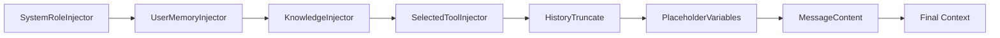

# LobeHub · 值得偷學的設計

## Pattern 1: Pipeline-based Context Assembly（Context Engine）

**是什麼**：[`packages/context-engine/src/pipeline.ts`](https://github.com/lobehub/lobehub/blob/bcc31ca/packages/context-engine/src/pipeline.ts)

**Context Engine** 是一個可組合的 pipeline，由 processors（轉換訊息）與 providers（插入 context 區塊）組成。每個 processor 實作 `ContextProcessor` 介面，只負責一個切面的 context 組裝。執行時依序處理，前一個的 output 是後一個的 input。



**為什麼有效**：
- 每個 processor 獨立可測、可開關、可排序
- 新增一個 context 注入只需新增一個 class，不改任何既有的 pipeline
- Pipeline 順序代表了 context 的優先級（前面的被後面的覆蓋或補充）
- 每個 processor 可選擇性執行（根據 `enabled` flag）

**替代方案**：
- **單一 assembleContext 函數**（LangGraph 的做法）：把所有 context 組裝邏輯放在一個大函數中，簡單但難以測試和擴展。
- **HOC pattern**（AutoGen 的做法）：用高階函數包裝 context 注入，靈活但不易追蹤最終效果。

Context Engine 的 pipeline 方法在「可擴展性 vs 可追蹤性」之間取得了一個中間點。

**何時可以借用**：
- 你的系統需要動態決定「這次 call LLM 要帶什麼 context」
- context 來源很多（system role、tool list、memory、knowledge base、date、user platform identity 等）
- 不同 session 需要不同的 context 組合

**注意事項**：
- Pipeline 的 ordering 至關重要。放錯順序可能導致 context 被錯誤地覆蓋或繞過
- Debug 困難：要確定「最終 prompt 長怎樣」需要理解整條 pipeline 的累積效果
- LobeHub 用 `debug()` module（而不是 console.log）來除錯，可透過環境變數開啟

---

## Pattern 2: Executor Pattern —「腦」與「引擎」分離

**是什麼**：[`packages/agent-runtime/src/core/runtime.ts:26-49`](https://github.com/lobehub/lobehub/blob/bcc31ca/packages/agent-runtime/src/core/runtime.ts#L26-L49)

`AgentRuntime` 不自己決定「下一步做什麼」，它只提供執行器的註冊表。真正的決策由 `Agent.runner()`（「腦」）負責。Executor 有三層優先級：

```typescript
// 1. Built-in executors (最底層)
this.executors = {
  call_llm: this.createCallLLMExecutor(),
  call_tool: this.createCallToolExecutor(),
  finish: this.createFinishExecutor(),
  request_human_approve: this.createHumanApproveExecutor(),
  // ...
  // 2. Config executors (可覆蓋內建)
  ...config.executors,
  // 3. Agent executors (最高優先級，可完全自訂)
  ...(agent.executors as any),
};
```

**為什麼有效**：
- 分離關注點：`GeneralChatAgent.runner()` 決定「要呼叫 LLM 還是執行 tool」，`executor` 決定「怎麼呼叫 LLM / 怎麼執行 tool」
- 可重寫任何 executor：想讓 `call_llm` 走不同的 provider 或不同的 streaming 策略？只需在 config 或 agent 層覆蓋
- 所有 executor 共用同一個指令格式 (`AgentInstruction`) 和回傳格式 (`ExecutorResult`)，保證了型別安全

**替代方案**：
- **Hardcoded loop**（最早期的 agent 框架）：在 agent class 內部寫死 decision logic 和 execution logic，無法獨立測試或替換任一部分
- **Callback-based**（部分框架）：用 callback hook 讓外部自訂特定步驟，但 hook 點有限

Executor Pattern 的 trade-off 是增加了 boilerplate — 每個 instruction type 都需要對應的 executor。但當你的 agent 有 6+ 種不同的 instruction type（LobeHub 有 call_llm、call_tool、call_tools_batch、finish、request_human_approve、request_human_prompt、request_human_select、compress_context），這種組織方式使維護成本遠低於 monolithic loop。

**何時可以借用**：
- Agent loop 中有 3+ 種不同類型的步驟
- 你想讓使用者在不改主 loop 的情況下自訂特定步驟的行為
- 需要對不同環境（client vs server）提供不同的 executor 實作

**注意事項**：
- `agent.executors` 的型別為 `any`（第 49 行），跳過了型別檢查 — 這是有意的但需要 runtime 驗證
- 指令與 executors 的配對是動態的，沒有 compiler 保證每個 instruction type 都有對應的 executor

---

## Pattern 3: 分層人機干預系統（Intervention Checker）

**是什麼**：[`packages/agent-runtime/src/agents/GeneralChatAgent.ts:125-259`](https://github.com/lobehub/lobehub/blob/bcc31ca/packages/agent-runtime/src/agents/GeneralChatAgent.ts#L125-L259)

LobeHub 對每個被 LLM 提出的 tool call，依序檢查七個層級的干預規則：

| 層級 | 範圍 | 控制者 | 範例 |
|---|---|---|---|
| Global security blacklist | 全域 | 系統管理員 | 封鎖 `rm -rf /`、敏感路徑 |
| Headless mode | 全域 | 系統管理員 | 背景任務全自動 |
| Dynamic resolver | 每個 tool | Tool author | 動態判斷 args 是否安全 |
| Always policy | 每個 API | Tool author | 總是需要人批 |
| Approval mode (allow-list) | 使用者層級 | 使用者 | 白名單 tool |
| Approval mode (manual) | 使用者層級 | 使用者 | 預設 |
| Auto-run | 使用者層級 | 使用者 | 全部自動執行 |

**為什麼有效**：
- 不同敏感度的 tool 設定不同的安全閾值：`calculator` 可以 auto-run，但 `cloud-sandbox` 可能需要 manaul approval
- 不待審的 tool 先執行，使用者不用乾等所有 tool 都批完
- `headless` mode 讓背景排程 agent 可以完全規避等待
- Global blacklist 提供最後一道防線，即使 tool 自己忘記設安全規則

**替代方案**：
- **No intervention**（大多數 agent 框架）：LLM 提出的 tool call 全部直接執行，靠使用者事後檢查日誌。最簡單但在生產環境風險極高。
- **Binary control**（全部審查或全部不審）：要嘛每個 tool call 都等你批准（慢），要嘛全部自動（不安全）。LobeHub 的「先執行安全的，等批准危險的」提供了第三條路。

**何時可以借用**：
- 你的 agent 有不同敏感度的 tool（例如 calculator vs file-write vs exec-shell）
- 你的使用者需要有不同安全等級的設定（有些人懂技術可以用 auto-run，初學者用 manual）
- 你有排程 agent 需要在夜間無人值守時運行

**注意事項**：
- 七層檢查的效能開銷：每個 tool call 最多經過 7 層判斷，大部分場景前幾層就決定了，但極端情況下（match/not match 各層都要跑）可能影響 TTFB（time-to-first-tool-execution）
- Security blacklist 的實作有 false positive 風險：過度敏感的比對規則可能阻擋正常的 tool 使用

---

## Pattern 4: 泛型 Agent 介面

**是什麼**：[`packages/agent-runtime/src/types/instruction.ts`](https://github.com/lobehub/lobehub/blob/bcc31ca/packages/agent-runtime/src/types/instruction.ts) 與 Agent 介面

`Agent` 介面只有三個方法：
```typescript
interface Agent {
  runner: (context: AgentRuntimeContext, state: AgentState) => Promise<AgentInstruction | AgentInstruction[]>;
  modelRuntime?: ModelRuntime;
  executors?: Record<string, InstructionExecutor>;
  calculateUsage?: (type, result, current) => Usage;
  calculateCost?: (params) => Cost;
}
```

任何實作這個介面的類別都可以被 `AgentRuntime` 接受。內建的 `GeneralChatAgent` 是標準實作，但你可以換成你自己的 agent（例如不經過 LLM 的 rule-based agent）。

**為什麼有效**：
- Agent 介面極簡（只有 2 個必要方法：runner + 可選的 executors/modelRuntime），降低了實作門檻
- `runner` 回傳 `AgentInstruction | AgentInstruction[]`，單一或多個指令皆可，涵蓋了簡單與複雜場景
- 不綁定特定 LLM protocol（modelRuntime 是 callback 而非特定 SDK），測試時可以 inject mock

**替代方案**：
- **Abstract base class with hooks**（AutoGen / LangChain 的做法）：定義一堆 abstract method（`_generate()`、`_call()`、`_apreprocess_input()`），子類別必須覆蓋特定方法。這種設計對框架作者友善（有明確的擴展點），但對使用者來說需要理解整個 class hierarchy。
- **Protocol / Trait-based**（Rust 界的做法）：類似 LobeHub 的方式，但更嚴格的型別。LobeHub 的 `Agent` 在 TypeScript 中用了 `any` 跳過了一些型別檢查（executors），是務實的取捨。

**何時可以借用**：
- 你的 agent 系統需要支援多種「agent 類型」
- 你希望使用者在不改動核心 loop 的情況下自訂 agent 邏輯
- 你需要在測試時 inject mock agent

---

## Pattern 5: Tool Manifest + HumanIntervention Config

**是什麼**：[`packages/agent-runtime/src/agents/GeneralChatAgent.ts:52-66`](https://github.com/lobehub/lobehub/blob/bcc31ca/packages/agent-runtime/src/agents/GeneralChatAgent.ts#L52-L66)

每個 tool 提供一份 manifest，定義 API 的介面以及每支 API 的人機干預設定：

```typescript
// 從 manifest 取得的設定
const manifest = state.toolManifestMap[identifier];
const api = manifest.api?.find((a: any) => a.name === apiName);
// API-level 優先於 tool-level
return api?.humanIntervention ?? manifest.humanIntervention;
```

Manifest 同時承擔兩個角色：tool 的 schema 定義（給 LLM 看）和 tool 的安全設定（給 intervention checker 看）。

**為什麼有效**：
- 單一文件定義了 tool 的「長相」和「規則」，不必同步兩份設定
- API-level 設定覆蓋 tool-level：同一個 tool 中，`read` API 可以 auto-run，`write` API 需要 person-in-loop
- Dynamic config 支援參數級別的控制：例如 `write({ path })` 可以根據 path 是否包含敏感字眼來決定

**何時可以借用**：
- 你的 tool 系統有不同敏感度的 API（read vs write、safe vs destructive）
- 你想讓 tool 作者自行宣告安全規範，而不只靠人工設定

---

## Agent 設計的哲學觀察

LobeHub 的設計哲學可以歸納為幾點：

1. **Agent 是被管理的資源，不是被編寫的程式**。LobeHub 的 Agent Manager Runtime 提供 CRUD API 來管理 agent，跟管理資料庫記錄或 container 一樣。這種「agent-as-config」的觀點對比 LangGraph 的「agent-as-graph」，更接近 DevOps 而非框架開發者。

2. **Context 是可組合的 pipeline，不是單一 prompt**。30+ 個 context provider/processor 各自注入一塊 context 碎片，最後組裝成完整的 LLM prompt。每一個 processor 都可以獨立開關和測試。

3. **安全不是 binary，而是多層級譜系**。headless → auto-run → allow-list → manual → always 形成了一個完整的安全光譜，每個層級對應不同的使用場景。

4. **MCP-first tool 生態**。所有 tool 都基於 MCP 協定，而非自訂 format。這讓 LobeHub 可以無縫整合任何第三方 MCP server，也讓 built-in tools 可以被其他 MCP 相容系統使用。

## 跟其他 agent 框架比較

| 面向 | LobeHub | LangGraph | AutoGen | CrewAI |
|---|---|---|---|---|
| 核心抽象 | AgentRuntime + Context Engine | StateGraph | AgentChat (conversation) | Crew + Process |
| 控制流 | Plan→Execute loop (指令驅動) | Graph traversal (邊驅動) | Conversation loop (訊息驅動) | Sequential/hierarchical |
| Tool 協定 | MCP manifest | 自訂 Python function | 自訂 function | 自訂 tool class |
| 人機協作 | 內建五層 intervention | 無 | 無 | 無 |
| Context 管理 | Pipeline engine (30+ processors) | 內建在 graph state | 純 messages | 無 |
| 部署 | Web + Desktop + Chat adapters | Library only | Library only | Library only |
| Heterogeneous agents | Claude Code / Codex 子行程 | 無 | 無 | 無 |
| 學習曲線 | 中等（需理解 pipeline 與指令系統） | 高（需理解 graph 理論） | 低 | 低 |
