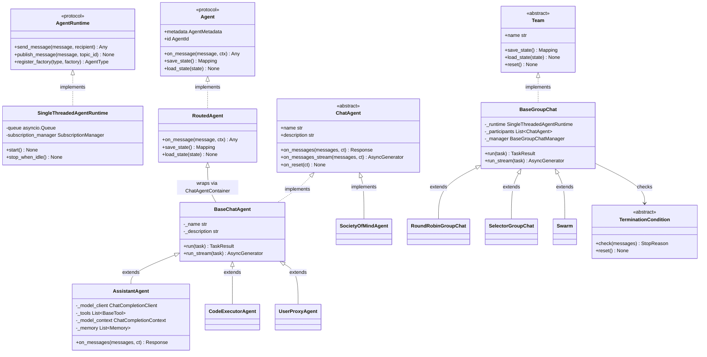
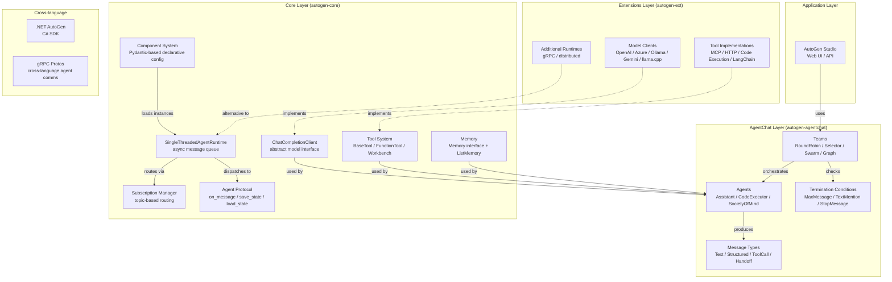

# AutoGen · 架構

## Agent 系統高層圖

AutoGen v0.7 的架構可以分為三個層級，從底到頂依序是：



**圖意說明**: AutoGen v0.7 的類別層級分為 Core 與 AgentChat 兩層。Core 層定義 `Agent` protocol 和 `AgentRuntime` protocol，透過 `RoutedAgent` 提供裝飾器式 message handler 註冊。AgentChat 層在此之上定義 `ChatAgent` 和 `Team` 抽象，提供高階 API。`BaseGroupChat` 在內部使用 `SingleThreadedAgentRuntime` 作為代理人的執行引擎。

---



**圖意說明**: AutoGen v0.7 的架構是三層 + 跨語言支援。底層 `autogen-core` 提供 actor runtime、component 系統、模型與工具抽象；中間 `autogen-agentchat` 提供開發者直接操作的 Agent 與 Team 物件；上層 `autogen-ext` 提供具體的 model client 實作與工具整合。跨語言層是 AutoGen 跟其他 agent 框架最大的差異點。

## 為什麼是 actor model？—— 跟 graph / ReAct 的關鍵差異

| 面向 | AutoGen（actor model） | LangGraph（graph） | CrewAI（任務編排） |
|---|---|---|---|
| Agent 間通訊 | message passing via Topic | edge-based state transition | 角色扮演 + 任務佇列 |
| 並行能力 | 原生 actor 級並行 | 受限於 graph topology | 任務級並行 |
| State 管理 | JSON serializable per agent | 全域 StateGraph state | 任務結果累積 |
| 可中斷性 | 內建 pause/resume | 支援 checkpointing | 不支援 |
| 序列化 | Component 系統原生支援 | 需自製 | 有限 |
| 跨語言 | gRPC protos + .NET SDK | 無 | 無 |

Actor model 的取捨在於：**它讓系統更容易 scale（更多 agent 並行），但讓單一 agent 的流程可讀性略低**——你不能直接看到一個 agent 的「graph」，因為它是由 message handler 的 async 流程決定的。

## Agent Runtime

### SingleThreadedAgentRuntime（[`027ecf0/python/packages/autogen-core/src/autogen_core/_single_threaded_agent_runtime.py`](https://github.com/microsoft/autogen/blob/027ecf0/python/packages/autogen-core/src/autogen_core/_single_threaded_agent_runtime.py)）

這是 v0.7 的關鍵設計。它不是真正的「distributed runtime」，而是一個 **async event loop 中的 actor scheduler**：

- 所有 agent 共用一個 event loop，但 runtime 保證每個 agent instance 的 `on_message()` 呼叫是**序列化的**
- 內部使用 `asyncio.Queue` 做 message queue，透過 `SubscriptionManager` 做 topic-based 路由
- 支援 `send_message()`（點對點，等待回應）跟 `publish_message()`（主題廣播，不等待回應）兩種通訊模式
- Interrupt / cancellation 透過 `CancellationToken` 傳播

**實作要點**：
- 用 `Future` 物件實現 send_message 的 request-response 模式（[`SingleThreadedAgentRuntime.send_message`](https://github.com/microsoft/autogen/blob/027ecf0/python/packages/autogen-core/src/autogen_core/_single_threaded_agent_runtime.py) 的 `SendMessageEnvelope`）
- 每個 agent 會綁定一個 `AgentId`（`type` + `key`），runtime 透過 factory 模式 lazy-initialize agent（[`register_factory`](https://github.com/microsoft/autogen/blob/027ecf0/python/packages/autogen-core/src/autogen_core/_single_threaded_agent_runtime.py)）
- Running context 追蹤所有 pending tasks，`stop_when_idle()` 在關閉時確認所有 message 都被處理完

### Subscription System（Topic-based routing）

`SubscriptionManager` 管理三種 subscription：

1. **TypeSubscription** — 當有特定 type 的 agent 被註冊時自動訂閱
2. **TypePrefixSubscription** — 依 prefix 匹配（例如 `"user."` 開頭的 agent 都收到）
3. **DefaultSubscription** — 讓開發者可以用 `@default_subscription` 裝飾器快速註冊

## Component 系統（[`027ecf0/python/packages/autogen-core/src/autogen_core/_component_config.py`](https://github.com/microsoft/autogen/blob/027ecf0/python/packages/autogen-core/src/autogen_core/_component_config.py)）

Component 系統是 AutoGen v0.7 最值得學的設計之一。它的核心是 `ComponentModel` 這個 Pydantic model：

```python
class ComponentModel(BaseModel):
    provider: str        # 完整 class path: "autogen_ext.models.openai.OpenAIChatCompletionClient"
    component_type: str | None  # "model" / "agent" / "tool" / "termination"
    config: dict[str, Any]      # schema-validated config dict
```

載入流程：
1. 讀取 YAML/JSON → `ComponentModel`（Pydantic 驗證）
2. `ComponentLoader` 查 `WELL_KNOWN_PROVIDERS` 找到對應 class
3. 呼叫 class 的 `_from_config()` classmethod 實例化

**安全設計**：內建 `_TRUSTED_PROVIDER_NAMESPACES`（只允許 `autogen_core.`、`autogen_agentchat.`、`autogen_ext.` 開頭的 provider），第三方 namespace 需透過 `AUTOGEN_ALLOWED_PROVIDER_NAMESPACES` 環境變數加入。

## AgentChat 層

### ChatAgent 介面（[`027ecf0/python/packages/autogen-agentchat/src/autogen_agentchat/base/_chat_agent.py`](https://github.com/microsoft/autogen/blob/027ecf0/python/packages/autogen-agentchat/src/autogen_agentchat/base/_chat_agent.py)）

```python
class ChatAgent(ABC, TaskRunner, ComponentBase[BaseModel]):
    component_type = "agent"

    @abstractmethod
    async def on_messages(self, messages, cancellation_token) -> Response: ...
    @abstractmethod
    def on_messages_stream(self, messages, cancellation_token) -> AsyncGenerator[...]: ...
    @abstractmethod
    async def on_reset(self, cancellation_token) -> None: ...
    @abstractmethod
    async def on_pause(self, cancellation_token) -> None: ...
    @abstractmethod
    async def on_resume(self, cancellation_token) -> None: ...
```

**重要設計決策**：開發者只傳「新的 messages」給 `on_messages()`，agent 內部維護自己的 state。這跟傳統的「每次都傳完整 conversation history」pattern 不同，副作用是 agent 間的 context 隔離。

### AssistantAgent（[`027ecf0/python/packages/autogen-agentchat/src/autogen_agentchat/agents/_assistant_agent.py`](https://github.com/microsoft/autogen/blob/027ecf0/python/packages/autogen-agentchat/src/autogen_agentchat/agents/_assistant_agent.py)）

核心 agent 實作，支援：
- 呼叫 LLM → 解析 tool call → 執行 tool → 可選 reflect 的循環
- `max_tool_iterations` 控制多輪 tool call
- `reflect_on_tool_use` 控制 tool call 後是否再做一次 LLM inference
- `model_client_stream` 支援 streaming token 輸出
- `handoffs` 讓 agent 可以觸發轉移給其他 agent（Swarm 模式使用）
- `memory` + `model_context` 管理 context window

### Team 編排（[`027ecf0/python/packages/autogen-agentchat/src/autogen_agentchat/teams/_group_chat/_base_group_chat.py`](https://github.com/microsoft/autogen/blob/027ecf0/python/packages/autogen-agentchat/src/autogen_agentchat/teams/_group_chat/_base_group_chat.py)）

`BaseGroupChat` 將 AgentChat 層的 `ChatAgent` 包裝為 Core 層的 `RoutedAgent`，透過 `ChatAgentContainer` 註冊到 `SingleThreadedAgentRuntime`。實際的編排邏輯在 `BaseGroupChatManager` 的子類別中：

| Team 類型 | 選擇策略 | 適用場景 |
|---|---|---|
| `RoundRobinGroupChat` | 輪詢（固定順序） | 需要公平分配話語權 |
| `SelectorGroupChat` | LLM 選擇下一位說話者 | 需要動態決定誰最合適 |
| `Swarm` | Handoff-based 轉移 | 角色扮演、客服轉接 |
| `MagenticOneGroupChat` | Magentic-One 專用協議 | Microsoft Research 的 Magentic-One 整合 |
| `GraphFlow` | DAG 拓樸（DiGraph） | 預定義的組織流程 |

## Model 抽象

`ChatCompletionClient`（[`027ecf0/python/packages/autogen-core/src/autogen_core/models/_model_client.py`](https://github.com/microsoft/autogen/blob/027ecf0/python/packages/autogen-core/src/autogen_core/models/_model_client.py)）是 model provider 的抽象層，支援：

- `create()` — 同步生成
- `create_stream()` — streaming 生成
- `ModelFamily` 列舉 OpenAI / Claude / Gemini / Llama / Mistral 等家族
- Tool schema 自動從 `FunctionTool` 轉換

第三方 provider 透過 `autogen_ext.models.*` 套件註冊。

## Memory 架構

Memory 系統（[`027ecf0/python/packages/autogen-core/src/autogen_core/memory/`](https://github.com/microsoft/autogen/blob/027ecf0/python/packages/autogen-core/src/autogen_core/memory/)）相對輕量：

- **介面**: `Memory` protocol（`query()` / `update_context()` / `add_content()`）
- **內建實作**: `ListMemory` — 簡單的 list-based 記憶
- **整合方式**: AssistantAgent 可掛載多個 Memory 實例，在每次 LLM 呼叫前執行 `update_context()`

跟 LangChain/LangGraph 的記憶系統相比，AutoGen 的 Memory 還很初階：沒有內建 vector store integration、沒有 summarization-based 壓縮、也沒有跨 session 記憶管理。

## 觀測性

- 內建 OpenTelemetry integration（`_telemetry/`）
- Agent span 自動追蹤（`trace_create_agent_span` / `trace_invoke_agent_span` / `trace_tool_span`）
- Event logger 提供 `autogen_core.events` 和 `autogen_agentchat.events` 兩種 logger

## 測試策略

- pytest + asyncio（單元測試用 `SingleThreadedAgentRuntime`）
- `autogen-test-utils` 提供 mock agent 與 mock model client
- 不確定是否有 deterministic test mode（mock LLM 可做到但非內建）

## LLM Provider 抽象

| 抽象方式 | Interface（`ChatCompletionClient`） |
|---|---|
| 支援的 providers | OpenAI、Azure OpenAI、Ollama、llama.cpp、Semantic Kernel、Replay（測試用） |
| 切換 provider 需改 | 只需換 model client class，不用改 agent 程式碼 |
| 是否有 fallback | 不內建，需自行實作 retry |

## 安全與護欄

- Input validation: Pydantic 模型層級驗證
- Tool 權限控制：無內建
- Cost / iteration 上限：`max_tool_iterations` 可設定
- Prompt injection 防護：無內建 [UNVERIFIED]
- Provider namespace 限制：Component 載入有 namespace whitelist
