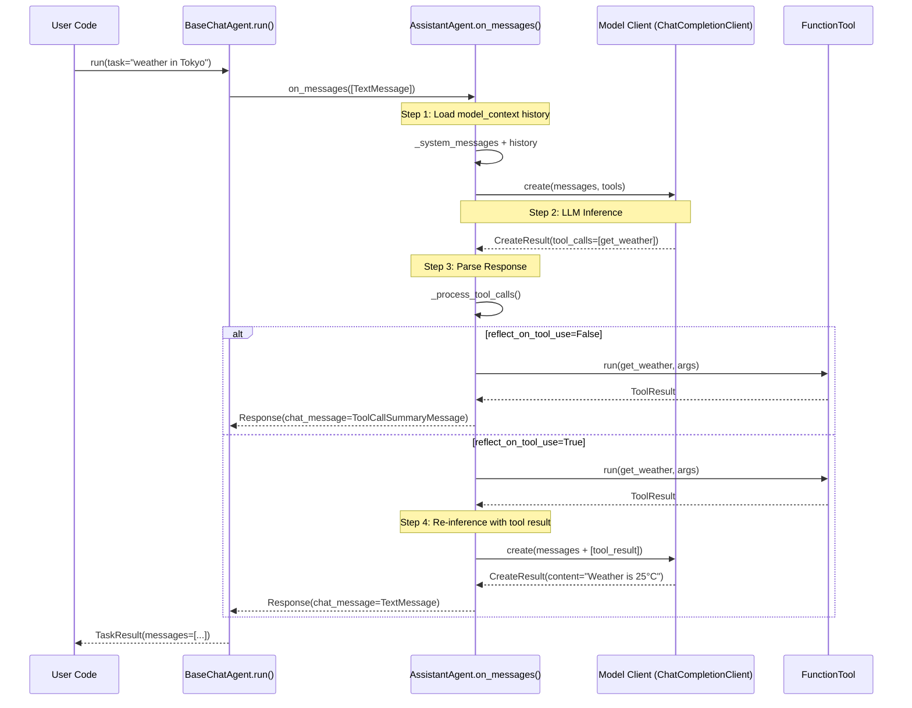

# AutoGen · 程式碼追蹤

## 追蹤的場景

**任務**: 一個 `AssistantAgent` 接收使用者訊息，呼叫一次 tool，然後回覆最終結果。

**預期的 agent 行為**:
1. 接收使用者訊息
2. 組裝 prompt（system message + tool descriptions + 對話 history）
3. 呼叫 LLM
4. LLM 回傳 tool call request
5. 執行 tool
6. 將 tool 結果餵回 LLM（如果 `reflect_on_tool_use=True`）
7. 回傳最終回應

## 流程圖



## 逐步追蹤

### Step 1: 任務進入 Agent

**入口點**: [`BaseChatAgent.run()`](https://github.com/microsoft/autogen/blob/027ecf0/python/packages/autogen-agentchat/src/autogen_agentchat/agents/_base_chat_agent.py#L111)

`run()` 方法處理三種輸入型別：`str`（轉為 `TextMessage`）、`BaseChatMessage`、或 `Sequence[BaseChatMessage]`。然後呼叫 `self.on_messages(input_messages, cancellation_token)`，這會進入子類別 `AssistantAgent` 的實作。

**值得注意**：agent 是 stateful 的，`on_messages()` 只接收「新訊息」，之前的 conversation history 由 agent 內部維護在 `model_context` 中。這跟傳統的每次傳完整 history 做法不同。

### Step 2: on_messages 內部流程

**入口點**: [`AssistantAgent.on_messages()`](https://github.com/microsoft/autogen/blob/027ecf0/python/packages/autogen-agentchat/src/autogen_agentchat/agents/_assistant_agent.py)

on_messages 的核心流程可以概括為一個 tool call loop：

1. 將新訊息附加到 `self._model_context`（[ChatCompletionContext](https://github.com/microsoft/autogen/blob/027ecf0/python/packages/autogen-core/src/autogen_core/model_context/__init__.py) 的實作）
2. 從 `model_context` 取出所有訊息
3. 如果 agent 有掛載 `memory`，執行 `memory.update_context()` 將相關記憶注入
4. 組裝 system message + messages 送給 `model_client.create()`
5. 解析 response：
   - 如果是 tool call → 執行到 `_process_tool_calls()` → 如果 `reflect_on_tool_use=True` 則再次呼叫 LLM
   - 如果是 text response → 封裝為 `TextMessage` 或 `StructuredMessage`

### Step 3: LLM 呼叫

```python
create_result = await self._model_client.create(
    messages=messages,
    tools=tools,
    cancellation_token=cancellation_token,
)
```

使用 `ChatCompletionClient` 抽象（定義於 [`027ecf0/python/packages/autogen-core/src/autogen_core/models/_model_client.py`](https://github.com/microsoft/autogen/blob/027ecf0/python/packages/autogen-core/src/autogen_core/models/_model_client.py)）。

**內建的 model_context 實作**：
- `UnboundedChatCompletionContext` — 無限制，保留所有 history
- `BufferedChatCompletionContext` — 只保留最近 N 條訊息
- `TokenLimitedChatCompletionContext` — 限制 token 數

### Step 4: Response 解析（[`_process_tool_calls` 區域](https://github.com/microsoft/autogen/blob/027ecf0/python/packages/autogen-agentchat/src/autogen_agentchat/agents/_assistant_agent.py)）

LLM 回傳之後的判斷邏輯：

```python
if create_result.content == tool calls:
    # 進入 _process_tool_calls()
    # 若有 handoff，優先處理 handoff
    # 否則執行 tool calls（並行執行多個 tool call）
    # 若 reflect_on_tool_use=True，把結果餵回 LLM 做第二次 inference
    # 否則回傳 ToolCallSummaryMessage
elif create_result.content == text:
    # 若是 handoff 觸發 → 回傳 HandoffMessage
    # 否則回傳 TextMessage / StructuredMessage
```

**並行 tool call**：如果 LLM 回傳多個 tool call，AutoGen 會用 `asyncio.gather()` 並行執行它們（除非 model client 設定了 `parallel_tool_calls=False`）。

### Step 5: Tool 執行

**dispatch 路徑**: [`AssistantAgent._process_tool_calls()` → `BaseTool.run()`](https://github.com/microsoft/autogen/blob/027ecf0/python/packages/autogen-core/src/autogen_core/tools/_base.py)

Tool 系統的抽象層：

- `BaseTool` — 基礎 class，定義 `run()` 與 `run_stream()` 介面
- `FunctionTool` — 從 Python function 自動產生的 tool，自動生成 JSON schema
- 支援同步和 async function
- Tool 結果透過 `ToolResult`（`TextResultContent` / `ImageResultContent`）回傳

**值得學的地方**：Tool 的 schema 是從 type hint 自動推導的，使用 Pydantic 的 `TypeAdapter` 進行參數驗證。這讓開發者只需要寫普通 Python function 就能註冊為 tool。

### Step 6: 結果餵回 LLM

當 `reflect_on_tool_use=True`，tool 執行結果會被包裝為 `FunctionExecutionResultMessage` 並附加到 messages list 中，然後進行第二次 LLM inference。

**注意**：這個設計跟 v0.2 的行為不同 — v0.7 的 tool call 結果預設不進行 reflection，需要明確設定 `reflect_on_tool_use=True`。

### Step 7: 終止判斷

Agent 層的「終止」條件由外部的 `TerminationCondition` 控制，而不是 agent 內部。具體來說：

- `MaxMessageTermination` — 達到特定 message 數量
- `TextMentionTermination` — 出現特定文字
- `StopMessageTermination` — 收到 `StopMessage`
- `TokenUsageTermination` — 超過 token 用量限制
- `TimeoutTermination` — 超時
- `ExternalTermination` — 外部觸發
- `HandoffTermination` — handoff 觸發
- 組合條件可透過 `AndTerminationCondition` / `OrTerminationCondition`

### Step 8: Memory 寫入

`memory.update_context()` 在每次 LLM 呼叫前被呼叫，用於將記憶注入 context。`ListMemory` 的實作很簡單 — 將 `MemoryContent` append 到 list 中。

實際上 agent 的「記憶」主要靠 `model_context` 維護 — 所有 LLMMessage 都保持在 context 中（或 truncated 到 buffer/token limit）。

## 想學更多時，在哪裡下中斷點

- Agent loop 起點: [`AssistantAgent.on_messages()`](https://github.com/microsoft/autogen/blob/027ecf0/python/packages/autogen-agentchat/src/autogen_agentchat/agents/_assistant_agent.py)
- LLM call 前一刻（看完整 prompt）: `ChatCompletionClient.create()` 在 [`_model_client.py`](https://github.com/microsoft/autogen/blob/027ecf0/python/packages/autogen-core/src/autogen_core/models/_model_client.py)
- Tool dispatch: [`_process_tool_calls`](https://github.com/microsoft/autogen/blob/027ecf0/python/packages/autogen-agentchat/src/autogen_agentchat/agents/_assistant_agent.py) 內部
- Runtime message routing: [`SingleThreadedAgentRuntime._process_next_message()`](https://github.com/microsoft/autogen/blob/027ecf0/python/packages/autogen-core/src/autogen_core/_single_threaded_agent_runtime.py)

## 沒追蹤到但值得留意的分支

- **GroupChat 的 Team-level run**: 當使用 RoundRobinGroupChat 時，整個流程是 BaseGroupChat → ChatAgentContainer → AssistantAgent，中間經過 Core runtime 的 message routing，跟單一 Agent 的 run() 完全不同。
- **Swarm 的 handoff 流程**: 通過 `HandoffMessage` 實現 agent 間的轉移，SelectorGroupChat 會根據 thread 中的 handoff 來選擇下一位說話者。
- **GraphFlow**: 使用 `DiGraph` 定義 DAG 拓樸，由 `GraphFlow` 控制 agent 間的執行順序。
