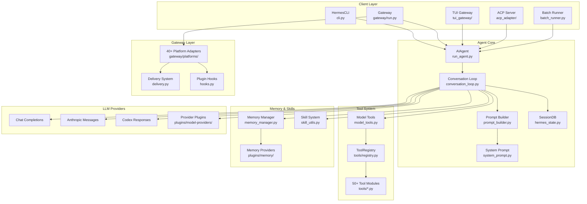
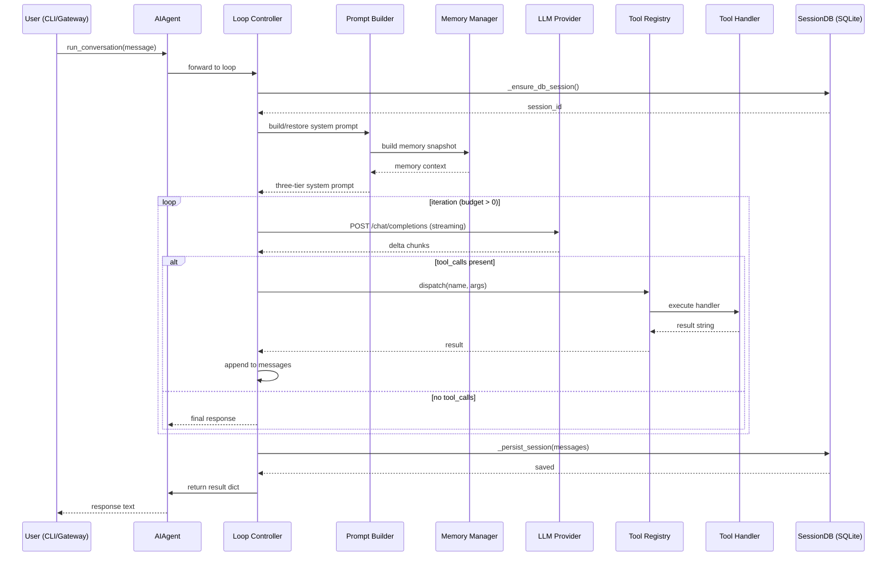
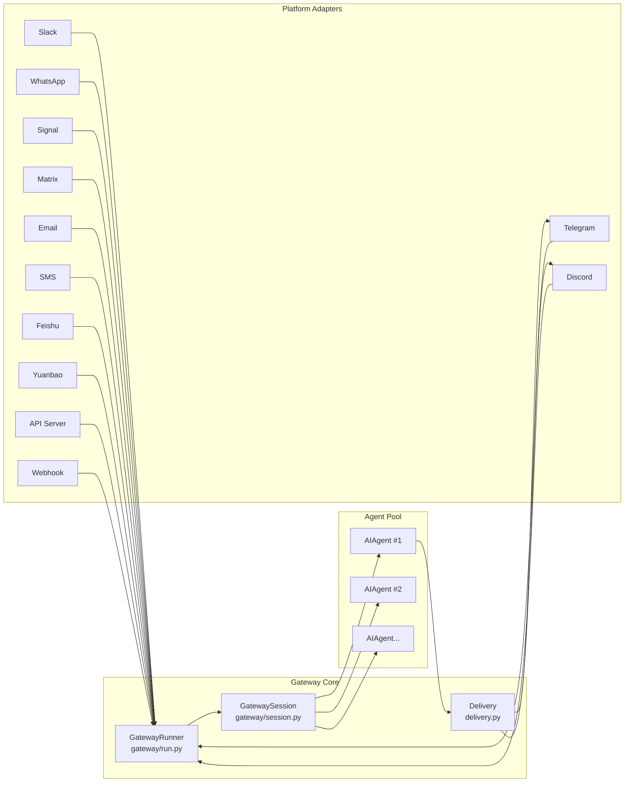

# Hermes Agent · 架構

## Agent 系統高層圖



### 圖意說明

Hermes Agent 採用四層架構：Client Layer（五種進入點）→ Agent Core（控制中樞）→ Tool / Memory / Skill / LLM Providers（能力層）→ Gateway Layer（多平台輸出層）。核心 Agent Core 是**無狀態的**——所有 session 狀態透過 `SessionDB`（SQLite）持久化，client 層每次啟動 `AIAgent` 都是從資料庫恢復狀態。

可以拿來對比的是 LangGraph：LangGraph 把 agent 邏輯表示為「StateGraph + node + edge」，是 declarative graph 架構；Hermes Agent 則是**imperative loop**——一個巨大的 synchronous while 迴圈（~3900 行在 `conversation_loop.py`）。沒有 graph、沒有 state machine，只有一個有著完整錯誤處理的 while loop。這兩個極端設計各有 trade-off：graph 的 declarative 形式在平行執行和中斷回復上更有優勢，但 imperative loop 的錯誤處理和邊界情況更容易掌控（因為你可以直接在 loop 中寫 `if/else` 和 `try/except`）。

## Agent 控制流

Hermes Agent 的核心是同一個 `run_conversation()` 方法（經由 `conversation_loop.py`），這是 CLI、Gateway、TUI、ACP 所有入口共享的 agent 實作。這是一個**完全的 synchronous loop**——不做 async/await（內部工具執行用 ThreadPoolExecutor 做平行），設計者明確選擇了同步模型的簡單性。

### 主迴圈位置

[`agent/conversation_loop.py:187`](https://github.com/nousresearch/hermes-agent/blob/48be2e0e4dbc4489f418e8d58794790c9c830390/agent/conversation_loop.py#L187)

`run_conversation()` 函式入口（被 `run_agent.py` 中的 `AIAgent.run_conversation()` thin wrapper forward 到這裡）。

### 控制流類型：Synchronous Imperative Loop

```python
while (api_call_count < max_iterations and budget.remaining > 0) or grace_call:
    if interrupt_requested: break
    response = client.chat.completions.create(model=model, messages=messages, tools=tool_schemas)
    # 重試 + fallback + 壓縮 + 錯誤處理 ~2000 行
    if response.tool_calls:
        for tool_call in response.tool_calls:
            result = handle_function_call(tool_call.name, tool_call.args)
            messages.append(tool_result_message(result))
        api_call_count += 1
    else:
        return response.content
```

- **終止條件**：iteration budget 耗盡 (`max_iterations=90` 預設），或 model 回傳純文字回應（無 tool calls）
- **錯誤處理**：7-stage empty response recovery chain、jittered exponential backoff、provider fallback chain

### 一個 Turn 的具體流程

```
1. __安全防護__: 安裝 safe stdio → 建立 SQLite session → 清理 zombie TCP 連線
2. __系統提示__: 從 SQLite 恢復或重建三層 system prompt (stable + context + volatile)
3. __Plugin hook__: pre_llm_call → 注入 plugin context
4. ══ 主迭代迴圈 ══
   a. 中斷檢查 & budget 消耗
   b. 建構 api_messages（修復 tool_call arguments、role alternation、surrogates）
   c. ══ API 重試迴圈（最多 3 次 retry）══
      - Nous rate guard → credential pool 輪換
      - Streaming API 呼叫（always on, 即使無 stream consumer）
      - Response 驗證（codex_responses / anthropic_messages / chat_completions）
      - 異常處理：413→壓縮 / 429→credential 輪換 / context overflow→逐步降級
   d. Response 解析：tool call 還是 final answer？
   e. Tool call 路徑：→ 驗證 name/args → guardrails → 並行/順序執行 → post-tool 壓縮
   f. Final answer 路徑：→ 提取 reasoning → 回傳
5. __後處理__: 存 trajectory → 持久化 session → 背景 memory/skill review
```

## Prompt 管理

### System Prompt 三層結構

設計來源：[`agent/system_prompt.py:10-22`](https://github.com/nousresearch/hermes-agent/blob/48be2e0e4dbc4489f418e8d58794790c9c830390/agent/system_prompt.py#L10-L22)

| 層級 | 內容 | 更新頻率 | 設計理由 |
|---|---|---|---|
| **stable** | 身份（SOUL.md / DEFAULT_AGENT_IDENTITY）、tool guidance、platform hints | 永不變（session 內） | Upstream prefix cache 保持熱 |
| **context** | 使用者 system_message + AGENTS.md / .cursorrules 等 context files | session 開始時 | CWD 變化時重算 |
| **volatile** | memory snapshot、USER.md、timestamp/session/model/provider 行 | 每個 turn | 唯一每次改變的部份 |

- **System prompts 放在哪**：`agent/system_prompt.py`（建構邏輯）、`agent/prompt_builder.py`（分段常數 + 組合邏輯）
- **是否使用 template 引擎**：是 — `Jinja2`（用於 skill 內容渲染）
- **是否有 prompt 版本控制**：無（但整個 repo 是 git 追蹤，prompt 修改由 PR 審查）
- **快取策略**：system prompt 在 session 中只建一次（line 406-420），後續 turn 從 SQLite 恢復。這讓 Anthropic prefix cache 保持熱——代價是 memory 變更不會即時反映在 prompt 中，必須透過 tool call 寫入。

## Tool / Function 系統

- **Tool 註冊方式**：[`tools/registry.py:234-305`](https://github.com/nousresearch/hermes-agent/blob/48be2e0e4dbc4489f418e8d58794790c9c830390/tools/registry.py#L234-L305) — 每個 tool module 在 module-level 呼叫 `registry.register()`，屬於 self-registering 模式
- **Tool 發現方式**：[`tools/registry.py:57-74`](https://github.com/nousresearch/hermes-agent/blob/48be2e0e4dbc4489f418e8d58794790c9c830390/tools/registry.py#L57-L74) — AST-based：只 import 有 `registry.register()` 呼叫的 module，跳過 helper modules
- **Tool schema 定義**：OpenAI JSON Schema（每個 handler 手寫，非 Pydantic auto-gen）
- **Tool 呼叫協定**：OpenAI-native function calling（`type: "function"`）
- **Tool 分類方式**：`toolset` 系統 — 工具依功能分組（`web`、`terminal`、`file`、`browser` 等），使用者可啟用/停用整個 toolset

### 內建 Tools 擷取

| Category | 範例工具 |
|---|---|
| Terminal | `terminal`、`process` |
| File | `read_file`、`write_file`、`patch`、`search_files` |
| Web | `web_search`、`web_extract` |
| Browser | `browser_navigate`、`browser_click`、`browser_snapshot` 等 |
| Agent Loop | `todo`、`memory`、`session_search`、`delegate_task` |
| Skills | `skill_view`、`skills_list`、`skill_manage` |
| Vision | `vision_analyze` |
| Cron | `cronjob` |
| Code | `execute_code` |

- **Tool 錯誤處理**：[`model_tools.py:500-538`](https://github.com/nousresearch/hermes-agent/blob/48be2e0e4dbc4489f418e8d58794790c9c830390/model_tools.py#L500-L538) — error sanitization（移除 XML tag、CDATA、markdown fence、限制 2000 chars）
- **Tool 權限/安全**：無（信任模型——這是設計選擇，見 3-key-patterns）

## Memory 架構

### Short-term（對話內）

- **儲存形式**：OpenAI-format message list（`{"role": "system/user/assistant/tool", ...}`）
- **截斷策略**：context summarization/compression（非 sliding window）— 超過 threshold 時由 `conversation_compression.py` 觸發，壓縮後會產生新的 session (parent_session_id chain)
- **位置**：[`agent/conversation_compression.py`](https://github.com/nousresearch/hermes-agent/blob/48be2e0e4dbc4489f418e8d58794790c9c830390/agent/conversation_compression.py)

### Long-term（跨對話）

- **是否有**：是
- **儲存後端**：[`hermes_state.py`](https://github.com/nousresearch/hermes-agent/blob/48be2e0e4dbc4489f418e8d58794790c9c830390/hermes_state.py) — SQLite with WAL mode + FTS5 全文搜尋
- **寫入時機**：每個 turn 結束後（`_persist_session()`）
- **讀取策略**：[`session_search`](https://github.com/nousresearch/hermes-agent/blob/48be2e0e4dbc4489f418e8d58794790c9c830390/tools/session_search_tool.py) — FTS5 全文搜尋 + SQL 遞迴 CTE 投影到最新 tip
- **外部 memory provider**：plugin-based（honcho、mem0、supermemory 等），最多一個同時啟用

## LLM Provider 抽象

- **抽象方式**：以 OpenAI-compatible API 為通用介面（`openai` SDK 的 proxy wrapper），非泛型 adapter interface
- **支援的 providers**：透過 plugin 動態擴充
  - 內建：OpenAI Chat Completions、Anthropic Messages、Codex Responses、Bedrock Converse
  - Plugin：OpenRouter、Google Gemini、xAI、Copilot、GitHub Models 等
- **切換 provider**：透過 config.yaml（`model` + `base_url` + `api_key`），或 runtime 的 fallback chain
- **Fallback**：[`agent/chat_completion_helpers.py:688`](https://github.com/nousresearch/hermes-agent/blob/48be2e0e4dbc4489f418e8d58794790c9c830390/agent/chat_completion_helpers.py#L688) — 429/billing 時走訪 fallback_chain，60s cooldown 後自動恢復 primary

## Multi-agent（kanban plugin）

- **Agents 數量與角色**：由 kanban board 定義，每個 card 一個 worker agent
- **編排者**：`kanban dispatcher plugin`（在 `plugins/kanban/`）
- **訊息傳遞**：shared SQLite board（`kanban.db`）
- **衝突解決**：每個 worker agent 獨立執行，dispatcher 不做全局協調——這是「execute and collect」模式，不是「debate and consensus」模式

## 資料流圖



### 圖意說明

這是 agent 處理一次 user message 的資料流。關鍵觀察點：

1. **SessionDB 是外部儲存** — loop 開始時建立/恢復 session、結束時持久化，中間不涉及資料庫寫入（除了 tool 產生的 side effects）
2. **Memory 快照只讀一次** — `build_memory_context_block()` 在 prompt 建構時被呼叫一次，產生的快照持續整輪 iteration（為了 prefix cache 穩定）
3. **Tool dispatch 是同步的** — 所有工具在 loop 內依序或平行（ThreadPoolExecutor）執行，結果直接 append 到 messages list
4. **Streaming 始終開啟** — 即使沒有 stream consumer（如子 agent context），也偏好 streaming API call（line 1030-1039），因為 streaming path 提供精細的健康檢查（90s stale-stream timeout、60s read timeout）

## Session 管理

- **State 序列化方式**：SQLite（WAL mode + FTS5），schema version 12
- **是否可中斷續跑**：是 — `/resume` slash command 從 SQLite 恢復 session
- **Session splitting**：壓縮觸發時建立新 session（parent_session_id chain），舊 session 保持唯讀

## 觀測性與評估

- **Tracing**：plugin-based（observability plugin）
- **Token / cost 追蹤**：[`agent/usage_pricing.py`](https://github.com/nousresearch/hermes-agent/blob/48be2e0e4dbc4489f418e8d58794790c9c830390/agent/usage_pricing.py) — 每個 API call 估算 cost
- **Trajectory**：`_save_trajectory()` — 儲存完整的工具呼叫軌跡
- **內建 evaluation**：無（tests/ 下有 ~17k pytest，但非 agent 行為評估）

## 平台 Gateway 架構

Gateway 是讓同一 agent core 服務多個 messaging platform 的關鍵設計：



- **Adapter 模式**：`BasePlatformAdapter`（`gateway/platforms/base.py`）定義 abstract methods（`connect/disconnect/send` 等），每個平台實作自己的 adapter
- **Session 路由**：`build_session_key()` 從 platform + chat_id + thread_id 產生唯一 key，映射到 AIAgent 實例
- **Agent 池**：LRU cache（128 cap / 1h TTL），避免為每條訊息建立新 agent
- **自動故障恢復**：GatewayRunner 監控 adapter 連線狀態，斷線自動重連

## 主要設計決策與 Trade-off

### 1. Synchronous Loop 而非 Async

**決定**：conversation loop 完全同步（threading.ThreadPoolExecutor 處理工具執行）。
**理由**：同步 loop 的錯誤處理更直接（`try/except` 就在迴圈內），debugging 更簡單，狀態管理更清晰。
**Trade-off**：失去 asyncio 的輕量級並行能力。工具平行執行依賴 ThreadPoolExecutor，thread 開銷比 coroutine 大。

### 2. OpenAPI-compatible API 為唯一抽象

**決定**：不建立泛型 Provider interface，直接使用 OpenAI SDK 作為統一介面。
**理由**：所有主流 provider 都支援 OpenAI-compatible API，省去 adapter 維護成本。
**Trade-off**：Anthropic Messages 和 Bedrock Converse 等原生 API 需要透過額外的 adapter layer（`agent/anthropic_adapter.py`、`agent/bedrock_adapter.py`）。如果某 provider 不支援 OpenAI format（例如某些 streaming 差異），就需要專屬處理。

### 3. Tool 的 Module-level Self-registration

**決定**：每個 tool 在 module-level 呼叫 `registry.register()`，discovery 用 AST scan 決定 import 哪些 module。
**理由**：不需要中央 enum 清單，新增 tool 只需在 `tools/` 下建立新檔案。AST scan 確保只 import 有 register() 呼叫的 module。
**Trade-off**：Import side effect 是隱式的（全域 mutable singleton），測試時需要注意註冊順序和 cleanup。Plugin 的 import error 可能導致 agent 啟動失敗（雖然用 try/except 包裹了）。

### 4. Prompt Cache 優先於即時性

**決定**：System prompt 在 session 內只建一次，memory 資料寫入但不更新提示。
**理由**：讓 Anthropic prefix cache 保持在熱狀態（~90% cache hit rate 可節省大量 token）。
**Trade-off**：模型在 session 中看不到 mid-session 的 memory 寫入（除非透過 tool call 讀取）。設計者選擇為成本（token）犧牲即時性（recency）。

### 5. SQLite 為中心儲存

**決定**：所有 session 資料儲存在單一 SQLite 檔案（WAL mode + FTS5）。
**理由**：零運維、零依賴（Python 內建）、FTS5 提供良好的全文搜尋。
**Trade-off**：不支援水平擴展。高併發 gateway 場景下，WAL mode 的 NFS 不相容需要 fallback 到 journal_mode=DELETE。
