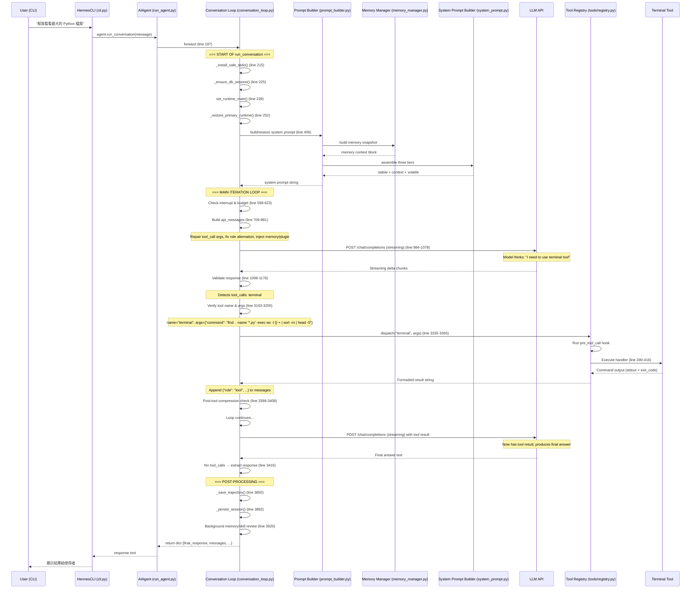

# Hermes Agent · 程式碼追蹤

## 追蹤的場景

**任務**: 使用者在 CLI 輸入 `/w` 要查看最近對話（最後 20 則訊息），要求 agent 用終端機顯示。

**預期的 agent 行為**:
1. 使用者輸入 slash command `/w`
2. CLI 的 `process_command()` 擷取指令，呼叫 `handle_history_command()` → 從 SessionDB 讀取最近訊息
3. 顯示歷史記錄給使用者

這個場景不需要 LLM 呼叫，但展示了 CLI slash command → SessionDB → 顯示的完整路徑。

更完整的 agent run（含 LLM tool calling）會追蹤第二個場景。

## 場景二：Agent 帶工具呼叫的完整路徑

**任務**: 使用者問「幫我看看這個目錄下最大的 Python 檔案是哪個？」

**預期的 agent 行為**:
1. 接收使用者輸入
2. 載入 system prompt + memory
3. 呼叫 `terminal` 工具執行 `find . -name '*.py' -exec wc -l {} + | sort -rn | head -5`
4. 解析結果
5. 回傳答案

## 流程圖（場景二）



### 圖意說明

這張 sequence diagram 追蹤了 agent 從接收到使用者訊息到完成回應的完整路徑。四個關鍵觀察點：

1. **Loop 內的兩次 API call**：第一次產生 tool call，第二次在 tool 執行後產生 final answer。這是標準的 ReAct 模式。
2. **同步控制流**：所有箭頭都是同步的——沒有 async/await，`ThreadPoolExecutor` 在工具執行層（圖中未顯示）處理平行。
3. **Tool dispatch 的 plugin hook**：在實際執行 handler 前有 `pre_tool_call` hook，可以攔截/阻擋工具執行。
4. **Session 只寫一次**：turn 開始時只建立 session row（`_ensure_db_session`），所有訊息累積在記憶體中，turn 結束才 `_persist_session`。

## 逐步追蹤

### Step 1: 使用者輸入進入 Agent

入口點：[`cli.py`](https://github.com/nousresearch/hermes-agent/blob/48be2e0e4dbc4489f418e8d58794790c9c830390/cli.py) — `HermesCLI` class 接收使用者輸入，檢查是否為 slash command（如 `/w`、`/resume`），若不是則傳入 `AIAgent.run_conversation()`。

**前置處理**：
- `cli.py` 使用 `prompt_toolkit` 提供 autocomplete 和歷史記錄
- 若輸入是 `/w` → `process_command()` 直接處理，不進 agent loop
- 若不是 slash command → 傳入 `run_conversation()`

### Step 2: Prompt 組裝

位置：[`agent/conversation_loop.py:406-420`](https://github.com/nousresearch/hermes-agent/blob/48be2e0e4dbc4489f418e8d58794790c9c830390/agent/conversation_loop.py#L406-L420)

- `_restore_or_build_system_prompt()` — 從 SQLite 恢復或重建
- 三層組合（`agent/system_prompt.py:10-22`）：
  - `stable` — 身份、tool guidance、platform hints（不變）
  - `context` — system_message + context files（AGENTS.md 等）
  - `volatile` — memory snapshot + USER.md + timestamp（每次不同）

**值得學的地方**：Time-based prefix cache 穩定策略——timestamp 只精確到日期（`YYYY-MM-DD`），確保同一天的 session 產生相同的 system prompt byte string。這讓 Anthropic 的 prefix cache 在整天的 session 中保持有效。

### Step 3: LLM 呼叫

位置：[`agent/conversation_loop.py:984-1078`](https://github.com/nousresearch/hermes-agent/blob/48be2e0e4dbc4489f418e8d58794790c9c830390/agent/conversation_loop.py#L984-L1078)

- **Provider 抽象**：透過 OpenAI-compatible API 統一介面（`client.chat.completions.create()`）
- **Streaming 始終開啟**：即使沒有 stream consumer（子 agent 場景），也偏好 streaming API call（line 1030-1039）。Rationale：streaming path 提供精細的健康檢查（90s stale-stream timeout、60s read timeout），non-streaming 在 provider 沉默時可能 hang 住。
- **重試策略**：[`agent/retry_utils.py`](https://github.com/nousresearch/hermes-agent/blob/48be2e0e4dbc4489f418e8d58794790c9c830390/agent/retry_utils.py) — jittered exponential backoff（base_delay=2~5s, max_delay=60~120s），每次睡眠前 200ms 檢查中斷標誌

### Step 4: Response 解析

位置：[`agent/conversation_loop.py:1098-1176`](https://github.com/nousresearch/hermes-agent/blob/48be2e0e4dbc4489f418e8d58794790c9c830390/agent/conversation_loop.py#L1098-L1176)

- 根據 `api_mode` 呼叫對應的 `validate_response()`：
  - `chat_completions` → 標準 OpenAI format 驗證
  - `codex_responses` → Responses API 格式驗證
  - `anthropic_messages` → Anthropic Messages API 格式轉換 + 驗證
- 判斷是否包含 `tool_calls`：
  - 有 → 進入 tool execution path
  - 無 → 進入 final answer path

### Step 5: Tool 執行

位置：[`agent/conversation_loop.py:3335-3365`](https://github.com/nousresearch/hermes-agent/blob/48be2e0e4dbc4489f418e8d58794790c9c830390/agent/conversation_loop.py#L3335-L3365)

1. **Tool name 驗證**（line 3103-3255）：檢查名稱是否在 registry 中，嘗試修復常見的模型幻覺
2. **Tool args 驗證**：`coerce_tool_args()`（[`model_tools.py:545-626`](https://github.com/nousresearch/hermes-agent/blob/48be2e0e4dbc4489f418e8d58794790c9c830390/model_tools.py#L545-L626)）— 自動轉換型別（字串→int、JSON 字串→dict）
3. **Guardrails**：`ToolCallGuardrailController` 檢查重複工具呼叫，可決定 `warn` 或 `halt`
4. **Dispatch**：[`tools/registry.py:390-416`](https://github.com/nousresearch/hermes-agent/blob/48be2e0e4dbc4489f418e8d58794790c9c830390/tools/registry.py#L390-L416) — 同步 handler 直接執行，非同步 handler 透過 `_run_async()` bridging

**錯誤路徑**：tool 失敗時（非同步 handler timeout、sync handler exception）→ `_sanitize_tool_error()`（line 500-538）移除 XML tag、CDATA、markdown fence，限制 2000 chars，回傳 `{"error": "sanitized_message"}`。

**並行 vs 順序**：[`agent/tool_dispatch_helpers.py:103`](https://github.com/nousresearch/hermes-agent/blob/48be2e0e4dbc4489f418e8d58794790c9c830390/agent/tool_dispatch_helpers.py#L103) — `_should_parallelize_tool_batch()` 根據 tool 類型決定並行（read-only tools 如 `web_search`、`search_files`）或順序（file mutation tools、`clarify`）。

### Step 6: 結果餵回 LLM

工具執行結果被包裝為 `{"role": "tool", "tool_call_id": ..., "content": result}`，直接 append 到 `messages` list。不需要其他格式化——OpenAI-format 的 tool result message 就是 LLM 可以吃的格式。

### Step 7: 終止判斷

位置：[`agent/conversation_loop.py:598`](https://github.com/nousresearch/hermes-agent/blob/48be2e0e4dbc4489f418e8d58794790c9c830390/agent/conversation_loop.py#L598)

```python
while (api_call_count < self.max_iterations and 
       self.iteration_budget.remaining > 0) or self._budget_grace_call:
```

終止條件：
1. **Budget 耗盡**（`max_iterations=90`）：注入一次 grace call（「請總結」）
2. **模型回傳純文字**：無 tool_calls → final answer
3. **中斷請求**：使用者傳送新訊息時設 `_interrupt_requested = True`

### Step 8: Session 持久化

位置：[`agent/conversation_loop.py:3850`](https://github.com/nousresearch/hermes-agent/blob/48be2e0e4dbc4489f418e8d58794790c9c830390/agent/conversation_loop.py#L3850)

- `_save_trajectory()` — 儲存工具呼叫軌跡
- `_persist_session()` — 將 messages 寫入 SQLite (`hermes_state.py`)
- `_cleanup_task_resources()` — 清理子 agent thread、todo store 等
- `_drop_empty_response_scaffolding()` — 移除框架性的空白回應

## 想學更多時，在哪裡下中斷點

| 中斷點 | 檔案 | 行號 |
|---|---|---|
| Conversation loop 起點 | `agent/conversation_loop.py` | 187 |
| LLM call 前一刻（看完整 prompt） | `agent/conversation_loop.py` | 984-1078 |
| API response 驗證後 | `agent/conversation_loop.py` | 1098-1176 |
| Tool dispatch 前（看 name + args） | `agent/conversation_loop.py` | 3103-3255 |
| Tool 執行結果回來後 | `agent/conversation_loop.py` | 3335-3365 |
| Memory / session 寫入 | `agent/conversation_loop.py` | 3850-3892 |
| Fallback chain activation | `agent/chat_completion_helpers.py` | 688 |
| System prompt 組合 | `agent/system_prompt.py` | 50+ |
| Tool registration | `tools/registry.py` | 234-305 |
| Tool discovery | `tools/registry.py` | 57-74 |
| Iteration budget 檢查 | `agent/conversation_loop.py` | 610-623 |
| Parallel vs sequential decision | `agent/tool_dispatch_helpers.py` | 103-146 |

## 沒追蹤到但值得留意的分支

- **Subagent（delegate_task）**: 另開 thread 執行子 `AIAgent`，使用獨立的 conversation loop instance
- **Compression path**: 當 message 超過 context length 時，`_compress_context()` 觸發 summarization
- **Fallback chain**: 當 primary provider 429/billing 時，走訪 fallback model chain
- **Gateway path**: 不同於 CLI 的單一 agent instance，gateway 使用 LRU agent pool（128 cap/1h TTL）
- **Empty response recovery**: 7-stage pipeline（partial stream recovery → nudge → prefill → empty retry → fallback → terminal sentinel）
