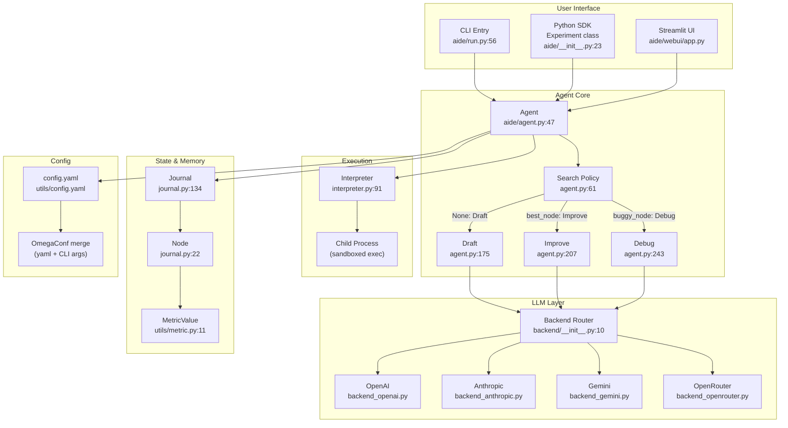

# AIDE ML · 架構

## Agent 系統高層圖



**圖意說明**：這張圖展示 AIDE 的三層架構。User Interface 層提供三種進入方式（CLI、Python SDK、Streamlit UI），全部導向核心 Agent。Agent Core 層由 `Agent.step()` 驅動，每次迭代先透過 `search_policy()` 決定本次要「從頭草稿」、「改進現有最佳」或「除錯」，然後透過 LLM Layer 產生程式碼。產生的程式碼送到 Interpreter 層以獨立行程（child process）執行，結果回傳後由 Agent 用 LLM 評估並更新到 Journal。Journal 是整個系統的「狀態資料庫」，記錄所有 solution nodes 與其 metric。

## Agent 控制流

### 主迴圈位置

核心迴圈在 [`aide/agent.py:276-294`](https://github.com/wecoai/aideml/blob/40dcf28/aide/agent.py#L276-L294)——`Agent.step()` 方法。

在 CLI 模式中，這個迴圈由 [`aide/run.py:131-135`](https://github.com/wecoai/aideml/blob/40dcf28/aide/run.py#L131-L135) 的 `while global_step < cfg.agent.steps` 驅動。

在 SDK 模式中，由 [`aide/__init__.py:55-58`](https://github.com/wecoai/aideml/blob/40dcf28/aide/__init__.py#L55-L58) 的 `for _i in range(steps)` 驅動。

### 控制流類型

AIDE 的控制流是「**tree search in code space**」，不屬於常見的 ReAct 或 Plan-Execute 分類。每次迭代：

1. **選擇節點**：`search_policy()` 決定本次要操作哪個節點（或從零開始）
2. **生成程式碼**：用 LLM 產生完整 Python 腳本（含 Plan + Code 在同一次呼叫）
3. **執行程式碼**：在隔離的 child process 中執行，捕獲 stdout/stderr
4. **LLM 評估**：用另一個（或同個）LLM 評估執行結果，判斷是否有 bug、提取 metric 值
5. **加入 Journal**：把新節點寫入 solution tree

- **終止條件**：到達設定的 `agent.steps` 數量（預設 20） [`config.yaml:36`](https://github.com/wecoai/aideml/blob/40dcf28/aide/utils/config.yaml#L36)
- **錯誤處理**：執行逾時在 [`interpreter.py:271-283`](https://github.com/wecoai/aideml/blob/40dcf28/aide/interpreter.py#L271-L283)——先送 SIGINT，若 5 秒後仍存活則 kill

### Search Policy 的節點選擇邏輯

`search_policy()` ([`agent.py:61-92`](https://github.com/wecoai/aideml/blob/40dcf28/aide/agent.py#L61-L92)) 是 AIDE 最核心的設計：

1. **草稿不足**：若 `draft_nodes < num_drafts`（預設 5），從頭草稿新節點
2. **機率除錯**：有 `debug_prob`（預設 0.5）的機率選一個 buggy leaf 節點來除錯
3. **貪婪改進**：否則選當下 metric 最好的節點來改進

這不是傳統的 MCTS（沒有 UCB 公式、沒有 exploration bonus），而是更簡單的**ε-greedy + 除錯優先**策略。

### 一個 Step 的具體流程

```
1. search_policy() → 決定操作類型（draft / improve / debug / 除錯特定節點）
2. 根據操作類型組裝 prompt（含 task_desc、前次解決方案或錯誤輸出）
3. 單次 LLM 呼叫 → 同時產出「自然語言計畫」+「完整 Python 程式碼」
4. 將程式碼寫入代理工作目錄、以 multiprocessing.Process 執行
5. 捕獲 stdout/stderr、異常資訊與執行時間
6. 用另一個 LLM 呼叫評估執行結果：
   - 是否有 bug？→ 若無，提取 metric 值
   - metric 是「越低越好」還是「越高越好」？
   - 摘要實驗發現
7. 建立 Node 物件（含 plan / code / exec result / metric / analysis）
8. 將 Node 加入 Journal（自動建立 parent-child 連結）
```

## Prompt 管理

AIDE 的 prompt 管理極為簡單——**沒有 template 引擎、沒有版本控制、沒有動態組裝層**，全部在 `agent.py` 中以 Python dict + f-string 拼接。

| 面向 | 選擇 |
|---|---|
| System prompts 存放位置 | 直接寫在 `agent.py` 的方法中（`_draft`、`_improve`、`_debug`） |
| Template 引擎 | 無——純 `dict` 拼接後由 `backend.utils.compile_prompt_to_md()` 轉成 markdown |
| Prompt 結構 | 由 dict key 作為 section header，value 為段落或 list |
| 動態組裝邏輯 | [`agent.py:175-205`](https://github.com/wecoai/aideml/blob/40dcf28/aide/agent.py#L175-L205) |

評估 prompt 則嵌入 Function calling：[`agent.py:301-321`](https://github.com/wecoai/aideml/blob/40dcf28/aide/agent.py#L301-L321)，使用 `submit_review` function spec。

**值得注意的設計**：prompt 中有一個 `Memory` section，填入 `journal.generate_summary()` 的輸出——這是整個系統中唯一從過去經驗提供上下文的方式，且僅限於「好的節點」的計畫與結果摘要，不給完整程式碼。

## Tool / Function 系統

AIDE **沒有傳統的 tool/function registry**。它不做 tool calling——每次迭代，LLM 被要求直接輸出一個完整的 Python 腳本，然後由 Interpreter 執行。

唯一的 function call 出現在**評估階段**：`submit_review` function spec [`agent.py:19-44`](https://github.com/wecoai/aideml/blob/40dcf28/aide/agent.py#L19-L44)，用於 LLM 結構化回報執行結果（is_bug、summary、metric、lower_is_better）。

## Memory 架構

### Short-term（session 內）

Journal 物件是唯一的狀態載體，儲存在 [`journal.py:134-192`](https://github.com/wecoai/aideml/blob/40dcf28/aide/journal.py#L134-L192)。

- **儲存形式**：`list[Node]`——每個 Node 包含 code、plan、execution result、metric
- **節點關係**：透過 `Node.parent` 與 `Node.children` 形成樹狀結構
- **截斷策略**：無截斷——所有節點完整保留
- **序列化**：透過 `dataclasses-json` 序列化成 `journal.json` [`config.py:191`](https://github.com/wecoai/aideml/blob/40dcf28/aide/utils/config.py#L191)

### Long-term（跨 session）

**無**——Journal 僅存在於單次 experiment run 內，沒有跨 session 的持久化。

### Journal Summary（給 LLM 的 context）

`generate_summary()` ([`journal.py:182-192`](https://github.com/wecoai/aideml/blob/40dcf28/aide/journal.py#L182-L192)) 是唯一的「memory → prompt」橋樑。它只從 `good_nodes`（非 buggy）中提取：
- Plan（自然語言描述）
- Analysis（LLM 評估摘要）
- Validation metric

**不包含程式碼**，這是個重要的設計選擇——避免把 LLM 的短期記憶塞滿完整程式碼。

## LLM Provider 抽象

| 面向 | 選擇 |
|---|---|
| 抽象方式 | Provider-aware dispatch by model name |
| 支援的 providers | OpenAI、Anthropic、Gemini、OpenRouter |
| 切換方式 | 設 `agent.code.model` 即可，自動依 model name 前綴判斷 |
| Fallback | 無——若 provider API 失敗，query 拋出例外 |
| Retry | 有——`backoff_create()` 對 rate limit / connection error 重試 |

Provider 判斷邏輯在 [`backend/__init__.py:10-23`](https://github.com/wecoai/aideml/blob/40dcf28/aide/backend/__init__.py#L10-L23)：
- `gpt-*` / `o*` → OpenAI (responses API)
- `claude-*` → Anthropic
- `gemini-*` → Gemini
- 若設了 `OPENAI_BASE_URL` → OpenAI (chat API，相容 local server)
- 其他 → OpenRouter

## 觀測性與評估

- **執行結果**：每次程式執行都捕獲 stdout/stderr、異常類型、traceback、執行時間
- **Metric 追蹤**：MetricValue 物件自帶「最大化/最小化」方向，支援比較與排序 [`metric.py:11-38`](https://github.com/wecoai/aideml/blob/40dcf28/aide/utils/metric.py#L11-L38)
- **視覺化**：`tree_export.py` 生成 HTML solution tree，可在瀏覽器中檢視所有節點與程式碼
- **報告生成**：`journal2report.py` 將 Journal 轉成自然語言報告
- **Token / cost 追蹤**：無內建——所有 LLM calls 回傳 token 計數，但未匯總或記錄

## 安全與護欄

- **執行隔離**：程式碼在獨立的 `multiprocessing.Process` 中執行 [`interpreter.py:176-180`](https://github.com/wecoai/aideml/blob/40dcf28/aide/interpreter.py#L176-L180)
- **執行超時**：預設 3600 秒 [`config.yaml:23`](https://github.com/wecoai/aideml/blob/40dcf28/aide/utils/config.yaml#L23)
- **無 sandbox 強化**：child process 與主行程有相同的檔案系統權限——沒有 chroot、Docker 或 seccomp
- **最大疊代次數**：`agent.steps` 限制（預設 20）

## 測試策略

AIDE 沒有集中的測試套件。專案的測試方式主要是端到端執行確認程式能否跑 Kaggle 任務。這種測試方式在 research code 中常見但對 production 部署不足。

## 關鍵設計決策與 Trade-off

### 決策 1：Why tree search over linear ReAct?

將 agent loop 從「線性思考-行動-觀察」改為「樹狀搜尋-評估-收斂」，核心 trade-off：

- **優點**：可以同時探索多條路線，避免 stuck in local optimum。MLE-Bench 的結果顯示這比線性 agent 好 4 倍。
- **代價**：每個節點都需要完整的 LLM 呼叫 + 程式碼執行，token 與時間成本遠高於線性 agent。
- **適用**：當 metric 回饋明確（validation metric）、評估成本相對低時（數分鐘執行）。

### 決策 2：Why separate coding model from evaluation model?

[UNVERIFIED] AIDE 預設讓 coding 用 `o4-mini`，evaluation 用 `gpt-4.1-mini`：

- **推測理由**：coding 需要大量 token 輸出完整程式碼，o4-mini 更快更便宜；evaluation 需要仔細分析程式輸出、判斷 bug 與 metric，gpt-4.1-mini 在判斷力上可能更好。這與 「writer/editor 分離」的思路一致。
- **代價**：每個 step 需要兩次 LLM call，且兩個模型間沒有對話歷史共享。
- **注意**：這個分離在 prompt 中也體現——coding prompt 是角色扮演（Kaggle grandmaster），evaluation prompt 是 analytic reviewer。

### 決策 3：Why no in-memory code for the improve step?

`improve` 的 prompt 中只包含 parent 的**完整程式碼**，但不包含 `journal.generate_summary()` 以外的跨節點上下文：

- **優點**：避免 LLM 分心，focus 在直接改進一個具體方案
- **代價**：錯失跨節點學習的機會——例如節點 A 的特徵工程做得很好但節點 B 的模型選得很好，LLM 無法融合兩者的優點
- **推測**：這是為什麼 `num_drafts=5` 很重要——足夠的 initial diversity 讓 LLM 可以在不同路線中挑選最好的，雖然無法「雜交」，但貪婪改進配上多個起始點實證表現已經很好
