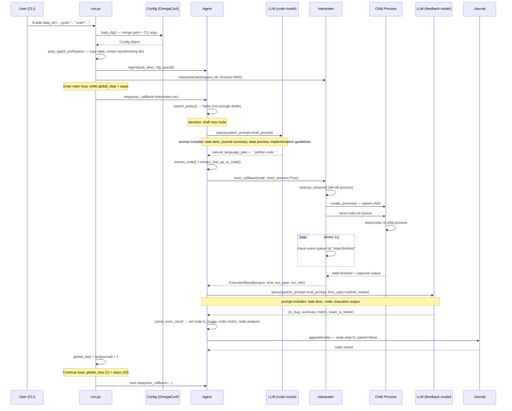
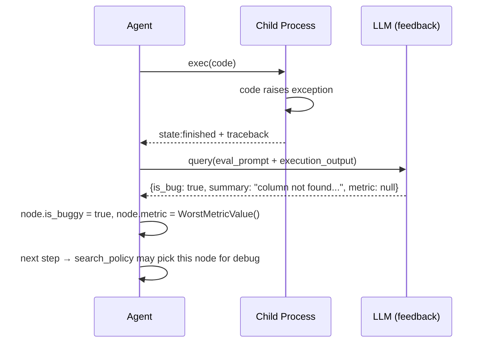

# AIDE ML · 程式碼追蹤

## 追蹤的場景

**任務**：使用者執行 CLI 指令 `aide data_dir="example_tasks/house_prices" goal="Predict the sales price for each house" eval="RMSE"` — 追蹤從 CLI 啟動到第一個 Step（draft → execute → evaluate）完成的完整流程。

**預期的 agent 行為**（一個 step 內）：

1. 載入 config 與 task description
2. 準備工作目錄（複製資料、解壓縮）
3. 初始化 Journal、Agent、Interpreter
4. 執行 `agent.step()`：
   - search_policy 決定 draft（因 draft_nodes 為 0）
   - 用 LLM 生成初始解決方案 + 程式碼
   - 在 child process 執行程式碼
   - 用 LLM 評估執行結果
   - 將節點加入 Journal

## 流程圖



**Failure path（程式碼執行失敗）**：



## 逐步追蹤

### Step 1: CLI 啟動與 Config 載入

入口點: [`aide/run.py:56-57`](https://github.com/wecoai/aideml/blob/40dcf28/aide/run.py#L56-L57)

```
cfg = load_cfg()
```

`load_cfg()` ([`config.py:105-107`](https://github.com/wecoai/aideml/blob/40dcf28/aide/utils/config.py#L105-L107)) 做兩層合併：
1. 載入 [`utils/config.yaml`](https://github.com/wecoai/aideml/blob/40dcf28/aide/utils/config.yaml) 的預設值
2. 用 `OmegaConf.from_cli()` 合併 CLI 參數（`data_dir=...`、`goal=...`、`eval=...`）

`prep_cfg()` ([`config.py:110-144`](https://github.com/wecoai/aideml/blob/40dcf28/aide/utils/config.py#L110-L144)) 接著做：
- 驗證 `data_dir` 和 `goal` 或 `desc_file` 至少一個存在
- 自動產生 experiment name（使用 `coolname` 套件生成隨機 slug）
- 建立 log 與 workspace 目錄

**關鍵設計**：使用 `coolname.generate_slug(3)` 產生人類可讀的 experiment name（如 `7-amber-rabbit-jumps`），
相比時間戳記或 UUID 更易在 CLI 中辨識。

### Step 2: Task Description 載入

[`config.py:151-174`](https://github.com/wecoai/aideml/blob/40dcf28/aide/utils/config.py#L151-L174)

若提供 `desc_file` ➞ 從檔案讀取完整 markdown task description。
若提供 `goal` + `eval` ➞ 組裝成簡單 dict：
```python
task_desc = {"Task goal": cfg.goal}
if cfg.eval:
    task_desc["Task evaluation"] = cfg.eval
```

這裡值得注意：`goal` 與 `eval` 是原始的字串，沒有任何結構化解析——它們「原樣」餵給 LLM。

### Step 3: Workspace 準備

[`config.py:177-184`](https://github.com/wecoai/aideml/blob/40dcf28/aide/utils/config.py#L177-L184)

```
workspace_dir/
├── input/    ← 資料複製或 symlink 到此
└── working/  ← 給 agent 放暫存檔 (包含 submission.csv)
```

**預設會複製資料** (`copy_data: True`)，避免 agent 意外修改原始資料。若該目錄有壓縮檔，`preprocess_data` 會解壓縮。

### Step 4: Agent 初始化的關鍵元件

[`run.py:72-81`](https://github.com/wecoai/aideml/blob/40dcf28/aide/run.py#L72-L81)

**Agent** ([`agent.py:47-59`](https://github.com/wecoai/aideml/blob/40dcf28/aide/agent.py#L47-L59))：
- 接收 `task_desc`（string）、`cfg`（Config object）、`journal`（Journal reference）
- 初始化時不做任何 LLM call——lazy initialization

**Interpreter** ([`interpreter.py:91-116`](https://github.com/wecoai/aideml/blob/40dcf28/aide/interpreter.py#L91-L116))：
- 設定 working directory、timeout（預設 3600s）
- 不立即建立 process——等到第一次 `run()` 才 spawn

**Journal** ([`journal.py:134-140`](https://github.com/wecoai/aideml/blob/40dcf28/aide/journal.py#L134-L140))：
- 空的 `nodes: list[Node]`
- 沒有任何 I/O

### Step 5: Agent.step() — 搜尋策略決定

[`agent.py:276-294`](https://github.com/wecoai/aideml/blob/40dcf28/aide/agent.py#L276-L294)

第一次呼叫 `step()`：
```
global step 0 — journal 是空的 → data_preview 需要更新
```

`update_data_preview()` ([`agent.py:271-274`](https://github.com/wecoai/aideml/blob/40dcf28/aide/agent.py#L271-L274)) 呼叫 `data_preview.generate()`，掃描 workspace/input/ 下的 CSV/JSON 等檔案的 schema（欄位、型態、前幾行取樣），產生一個結構化摘要給 LLM。

接著 `search_policy()` 被呼叫：

```python
# len(journal.draft_nodes) = 0 < search_cfg.num_drafts = 5
→ return None  # 從頭草稿
```

**決策：draft**。這是每次實驗最初 5 個 step 的固定路徑。

### Step 6: 程式碼生成 (LLM 呼叫 #1)

[`agent.py:175-205`](https://github.com/wecoai/aideml/blob/40dcf28/aide/agent.py#L175-L205)

`_draft()` 組裝 prompt 並呼叫 `plan_and_code_query()`。

**Prompt 組成**（以 dict 表示，實際會編譯成 markdown）：

| Section | 內容 | 來源 |
|---|---|---|
| Introduction | Kaggle grandmaster 角色扮演 | 固定字串 |
| Task description | `goal` + `eval` | 使用者的輸入 |
| Memory | `journal.generate_summary()` | 空的（第一次） |
| Data Overview | 資料集 schema 預覽 | `data_preview.generate()` |
| Response format | 先寫計畫（3-5 句）+ 再寫程式碼 block | 固定指導 |
| Solution sketch guideline | 保持簡單、不要 ensemble、不要 EDA | 固定指導 |
| Implementation guideline | 自包含腳本、印出 metric、時限內完成 | 固定指導 |
| Installed Packages | numpy, pandas, xgboost, torch 等 | 固定 shuffle 清單 |

`plan_and_code_query()` ([`agent.py:153-173`](https://github.com/wecoai/aideml/blob/40dcf28/aide/agent.py#L153-L173))：
- 單次 LLM call（`agent.code.model`，預設 `o4-mini`）
- 無 streaming——等待完整 completion
- 有 retry 機制（最多 3 次）
- 用 `extract_code()` 從 completion 中抓取 markdown code block
- 用 `extract_text_up_to_code()` 抓 code block 之前的自然語言

**如果 extraction 失敗**（例如 LLM 回傳了不符合格式的回應），retry 後若仍失敗，回傳空字串。這是系統最脆弱的點之一——沒有 structural output 或 grammar 約束來保證格式正確。

### Step 7: 程式碼執行

[`agent.py:290-293`](https://github.com/wecoai/aideml/blob/40dcf28/aide/agent.py#L290-L293)

```python
exec_callback(result_node.code, True)
```

這裡的 `exec_callback` 在 CLI 模式是被包裝過的 [`run.py:93-97`](https://github.com/wecoai/aideml/blob/40dcf28/aide/run.py#L93-L97)——除了執行還會更新 terminal 顯示的 status。

**Interpreter.run()** ([`interpreter.py:205-311`](https://github.com/wecoai/aideml/blob/40dcf28/aide/interpreter.py#L205-L311))：
- `reset_session=True` ➞ 每次執行都建立新的 child process（clean session）
- 透過 `Queue` 傳遞程式碼給 child
- Child process 寫檔案 → `exec(compile(code, "runfile.py", "exec"))`
- 透過 `RedirectQueue` 捕獲 stdout/stderr
- 主行程每 1 秒檢查 `event_outq` 是否收到 `"state:finished"`
- 若超過 timeout，先送 SIGINT，5 秒後若仍存活則 kill

**最重要的設計**：程式碼以 `exec()` 而非 `subprocess.run` 執行——這表示 agent 的程式碼直接在 child process 的 Python namespace 中執行，可以使用任何 pip 套件（在 host 已安裝的前提下）。這與 `subprocess.run("python script.py")` 的隔離程度相同。

### Step 8: 結果評估 (LLM 呼叫 #2)

[`agent.py:296-339`](https://github.com/wecoai/aideml/blob/40dcf28/aide/agent.py#L296-L339)

`parse_exec_result()` 先將執行結果吸收進 node（`node.absorb_exec_result()`），然後用 LLM 評估：

```python
response = query(
    system_message={
        "Introduction": "你是 Kaggle grandmaster…",
        "Task description": self.task_desc,
        "Implementation": wrap_code(node.code),
        "Execution output": wrap_code(node.term_out, lang=""),
    },
    func_spec=review_func_spec,  # 強制結構化輸出
    model=self.acfg.feedback.model,
)
```

這裡使用 **function calling** 來確保結構化輸出——`submit_review` function spec 要求 LLM 回傳 `is_bug`、`summary`、`metric`、`lower_is_better` 四個欄位。不使用一般的 JSON mode 或 text completion。

然後根據評估結果填寫 node：
- 若有 bug 或 metric 不是 float → `node.is_buggy = True`，metric 設為 `WorstMetricValue()`
- 若成功 → `node.metric = MetricValue(response["metric"], maximize=not lower_is_better)`

**WorstMetricValue** ([`metric.py:66-78`](https://github.com/wecoai/aideml/blob/40dcf28/aide/utils/metric.py#L66-L78)) 是 sentinel object，永遠比任何真實 metric 差，確保 buggy node 不會被 `get_best_node()` 選中（除非所有節點都 buggy）。

### Step 9: 加入 Journal

[`journal.py:148-151`](https://github.com/wecoai/aideml/blob/40dcf28/aide/journal.py#L148-L151)

```python
def append(self, node: Node) -> None:
    node.step = len(self.nodes)
    self.nodes.append(node)
```

Node 的 `__post_init__` ([`journal.py:51-53`](https://github.com/wecoai/aideml/blob/40dcf28/aide/journal.py#L51-L53)) 會自動處理 parent-child 關聯：

```python
def __post_init__(self) -> None:
    if self.parent is not None:
        self.parent.children.add(self)
```

所以第一次 step 的 node 沒有 parent → 屬於 `draft_nodes`。

### Step 10: 回到主迴圈

[`run.py:131-135`](https://github.com/wecoai/aideml/blob/40dcf28/aide/run.py#L131-L135)

```python
global_step = len(journal)  # 1
live.update(generate_live())  # 更新 terminal 顯示
```

然後繼續 `while global_step < cfg.agent.steps`（預設 20）。

## 想學更多時，在哪裡下中斷點

- Agent step 起點：[`agent.py:276`](https://github.com/wecoai/aideml/blob/40dcf28/aide/agent.py#L276)
- Search policy 決策點：[`agent.py:61`](https://github.com/wecoai/aideml/blob/40dcf28/aide/agent.py#L61)
- LLM call 前一刻（看完整 prompt）：[`agent.py:157-162`](https://github.com/wecoai/aideml/blob/40dcf28/aide/agent.py#L157-L162)（`plan_and_code_query` 內）
- 程式碼執行開始：[`interpreter.py:231`](https://github.com/wecoai/aideml/blob/40dcf28/aide/interpreter.py#L231)（`self.code_inq.put(code)`）
- 評估 LLM call：[`agent.py:312-321`](https://github.com/wecoai/aideml/blob/40dcf28/aide/agent.py#L312-L321)
- Journal 寫入：[`journal.py:148`](https://github.com/wecoai/aideml/blob/40dcf28/aide/journal.py#L148)

## 沒追蹤到但值得留意的分支

- **Improve 路徑**：當 `search_policy()` 選中一個好的節點來改進時，prompt 結構不同——包含前次解決方案的完整程式碼。與 Draft 的差別在於 prompt 中的「改進指導」而非「草稿指導」。
- **Debug 路徑**：選中 buggy node 時，prompt 包含前次程式碼與執行錯誤輸出，要求 LLM 修正 bug。
- **非 reset_session 模式**：Interpreter 支援 `reset_session=False`，可讓程式碼在同個 Python namespace 中累積狀態（類似 notebook cell 執行），但 `agent.step()` 永遠使用 `reset_session=True`。
