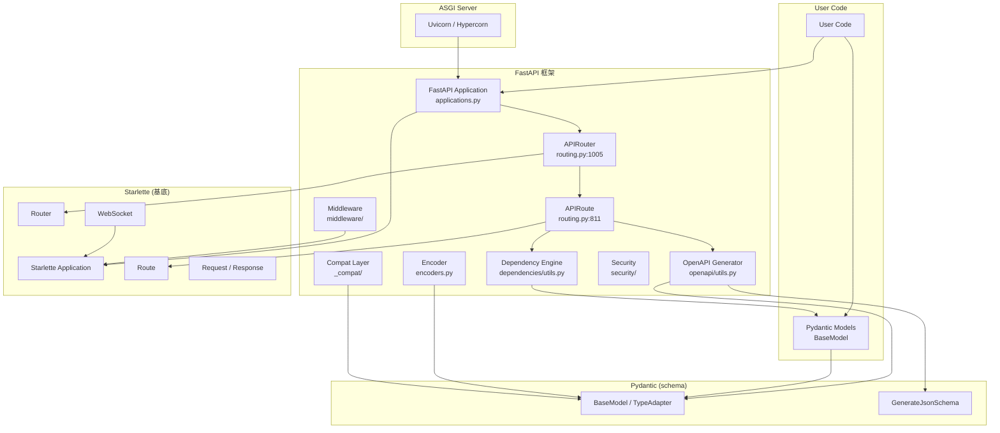
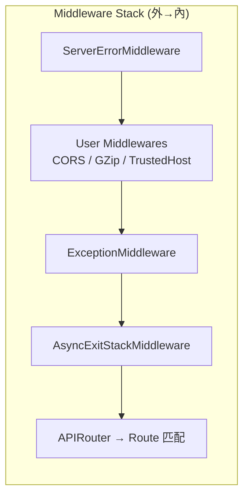

# FastAPI · 架構

## 高層架構圖

**圖意說明**: 上圖展示了 FastAPI 的四層架構。最底層是 ASGI Server (Uvicorn/Hypercorn)，它把 HTTP 請求轉換成 ASGI scope/receive/send triple 傳給 FastAPI 應用。FastAPI 本體繼承自 Starlette，疊加自己的 `APIRouter` 與 `APIRoute`。`APIRoute` 在初始化時進行編譯期的依賴分析（`get_dependant`）和 OpenAPI schema 預計算（`get_openapi_path`）。Pydantic 作為 schema 引擎，被依賴系統、OpenAPI 生成器和 Encoder 三個方向共用。`_compat` 層負責 Pydantic v1/v2 的相容性抽象。

## 分層說明

### FastAPI Application (`applications.py`)

**職責**: 框架入口點。繼承 Starlette 的 `Starlette` 類別，擴充了 OpenAPI metadata、內建文件路由（`/docs`、`/redoc`、`/openapi.json`）、預設 exception handlers 跟 `self.router`。

- 程式碼位置: [`fastapi/applications.py:41`](https://github.com/fastapi/fastapi/blob/0b9863020dd9b3a237e971fa1e10afa0da280c9a/fastapi/applications.py#L41)
- 建構子 (L57-1016) 建立 `self.router` (APIRouter)，註冊預設 handlers，最後呼叫 `self.setup()` 動態加入 `/openapi.json` 等路由

### APIRouter (`routing.py`)

**職責**: 繼承 Starlette 的 `Router`，擴充了 `prefix`、`tags`、`dependencies`、`responses` 等全域路由設定。所有路徑裝飾器 (`app.get`、`app.post`) 最終都委派到 `add_api_route()`。

- 程式碼位置: [`fastapi/routing.py:1005`](https://github.com/fastapi/fastapi/blob/0b9863020dd9b3a237e971fa1e10afa0da280c9a/fastapi/routing.py#L1005)
- `add_api_route()` (L1336) 合併全域與 route-level 的設定後建立 `APIRoute` 實例

### APIRoute (`routing.py`)

**職責**: 每條路由的唯一表示。繼承 Starlette 的 `Route`，擴充了 dependency 分析（編譯期）、response model 推導、streaming type 檢測、OpenAPI schema 預計算。

- 程式碼位置: [`fastapi/routing.py:811`](https://github.com/fastapi/fastapi/blob/0b9863020dd9b3a237e971fa1e10afa0da280c9a/fastapi/routing.py#L811)
- 初始化時 (L948-976) 呼叫 `get_dependant()` 建立依賴樹，`get_flat_dependant()` 拍平，`_should_embed_body_fields()` 判斷 body 格式

### Dependency Engine (`dependencies/utils.py`)

**職責**: FastAPI 最核心的引擎。編譯期 `get_dependant()` 建立依賴樹，執行期 `solve_dependencies()` 遞迴求解。支援巢狀依賴、generator-based lifecycle、scope (request/function)、dependency override。

- 程式碼位置: [`fastapi/dependencies/utils.py`](https://github.com/fastapi/fastapi/blob/0b9863020dd9b3a237e971fa1e10afa0da280c9a/fastapi/dependencies/utils.py)
- `solve_dependencies()` (L598) 是高峰期最重要的函式

### OpenAPI Generator (`openapi/utils.py`)

**職責**: 從路由的 type hints 產生完整的 OpenAPI spec。核心思路是「不做型別→schema 轉換，只做 OpenAPI 結構的組裝」，schema 部分委託給 Pydantic 的 `GenerateJsonSchema`。

- 程式碼位置: [`fastapi/openapi/utils.py`](https://github.com/fastapi/fastapi/blob/0b9863020dd9b3a237e971fa1e10afa0da280c9a/fastapi/openapi/utils.py)
- `get_openapi()` (L514) 編排整個生成流程，`get_openapi_path()` (L260) 處理單一路徑

### Encoder (`encoders.py`)

**職責**: 將任意 Python 物件轉換為 JSON-compatible 的 dict。支援 Pydantic BaseModel、dataclass、Enum、pathlib.Path、UUID、Decimal 等 20+ 種內建類型，並遞迴處理巢狀結構。

- 程式碼位置: [`fastapi/encoders.py`](https://github.com/fastapi/fastapi/blob/0b9863020dd9b3a237e971fa1e10afa0da280c9a/fastapi/encoders.py)
- `jsonable_encoder()` (L129) 是公開 API

## 關鍵設計決策

### 決策 1: 繼承 Starlette 而非單純依賴

- **是什麼**: `FastAPI` 直接繼承 `Starlette`，而非把 Starlette 當作內部組件組合。
- **推測的理由**: 這樣 FastAPI 可以透明地使用 Starlette 的所有功能（middleware stack、lifespan、WebSocket 等），同時覆寫或是擴充關鍵方法（`__call__`、`build_middleware_stack`）。如果只用組合，FastAPI 需要自己實現一層介面抽象去委派 Starlette 的方法，程式碼會更複雜。
- **Trade-off**: FastAPI 的使用者也繼承了 Starlette 的所有 public API，包括一些不該直接用的方法（如 `add_route` 而非 `app.get`）。文件上有標註 deprecated，但無法在編譯期阻止。
- **相關程式碼**: [`fastapi/applications.py:41`](https://github.com/fastapi/fastapi/blob/0b9863020dd9b3a237e971fa1e10afa0da280c9a/fastapi/applications.py#L41)

### 決策 2: 編譯期依賴分析 vs Runtime scan

- **是什麼**: `get_dependant()` 在路由註冊時就解析完整依賴樹，而非每次請求時動態掃描參數型別。
- **推測的理由**: 編譯期分析把大量計算（參數型別反射、ForwardRef 解析、Depends 遞迴展開）移到啟動階段，讓每個請求的 `solve_dependencies()` 只需沿著已建立的樹結構求解。對高吞吐場景（一個 FastAPI 實例可能處理上萬 QPS），這種設計大幅降低每個請求的 overhead。
- **Trade-off**: 啟動時間變長。如果一個應用的路由非常多（數百條），首次啟動會因依賴分析而明顯較慢。此外，編譯期分析的依賴結構是靜態的——無法在請求層級動態改變依賴的選擇（某些框架支援的 runtime conditional injection）。
- **相關程式碼**: [`fastapi/routing.py:948-965`](https://github.com/fastapi/fastapi/blob/0b9863020dd9b3a237e971fa1e10afa0da280c9a/fastapi/routing.py#L948-L965)

### 決策 3: 雙層 AsyncExitStack 管理 Generator Dependency

- **是什麼**: 在 `request_response()` 中建立內外兩層 `AsyncExitStack`（`fastapi_inner_astack` 與 `fastapi_function_astack`），generator dependency 根據 scope 決定進入哪層。
- **推測的理由**: request-scope 的 generator（例如資料庫 session）需要在整個請求生命週期結束後才 cleanup，包含 response 的 streaming。function-scope 的 generator（例如臨時檔案）只需要在 handler 執行完就 cleanup。用單層 stack 無法區分這兩個時機。
- **Trade-off**: 多了一層 `AsyncExitStack` 的管理成本。對沒有 generator dependency 的路由，這層是純 overhead。但這影響極小，因為 AsyncExitStack 在空的時候是 O(1) 的。
- **相關程式碼**: [`fastapi/routing.py:97-136`](https://github.com/fastapi/fastapi/blob/0b9863020dd9b3a237e971fa1e10afa0da280c9a/fastapi/routing.py#L97-L136)

### 決策 4: OpenAPI 生成委託 Pydantic，而非自訂 schema 系統

- **是什麼**: FastAPI 不做自己的 Python type → JSON Schema 轉換。它把 type hints 包裝成 Pydantic 的 `ModelField`，然後呼叫 Pydantic 的 `GenerateJsonSchema.generate_definitions()` 獲得 schema。
- **推測的理由**: 避免重複實現複雜的 type→schema 映射（Union、Optional、Annotated、ForwardRef、recursive models 等）。Pydantic 已經投入大量工程資源解決這些問題，FastAPI 直接利用。
- **Trade-off**: 強依賴 Pydantic 的 schema 行為。當 Pydantic 改版（如 v1→v2 的 JSON Schema 生成方式大幅變化），FastAPI 需要透過 `_compat` 層適應。對使用者來說，Pydantic 的任何 breaking change 都可能影響 API doc 的輸出格式。
- **相關程式碼**: [`fastapi/_compat/v2.py`](https://github.com/fastapi/fastapi/blob/0b9863020dd9b3a237e971fa1e10afa0da280c9a/fastapi/_compat/v2.py)

## Middleware Stack 建置

建置程式碼在 [`applications.py:1018-1066`](https://github.com/fastapi/fastapi/blob/0b9863020dd9b3a237e971fa1e10afa0da280c9a/fastapi/applications.py#L1018-L1066)。Middleware 使用 `reversed()` 包裝，因為列表是從外層到內層的順序，但 Python 的 decorator-style layer 需要先包內層。

## 路由 API 概覽

| 方法 | 裝飾器 | 用途 | 核心實作 |
|---|---|---|---|
| GET | `@app.get()` | 讀取資源 | `routing.py:1831` |
| POST | `@app.post()` | 建立資源 | `routing.py:1876` |
| PUT | `@app.put()` | 更新資源 | `routing.py:1921` |
| DELETE | `@app.delete()` | 刪除資源 | `routing.py:1966` |
| PATCH | `@app.patch()` | 部分更新 | `routing.py:2011` |
| WebSocket | `@app.websocket()` | WebSocket 連線 | `routing.py:2056` |

所有路徑裝飾器都集中在 [`routing.py:1831-2100+`](https://github.com/fastapi/fastapi/blob/0b9863020dd9b3a237e971fa1e10afa0da280c9a/fastapi/routing.py#L1831)，最終全部委派到 `APIRouter.add_api_route()`。

## 外部依賴

| 依賴 | 用途 | 抽象方式 |
|---|---|---|
| Starlette | ASGI 基底框架 | 直接繼承 (`FastAPI(Starlette)`) |
| Pydantic | Schema validation / JSON Schema | 透過 `_compat/` 層抽象 |
| typing-extensions | 型別相容性 | 直接 import |
| annotated-doc | Python 3.14+ Doc 相容 | 直接 import |

## 非同步處理

FastAPI 原生支援 async endpoints。當 endpoint 是 sync function 時，透過 `run_in_threadpool()` (Starlette) 在 thread pool 執行，避免阻塞 event loop。Background tasks 使用 Starlette 的 `BackgroundTasks`。

## 可觀測性

- **Metrics**: 無內建（可透過 Starlette middleware 加入 Prometheus）
- **Tracing**: 無內建（可透過 ASGI middleware 加入 OpenTelemetry）
- **Health check**: 需自行實作 endpoint
- **Logging**: [`fastapi/logger.py`](https://github.com/fastapi/fastapi/blob/0b9863020dd9b3a237e971fa1e10afa0da280c9a/fastapi/logger.py) 僅提供一個 `logging.getLogger(__name__)`，不使用也可

## 測試策略

- **測試框架**: pytest + httpx (TestClient)
- **覆蓋層次**: `tests/` 下以 integration test 為主，大量使用 TestClient（Starlette 提供，FastAPI re-export）
- **特別之處**: [`testclient.py`](https://github.com/fastapi/fastapi/blob/0b9863020dd9b3a237e971fa1e10afa0da280c9a/fastapi/testclient.py) 僅是 Starlette TestClient 的 re-export，非自訂實作
