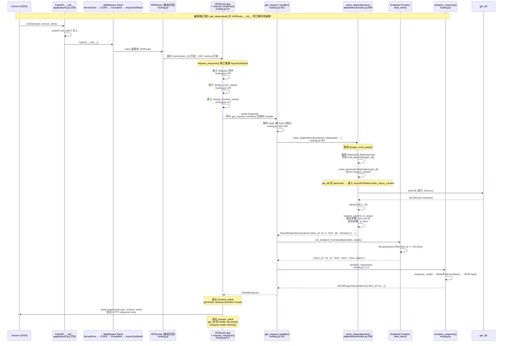

# FastAPI · 程式碼追蹤

## 追蹤的場景

**場景**: 一個有依賴注入的 GET 請求 — `GET /items/42?q=test`

**對應的使用者程式碼**:

```python
from fastapi import FastAPI, Depends, Query
from sqlalchemy.orm import Session

app = FastAPI()

def get_db():
    db = Session()
    try:
        yield db
    finally:
        db.close()

@app.get("/items/{item_id}")
def read_item(
    item_id: int,
    q: str | None = Query(default=None, max_length=50),
    db: Session = Depends(get_db),
):
    item = db.query(Item).filter(Item.id == item_id).first()
    return {"item_id": item_id, "q": q, "item": item}
```

## 流程圖



**圖意說明**: 上圖追踪了一個 GET /items/42?q=test 請求的完整生命週期。編譯期時，`APIRoute.__init__()` 已經透過 `get_dependant()` 解析了 `read_item` 的依賴樹 — 包含一個 generator dependency (`get_db`) 和兩個參數 (`item_id`, `q`)。執行期時，雙層 `AsyncExitStack` 確保 generator dependency 在正確時機 cleanup：`get_db` 是 request scope，所以 cleanup 在 response 發送完成後才執行（`db.close()`）。

## 逐步追蹤

### Step 1: ASGI 進入 + Root Path

請求首先由 Uvicorn 以 ASGI protocol 送到 `FastAPI.__call__()`。FastAPI 在這裡做一件小事但重要的事：

```python
# applications.py:1156-1159
async def __call__(self, scope, receive, send):
    if self.root_path:
        scope["root_path"] = self.root_path
    await super().__call__(scope, receive, send)
```

注入 `root_path` 讓後續路由生成 `/docs` 等連結時能正確處理 reverse proxy 前綴。

### Step 2: Middleware Stack

Middleware 的建置程式碼在 [`applications.py:1018-1066`](https://github.com/fastapi/fastapi/blob/0b9863020dd9b3a237e971fa1e10afa0da280c9a/fastapi/applications.py#L1018-L1066)。堆疊順序：

1. **ServerErrorMiddleware** — 最外層，catch 500 錯誤回傳 500 Internal Server Error
2. **CORS / GZip / TrustedHost / WSGI** — 使用者註冊的 middleware（若有）
3. **ExceptionMiddleware** — catch HTTPException 與自訂 exception handler
4. **AsyncExitStackMiddleware** — FastAPI 專用，close 上傳檔案等資源
5. **APIRouter** — 最內層，實際路由匹配

### Step 3: 路由匹配

`APIRouter`（Starlette 的 `Router`）比對 `GET /items/42` 到 `GET /items/{item_id}` 這個 pattern。匹配成功後，找到對應的 `APIRoute` 實例，執行 `APIRoute.app` — 即 `request_response()` 回傳的 ASGI app。

### Step 4: request_response()— 雙層 AsyncExitStack

這是 FastAPI 最精巧的設計之一：

```python
# routing.py:97-136 (簡化)
async def app(scope, receive, send):
    request = Request(scope, receive, send)

    async def app(scope, receive, send):
        async with AsyncExitStack() as request_stack:      # 外層: request scope
            scope["fastapi_inner_astack"] = request_stack
            async with AsyncExitStack() as function_stack: # 內層: function scope
                scope["fastapi_function_astack"] = function_stack
                response = await f(request)                # 執行 handler
            await response(scope, receive, send)           # 發送 response
        # 外層 stack exit: 此處執行 request-scope generator cleanup

    await wrap_app_handling_exceptions(app, request)(scope, receive, send)
```

**雙層 stack 的意義**:
- `function_stack` — generator dependency 若 `scope="function"`，cleanup 在 response 產生後、發送前執行
- `request_stack` — generator dependency 若 `scope="request"`（預設），cleanup 在 response**發送完成後**才執行。這對 streaming response（如 SSE）至關重要 — response body 還在 streaming 時，資料庫連線不能被關閉

### Step 5: get_request_handler() — 請求參數解析

`get_request_handler()` ([`routing.py:351`](https://github.com/fastapi/fastapi/blob/0b9863020dd9b3a237e971fa1e10afa0da280c9a/fastapi/routing.py#L351)) 回傳真正的 handler function。

**Body parsing** (L402-449): 檢查 Content-Type 決定是否讀取 body。若是 `GET` 請求，略過 body 處理。若是 `POST/PUT`，根據 Content-Type 走 `request.json()` 或 `request.form()`。

### Step 6: solve_dependencies() — 依賴求解核心

[`dependencies/utils.py:598`](https://github.com/fastapi/fastapi/blob/0b9863020dd9b3a237e971fa1e10afa0da280c9a/fastapi/dependencies/utils.py#L598) 是整個請求最關鍵的函式：

1. **遍歷子依賴** (L628-684): 對 `dependant.dependencies` 中的每個節點：
   - 檢查 `dependency_overrides_provider`（測試用 mock）
   - 遞迴呼叫 `solve_dependencies()`
   - 檢查 cache（`use_cache=True` 的相同 callable 只執行一次）
   - Generator dependency 透過 `_solve_generator()` 進入 `AsyncExitStack.enter_async_context()`（L666-676）
   - 結果寫入 `values[sub_dependant.name]`

2. **解析路徑/查詢/Header/Cookie 參數** (L685-701): 透過 `request_params_to_args()` 從 request 提取並驗證

3. **解析 Body** (L702-712): `request_body_to_args()` 處理 JSON/FormData/bytes

4. **注入特殊物件** (L713-728): Request、WebSocket、BackgroundTasks 等

5. **回傳 `SolvedDependency`**: 包含 `values`、`errors`、`background_tasks`、`response`、`dependency_cache`

**值得注意**: `get_dependant()` 在路由註冊時已執行 — 依賴樹已經建立好，`solve_dependencies()` 只需沿樹求解。這是典型的 compile-time / runtime 分離設計。

### Step 7: run_endpoint_function()

使用 `run_in_threadpool()` 執行 sync endpoint（或直接 await async endpoint），傳入已解析的 values。

### Step 8: serialize_response()

```python
# routing.py:713 (簡化)
response = serialize_response(
    field=route.response_field,    # 從 response_model 建立的 ModelField
    response_content=result,       # endpoint 回傳值
    ...
)
```

`serialize_response()` 使用 Pydantic 的 `ModelField.serialize()` 將 endpoint 回傳值轉成 JSON bytes，包裝進 `JSONResponse`（或設定的 `response_class`）。

若 endpoint 回傳 streaming response（`StreamingResponse`、`EventSourceResponse`），則跳過 serialization，直接傳遞。

## 想學更多時，在哪裡下中斷點

- 想看請求剛進入框架: [`applications.py:1156`](https://github.com/fastapi/fastapi/blob/0b9863020dd9b3a237e971fa1e10afa0da280c9a/fastapi/applications.py#L1156)
- 想看依賴樹建立（編譯期）: [`routing.py:948`](https://github.com/fastapi/fastapi/blob/0b9863020dd9b3a237e971fa1e10afa0da280c9a/fastapi/routing.py#L948)
- 想看依賴求解核心: [`dependencies/utils.py:598`](https://github.com/fastapi/fastapi/blob/0b9863020dd9b3a237e971fa1e10afa0da280c9a/fastapi/dependencies/utils.py#L598)
- 想看 generator dependency 注入: [`dependencies/utils.py:666`](https://github.com/fastapi/fastapi/blob/0b9863020dd9b3a237e971fa1e10afa0da280c9a/fastapi/dependencies/utils.py#L666)
- 想看 response serialization: [`routing.py:713`](https://github.com/fastapi/fastapi/blob/0b9863020dd9b3a237e971fa1e10afa0da280c9a/fastapi/routing.py#L713)

## 沒追蹤到但值得留意的分支

- **錯誤路徑**: 若 `solve_dependencies()` 回傳 errors（validation 失敗），走 `RequestValidationError` → 回傳 422。程式碼在 [`routing.py:719-723`](https://github.com/fastapi/fastapi/blob/0b9863020dd9b3a237e971fa1e10afa0da280c9a/fastapi/routing.py#L719-L723)
- **Streaming 路徑**: 若 endpoint 回傳 async generator 或 `StreamingResponse`，走 `StreamingResponse` 而非 `serialize_response()`
- **Lifespan**: 應用啟動/關閉時，ASGI server 會發送 `lifespan` event — FastAPI/APIRouter 透過 `_DefaultLifespan` 向後相容 `on_startup`/`on_shutdown`
- **Dependency override**: 測試時可透過 `app.dependency_overrides[get_db] = mock_get_db` 完全替代依賴樹節點
