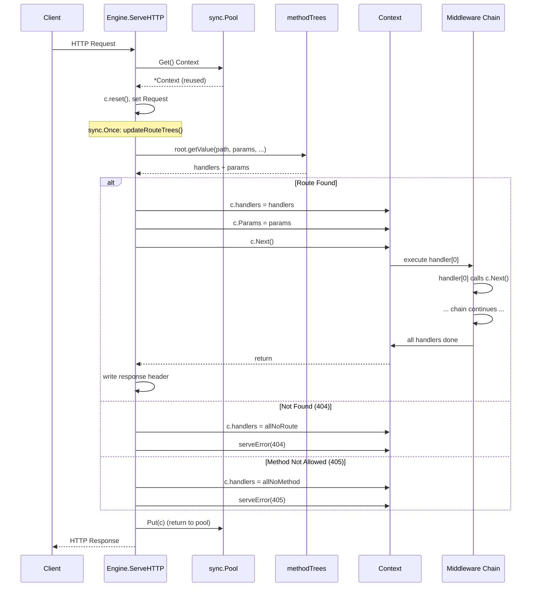

# Gin · 架構

## 高層架構圖

```mermaid
flowchart TB
    subgraph "Public API"
        Engine["Engine<br/>gin.go"]
        RouterGroup["RouterGroup<br/>routergroup.go"]
    end

    subgraph "Request Lifecycle"
        Context["Context<br/>context.go"]
        Handlers["HandlersChain<br/>(middleware + handler)"]
    end

    subgraph "Routing"
        Trees["methodTrees<br/>(radix trees)<br/>tree.go"]
    end

    subgraph "Data Binding"
        Binding["Binding / BindingBody / BindingUri<br/>binding/binding.go"]
        Validator["StructValidator (go-playground/validator)<br/>binding/default_validator.go"]
    end

    subgraph "Response Rendering"
        Render["Render interface<br/>render/render.go"]
        JSON["JSON variants (6)<br/>render/json.go"]
        Other["XML / YAML / ProtoBuf / HTML / ...<br/>render/*.go"]
    end

    subgraph "Middleware (built-in)"
        Logger["Logger<br/>logger.go"]
        Recovery["Recovery<br/>recovery.go"]
    end

    %% Relationships
    Engine --> RouterGroup
    RouterGroup --> Trees
    Engine --> Context
    Context -- "handlers" --> Handlers
    Context -- "Bind*()" --> Binding
    Binding --> Validator
    Context -- "Render()" --> Render
    Render --> JSON
    Render --> Other
    Handlers -- "Logger()\nRecovery()" --> Logger
    Handlers -- "Recovery()" --> Recovery

    %% Notes
    note["Engine embeds RouterGroup<br/>= inherits GET/POST/Group/Use"]

    style note fill:#1e293b,stroke:#94a3b8,stroke-dasharray: 4 4
```

### 圖意說明

這張圖展示 Gin 的六個主要子系統及其關係。最核心的設計是 **Engine 嵌入了 RouterGroup**（Go 的 embedding 機制），這讓 `engine.GET()`、`engine.POST()` 等方法直接可用，不需經過 `engine.RouterGroup.GET()`。**Routing** 子系統使用每個 HTTP method 專屬的 radix tree（`methodTrees` 型別），這是 Gin 效能的關鍵。**Context** 是請求生命期的中心：它持有 middleware chain，提供 `Bind*()` 和 `Render()` 方法分別委派給 binding 與 render 子系統。**Middleware（Logger、Recovery）** 是內建的 HandlerFunc，可被使用者移除或取代。

## 請求處理流程圖

### 圖意說明

這張 sequence diagram 追蹤一個 HTTP 請求從 `ServeHTTP` 進入到回應離開的完整生命期。關鍵步驟：(1) 從 `sync.Pool` 取 `*Context`，避免每次請求都分配新物件；(2) `updateRouteTrees()` 透過 `sync.Once` 確保只執行一次——這是 lazy initialization 模式，路由樹在註冊時就建好但 escape 字元替換延遲到第一個請求才做；(3) `getValue()` 在對應 HTTP method 的 radix tree 中搜尋，回傳 handlers 和 params（或 TSR 標記）；(4) 找到路由後呼叫 `c.Next()` 啟動 middleware chain，找不到則走 404/405 handler。請求結束後將 `*Context` 放回 pool。

## 分層說明

### Engine — 框架入口

職責: 持有全域配置、路由樹、context pool，實作 `http.Handler` 介面
程式碼位置: [`gin.go:92-189`](https://github.com/gin-gonic/gin/blob/5f4f9643258dc2a65e684b63f12c8d543c936c67/gin.go#L92)
與相鄰層的契約: 實作 `ServeHTTP(ResponseWriter, *Request)`，可作為 `http.ListenAndServe` 的第二參數

### RouterGroup — 路由註冊

職責: 管理路由與 middleware 的註冊、路徑群組的巢狀組織
程式碼位置: [`routergroup.go:55-60`](https://github.com/gin-gonic/gin/blob/5f4f9643258dc2a65e684b63f12c8d543c936c67/routergroup.go#L55)
與相鄰層的契約: 每個 RouterGroup 持有 `engine *Engine` 指標和 `Handlers HandlersChain`，路由註冊時呼叫 `engine.addRoute()`

### Context — 請求上下文

職責: 承載單次請求的所有狀態：參數、handler chain、綁定/渲染方法、鍵值儲存
程式碼位置: [`context.go:61-97`](https://github.com/gin-gonic/gin/blob/5f4f9643258dc2a65e684b63f12c8d543c936c67/context.go#L61)
與相鄰層的契約: 由 engine pool 管理生命期；handler 透過 `c.Next()` 觸發 chain 執行；`c.handlers` 由 `handleHTTPRequest` 設定

### Radix Tree — 路徑匹配

職責: 對應 HTTP method + URL path 到 handler chain，提取 path 參數
程式碼位置: [`tree.go:99-108`](https://github.com/gin-gonic/gin/blob/5f4f9643258dc2a65e684b63f12c8d543c936c67/tree.go#L99)
與相鄰層的契約: Engine 持有 `methodTrees`（每個 HTTP method 一顆樹）；`getValue()` 回傳 `nodeValue{handlers, params, tsr, fullPath}`

### Binding — 請求資料綁定

職責: 根據 Content-Type 將請求主體/表單/查詢/URI 參數反序列化到 Go struct
程式碼位置: [`binding/binding.go:32-49`](https://github.com/gin-gonic/gin/blob/5f4f9643258dc2a65e684b63f12c8d543c936c67/binding/binding.go#L32)
介面: `Binding`（`Bind()`）、`BindingBody`（附加 `BindBody()`）、`BindingUri`（`BindUri()`）

### Render — 回應渲染

職責: 將資料序列化為指定格式寫入 `http.ResponseWriter`
程式碼位置: [`render/render.go:10-15`](https://github.com/gin-gonic/gin/blob/5f4f9643258dc2a65e684b63f12c8d543c936c67/render/render.go#L10)
介面: `Render`（`Render()` + `WriteContentType()`）

## 關鍵設計決策

### 決策 1: Engine 嵌入 RouterGroup 而非組合

- **是什麼**: `Engine` 直接嵌入 `RouterGroup`（`type Engine struct { RouterGroup; ... }`），而非以欄位持有。
- **推測的理由**: 讓 Engine 直接繼承所有 IRouter 方法（GET, POST, Group, Use），創造統一的 API 表面——使用者只需操作 `engine` 一個變數，不需知道內部分層。
- **Trade-off**: 優點是 API 簡潔；缺點是 Engine 和 RouterGroup 的角色邊界模糊——`Engine` 既是設定持有者又是路由註冊器。Go embedding 也讓自訂組件（如自訂 Engine）無法覆寫 RouterGroup 方法。
- **相關程式碼**: [`gin.go:93`](https://github.com/gin-gonic/gin/blob/5f4f9643258dc2a65e684b63f12c8d543c936c67/gin.go#L93)

### 決策 2: Middleware Chain 在註冊期扁平化

- **是什麼**: 每個路由最終的 `HandlersChain` 是所有 middleware + handler 拍平後的 slice。執行時 `c.Next()` 就是簡單的 for loop。
- **推測的理由**: 效能優先——不用每層包裝 `http.Handler`，沒有遞迴 call stack，沒有 per-middleware 的 interface dispatch。
- **Trade-off**: 極快執行（單一 for loop），但 middleware 無法在執行期「動態跳過」某些 middleware（因為已經扁平化了）。也無法在 middleware 間傳遞自訂資料（除了 `c.Set()/c.Get()`）。記憶體開銷：每個路由都複製一份完整 chain，大量路由時顯著。
- **相關程式碼**: [`gin.go:715-725`](https://github.com/gin-gonic/gin/blob/5f4f9643258dc2a65e684b63f12c8d543c936c67/gin.go#L715), [`routergroup.go:241-248`](https://github.com/gin-gonic/gin/blob/5f4f9643258dc2a65e684b63f12c8d543c936c67/routergroup.go#L241)

### 決策 3: 自訂 Radix Tree 而非 `net/http` ServeMux

- **是什麼**: Gin 自行實作了壓縮 radix tree（Patricia trie）作為路由引擎，每個 HTTP method 一顆樹。
- **推測的理由**: 2014 年 Go stdlib 的 `ServeMux` 只支援精確路徑 + 檔名前綴匹配，遠不敷框架需求。Gin 選擇自建而非依賴第三方（如 `gorilla/mux` 的正則 map），因為後者在大規模路由時效能不穩定。
- **Trade-off**: 極快的 O(k) 匹配（k = path 長度），支援 `:param` 和 `*catchAll`，但**不支援 regex 約束**（如 `gorilla/mux` 的 `/users/{id:[0-9]+}`）。路由無法在執行期修改（非 thread-safe for insertion）。記憶體佔用較高（壓縮節點 + 優先級排序）。
- **相關程式碼**: [`tree.go:133-249`](https://github.com/gin-gonic/gin/blob/5f4f9643258dc2a65e684b63f12c8d543c936c67/tree.go#L133), [`gin.go:184`](https://github.com/gin-gonic/gin/blob/5f4f9643258dc2a65e684b63f12c8d543c936c67/gin.go#L184)

### 決策 4: Context sync.Pool 重用以減少 GC

- **是什麼**: `*gin.Context` 透過 `sync.Pool` 管理，請求結束後 `Put()` 回 pool，新請求 `Get()` 取出再使用。
- **推測的理由**: 減少 heap allocation，降低 GC 壓力。`Context` 內含多個 slice（params、handlers、errors）、map（Keys）、struct（writermem），每次都 `new` 會很昂貴。
- **Trade-off**: 省 allocation，但需要 `reset()` 清理狀態避免跨請求資料殘留。`maxParams`/`maxSections` 的動態調整跟 pool 的初始化時機存在微妙互動（`pool.New` 的 closure 在 `New()` 時就建立了，但 `maxParams` 直到路由註冊後才確定）。
- **相關程式碼**: [`gin.go:183`](https://github.com/gin-gonic/gin/blob/5f4f9643258dc2a65e684b63f12c8d543c936c67/gin.go#L183), [`gin.go:229-231`](https://github.com/gin-gonic/gin/blob/5f4f9643258dc2a65e684b63f12c8d543c936c67/gin.go#L229), [`gin.go:662-675`](https://github.com/gin-gonic/gin/blob/5f4f9643258dc2a65e684b63f12c8d543c936c67/gin.go#L662)

### 決策 5: Binding 介面分割為三組而非單一萬用介面

- **是什麼**: 請求綁定拆成三個介面——`Binding`（主要）、`BindingBody`（附加 `BindBody()` 支援預讀位元組）、`BindingUri`（完全獨立的 URI 參數綁定）。
- **推測的理由**: Content-Type-based 綁定（JSON, XML, Form）跟 URI 參數綁定從根本上不同——前者讀 `req.Body`，後者讀 `map[string][]string`。拆開讓 URI 綁定的實作不需要虛設 `Bind(*http.Request, any)` 方法。
- **Trade-off**: 更精確的型別安全，但呼叫端需要知道哪種 binder 該用哪個介面。`BindingUri` 不嵌入 `Binding`，導致 `BindingUri` 無法被 `Default()` 工廠函式回傳（無法統一處理）。
- **相關程式碼**: [`binding/binding.go:32-49`](https://github.com/gin-gonic/gin/blob/5f4f9643258dc2a65e684b63f12c8d543c936c67/binding/binding.go#L32)

## 外部依賴

| 依賴 | 用途 | 抽象方式 |
|------|------|----------|
| go-playground/validator/v10 | struct tag 驗證 | `StructValidator` 介面（`binding/default_validator.go`） |
| encoding/json (可換) | JSON 編解碼 | `codec/json` 抽象層（支援 json-iterator, sonic） |
| goccy/go-yaml | YAML 編解碼 | 直接使用（無抽象層） |
| google.golang.org/protobuf | ProtoBuf 編解碼 | 直接使用 |
| encoding/xml (stdlib) | XML 編解碼 | 直接使用 |

## 非同步處理

無。Gin 的 handler 全部同步執行。對長時間連線（SSE、WebSocket）使用者需自行開 goroutine（透過 `c.Copy()` 確保 thread-safe）。這個設計選擇反映 Gin 誕生於 Go 1.4 時期（2014），那時 Go 的非同步模式還沒有最佳實踐。

## 可觀測性

- **Metrics**: 無內建。Logger middleware 可輸出 latency、status code，但由使用者自行整合 Prometheus client。
- **Tracing**: 無內建。可透過自訂 middleware 整合 OpenTelemetry。
- **Health check**: 無內建端點。使用者自訂 `GET /health` handler。

## 測試策略

- **測試框架**: Go 標準 `testing` 套件
- **覆蓋層次**: 以 unit test 為主（`gin_test.go`, `context_test.go`, `tree_test.go` 等），少數 integration test（`gin_integration_test.go`）
- **Mock 策略**: 無 mock framework，直接用 `httptest.NewRecorder()` + `httptest.NewRequest()` 模擬 HTTP 請求
- **特別之處**: `tree_test.go` 的內容極詳盡（涵蓋 param 衝突、TSR、case-insensitive、catchAll 邊界），反映路由引擎是專案最敏感的核心
