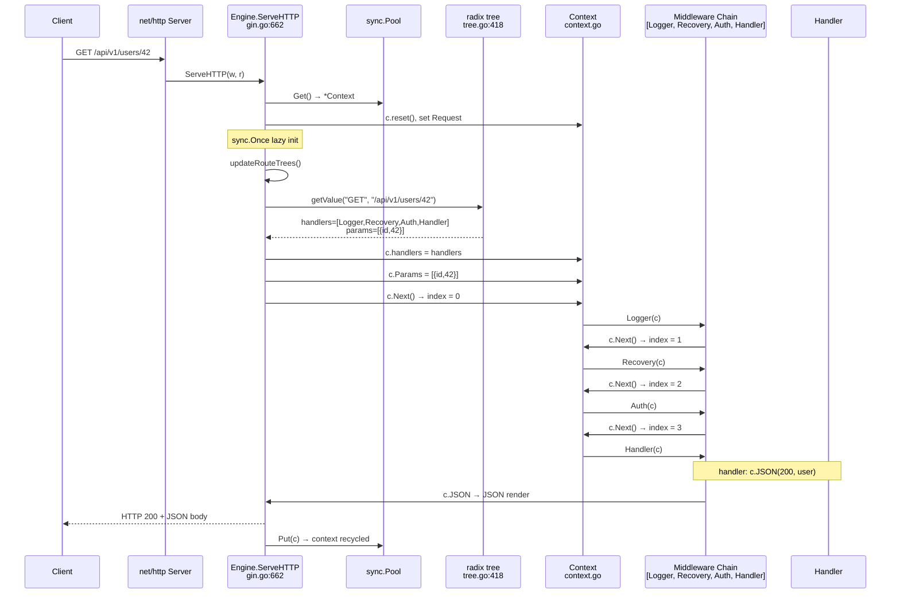

# Gin · 程式碼追蹤

## 追蹤的場景

**場景**: 一個 `GET /api/v1/users/42` 請求，使用 Gin 處理，透過 middleware chain（Logger → Recovery → Auth）後由 handler 回應 JSON。

**對應的 HTTP 請求**:
```http
GET /api/v1/users/42 HTTP/1.1
Host: example.com
Authorization: Bearer token123
Accept: application/json
```

## 流程圖



### 圖意說明

此 sequence diagram 追蹤 `GET /api/v1/users/42` 的完整生命期。橘色 Notes 標出三個關鍵步驟：`sync.Pool` 的 context 重用（省 allocation）、`sync.Once` 的 lazy route tree 初始化（延遲殖民字元替換到第一個請求）、以及 middleware chain 的 `c.Next()` 調用模式。注意 Logger → Recovery → Auth → Handler 的執行順序：每個 middleware 呼叫 `c.Next()` 把控制權交給 chain 中下一個 handler，最後 handler（index=3）執行完返回，chain unwinds，Logger 有機會在返回後記錄 latency。

## 逐步追蹤

### Step 1: 路由分派

請求到達 [`Engine.ServeHTTP()`](https://github.com/gin-gonic/gin/blob/5f4f9643258dc2a65e684b63f12c8d543c936c67/gin.go#L662)，從 `sync.Pool` 取出 `*Context`，重置狀態，設定 `Request` 和 `ResponseWriter`。

第一次請求觸發 [`updateRouteTrees()`](https://github.com/gin-gonic/gin/blob/5f4f9643258dc2a65e684b63f12c8d543c936c67/gin.go#L663-L665)，透過 `sync.Once` 確保只執行一次。這個步驟將 tree 中所有 escape 後的冒號（`\:`）還原為字面冒號。

呼叫 [`handleHTTPRequest()`](https://github.com/gin-gonic/gin/blob/5f4f9643258dc2a65e684b63f12c8d543c936c67/gin.go#L690)，決定使用的 path（`UseRawPath` / `UnescapePathValues` 等配置），然後遍歷 `engine.trees` 找到對應 GET method 的 radix tree。

**值得注意的地方**:
- `methodTrees` 是 `[]methodTree`，線性搜尋比對 method。因為 HTTP method 數量固定（~9 個），線性搜尋 vs map 差異可忽略。
- path 的選擇邏輯集中在 [`lines 694-710`](https://github.com/gin-gonic/gin/blob/5f4f9643258dc2a65e684b63f12c8d543c936c67/gin.go#L694-L710)，處理 `UseRawPath`、`UnescapePathValues`、`RemoveExtraSlash` 的排列組合。

### Step 2: Radix Tree 匹配

呼叫 [`root.getValue("/api/v1/users/42", c.params, c.skippedNodes, unescape)`](https://github.com/gin-gonic/gin/blob/5f4f9643258dc2a65e684b63f12c8d543c936c67/tree.go#L418)。

假設路由已註冊: `v1.GET("/users/:id", handler)`，則 tree 結構大致為:

```
root ""
└── static "api/"
    └── static "v1/"
        └── static "users/"
            └── param ":id" (handlers = [Logger, Recovery, Auth, Handler])
```

匹配過程:
1. 逐段消耗 path：`/api/` → `/v1/` → `/users/` → `/42`
2. 當進入 `:id` 節點時，掃到 `/42` 後方的 end-of-string，將 `42` 提取為 `id` 參數值
3. 回傳 handlers chain 和 `params=[{id, 42}]`

**靜態 path 優先**：在遍歷中，若節點同時有 static child 和 wildcard child，Gin 先嘗試 static child；若 static 分支在中途失敗，透過 `skippedNodes` stack 回溯到 wildcard 分支。這個機制確保 `/users/search`（靜態）不會被 `/users/:id`（param）意外攔截。

**值得注意的地方**:
- 節點優先級（`priority`）會依註冊順序和命中頻率動態排序 [`incrementChildPrio()`](https://github.com/gin-gonic/gin/blob/5f4f9643258dc2a65e684b63f12c8d543c936c67/tree.go#L111-L131)
- 不支援 regex 路由參數（如 `/users/{id:[0-9]+}`）——這是刻意簡化，以換取 O(k) 匹配時間

### Step 3: Handler Chain 設定

匹配成功後，[`handleHTTPRequest()`](https://github.com/gin-gonic/gin/blob/5f4f9643258dc2a65e684b63f12c8d543c936c67/gin.go#L718-L724) 將 handlers 和 params 寫入 `*Context`，呼叫 `c.Next()` 啟動 chain。

```go
c.handlers = value.handlers
c.fullPath = value.fullPath
c.Next()          // <-- starts middleware execution
c.writermem.WriteHeaderNow()
return
```

注意 `c.Next()` 是同步的——它會完整執行整個 chain 直到所有 handler 返回，才繼續執行 `WriteHeaderNow()`。

### Step 4: Middleware Chain

執行順序（以 `gin.Default()` 為例 + 自訂 Auth middleware）:

1. **Logger** ([`logger.go:245`](https://github.com/gin-gonic/gin/blob/5f4f9643258dc2a65e684b63f12c8d543c936c67/logger.go#L245)):
   - 記錄開始時間
   - 呼叫 `c.Next()`
   - 在 `c.Next()` 返回後計算 latency、讀取 status code、輸出 log line（色彩化格式）
   - Logger 接收到最終 status code（由 handler 和 Auth 共同決定）

2. **Recovery** ([`recovery.go:53`](https://github.com/gin-gonic/gin/blob/5f4f9643258dc2a65e684b63f12c8d543c936c67/recovery.go#L53)):
   - `defer func() { recover(); ... }()` — 攔截後續 handler 的 panic
   - 呼叫 `c.Next()`（若 Auth 或 handler panic，在此被 recover）
   - 若為 `syscall.EPIPE` 或 `syscall.ECONNRESET`，只簡短記錄後 abort（不寫 response）
   - 正常 panic：寫 stack trace 到 log，回 500

3. **Auth** (自訂):
   - 驗證 Authorization header/cookie
   - 若無效: `c.AbortWithStatusJSON(401, gin.H{"error": "unauthorized"})`
   - 若有效: `c.Set("userID", userID)`, 呼叫 `c.Next()`

4. **Handler** (`GET /api/v1/users/:id`):
   - 取得 `c.Param("id")` → `"42"`
   - 查詢資料庫/模擬資料
   - `c.JSON(200, gin.H{"id": 42, "name": "Alice"})` — 觸發 render

**設計觀察**: Gin 的 middleware 執行模式是「before + c.Next() + after」。這與 Express.js/Node.js 的 `next()` 模式一致。`c.Abort()` 只是把 `c.index` 設為大於 chain length 的值，讓 `c.Next()` 的 loop 立刻結束——但它不會停止當前的 middleware 的執行。middleware 在調用 `c.Abort()` 後仍需 `return` 才能真的停止。

### Step 5: JSON Render

[`c.JSON(200, gin.H{"id": 42, "name": "Alice"})`](https://github.com/gin-gonic/gin/blob/5f4f9643258dc2a65e684b63f12c8d543c936c67/context.go#L1205-L1207) 內部:

1. `c.Status(200)` — 設定 HTTP status code
2. 建立 `render.JSON{Data: gin.H{...}}` 結構
3. 呼叫 `c.Render(200, render.JSON{...})` 內部: 
   - 設定 Content-Type: `application/json; charset=utf-8`
   - 透過 `codec/json` 抽象層 marshal data
   - 寫入 `c.Writer`

`codec/json` 抽象層 ([`codec/json/json.go`](https://github.com/gin-gonic/gin/blob/5f4f9643258dc2a65e684b63f12c8d543c936c67/codec/json/json.go)) 支援多個 backend：預設 `encoding/json`、`github.com/json-iterator/go`、`github.com/bytedance/sonic`。編譯時透過 build tag 決定。

**設計觀察**: `render.JSON` 有 6 個變體（JSON, IndentedJSON, SecureJSON, JsonpJSON, AsciiJSON, PureJSON）。每個獨立的 struct 避免了「一個 renderer 加一堆 boolean option」的反模式。

### Step 6: Chain Unwind 與 Response

Handler 返回後：
1. `c.Next()` 的 for loop 終止（index >= len(handlers)）
2. 回到 Recovery 的 deferred recover（無 panic → 略過）
3. 回到 Logger 的 `c.Next()` 返回處
4. Logger 記錄 `[GIN] 200 | 4.2ms | 192.168.1.1 | GET /api/v1/users/42`
5. 回到 [`handleHTTPRequest()`](https://github.com/gin-gonic/gin/blob/5f4f9643258dc2a65e684b63f12c8d543c936c67/gin.go#L721-L724)
6. 執行 `c.writermem.WriteHeaderNow()`（寫出 HTTP status header，若尚未寫出）
7. 回到 `ServeHTTP()`（[`gin.go:674`](https://github.com/gin-gonic/gin/blob/5f4f9643258dc2a65e684b63f12c8d543c936c67/gin.go#L674)）
8. `engine.pool.Put(c)` — 放回 pool，`*Context` 等待下個請求重用

## 想學更多時，在哪裡下中斷點

- 想看請求剛進入: [`gin.go:662`](https://github.com/gin-gonic/gin/blob/5f4f9643258dc2a65e684b63f12c8d543c936c67/gin.go#L662) — `ServeHTTP()` 入口
- 想看路由匹配過程: [`gin.go:713`](https://github.com/gin-gonic/gin/blob/5f4f9643258dc2a65e684b63f12c8d543c936c67/gin.go#L713) — `root.getValue()` 呼叫
- 想看 middleware chain 執行: [`context.go:188`](https://github.com/gin-gonic/gin/blob/5f4f9643258dc2a65e684b63f12c8d543c936c67/context.go#L188) — `Next()` 方法
- 想看請求綁定過程: [`context.go:810`](https://github.com/gin-gonic/gin/blob/5f4f9643258dc2a65e684b63f12c8d543c936c67/context.go#L810) — `MustBindWith()`
- 想看回應寫出: [`render/json.go:57`](https://github.com/gin-gonic/gin/blob/5f4f9643258dc2a65e684b63f12c8d543c936c67/render/json.go#L57) — JSON Render
- 想看 Context 如何放回 pool: [`gin.go:674`](https://github.com/gin-gonic/gin/blob/5f4f9643258dc2a65e684b63f12c8d543c936c67/gin.go#L674) — `pool.Put(c)`
- 想看 param 如何從 tree 提取: [`tree.go:482-584`](https://github.com/gin-gonic/gin/blob/5f4f9643258dc2a65e684b63f12c8d543c936c67/tree.go#L482) — wildcard 遍歷區

## 沒追蹤到但值得留意的分支

- **Trailing Slash Redirect** (`RedirectTrailingSlash`): 當 `getValue()` 回傳 `tsr=true`，Gin 會回傳 301/307 redirect 到加上/去掉 trailing slash 的路徑 [`gin.go:727-738`](https://github.com/gin-gonic/gin/blob/5f4f9643258dc2a65e684b63f12c8d543c936c67/gin.go#L727)
- **Fixed Path Redirect** (`RedirectFixedPath`): 當路徑完全匹配但大小寫不同（透過 `findCaseInsensitivePath()` 遞迴搜尋）[`gin.go:739-741`](https://github.com/gin-gonic/gin/blob/5f4f9643258dc2a65e684b63f12c8d543c936c67/gin.go#L739)
- **405 Method Not Allowed** (`HandleMethodNotAllowed`): 當路徑存在但 HTTP method 不符時，掃描所有其他 method 的 tree 確認路徑是否存在 [`gin.go:743-754`](https://github.com/gin-gonic/gin/blob/5f4f9643258dc2a65e684b63f12c8d543c936c67/gin.go#L743)
- **Panic 恢復**: Recovery middleware 中 `defer recover()` 攔截 chain 中未處理的 panic，回 500 [`recovery.go:53-92`](https://github.com/gin-gonic/gin/blob/5f4f9643258dc2a65e684b63f12c8d543c936c67/recovery.go#L53)
- **Broken Pipe 處理**: 當客戶端中斷連線，Recovery 識別 `syscall.EPIPE`/`syscall.ECONNRESET` 後只簡短記錄不 panic [`recovery.go:63-69`](https://github.com/gin-gonic/gin/blob/5f4f9643258dc2a65e684b63f12c8d543c936c67/recovery.go#L63)
