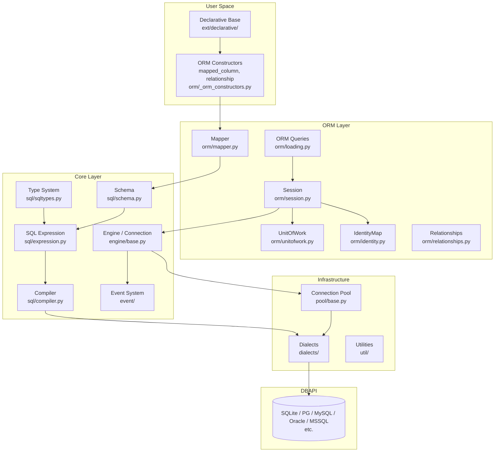
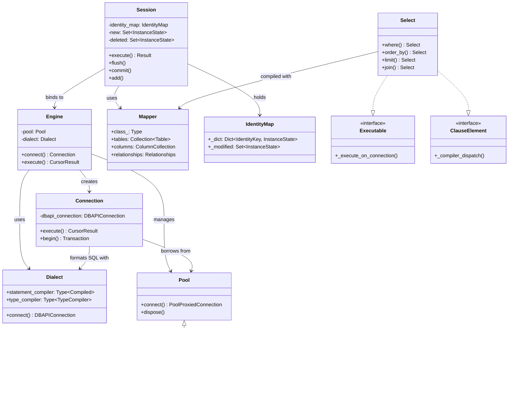

# SQLAlchemy · 架構

## 高層架構圖

### 圖意說明

這張圖展現 SQLAlchemy 最核心的架構設計：**Core / ORM 兩層獨立但可協作**。

最上層的 User Space 是開發者常接觸的 declarative mapping 與 ORM constructors。中間兩層——ORM Layer 與 Core Layer——之間有清楚的依賴方向：ORM 依賴 Core，但 Core 完全不知道 ORM 的存在。

由於這個依賴方向，你可以：
- 只使用 Core（`engine = create_engine(...)` -> `connection.execute(text("..."))`）
- 只使用 ORM（但底層仍經過 Core，無法跳過）
- 混用（例如用 Core 做 batch insert，用 ORM 做關係查詢）

---

## 核心類別關係圖

### 圖意說明

這張 class diagram 展示 SQLAlchemy 的關鍵類別與它們之間的靜態關係。從左到右可以分成三組：
- **Pool + Dialect** (底層基礎設施)：Pool 管理 DB-API 連線生命週期，Dialect 決定 SQL 語法與類型轉換
- **Engine + Connection** (Core 執行層)：Engine 是工廠，建立 Connection；Connection 是實際執行 SQL 的場所
- **Session + Mapper + IdentityMap** (ORM 層)：Session 作為 ORM 中樞，協調 Mapper（資料映射）、IdentityMap（物件追蹤）、Select（查詢建構）

---

## 分層說明

### ORM Layer — Session / Mapper / UnitOfWork

ORM 層在 Core 之上提供了物件持久化。

**Session** (`orm/session.py:5416 行`) 是 ORM 的入口。它管理：(1) IdentityMap（每個 PK 對應唯一的 Python 物件實例）、(2) 變更追蹤（透過 `InstanceState` 記錄每個屬性的前後變化）、(3) 事務邊界（SessionTransaction 巢狀支援）。

**Mapper** (`orm/mapper.py:4412 行`) 是 Data Mapper 的核心——它將 Python 類別與資料庫 table/selectable 對應，包含 column mapping、relationship mapping、inheritance mapping。

**UnitOfWork** (`orm/unitofwork.py:797 行`) 負責 flush 時的 dependency 排序。當 `session.flush()` 被呼叫時，它用 topological sort 決定 INSERT/UPDATE/DELETE 的順序。

### Core Layer — Engine / SQL / Connection Pool

**Engine** (`engine/base.py`) 是 Core 的總入口。`create_engine()` (`engine/create.py`) 根據 URL（如 `sqlite:///test.db`）選擇對應的 Dialect 與 Pool 實作。

**Connection** (`engine/base.py:90`) 包裝了底層的 DB-API connection，提供 `execute()` 方法。所有的 SQL 執行——無論來自 Core 還是 ORM——最終都經過 `Connection.execute()`。

**SQL Expression** (`sql/expression.py`) 是整個 SQLAlchemy 最有設計價值的部分。它用 Python 物件樹來表示 SQL 語句，例如 `select(User).where(User.name == "Alice")` 會產生一棵 ClauseElement 樹，然後由 Compiler 轉換為 SQL 字串。

**Compiler** (`sql/compiler.py`) 將 ClauseElement 樹轉換為 SQL 字串。每個 Dialect 可以覆蓋 compiler 的行為（例如 PostgreSQL 的 `ILIKE` 支援）。

## 關鍵設計決策

### 決策 1: Core / ORM 雙層分離

- **是什麼**: SQLAlchemy 不把 ORM 和 SQL 抽象放在同一層，而是分成 Core（SQL expression、engine、pool、types）和 ORM（Session、Mapper、Relationships）兩層。
- **推測的理由**: 讓開發者可以在不同抽象層級操作——寫 pure SQL 用 `text()`，需要 SQL expression 建構用 Core，需要物件持久化用 ORM。同時也降低 ORM 的實作複雜度。
- **Trade-off**: ORM 無法直接存取底層 Connection，所有 ORM 操作都經過 Core 層（增加了跳數）。學習曲線更陡——新手常搞不清楚哪些是 Core API、哪些是 ORM API。
- **相關程式碼**: [lib/sqlalchemy/engine/\_\_init\_\_.py](https://github.com/sqlalchemy/sqlalchemy/blob/873f877/lib/sqlalchemy/engine/__init__.py)

### 決策 2: 採用 Data Mapper 而非 Active Record

- **是什麼**: 不像 Django ORM 讓 Model 物件自己負責 CRUD（`user.save()`），SQLAlchemy 用 Session 作為中介：`session.add(user)`、`session.flush()`、`session.commit()`。物件是普通的 Python 物件（POJO/POPO）。
- **推測的理由**: Data Mapper 讓 domain model 與 persistence layer 的耦合降到最低，適合複雜的 domain logic。也讓 unit test 更容易（不需要 DB 就可以測 domain logic）。
- **Trade-off**: 需要手動管理 Session（session scope、flush timing），比 Active Record 冗長。Domain 邏輯較簡單時，Active Record 更直覺。
- **相關程式碼**: [`Session` class](https://github.com/sqlalchemy/sqlalchemy/blob/873f877/lib/sqlalchemy/orm/session.py#L162)

### 決策 3: 用 ClauseElement 物件樹表示 SQL，而非字串拼接

- **是什麼**: `select(User).where(User.name == "Alice")` 不立即產生 SQL 字串，而是建構一棵 `ClauseElement` 物件樹。只有在執行階段才經由 Compiler 轉為 SQL。
- **推測的理由**: 物件樹可被 inspect、modify、cache，並且可以跨 Dialect 編譯。這是 SQLAlchemy 能做到「同一份 query 在不同資料庫產生不同 SQL」的關鍵。
- **Trade-off**: 每次查詢都經過物件建構 + 編譯兩階段，增加了 overhead。但 compiler 有 cache（cache key 機制在 `sql/cache_key.py`），實際影響有限。
- **相關程式碼**: [`ClauseElement` 類別](https://github.com/sqlalchemy/sqlalchemy/blob/873f877/lib/sqlalchemy/sql/expression.py)

### 決策 4: Event 系統作為跨模組通訊基礎

- **是什麼**: SQLAlchemy 的 event 系統 (`event/`) 是核心基礎設施——Engine、Pool、Session、Mapper、Connection 等物件都透過 event 發送生命週期通知。第三方程式碼可以 `listen()` 或註冊 `listens_for` decorator。
- **推測的理由**: Event 讓 SQLAlchemy 在不解耦的前提下開放客製化（例如加 audit log、query timeout monitoring），而不需要為每種擴充開 API hooks。
- **Trade-off**: Event-based 的通訊較難除錯（誰訂閱了什麼？執行順序？），且濫用 event 可能導致難以預測的行為。
- **相關程式碼**: [`event/api.py`](https://github.com/sqlalchemy/sqlalchemy/blob/873f877/lib/sqlalchemy/event/api.py)

## 外部依賴

| 依賴 | 用途 | 抽象方式 |
|---|---|---|
| DB-API module（如 psycopg2、sqlite3） | 底層資料庫通訊 | Dialect 抽象層 (`engine/interfaces.py:60`) |
| greenlet | AsyncIO 支援（greenlet.spawn） | `util/concurrency.py` 中作為 `await_()` 實作 |
| typing_extensions | Python 3.9-3.11 的 typing backport | 直接 import |

## 非同步處理

SQLAlchemy 用獨立的 `ext/asyncio/` 支援 async。核心機制是 `util/concurrency.py` 中的 `await_()` 函式——它在 greenlet 內跑同步 DB-API 呼叫，然後 yield 給 async event loop。

關鍵類別：
- `AsyncEngine` (`ext/asyncio/engine.py`) — async wrapper 包裝 sync Engine
- `AsyncSession` (`ext/asyncio/session.py`) — async wrapper 包裝 sync Session
- `AsyncAttrs` (`ext/asyncio/session.py`) — 讓 async session 也能 lazy-load relationships

**這不是真正的 async DB-API**（因為 DB-API 2.0 是同步的），而是用 greenlet 把 blocking I/O 轉成 async-safe。真正的 async 需要 async DB-API driver（如 asyncpg、aiosqlite 配合 `create_async_engine`）。

## 測試策略

- **測試框架**: pytest，無插件依賴
- **覆蓋層次**: 從 engine 到 ORM 到 dialects 都有廣泛測試，`test/` 目錄結構 mirror `lib/sqlalchemy/`
- **Mock 策略**: 用 `create_mock_engine()` (`engine/mock.py`) 攔截 SQL 輸出做 assertion
- **特別之處**: 有 profiling regression 測試（`test/aaa_profiling/`）確保查詢效能不退化；`test/requirements.py` 集中管理 database feature flags

## 中介層 / 橫切關注點

- **Logging**: `log.py` — 基於標準 logging 模組，由 `echo=True` 參數觸發
- **Error handling**: `exc.py` — 統一的異常層級（StatementError、IntegrityError 等），繼承自 Python `Exception`
- **Caching**: SQL 編譯結果有 cache（`sql/cache_key.py`），重複的查詢可跳過 compilation
