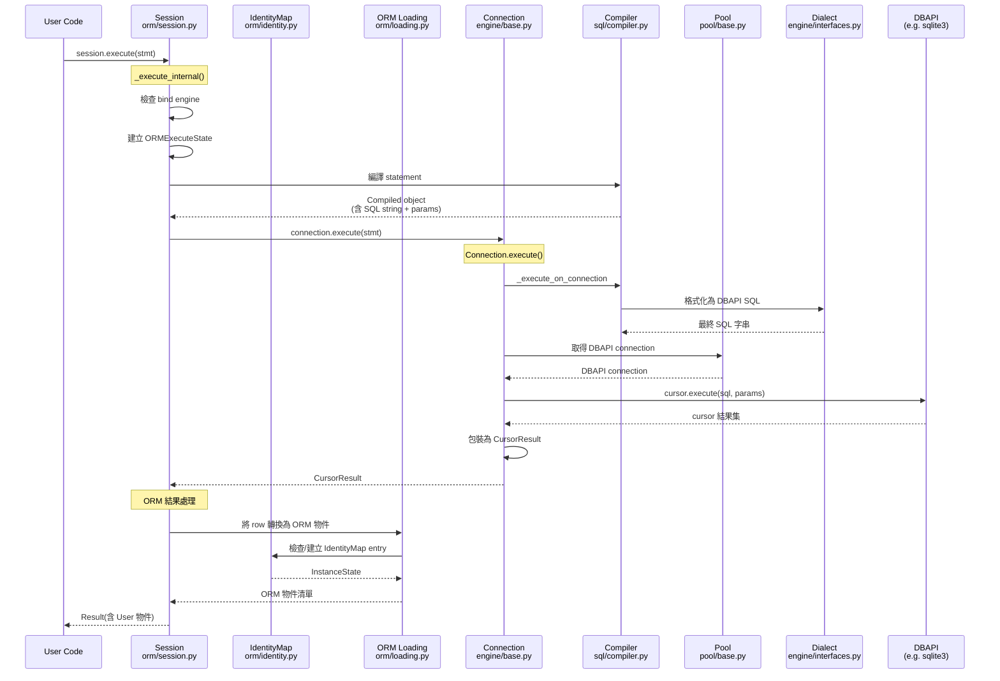

# SQLAlchemy · 程式碼追蹤

## 追蹤的場景

**場景**: 使用者透過 ORM Session 執行一條 SELECT 查詢，從 Session down 到 DBAPI，再回到 ORM 物件。

```python
from sqlalchemy import select
from sqlalchemy.orm import Session

session = Session(engine)
stmt = select(User).where(User.name == "Alice")
result = session.execute(stmt)
user = result.scalar_one()
```

## 流程圖



### 圖意說明

這條路徑橫跨了 SQLAlchemy 的四個主要層次：(1) ORM Session 層——接收 statement，決定 bind engine；(2) Core Engine/Connection 層——執行 SQL、管理連線；(3) Compiler/Dialect 層——將 ClauseElement 樹轉為目標資料庫的 SQL 字串；(4) Pool 層——管理 connection 的生命週期。

關鍵的設計觀察：ORM 的 `session.execute()` 並不直接對應到 `connection.execute()`，而是先經過 `ORMExecuteState` 的包裝，讓 ORM 可以攔截 Core 層的行為（例如 event hooks、result processing）。這是一個典型的「Decorator + Hook」模式。

## 逐步追蹤

### Step 1: Session.execute() 入口

`session.execute()` (`session.py:2337`) 做兩件事：
1. 將 statement 與 params 傳給 `_execute_internal()` (`session.py:2149`)
2. `_execute_internal` 建立 `ORMExecuteState`，根據 statement 的類型決定如何編譯

**設計觀察**: `ORMExecuteState` (`orm/context.py`) 是 ORM 執行的核心上下文。它統一了從 Core 的 `Compiled`、`ExecutionContext` 到 ORM 的 loading 策略。

### Step 2: Statement 編譯

在 `_execute_internal()` 內部，statement（一棵 ClauseElement 樹）被傳遞給 Compiler：

```python
# session.py (簡化)
compiled = statement._compile()
```

Compiler (`sql/compiler.py`) 遍歷 ClauseElement 樹，對每個節點呼叫 `visit_xxx()` 方法。這個 pattern 是標準的 **Visitor Pattern**——ClauseElement 樹的每個節點（Select、WhereClause、ColumnClause、BinaryExpression）都有自己的 visit 方法。

**值得注意的地方**: Compiler 有 cache 機制。如果同一條 statement 的 cache key 相同（SQL 結構沒變，只是參數值不同），可以跳過 compilation。Cache key 的計算在 `sql/cache_key.py`。

### Step 3: Dialect 調整

Compiler 產出的 SQL 是 dialect-aware 的。關鍵介面在 `engine/interfaces.py`：

```python
class Dialect(EventTarget):
    statement_compiler: Type[Compiled]  # 覆蓋預設 compiler 行為
    type_compiler: Type[TypeCompiler]    # 覆蓋型別編譯行為
```

每個 dialect（`dialects/sqlite/`、`dialects/postgresql/` 等）都可以覆蓋 compiler。例如 PostgreSQL dialect 會把 `now()` 編譯為 `NOW()`，而 SQLite 則為 `CURRENT_TIMESTAMP`。

### Step 4: Connection.execute()

經過編譯後，Session 取得 Engine 的 Connection，然後呼叫 `connection.execute()` (`engine/base.py:1404`)：

```python
def execute(self, statement, parameters=None, execution_options=None):
    distilled_parameters = _distill_params_20(parameters)
    meth = statement._execute_on_connection  # 多型分派
    return meth(self, distilled_parameters, execution_options or NO_OPTIONS)
```

**核心設計**: `_execute_on_connection` 是 Executable 介面 (`sql/base.py`) 的方法。每個可執行的 statement 類別（`Select`、`Insert`、`TextClause`）都實作自己的 `_execute_on_connection`。這是一個 **Template Method** pattern——Core layer 知道「執行」的流程，但每個 statement 類別決定「如何執行」。

### Step 5: Connection Pool

Connection 從 Pool 取得 DB-API connection (`pool/base.py`)。預設使用 `QueuePool` (`pool/impl.py`)——一個 thread-safe 的連線池，支援：
- `pool_size`: 預設 5 個連線
- `max_overflow`: 預設 10（超過 pool_size 可額外建立的連線）
- `timeout`: 預設 30 秒（沒 idle connection 時的等待時間）
- `recycle`: 連線多久後回收（預設 -1，不回收）

**值得注意**: Pool 回傳的是 `_ConnectionFairy`——一個 proxy 物件包裝真正的 DB-API connection。當 connection 歸還時，Pool 會執行 `reset_on_return` 策略（預設 `rollback`），確保連接回到 clean state。

### Step 6: DBAPI 執行

Compiler 產出的最終 SQL（字串）+ 參數（tuple/dict）被傳給 DB-API cursor：

```python
cursor.execute(sql_string, params)
```

### Step 7: ORM 結果處理

從 `connection.execute()` 回傳的是 `CursorResult`（Core 層的結果物件）。Session 的 `_execute_internal` 再將 `CursorResult` 交給 ORM loading 機制 (`orm/loading.py`)。

Loading 流程：
1. `orm/loading.py` 中的 loader 根據 Mapper 的配置決定如何建立物件
2. 建立物件前，先查 `IdentityMap` (`orm/identity.py:37`)，如果此 PK 的物件已在 session 中，直接回傳同一實例
3. 新的 row 透過 `InstanceState` (`orm/state.py`) 包裝，附加到 Session 的 identity map

**IdentityMap 的設計意義**: 確保同一個 row 在同一 session 中只對應一個 Python 物件實例。這避免了 update conflict，但也意味著 session scope 外取得的物件不會自動同步。

### Step 8: 回傳 Result

最後，Session 回傳 `Result` 物件給使用者。`result.scalar_one()` 取出單一 ORM 物件。

## 想學更多時，在哪裡下中斷點

- 想看 Session 的 execute 邏輯入口: [`orm/session.py:2149`](https://github.com/sqlalchemy/sqlalchemy/blob/873f877/lib/sqlalchemy/orm/session.py#L2149) `_execute_internal()`
- 想看 Connection 如何執行 SQL: [`engine/base.py:1404`](https://github.com/sqlalchemy/sqlalchemy/blob/873f877/lib/sqlalchemy/engine/base.py#L1404) `Connection.execute()`
- 想看 Compiler 如何產生 SQL: [`sql/compiler.py`](https://github.com/sqlalchemy/sqlalchemy/blob/873f877/lib/sqlalchemy/sql/compiler.py) `visit_select()` 等 visit 方法
- 想看 Pool 怎麼發放連線: [`pool/base.py`](https://github.com/sqlalchemy/sqlalchemy/blob/873f877/lib/sqlalchemy/pool/base.py) `Pool.connect()`
- 想看 ORM 結果轉換: [`orm/loading.py`](https://github.com/sqlalchemy/sqlalchemy/blob/873f877/lib/sqlalchemy/orm/loading.py) `load_on_pk()`、`instance_processor()`

## 沒追蹤到但值得留意的分支

- **Flush 路徑**: `session.flush()` (`orm/session.py:4429`) -> `UOWTransaction` (`orm/unitofwork.py`) -> `topological.sort()` 決定 INSERT/UPDATE/DELETE 順序 -> `orm/persistence.py` 執行 SQL。這是整個 ORM 中最複雜的路徑，涉及 cascade、dependency sorting、relationship flush。
- **Lazy loading**: 存取未載入的 relationship 屬性時，`orm/strategies.py` 中的 `LazyLoader` 會自動觸發額外 SQL。
- **Async 路徑**: `AsyncSession.execute()` (`ext/asyncio/session.py`) -> `await self.sync_spawn(...)` -> `session._execute_internal()` -> `await_()` 用 greenlet 轉換 sync -> async。
