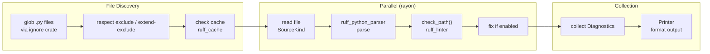

# Ruff · 架構

## 高層元件圖

```mermaid
flowchart TB
  subgraph CLI["CLI Layer (crates/ruff)"]
    direction LR
    Main[main.rs<br/>entry]
    Args[args.rs<br/>clap Parser]
    Run[lib.rs::run()<br/>dispatch]
  end

  subgraph Linter["Linter Pipeline (crates/ruff_linter)"]
    Check[check<br/>file discovery<br/>parallel dispatch]
    Lint[check_path<br/>multi-pass checker]
    Tokens[token-based<br/>rules]
    Fs[filesystem-based<br/>rules]
    Logical[logical-line<br/>rules]
    Ast[AST-based<br/>rules]
    Imports[import/isort<br/>rules]
    Physical[physical-line<br/>rules]
  end

  subgraph Parser["Parser (ruff_python_parser)"]
    Parse[Parsed&lt;ModModule&gt;<br/>parse + tokens]
  end

  subgraph Formatter["Formatter"]
    FmtGeneric[ruff_formatter<br/>generic infra]
    FmtPython[ruff_python_formatter<br/>Python specifics]
  end

  subgraph TypeChecker["Type Checker (ty*)"]
    TySem[ty_python_semantic<br/>131k LOC type inference]
    TyInfra[ty_module_resolver<br/>ty_combine]
  end

  subgraph Workspace["Config (ruff_workspace)"]
    Resolver[pyproject.toml<br/>ruff.toml resolver]
    Settings[settings / options<br/>types]
  end

  subgraph Server["LSP (ruff_server)"]
    Lsp[lsp server]
  end

  subgraph Core["Core Types"]
    Diagnostics[ruff_diagnostics]
    AstTypes[ruff_python_ast]
    Db[ruff_db<br/>symbol store]
    Cache[ruff_cache]
  end

  Main --> Args
  Args --> Run
  Run --> Check
  Run --> FmtPython
  Run --> Lsp
  Run --> TySem

  Check --> Lint
  Lint --> Tokens
  Lint --> Fs
  Lint --> Logical
  Lint --> Ast
  Lint --> Imports
  Lint --> Physical

  Ast -.-> Parse
  Ast -.-> AstTypes
  Lint -.-> Diagnostics
  Lint -.-> Db
  Lint -.-> Cache

  FmtPython --> FmtGeneric

  TySem --> TyInfra
  TySem --> Db

  Check -.-> Resolver
  Resolver -.-> Settings
```

**圖意說明**: 這是 Ruff 的完整 crate 視圖。上方是 CLI 層（`crates/ruff`）——唯一的 binary crate，負責 clap 參數解析與指令調度。中左是 linter pipeline——Ruff 的最核心功能，以 `check_path()` 為入口接收「經過 parser 解析的 AST + tokens」，依序通過五個 checker pass（token、filesystem、logical_line、AST、import），每個 pass 只啟用其所屬規則。中右是 formatter 與 type checker——前者是相對獨立的子系統，後者則是整個專案單一最大的 crate（`ty_python_semantic` 約 13 萬行）。下方是橫向共用層：`ruff_workspace` 負責 `pyproject.toml` 解析、`ruff_diagnostics` 定義診斷結構、`ruff_db` 提供符號儲存層。

## Linter 核心流程



**圖意說明**: `ruff check` 的執行流程。先透過 `ignore` crate (gitignore 實作) 收集檔案，再根據 `ruff.toml` 的 exclude 規則過濾，接著檢查 cache（`ruff_cache` 用 bincode 序列化結果避免重複解析）。未被 cache hit 的檔案用 `rayon` 平行處理：每個檔案獨立經過 read → parse → check_path → fix 的 pipeline。最後所有 diagnostic 由 Printer 格式化輸出。

## 公開 API 結構

| 進入點 | 用途 | 位置 |
|---|---|---|
| `ruff check [files]` | 執行 lint 檢查（預設指令） | [`crates/ruff/src/commands/check.rs`](https://github.com/astral-sh/ruff/blob/8c04080b5e449b077500fff1cf1d83c2a69af4c9/crates/ruff/src/commands/check.rs) |
| `ruff format [files]` | 格式化 Python 程式碼 | [`crates/ruff/src/commands/format.rs`](https://github.com/astral-sh/ruff/blob/8c04080b5e449b077500fff1cf1d83c2a69af4c9/crates/ruff/src/commands/format.rs) |
| `ruff server` | 啟動 LSP server | [`crates/ruff/src/commands/server.rs`](https://github.com/astral-sh/ruff/blob/8c04080b5e449b077500fff1cf1d83c2a69af4c9/crates/ruff/src/commands/server.rs) |
| `ruff rule <code>` | 查詢特定規則的說明 | [`crates/ruff/src/commands/rule.rs`](https://github.com/astral-sh/ruff/blob/8c04080b5e449b077500fff1cf1d83c2a69af4c9/crates/ruff/src/commands/rule.rs) |
| `ruff ty [files]` | 型別檢查（preview） | [`crates/ty/src/main.rs`](https://github.com/astral-sh/ruff/blob/8c04080b5e449b077500fff1cf1d83c2a69af4c9/crates/ty/src/main.rs) |

### 典型用法

```bash
# lint
ruff check .                    # 檢查目前目錄下所有 .py 檔
ruff check --fix .              # 自動修復
ruff check --preview .          # 啟用預覽規則（含型別檢查）

# format
ruff format .                   # 格式化（等價於 Black 的預設行為）
ruff format --check .           # 只檢查，不寫入

# type checking
ruff check --preview --select TCH .  # type-checking-only 規則

# server (VS Code, Neovim 等編輯器)
ruff server
```

## 內部分層

### CLI 層 (`crates/ruff`)

- **職責**: clap 參數解析、子指令調度、結果輸出（終端 / JSON / SARIF 等）
- **位置**: [`crates/ruff/src/lib.rs`](https://github.com/astral-sh/ruff/blob/8c04080b5e449b077500fff1cf1d83c2a69af4c9/crates/ruff/src/lib.rs#L128)
- **對其他層的依賴**: `ruff_linter`、`ruff_workspace`、`ruff_server`、`ruff_python_formatter`、`ruff_python_parser`

`run()` 函數（`lib.rs:128`）是整個 CLI 的調度中心。根據指令分派到 `check()`、`format()`、`server()`、`analyze_graph()` 等。值得注意的設計細節：

- **Windows 用 mimalloc，其他平台用 jemalloc**（`main.rs:11-28`）— 這是在 Rust 全域分配器層級做的選擇，對效能有可量化的影響
- **Broken pipe 優雅處理**（`lib.rs:56-61`）— 受 ripgrep 啟發，當 stdout pipe 斷掉時不 panic

### Linter 核心 (`crates/ruff_linter`)

- **職責**: 執行 lint 規則檢查，產生 diagnostic
- **位置**: [`crates/ruff_linter/src/linter.rs`](https://github.com/astral-sh/ruff/blob/8c04080b5e449b077500fff1cf1d83c2a69af4c9/crates/ruff_linter/src/linter.rs#L120-L241)
- **對其他層的依賴**: `ruff_python_parser`、`ruff_python_ast`、`ruff_python_semantic`、`ruff_db`

`check_path()`（`linter.rs:120`）是 linter 的核心。它依序執行五種 checker pass：

1. **Token-based rules** (`check_tokens`): 只依賴 lexer tokens，不依賴 AST。適用於引號風格、縮排等語法層級規則。
2. **Filesystem-based rules** (`check_file_path`): 檢查檔案名稱與路徑約定。
3. **Logical line-based rules** (`check_logical_lines`): 在 tokens 層級做邏輯行分析。
4. **AST-based rules** (`check_ast`): 最核心的 pass。用 `Checker` visitor 遍歷 AST，在每個節點做 binding → traversal → cleanup → analysis 四個步驟。[`crates/ruff_linter/src/checkers/ast/mod.rs`](https://github.com/astral-sh/ruff/blob/8c04080b5e449b077500fff1cf1d83c2a69af4c9/crates/ruff_linter/src/checkers/ast/mod.rs#L1-L23)
5. **Import rules** (`check_imports`): 處理 import 排序與檢查。

最後還有一次 **physical lines 檢查**（`check_physical_lines`）處理行長度等規則。

### 規則組織 (`crates/ruff_linter/src/rules/`)

規則依來源（對應的 Flake8 plugin）組織成模組。每個模組包含數十到數百條規則：

[`crates/ruff_linter/src/rules/mod.rs`](https://github.com/astral-sh/ruff/blob/8c04080b5e449b077500fff1cf1d83c2a69af4c9/crates/ruff_linter/src/rules/mod.rs) 列出 59 個 `pub mod`，涵蓋 flake8_xxx、pycodestyle、pylint、mccabe 等。每個規則實作 `Violation` trait（定義於 `ruff_diagnostics`）。

### Parser (`ruff_python_parser`)

- **職責**: 將 Python 原始碼解析為 AST + tokens
- **位置**: [`crates/ruff_python_parser`](https://github.com/astral-sh/ruff/blob/8c04080b5e449b077500fff1cf1d83c2a69af4c9/crates/ruff_python_parser)
- **規模**: ~20K LOC（`ruff_python_ast` 另有 ~28K LOC）

Ruff 的 parser 是從零用 Rust 實作的 Python parser，支援 Python 3.7–3.14 的完整語法。與 CPython 的 `ast` 模組不同，它同時產出 tokens 和 AST——這讓 token-based rules 可以跑在 parsing 之後而不需要重新 lex。

### Formatter (`ruff_formatter` + `ruff_python_formatter`)

- **職責**: 格式化 Python 程式碼
- **程式碼位置**: [`crates/ruff_formatter`](https://github.com/astral-sh/ruff/blob/8c04080b5e449b077500fff1cf1d83c2a69af4c9/crates/ruff_formatter)（通用 infra，~11K LOC）+ [`crates/ruff_python_formatter`](https://github.com/astral-sh/ruff/blob/8c04080b5e449b077500fff1cf1d83c2a69af4c9/crates/ruff_python_formatter)（Python 專用，~32K LOC）

formatter 採用 comment-preserving CST（concrete syntax tree）方法，以 Black 的輸出作為等價性目標。與 linter 共用同一個 parser，但在 formatter 中不使用 semantic model。

### Type Checker (`ty*` crates)

- **職責**: Python 型別檢查
- **規模**: `ty_python_semantic` 約 131K LOC，是 Ruff 中最大的單一 crate
- **程式碼位置**: [`crates/ty_python_semantic`](https://github.com/astral-sh/ruff/blob/8c04080b5e449b077500fff1cf1d83c2a69af4c9/crates/ty_python_semantic)

這是 Ruff 在 2024–2026 年最大的新增功能。與 mypy 等傳統 type checker 不同，它架構在 `ruff_db`（symbol store / file system abstraction）之上，並共用 `ruff_python_ast` 與 `ruff_python_parser`。

### LSP Server (`ruff_server`)

- **職責**: 實現 Language Server Protocol，供 VS Code / Neovim 等編輯器使用
- **規模**: ~10K LOC
- **程式碼位置**: [`crates/ruff_server`](https://github.com/astral-sh/ruff/blob/8c04080b5e449b077500fff1cf1d83c2a69af4c9/crates/ruff_server)

實作 LSP 的 `textDocument/didChange`、`textDocument/didOpen`、`textDocument/codeAction`、`textDocument/formatting` 等方法。

## 關鍵設計決策與 trade-off

### 決策 1: 用 Rust 而非 Python

**做什麼**: Ruff 用 Rust 重寫了 Python 工具鏈的核心——parser、linter、formatter、type checker。

**為什麼**: 對於需要遍歷大量檔案的靜態分析工具，Rust 的效能優勢顯著。Ruff 的 `ruff check` 可以使用 `rayon` 在 CPU 所有核心上平行處理，且 `mimalloc`/`jemalloc` 的自定義分配器進一步減少分配開銷。

**放棄了什麼**: Python plugin 的門檻大幅提高——Flake8 的 plugin 生態依賴於 Python 的 import 機制和 AST API，任何開發者都可以寫 plugin。Ruff 的 plugin 必須用 Rust 寫並編譯進 binary，這意味著：a) 外部的 plugin 開發幾乎不存在，b) Ruff 必須自己實作所有 Flake8 plugin 的規則。這是一個**巨大的維護成本**，但也讓 Ruff 可以針對所有規則做全域優化（規則依賴分析、平行化策略等）。

### 決策 2: 五 pass checker 而非單 pass

**做什麼**: Ruff 的 linter 不是一次遍歷做完所有事，而是分成 token → filesystem → logical line → AST → import → physical line 六個 pass。

**為什麼**: 不同的規則需要的資訊不同。Token-based rules 只看 tokens、AST-based rules 需要完整的 semantic model。若強行在單 pass 中做所有事，會讓 checker 變得複雜且難以平行化。分 pass 的好處是：a) 每個 pass 的程式碼可以保持簡單，b) pass 之間可以獨立平行（例如 token pass 可以在 parsing 的同時進行），c) 新增規則類型的影響範圍有限。

**放棄了什麼**: 每個 file 會被遍歷多次（每個 pass 一次），增加了總體執行時間。但考慮到 parallel processing（多檔案同時）和 cache（檔案層級的 skip），這個 trade-off 是可接受的。

### 決策 3: 取代 vs 整合

**做什麼**: Ruff 選擇「取代」Flake8 + plugins + isort + Black + Pylint + mypy，而不是「整合」它們。

**為什麼**: 在統一架構下實現所有功能，可以做到全域優化——例如 parser 只需執行一次，linter 和 formatter 可以共享同一個 parsing result。且輸出一致（統一 error message 格式、統一的 config 格式）。

**放棄了什麼**: 不可能做到與被取代工具 100% 的行為一致。Ruff 的 lint rules 是「重新實作語意」而非「直接對應」，因此必然有 edge case 的差異。更根本的是，使用者無法選擇性地只使用某個工具的特定版本——Ruff 的實作永遠是它所依賴的 crate 的版本。

### 決策 4: 自建 parser 而非使用既有 crate

**做什麼**: Ruff 選擇自己用 Rust 寫 Python parser（`ruff_python_parser`），而不是使用現有的 Rust Python parser crate（如 `rustpython-parser`）。

**為什麼**: Ruff 需要同時產出 tokens 和 AST，且對 parsing 速度有極高要求。自建 parser 讓它可以完全控制 error recovery 策略、token stream 的輸出順序、以及 AST node 的 layout（直接影響所有 rule 的 pattern matching 效能）。

[UNVERIFIED]: Ruff 早期（v0.0.x）使用的是 `rustpython-parser`，後來才自建 parser。我無法從當前的 commit 中確認 exact 的切換時間點。這是一筆值得查閱的歷史。

## 跟外部世界的接觸面

- **CLI**: 唯一公開的接觸面。`ruff` binary 透過 `clap` 解析命令列參數
- **設定檔**: `pyproject.toml`（`[tool.ruff]`）、`ruff.toml`、`.ruff.toml`，由 `ruff_workspace` 解析
- **環境變數**: `RUFF_FORMATTER`、`FORCE_COLOR` 等。（[`crates/ruff/src/lib.rs:136`](https://github.com/astral-sh/ruff/blob/8c04080b5e449b077500fff1cf1d83c2a69af4c9/crates/ruff/src/lib.rs#L136)）
- **LSP Protocol**: `ruff server` 透過 stdio 實作 LSP
- **WASM**: `ruff_wasm` crate 提供瀏覽器端的 playground 支援

## 測試策略

- **Snapshot testing**: 每個規則有對應的 `.py.snap` snapshot，用於驗證 diagnostic 的 message、位置、fix suggestion
- **Fixture testing**: `crates/ruff_linter/resources/test/fixtures/` 下每個規則一個 fixture 目錄
- **Ecosystem checks**: `scripts/ecosystem_all_check.sh` 會在主要 Python 專案（如 Django、pandas）上執行 Ruff，確保不會有 regression
- **Fuzz testing**: `fuzz/` 目錄包含 fuzzing targets
- **Conformance testing**: `scripts/conformance.py` 用於比對 Ruff output 與 Flake8/Black 的等價性

## 發布與版本管理

- **版本策略**: 寬鬆 SemVer。版本號 0.x.y，minor 版本常含破壞性變更
- **Changelog**: [`CHANGELOG.md`](https://github.com/astral-sh/ruff/blob/8c04080b5e449b077500fff1cf1d83c2a69af4c9/CHANGELOG.md) + 按版本拆分的 changelog（`changelogs/` 目錄） — 每份 changelog 會列出新增規則、破壞性變更和 bug fix
- **Release 流程**: 自動化 GitHub Actions。`scripts/release.sh` 處理發佈流程
- **支援版本**: Python 3.7–3.14
