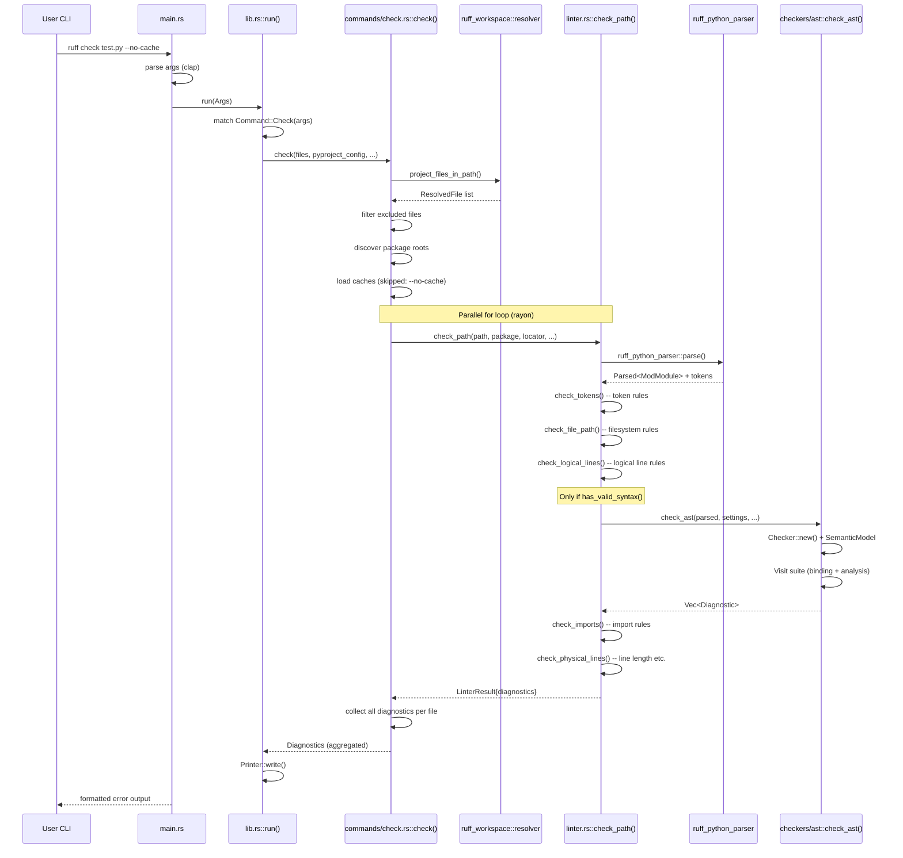

# Ruff · 程式碼追蹤

本追蹤選擇的場景是：**執行 `ruff check .` 檢查一個檔案**，從 CLI 入口到每條 lint rule 的執行。

## 追蹤的場景

```bash
ruff check test.py --no-cache
```

## 流程圖



## 逐步追蹤

### Step 1: 進入點 — main.rs

[`crates/ruff/src/main.rs:30`](https://github.com/astral-sh/ruff/blob/8c04080b5e449b077500fff1cf1d83c2a69af4c9/crates/ruff/src/main.rs#L30-L48)

Rust binary 的標準入口。先設定 ANSI 顏色的 VT 支援（Windows），然後用 `wild::args_os()` 處理 wildcard expansion、`argfile::expand_args_from` 處理 `@file` 語法（從檔案讀取 CLI 參數）。最後 parse 成 `Args` struct，呼叫 `run()`。

值得注意的細節：**全域分配器的選擇**在 binary 層面用 conditional compilation 決定（`main.rs:11-28`）。Windows 用 mimalloc（與 Rust 的 system allocator 相比對多線程效能更好），其他平台用 jemalloc（大記憶體壓力下表現更好）。

### Step 2: 指令調度 — lib.rs::run()

[`crates/ruff/src/lib.rs:128`](https://github.com/astral-sh/ruff/blob/8c04080b5e449b077500fff1cf1d83c2a69af4c9/crates/ruff/src/lib.rs#L128-L212)

`run()` 接受解構後的 `Args`，根據 `Command` enum 分派：

```rust
match command {
    Command::Check(args) => check(args, global_options),
    Command::Format(args) => format(args, global_options),
    Command::Server(args) => server(args),
    Command::Analyze(AnalyzeCommand::Graph(args)) => analyze_graph(args, global_options),
    // ...
}
```

每個指令的 handler 在 `commands/` 目錄中各自一個檔案。這種設計讓指令間的依賴最小化。

### Step 3: 檔案收集 — check()

[`crates/ruff/src/commands/check.rs:34`](https://github.com/astral-sh/ruff/blob/8c04080b5e449b077500fff1cf1d83c2a69af4c9/crates/ruff/src/commands/check.rs#L34-L42)

`check()` 函數是 linter 指令的 orchestrator：

1. **檔案發現**: `project_files_in_path()`（`check.rs:45`）遍歷指定路徑，使用 `ignore` crate（gitignore 實作）收集 `.py` / `.pyi` / `.ipynb` 檔案
2. **排除過濾**: `check.rs:49-58`，根據 `SourceType` 過濾不支援的檔案類型
3. **Package 發現**: `check.rs:66-72`，為每個 Python 檔案發現其 package root（由 `__init__.py` 決定）
4. **Cache 載入**: `check.rs:75-79`，若啟用 cache 則載入 `PackageCacheMap`

### Step 4: 平行執行 — par_iter

[`crates/ruff/src/commands/check.rs:82`](https://github.com/astral-sh/ruff/blob/8c04080b5e449b077500fff1cf1d83c2a69af4c9/crates/ruff/src/commands/check.rs#L82-L101)

```rust
let diagnostics_per_file = paths.par_iter().filter_map(|resolved_file| {
    // ...
    let settings = resolver.resolve(path);
    // ...per-file settings override
    match lint_path(path, ...) {
        // ...
    }
});
```

使用 `rayon::par_iter()` 在 CPU 所有核心上平行處理每個檔案。這是最重要的效能來源——針對多檔案的 linting，Rust 的無資料競爭平行計算讓 Ruff 能充分利用多核心。

### Step 5: 核心 linter — check_path()

[`crates/ruff_linter/src/linter.rs:120`](https://github.com/astral-sh/ruff/blob/8c04080b5e449b077500fff1cf1d83c2a69af4c9/crates/ruff_linter/src/linter.rs#L120-L134)

`check_path()` 接受：
- `path` — 檔案路徑
- `package` — 可選的 package root
- `locator` — 原始檔案內容
- `stylist` — 程式碼風格資訊（引號、縮排等）
- `indexer` — 預先計算的 index（tokens、comment ranges 等）
- `directives` — `# noqa` / `# isort:skip` 等指令
- `settings` — `LinterSettings`
- `source_kind` — Python 或 Jupyter Notebook
- `parsed` — 已解析的 `Parsed<ModModule>`（AST + tokens）
- `target_version` — Python 版本目標
- `suppressions` — suppression mapping

建立 `LintContext`（`linter.rs:136`），然後依序運行五種 checker。

### Step 6: Token-based 規則

[`crates/ruff_linter/src/linter.rs:153-167`](https://github.com/astral-sh/ruff/blob/8c04080b5e449b077500fff1cf1d83c2a69af4c9/crates/ruff_linter/src/linter.rs#L153-L167)

只在有 token-based 規則啟用時才運行 `check_tokens()`。token-based 規則包括：引號類型檢查（`flake8_quotes`）、空行規則等。這些規則不需要 AST 或 semantic model，因此執行速度最快，且即使語法錯誤也能運行。

關鍵設計：每個 pass 先用 `context.iter_enabled_rules().any(|rule| rule.lint_source().is_tokens())` 快速判斷是否有規則需要跑這個 pass。若無則完全跳過，這是**零開銷抽象**的典型應用。

### Step 7: AST-based 規則 — check_ast()

[`crates/ruff_linter/src/linter.rs:196-215`](https://github.com/astral-sh/ruff/blob/8c04080b5e449b077500fff1cf1d83c2a69af4c9/crates/ruff_linter/src/linter.rs#L196-L215)

只在 `parsed.has_valid_syntax()` 為 true 時運行。AST-based 規則是 linter 的核心，包含 60+ 個規則模組的所有內容。

`check_ast()` 使用 `Checker` visitor pattern：

[`crates/ruff_linter/src/checkers/ast/mod.rs:1-23`](https://github.com/astral-sh/ruff/blob/8c04080b5e449b077500fff1cf1d83c2a69af4c9/crates/ruff_linter/src/checkers/ast/mod.rs#L1-L23)

每個 AST 節點的遍歷依序做：

1. **Binding**: 將該節點引入的名稱綁到 `SemanticModel`
2. **Traversal**: 遞迴遍歷子節點
3. **Clean-up**: 遍歷完子節點後的清理（scope 離開等）
4. **Analysis**: 對這個節點執行所有啟用的 lint rule

「評估順序」模擬 Python interpreter 的執行順序：function body 被 defer 到 parent scope 遍歷完成之後、`with` 區塊也在特定順序下分析。這種設計讓規則可以依賴正確的 semantic state。

### Step 8: Import 檢查

[`crates/ruff_linter/src/linter.rs:217-240`](https://github.com/astral-sh/ruff/blob/8c04080b5e449b077500fff1cf1d83c2a69af4c9/crates/ruff_linter/src/linter.rs#L217-L240)

`check_imports()` 在 AST pass 之後獨立運行，處理 import 排序（isort 等價功能）、import 組織等。與其他 pass 獨立是因為 import 規則需要對整個檔案做全局分析（重新排序），無法在單一 AST visitor pass 中完成。

### Step 9: Physical lines 規則

[`crates/ruff_linter/src/linter.rs:249-255`](https://github.com/astral-sh/ruff/blob/8c04080b5e449b077500fff1cf1d83c2a69af4c9/crates/ruff_linter/src/linter.rs#L249-L255)

最後的 pass。檢查行長度（E501/W505）等基於實際程式碼行的規則。這個 pass 使用 doc_lines（混合來自 tokens 的 comment lines 和來自 AST 的 docstring lines），來判斷哪些行是文件字串需要特別處理。

### Step 10: Diagnostic 輸出

[`crates/ruff/src/printer.rs`](https://github.com/astral-sh/ruff/blob/8c04080b5e449b077500fff1cf1d83c2a69af4c9/crates/ruff/src/printer.rs)

所有檔案平行處理完後，結果彙整進 `Diagnostics`。`Printer` 根據 CLI 指定的 `--output-format`（預設 terminal-friendly、亦可選 JSON、SARIF、grouped 等）格式化輸出。

## 想學更多時，在哪裡下中斷點

- CLI 入口: [`crates/ruff/src/lib.rs:128`](https://github.com/astral-sh/ruff/blob/8c04080b5e449b077500fff1cf1d83c2a69af4c9/crates/ruff/src/lib.rs#L128) — `run()` 指令分派
- Linter 入口: [`crates/ruff_linter/src/linter.rs:120`](https://github.com/astral-sh/ruff/blob/8c04080b5e449b077500fff1cf1d83c2a69af4c9/crates/ruff_linter/src/linter.rs#L120) — `check_path()` 五 pass 啟動
- AST 遍歷: [`crates/ruff_linter/src/checkers/ast/mod.rs`](https://github.com/astral-sh/ruff/blob/8c04080b5e449b077500fff1cf1d83c2a69af4c9/crates/ruff_linter/src/checkers/ast/mod.rs) — `Checker` visitor 四步驟
- 規則分派: `crates/ruff_linter/src/checkers/ast/analyze/` — 各節點類型的 analysis dispatch
- 規則註冊: [`crates/ruff_linter/src/codes.rs`](https://github.com/astral-sh/ruff/blob/8c04080b5e449b077500fff1cf1d83c2a69af4c9/crates/ruff_linter/src/codes.rs) — 所有規則的 `Rule` enum

## 沒追蹤到但值得留意

- **Formatter 路徑**: `ruff format` 使用不同的 pipeline。它從 `ruff format` 指令跳過 linter pass，直接調用 `ruff_python_formatter`。Formatter 需要 comment-preserving CST，這與 linter 的 AST-based 方法不同。
- **Type checker 路徑**: `ruff ty` 使用完整 `ty_python_semantic` 引擎，進行全域型別推論。與 linter 的 per-file 平行不同，type checker 需要跨檔案的符號解析——這是一個 intrinsic 的複雜度差異。
- **LSP server 路徑**: `ruff server` 透過 LSP protocol 啟動，對應 `didChange`/`didOpen` 事件增量處理。
- **Fix 應用**: 本追蹤跳過了 `fix_file()` 的邏輯。當 `--fix` 啟用時，`check_path()` 回傳的 diagnostics 會被傳入 `fix_file()`，後者根據每個 diagnostic 的 `Fix` instruction（包含 `Applicability`、`IsolationLevel`）修改 source code。
