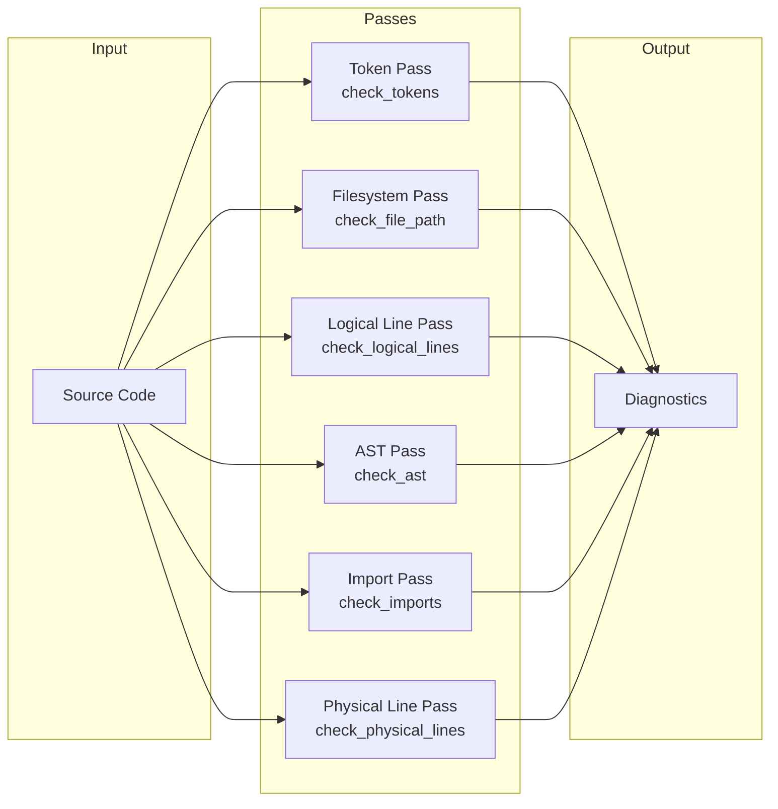

# Ruff · 值得偷學的設計

## Pattern 1: 多 Pass Checker 架構

**是什麼**: Ruff 的 linter 不是一個巨大的 AST visitor 一次做完所有規則，而是拆成五個 pass（token → filesystem → logical line → AST → import → physical line），每個 pass 只處理其所需資訊的規則。



**為什麼有效**:
- **關注點分離**: 每個 pass 的程式碼可以保持簡單專注。AST pass 不需要知道 token-based 規則的邏輯，反之亦然
- **零開銷跳過**: 如果沒有啟用 token-based 規則，整個 `check_tokens` pass 完全不會被呼叫——透過 `iter_enabled_rules().any(...)` 檢查。這種跳過在編譯期由 Rust 的 monomorphization 消除為無操作
- **部分容忍錯誤**: Token pass 即使在語法錯誤的檔案上也能運行（因為 tokening 幾乎不會失敗），而 AST pass 只在 parse 成功時運行
- **平行潛力**: Pass 之間理論上可以平行，但目前 Ruff 的實作是序列化的

**程式碼位置**: [`crates/ruff_linter/src/linter.rs:120-255`](https://github.com/astral-sh/ruff/blob/8c04080b5e449b077500fff1cf1d83c2a69af4c9/crates/ruff_linter/src/linter.rs#L120-L255)

**何時可以借用**:
- 當你的系統有「多種不同類型的檢查/轉換，各自需要不同層級的資訊」
- 當某些檢查需要完整的 AST 而其他只需要 tokens 時
- 當你希望使用者可以選擇性啟用/停用特定類型的分析

**替代方案**: 單一巨大 visitor（Flake8 的做法），或中間表示層層管線（更多 pass 但每個 pass 轉換 IR）。多 pass 的 trade-off 是每個檔案被遍歷多次，對於 vast majority of files 都被 cache hit 的場景，這個開銷可忽略。

**注意事項**: Pass 的順序很重要——import pass 需要在 AST pass 的 `SemanticModel` 建好之後才能執行。若 pass 間的資料依賴複雜，可能需要引入中間 type 來傳遞狀態。

---

## Pattern 2: 零配置優先（Opinionated Defaults）

**是什麼**: Ruff 開箱即用不需要任何設定。用戶執行 `ruff check .` 就能得到有意義的輸出——預設規則集合、預設行長度、預設排除路徑都在不寫任何設定檔的情況下合理。

**為什麼有效**:
- 大幅降低採用門檻：使用者不需要讀文件就能開始使用
- Flake8 的一大痛點就是要手動決定要哪些 plugin、各自什麼版本
- Ruff 的 opinionated defaults 讓「預設」代表「400+ 條經過 astral team 維護的規則」

**程式碼位置**: 
- 預設設定值在 [`crates/ruff_workspace/src/options.rs`](https://github.com/astral-sh/ruff/blob/8c04080b5e449b077500fff1cf1d83c2a69af4c9/crates/ruff_workspace/src/options.rs)（TOML 設定檔案型別定義）
- 預設規則選擇在 [`crates/ruff_linter/src/codes.rs`](https://github.com/astral-sh/ruff/blob/8c04080b5e449b077500fff1cf1d83c2a69af4c9/crates/ruff_linter/src/codes.rs)（每條 rule 有 `stable`/`preview` flag，預設只啟用 stable）

**何時可以借用**:
- 當你的 CLI tool 要做「簡單事情應該簡單」的體驗
- 當多數使用者的行為模式類似（例如：Python 開發者絕大多數都要 linting + formatting）

**替代方案**: Configuration-driven（clang-format 風格——不給 config 就報錯）、或 convention-over-configuration 風格。Ruff 的取捨是：簡單場景零配置、複雜場景完整 TOML schema。

**注意事項**: Opinionated defaults 意味著你的 opinion 必須是 community-wide consensus 或你有足夠的 authority。Ruff 借用了 Black 的「不可配置」哲學，但只在 formatting 上嚴格執行（`ruff format` 幾乎沒有可配置選項）。

---

## Pattern 3: 規則命名空間與前綴註冊

**是什麼**: Ruff 的規則使用「前綴」系統（如 `F` = PyFlakes、`E`/`W` = pycodestyle、`ANN` = flake8-annotations），透過 `#[prefix = "ANN"]` 屬性和 `RuleNamespace` trait 實現。

```rust
#[derive(EnumIter, Debug, PartialEq, Eq, Clone, Hash, RuleNamespace)]
pub enum Linter {
    #[prefix = "ANN"]
    Flake8Annotations,
    #[prefix = "F"]
    PyFlakes,
    // ...
}
```

**為什麼有效**:
- 對使用者來說，熟悉的規則代碼（`F841`、`E501`）可以無痛遷移——不需要學新的命名系統
- 對開發者來說，新增一個 linter 來源只需要在 `Linter` enum 加一個變體、在 `rules/` 下加一個 mod，程式碼量極小
- `RuleNamespace` 自動生成前綴解析與反查的所有 boilerplate

**程式碼位置**: [`crates/ruff_linter/src/registry.rs:36-51`](https://github.com/astral-sh/ruff/blob/8c04080b5e449b077500fff1cf1d83c2a69af4c9/crates/ruff_linter/src/registry.rs#L36-L51)（`Linter` enum + `RuleNamespace` derive）

**何時可以借用**:
- 當你的系統有數百條分散在不同「來源」或「類別」的項目
- 當使用者需要透過前綴選擇子集合（Ruff 支援 `--select ANN`、`--ignore F`）
- 當你希望新 contributor 不需理解全域註冊機制就能新增規則

**替代方案**: Central registry（一個巨大的 `rules.rs` 列出所有規則）、或 convention-based file discovery。前綴法的局限是：一個前綴只能對應一個來源，當來源間有重疊時需要額外的命名協定。

---

## Pattern 4: 平行 + Cache 雙層加速

**是什麼**: Ruff 使用兩層加速策略：第一層是 `rayon` parallel iteration（檔案層級平行），第二層是 serde-serialized cache（避免重複解析和檢查未修改的檔案）。

**為什麼有效**: 平行化在大專案（數千個檔案）上效果顯著，但平行化本身不能避免重複工作。Cache 層讓多次執行（如 dev 過程中反覆 `ruff check`）不重複解析未改動的檔案。兩層合在一起讓 Ruff 的「第二次快」極有感覺。

**程式碼位置**:
- 平行化: [`crates/ruff/src/commands/check.rs:82`](https://github.com/astral-sh/ruff/blob/8c04080b5e449b077500fff1cf1d83c2a69af4c9/crates/ruff/src/commands/check.rs#L82) — `par_iter().filter_map(...)`
- Cache: [`crates/ruff_cache`](https://github.com/astral-sh/ruff/blob/8c04080b5e449b077500fff1cf1d83c2a69af4c9/crates/ruff_cache) — 檔案層級 cache，將 lint result 序列化為 bincode

**何時可以借用**: 幾乎任何 CLI 工具。如果你的工具 parse/check/transform 多個獨立檔案，這是必要的。

**替代方案**: 單執行緒 + cache（慢但 cache hit 還行）、或 daemon 模式（如 ESLint's `--cache` 加上 persistent process）。Ruff 的取捨是：保持每個執行都是獨立 process，不做 daemon。

**注意事項**: 實現檔案層級 cache 的關鍵是 cache key 的設計。Ruff 需要 hash file content + config + rule set，其中任何一個變了都會 invalidate cache。若 cache key 太粗糙，會出現「改了 config 但 cache 沒刷新」的 bug。

---

## Pattern 5: Checker 內部的四階段 Visitor

**是什麼**: Ruff 的 AST visitor（`Checker`）在遍歷每個節點時依序執行四個步驟：Binding → Traversal → Cleanup → Analysis。這與傳統的 visitor pattern（只做 traversal + analysis）不同。

**程式碼位置**: [`crates/ruff_linter/src/checkers/ast/mod.rs:12-22`](https://github.com/astral-sh/ruff/blob/8c04080b5e449b077500fff1cf1d83c2a69af4c9/crates/ruff_linter/src/checkers/ast/mod.rs#L12-L22)

```
1. Binding:   Bind any names introduced by the current node
2. Traversal: Recurse into the children of the current node
3. Clean-up:  Perform any necessary clean-up after traversal
4. Analysis:  Run any relevant lint rules on the current node
```

**為什麼有效**: 將 semantic model 的建立（binding + cleanup）與 lint rule 的執行（analysis）明確分離，讓兩者可以獨立演進。Phase 1-3 的 code 專注於建構正確的 semantic context，Phase 4 專注於 linting。

**何時可以借用**: 
- 當你的程式需要遍歷樹狀結構，且遍歷過程中需要維護一個「上下文堆疊」
- 當你要在遍歷中同時做「建構某個 model」和「基於這個 model 做檢查」兩件事

**替代方案**: Two-pass（先遍歷一次建 semantic model，再遍歷一次做 linting）。Ruff 的單 pass 四階段避免了兩次遍歷的開銷，但讓 single pass 的 code 更複雜。

---

## Pattern 6: Per-File 設定解析（Hierarchical Config）

**是什麼**: Ruff 允許在專案子目錄中用 `pyproject.toml` 或 `ruff.toml` 覆蓋全域設定。`ruff_workspace::resolver` 為每個檔案找到最近的設定檔路徑，在 runtime 做疊加。

**為什麼有效**: 這對 monorepo 特別有用——不同的 package 可以有不同的 lint rule 設定，而不需要複雜的 override 機制。Ruff 實作了一個有效率的路徑解析，避免每次讀檔案都掃描目錄樹。

**程式碼位置**: [`crates/ruff_workspace/src/resolver.rs`](https://github.com/astral-sh/ruff/blob/8c04080b5e449b077500fff1cf1d83c2a69af4c9/crates/ruff_workspace/src/resolver.rs)

**何時可以借用**: 如果你在 monorepo 中使用 CLI tool，目標是讓每個子 package 的設定盡可能獨立。

**替代方案**: 單一 top-level config file（簡單但 monorepo 不實用）、或完全沒有 per-directory config（如 Black 的哲學）。Ruff 取了一個中間點。

---

## API 設計品味的觀察

- **顯式優於魔術**: Ruff 的 `--select` / `--ignore` / `--extend-select` 是顯式的規則選擇系統，而 Flake8 依賴 plugin 載入順序的隱含行為。Ruff 的做法讓使用者明確知道自己啟用了哪些規則
- **漸進式複雜度**: 簡單的 `ruff check .` 到複雜的 `ruff check --select ANN,B --ignore B018 --preview --config "..."` 在同一個 clap CLI 框架中自然支援
- **錯誤訊息設計**: Ruff 的 error messages 包含規則代碼、檔案位置、建議 fix、和對應的文件連結。這是 terminal-friendly 的 error reporting 範例
- **預覽 vs 穩定**: Ruff 用 `preview` 標記（`--preview` flag）區分「還在開發中但可用」的規則和「完全穩定」的規則。這讓 community 可以提早試用而不影響穩定使用者的體驗

## 對相容性的態度

Ruff 對相容性的態度是 pragmactic：

- 版本 0.x 階段，minor 版本升級常含破壞性變更
- 每次破壞性變更都會在 changelog 中明確標註，且有 migration guide
- 規則的移除有至少一個版本的 deprecation warning（使用 `--show-deprecation-warnings` 可見）
- Ruff 的 changelog 品質極高——每項變更都有 issue/PR 引用、影響範圍說明、和 migration 建議。見 [`changelogs/0.15.x.md`](https://github.com/astral-sh/ruff/blob/8c04080b5e449b077500fff1cf1d83c2a69af4c9/changelogs/0.15.x.md) 可看出維護者的 discipline
