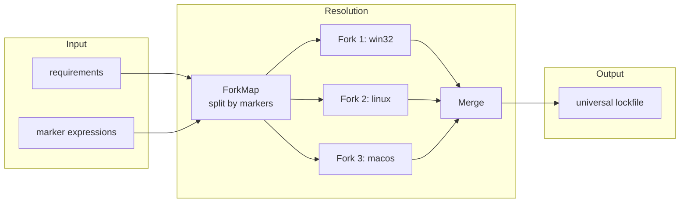

# uv · 架構

## 高層架構

uv 使用 **multi-crate Rust workspace**，約 58 個 crate 組成。不像傳統 Python 套件管理工具把功能寫在一個大 package 裡，uv 把每個職責拆成獨立的 Rust crate，形成一個依賴圖清晰的層級架構。

```mermaid
flowchart TB
    subgraph "CLI Layer"
        CLI[uv CLI<br/>crates/uv]
        CLIDef[uv-cli<br/>crates/uv-cli]
    end

    subgraph "Dispatch Layer"
        Dispatch[uv-dispatch<br/>crates/uv-dispatch]
    end

    subgraph "Resolution Core"
        Resolver[uv-resolver<br/>crates/uv-resolver]
        Lock[uv.lock / pylock.toml<br/>crates/uv-resolver/src/lock]
        Manifest[Manifest<br/>crates/uv-resolver/src/manifest]
        PubGrub[pubgrub<br/>resolution algorithm]
    end

    subgraph "Installation"
        Installer[uv-installer<br/>crates/uv-installer]
        WheelInstall[uv-install-wheel<br/>crates/uv-install-wheel]
    end

    subgraph "Build System"
        BuildFrontend[uv-build-frontend<br/>crates/uv-build-frontend]
        BuildBackend[uv-build-backend<br/>crates/uv-build-backend]
    end

    subgraph "Network & Registry"
        Client[uv-client<br/>crates/uv-client]
        Distribution[uv-distribution<br/>crates/uv-distribution]
        Registry[PyPI / Custom Index]
    end

    subgraph "Python Management"
        Python[uv-python<br/>crates/uv-python]
        VirtualEnv[uv-virtualenv<br/>crates/uv-virtualenv]
    end

    subgraph "Infrastructure"
        Cache[uv-cache<br/>crates/uv-cache]
        Config[uv-settings<br/>crates/uv-settings]
        Workspace[uv-workspace<br/>crates/uv-workspace]
        Git[uv-git<br/>crates/uv-git]
        FS[uv-fs<br/>crates/uv-fs]
        Pep440[uv-pep440<br/>crates/uv-pep440]
        Pep508[uv-pep508<br/>crates/uv-pep508]
    end

    CLI --> CLIDef
    CLI --> Dispatch
    Dispatch --> Resolver
    Dispatch --> Installer
    Dispatch --> BuildFrontend
    Dispatch --> Distribution
    Resolver --> Client
    Resolver --> Pep440
    Resolver --> Pep508
    Resolver --> Manifest
    Resolver --> Lock
    Installer --> WheelInstall
    Installer --> Client
    BuildFrontend --> BuildBackend
    Distribution --> Client
    Distribution --> BuildFrontend
    Client --> Registry
    Python --> Cache
    Python --> VirtualEnv
    CLI --> Config
    CLI --> Workspace
    CLI --> Cache
    CLI --> Git
    CLI --> FS
```

### 圖意說明

上圖展示 uv 的四層架構：最上層是 CLI 層（`uv` crate + `uv-cli`），負責參數解析與命令調度。中間層是「Dispatch Layer」，只有 `uv-dispatch` 一個 crate，作用是打破 cyclic dependency。第三層是核心功能層（resolution、installation、build、network），每個都是獨立 crate。最底層是基礎設施（cache、fs、git、PEP 規範實作等）。箭頭代表依賴方向，可以看到 `uv-dispatch` 作為樞紐，協調 resolver、installer、build 三者的互動。

## 核心模組職責

| Crate | 職責 | 位置 |
|-------|------|------|
| `uv` | CLU 入口與命令調度，組合所有 crate | [`crates/uv/src/lib.rs`](https://github.com/astral-sh/uv/blob/135a363/crates/uv/src/lib.rs) |
| `uv-cli` | CLI 參數定義（clap derive） | [`crates/uv-cli/src/lib.rs`](https://github.com/astral-sh/uv/blob/135a363/crates/uv-cli/src/lib.rs) |
| `uv-dispatch` | 打破 resolver/installer/build 的循環依賴 | [`crates/uv-dispatch/src/lib.rs`](https://github.com/astral-sh/uv/blob/135a363/crates/uv-dispatch/src/lib.rs) |
| `uv-resolver` | Universal dependency resolver（PubGrub） | [`crates/uv-resolver/src/resolver/mod.rs`](https://github.com/astral-sh/uv/blob/135a363/crates/uv-resolver/src/resolver/mod.rs) |
| `uv-installer` | 套件安裝編排 | [`crates/uv-installer/src/lib.rs`](https://github.com/astral-sh/uv/blob/135a363/crates/uv-installer/src/lib.rs) |
| `uv-client` | PyPI registry HTTP 客戶端 | [`crates/uv-client/src/lib.rs`](https://github.com/astral-sh/uv/blob/135a363/crates/uv-client/src/lib.rs) |
| `uv-python` | Python 直譯器探索與管理 | [`crates/uv-python/src/lib.rs`](https://github.com/astral-sh/uv/blob/135a363/crates/uv-python/src/lib.rs) |
| `uv-build-frontend` | Source distribution 編譯（PEP 517） | [`crates/uv-build-frontend/src/lib.rs`](https://github.com/astral-sh/uv/blob/135a363/crates/uv-build-frontend/src/lib.rs) |
| `uv-workspace` | Cargo 風格 workspace 探索與管理 | [`crates/uv-workspace/src/lib.rs`](https://github.com/astral-sh/uv/blob/135a363/crates/uv-workspace/src/lib.rs) |
| `uv-settings` | 多層配置系統載入與合併 | [`crates/uv-settings/src/lib.rs`](https://github.com/astral-sh/uv/blob/135a363/crates/uv-settings/src/lib.rs) |
| `uv-cache` | 全域套件快取管理 | [`crates/uv-cache/src/lib.rs`](https://github.com/astral-sh/uv/blob/135a363/crates/uv-cache/src/lib.rs) |
| `uv-git` | Git dependency 處理 | [`crates/uv-git/src/lib.rs`](https://github.com/astral-sh/uv/blob/135a363/crates/uv-git/src/lib.rs) |

## 關鍵設計決策與取捨

### 1. uv-dispatch：循環依賴破壞者（Decoupling Pattern）

**問題**：`uv-resolver` 需要 `uv-build-frontend` 來取得 source dist 的 metadata（因為要先 build 才能知道依賴），但 `uv-build-frontend` 也需要 resolver 的結果來決定 build 順序——經典的循環依賴。

**uv 的做法**：建立一個獨立的 `uv-dispatch` crate，只包含 `BuildDispatch` struct，它實作 `BuildContext` trait（定義在 `uv-types`），既不屬於 resolver 也不屬於 installer。`uv-dispatch` 知道所有相關 crate 的存在，而其他 crate 只需要跟 `BuildContext` trait 互動。

**Trade-off**：
- ✅ 避免循環依賴，保持 crate 間的單向依賴圖
- ✅ 減少編譯時間（每個 crate 的變更範圍可控）
- ❌ `BuildDispatch` 的 `new()` 接受 ~20 個參數（見 [`uv-dispatch/src/lib.rs:138-189`](https://github.com/astral-sh/uv/blob/135a363/crates/uv-dispatch/src/lib.rs#L138-L189)）——這是「把所有 needed 東西傳進來」的模式，不是 DI container。當參數過多時，新增一個欄位就要改所有呼叫點

**替代方案**：Python 生態的 `pip` 用 module-level global state 解決這個問題（monkeypatching build backend）。uv 的 Rust trait-based 方案更強型別安全，但靜態性也更強。

### 2. Universal resolver（多平台單一 lockfile）

**問題**：Python 套件依賴有 marker expression（`sys_platform == "win32"`、`python_version >= "3.10"`），不同平台需要不同版本的套件。傳統 lockfile（Poetry、pip-tools）只鎖當前平台，CI/CD 或團隊協作時會出問題。

**uv 的做法**：Resolver 在解析時考慮所有 marker expression 分支，對每個分支獨立解版本，最後合併成單一 lockfile。See: [`uv-resolver/src/resolver/environment.rs`](https://github.com/astral-sh/uv/blob/135a363/crates/uv-resolver/src/resolver/environment.rs) 中的 `ForkingPossibility` 和 `fork_version_by_marker`。

**Trade-off**：
- ✅ 一次 lock 所有平台，團隊協作不再被 platform-specific lockfile 困擾
- ✅ CI 可以 pull lockfile 後直接 sync，不跑 resolve
- ❌ Resolution 時間較長（因為同時解多個「環境維度」）
- ❌ Lockfile 很大（uv.lock 動輒數千行），對 diff review 不友善
- ✅ uv 用 `UniversalMarker` 記錄每個依賴適用的 marker 範圍，resolution graph 是帶標記的 DAG

**替代方案**：Poetry 只在單一平台上 lock，然後祈禱跨平台不會有問題。pip-tools 根本不產 lockfile。PDM 也有 universal lockfile 但實作方式不同。

### 3. Workspace 系統（Cargo 風格搬進 Python）

**問題**：大型 Python monorepo 有多個 package，每個都有自己的 `pyproject.toml`，但共享依賴版本。管理這些 package 之間的依賴關係很麻煩。

**uv 的做法**：引入 Cargo workspace 概念。根目錄的 `pyproject.toml` 可以定義 `[tool.uv.workspace]` 來宣告 members，每個 member 有獨立的 `pyproject.toml`，但共享一個 `uv.lock`。

**關鍵實作**：`Workspace::discover()` 從當前目錄往上搜尋 workspace root，使用 `WorkspaceCache` 來避免重複搜尋。見 [`crates/uv-workspace/src/workspace.rs`](https://github.com/astral-sh/uv/blob/135a363/crates/uv-workspace/src/workspace.rs)。

**Trade-off**：
- ✅ 大型專案只要 sync 一次，所有 member 的依賴一次裝好
- ✅ 依賴版本一致性（不會發生 package A 用 requests 2.28、package B 用 2.31）
- ❌ 想把一個 member 獨立出去時，lockfile 會包含不需要的依賴
- ❌ Workspace 的 member discovery 是 I/O 密集操作（掃描檔案系統），uv 用 cache 緩解但仍有限

### 4. 配置層疊（Combine Pattern）

**問題**：使用者可能從多個來源設定 uv 的行為：CLI 參數、目錄的 `uv.toml`、使用者層級的 `~/.config/uv/uv.toml`、系統層級的 `/etc/uv/uv.toml`。合併順序很重要。

**uv 的做法**：定義 `FilesystemOptions` 和 `Options` struct，透過 `Combine` trait 來定義合併行為。合併順序是：專案配置 > 使用者配置 > 系統配置。見 [`crates/uv-settings/src/combine.rs`](https://github.com/astral-sh/uv/blob/135a363/crates/uv-settings/src/combine.rs)。

**關鍵實現**：
- `FilesystemOptions::find()` — 從指定目錄往上搜尋 `uv.toml` 或 `pyproject.toml`（`[tool.uv]` 區段）
- 優先級：`CLI --config-file > 專案 uv.toml > ~/.config/uv/uv.toml > /etc/uv/uv.toml`
- PEP 723 script 的 `// requirements` 內嵌 metadata 也算一層配置來源

**Trade-off**：
- ✅ 多層配置靈活，使用者可以設全域 proxy 但專案級 overwrite
- ❌ `Combine` trait 需要每個欄位手動定義合併邏輯——對複雜型別（如 enum）容易遺漏邊界情況
- ✅ 相較於 pip 的 `pip.conf` 只有兩層（global + user），uv 的四層更貼近實際需求

## 公開 vs 內部界線

uv 的 crate 邊界就是公開 / 內部界線：

- **公開 API**：每個 crate 的 `pub` 標記就是它的 contract。`uv` crate 的 `pub fn main()` 是 CLI 入口（[`crates/uv/src/lib.rs`](https://github.com/astral-sh/uv/blob/135a363/crates/uv/src/lib.rs)），被 `crates/uv/src/bin/uv.rs` 呼叫
- **內部**：每個 crate 的 `pub(crate)` 或 private 函式。`crates/uv/src/` 下的 `commands/` 目錄是內部實作
- **Breaking change 處理**：所有 crate 版本都鎖在 `0.0.49`（除了 `uv-version` 是 `0.11.16`），表示 Astral 認為 crate 內的 API 還不穩定。CLI 的穩定保證透過 `clap` derive macro 維護

## 測試策略

- **單元測試**：分散在各 crate 的 `#[cfg(test)] mod tests` 中
- **整合測試**：位於 `crates/uv/tests/`，使用 `assert_cmd` 和 `assert_fs` 進行 CLI 層級的端到端測試
- **Property-based**：使用 `insta` snapshot testing 來比較 resolution 結果的變更
- **CI 矩陣**：跨 Linux/macOS/Windows、多個 Python 版本（3.8–3.13）和 Rust stable/nightly

## 發布與版本管理

- **版本策略**：SemVer 嚴格管控（即使仍在 0.x，breaking change 透過 minor bump 標記）
- **Changelog**：[`CHANGELOG.md`](https://github.com/astral-sh/uv/blob/135a363/CHANGELOG.md) 詳細記錄每版的變更，超過 51,000 字
- **Release 流程**：GitHub Actions 自動化，每日或每兩日發佈
- **支援 Python 版本**：3.8–3.13
