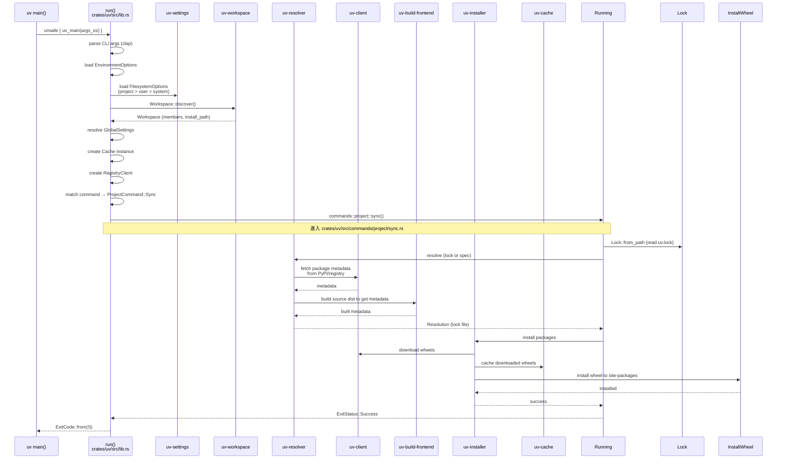

# uv · 程式碼追蹤

## 追蹤的場景

我們追蹤 `uv sync` 在一個專案目錄下的完整執行路徑。這是 uv 最核心的 workflow：解析依賴 → 編譯 source dist → 安裝 wheel。過程中涉及 workspace 發現、配置載入、resolver、build frontend、installer 等多個 crate 的協作。

## 流程圖



### 圖意說明

這張 sequence diagram 展示 `uv sync` 的主要互動流程。從入口 `main()` 開始，經過初始化（配置加載、workspace 探索、cache/registry 設定），到執行階段（讀取 lockfile → 確認 resolution → 安裝套件）。需要注意的是，`uv-build-frontend` 只在 source dist 尚未被 cache 時被呼叫；若 cache 中已有 wheel，則跳過 build 步驟。

## 逐步追蹤

### Step 1: 程式入口

[`crates/uv/src/bin/uv.rs:11-13`](https://github.com/astral-sh/uv/blob/135a363/crates/uv/src/bin/uv.rs#L11-L13)

```rust
fn main() -> ExitCode {
    unsafe { uv_main(std::env::args_os()) }
}
```

整個 binary 的入口極簡。`uv_main()` 定義在 `crates/uv/src/lib.rs:12-13`（位於 `main` function 宣告處），接收 `OsString` 參數列。

值得注意：這裡用了 `unsafe` 是因為要在 main thread 上執行但尚未 spawn 任何 threads（memory allocator 的全局初始化是 unsafe 的）。

### Step 2: CLI 參數解析

[`crates/uv/src/lib.rs:93`](https://github.com/astral-sh/uv/blob/135a363/crates/uv/src/lib.rs#L93) — `async fn run(cli: Cli)`

`clap` 的 `Parser` derive macro 把參數解析成 `Cli` struct。uv 的 CLI 設計分成五大 namespace：`Pip`、`Project`、`Tool`、`Python`、`Workspace`（再加上 `Auth`、`Cache`、`Self` 等較小的 namespace）。

### Step 3: 配置層疊載入

[`crates/uv/src/lib.rs:264-301`](https://github.com/astral-sh/uv/blob/135a363/crates/uv/src/lib.rs#L264-L301)

這是最複雜的初始化步驟：

1. 先從 CLI 檢查 `--config-file`，若有則直接載入該檔案
2. 若無，則 `Workspace::discover()` 找到 workspace root
3. 從 workspace root 往下找 `uv.toml` 或 `pyproject.toml` 中的 `[tool.uv]`
4. 用 `.combine()` 依序合併：project config → user config → system config

### Step 4: Workspace 探索

[`crates/uv-workspace/src/workspace.rs`](https://github.com/astral-sh/uv/blob/135a363/crates/uv-workspace/src/workspace.rs)

`Workspace::discover()` 接收一個目錄路徑和 `DiscoveryOptions`，從該目錄往上搜尋 workspace root。判斷方式：

1. 若目錄有 `pyproject.toml` 且內含 `[tool.uv.workspace]` → 此為 workspace root
2. 若目錄有 `pyproject.toml` 但無 workspace section → 此為 single-project workspace
3. 往上遞迴直到根目錄

`WorkspaceCache` 用來避免反覆搜尋同一目錄。

### Step 5: 命令分發

[`crates/uv/src/lib.rs:542-end`](https://github.com/astral-sh/uv/blob/135a363/crates/uv/src/lib.rs#L542) — `match *cli.command`

這裡有一個巨大的 `match` 表達式涵蓋所有命令。例如 `Commands::Project(command)` 且 command 是 `ProjectCommand::Sync(args)` 時，呼叫 `commands::sync()`。

每個命令分支都經歷：
1. 從 CLI args + filesystem config 解析出命令專屬的 `Settings`（如 `SyncSettings`）
2. 呼叫對應的 `commands::{namespace}::{command}` 函式

### Step 6: Resolution（核心路徑）

[`crates/uv-resolver/src/resolver/mod.rs:100`](https://github.com/astral-sh/uv/blob/135a363/crates/uv-resolver/src/resolver/mod.rs#L100) — `pub struct Resolver`

`Resolver` 是 uv 最複雜的元件。它用 `pubgrub` crate 實作依賴解析：

1. **Input**: `Manifest`（包含所有 requirements、constraints、overrides、source tree 編輯策略）
2. **Algorithm**: PubGrub（一種 CDCL-based 的版本求解演算法，類似 SAT solver 的簡化版）
3. **Fork handling**: 遇到 marker expression 時（如 `sys_platform == "win32"`），resolver 會 fork 成獨立的路徑，各自解版本後再合併

關鍵資料結構：
- `InMemoryIndex` — 快取已取得的 package metadata（[`crates/uv-resolver/src/resolver/index.rs`](https://github.com/astral-sh/uv/blob/135a363/crates/uv-resolver/src/resolver/index.rs)）
- `ForkIndexes` — 管理 fork 分支的 index（[`crates/uv-resolver/src/fork_indexes.rs`](https://github.com/astral-sh/uv/blob/135a363/crates/uv-resolver/src/fork_indexes.rs)）
- `BatchPrefetcher` — 並行 prefetch package versions 以加速 resolution（[`crates/uv-resolver/src/resolver/batch_prefetch.rs`](https://github.com/astral-sh/uv/blob/135a363/crates/uv-resolver/src/resolver/batch_prefetch.rs)）

### Step 7: Source build（若需要）

[`crates/uv-build-frontend/src/lib.rs`](https://github.com/astral-sh/uv/blob/135a363/crates/uv-build-frontend/src/lib.rs)

當 resolver 需要 source dist 的 metadata（而 cache 沒有）時：
1. `BuildDispatch` 實作 `BuildContext` trait
2. 下載 source dist 到暫存目錄
3. 用 PEP 517 build hook（如 `python -m build --wheel`）編譯成 wheel
4. 提取 metadata，存回 cache

`SourceBuild` struct 封裝了 build 的隔離環境（virtualenv + pip install build deps）。

### Step 8: 安裝

[`crates/uv-installer/src/lib.rs`](https://github.com/astral-sh/uv/blob/135a363/crates/uv-installer/src/lib.rs)

`Installer` 執行最後的安裝步驟：
1. `SitePackages` 檢查目前 site-packages 狀態
2. `Planner` 決定哪些 wheel 需要下載、哪些可以直接 link
3. `Preparer` 下載並解壓 wheels（使用 `uv-extract` 和 `uv-cache`）
4. `Installer` 執行 link 操作（hardlink/copy/clone/clone-to-temp/reef 模式）

## 想學更多時，在哪裡下中斷點

- CLI 入口: [`crates/uv/src/lib.rs:93`](https://github.com/astral-sh/uv/blob/135a363/crates/uv/src/lib.rs#L93) — `async fn run()`
- 命令分發: [`crates/uv/src/lib.rs:542`](https://github.com/astral-sh/uv/blob/135a363/crates/uv/src/lib.rs#L542) — `match *cli.command`
- Workspace 發現: [`crates/uv-workspace/src/workspace.rs`](https://github.com/astral-sh/uv/blob/135a363/crates/uv-workspace/src/workspace.rs) — `Workspace::discover()`
- Resolver 主迴圈: [`crates/uv-resolver/src/resolver/mod.rs:100`](https://github.com/astral-sh/uv/blob/135a363/crates/uv-resolver/src/resolver/mod.rs#L100) — `Resolver::resolve()`
- Fork 分支處理: [`crates/uv-resolver/src/resolver/environment.rs`](https://github.com/astral-sh/uv/blob/135a363/crates/uv-resolver/src/resolver/environment.rs)
- Build dispatch: [`crates/uv-dispatch/src/lib.rs:109`](https://github.com/astral-sh/uv/blob/135a363/crates/uv-dispatch/src/lib.rs#L109) — `BuildDispatch`
- 安裝 pipeline: [`crates/uv-installer/src/lib.rs`](https://github.com/astral-sh/uv/blob/135a363/crates/uv-installer/src/lib.rs) — `Installer::install()`

## 沒追蹤到但值得留意

- **Error path**: 如果 resolve 失敗，`uv-resolver` 會產出 `NoSolutionError` 並嘗試生成 `PubGrubHint`（用 PubGrub 的 conflict 分析來給使用者可讀的錯誤訊息）
- **`uv add` 流程**: 比 `uv sync` 多一個步驟——先修改 `pyproject.toml` 再加入套件到 lockfile，最後 sync。修改 `pyproject.toml` 使用 `pyproject_mut.rs` 來保留原格式和註解
- **`uv run` 流程**: 會先確保環境是 synced 狀態，再 spawn 子行程執行目標指令。PEP 723 script 也走這條路徑
