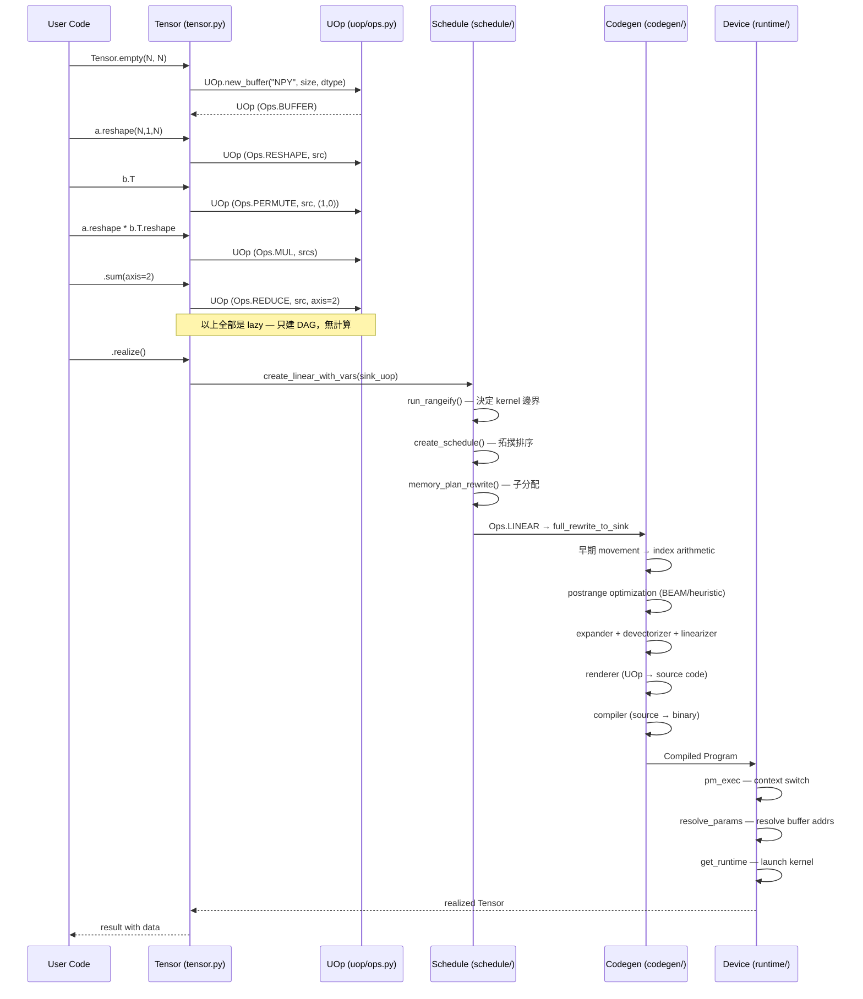

# tinygrad · 程式碼追蹤

## 追蹤的場景

**場景**: 執行 README 中的矩陣乘法範例（batch matmul → sum → realize），追蹤從 Python API 呼叫到 GPU kernel 執行的完整路徑：

```sh
DEBUG=3 python3 -c "from tinygrad import Tensor; \
  N = 1024; a, b = Tensor.empty(N, N), Tensor.empty(N, N); \
  (a.reshape(N, 1, N) * b.T.reshape(1, N, N)).sum(axis=2).realize()"
```

## 流程圖



### 圖意說明

關鍵洞察：**realize() 之前，整個操作鏈沒有任何計算或 kernel 生成**。Tensors 之間傳遞的是 UOp DAG 的參考，所有的 shape 推導、broadcast 決策都在 UOp 層級靜態完成。直到 `realize()` 才觸發排程器（`create_linear_with_vars`），經過排程（decide kernel boundaries）→編譯（rewrite + optimize）→渲染（source generation）→編譯器（machine code）→執行（kernel launch）。

## 逐步追蹤

### Step 1: Tensor 建立（lazy buffer allocation）

[`tinygrad/tensor.py:114`](https://github.com/tinygrad/tinygrad/blob/149a87d/tinygrad/tensor.py#L114)

```python
# Tensor.empty(N, N) → 最終呼叫
data = UOp.const(_dtype or dtypes.default_float, 0, _device)
```

但`Tensor.empty()` 實際上調用 `UOp.new_buffer(...)` 建立一個 buffer UOp（參考 [`tensor.py:41-45`](https://github.com/tinygrad/tinygrad/blob/149a87d/tinygrad/tensor.py#L41) 中的 `_fromnp` helper）。此時 no actual allocation 發生 — UOp 的 `.buffer` 屬性是 lazy，只有在 realize 時才會真正 allocate host/device memory。

### Step 2: 運算圖建立（shape manipulation）

[`tinygrad/tensor.py:159`](https://github.com/tinygrad/tinygrad/blob/149a87d/tinygrad/tensor.py#L159)

```python
def alu(self, op: Ops, *src: Tensor) -> Tensor:
  return self._apply_uop(lambda *u: u[0].alu(op, *u[1:]), *src)
```

`.reshape()` 和 `.T` 透過 `OpMixin`（繼承自 [`mixin/__init__.py`](https://github.com/tinygrad/tinygrad/blob/149a87d/tinygrad/mixin/__init__.py)）建立 `Ops.RESHAPE` / `Ops.PERMUTE` UOp。`*` 運算透過 `__mul__` → `alu(Ops.MUL, ...)` 建立 `Ops.MUL` UOp。`.sum(axis=2)` 建立 `Ops.REDUCE` UOp。

每個運算都透過 `_apply_uop`（[`tensor.py:147`](https://github.com/tinygrad/tinygrad/blob/149a87d/tinygrad/tensor.py#L147)）建立新的 Tensor 包裹新 UOp。注意 `_apply_uop` 不使用 `__init__`（而是 `Tensor.__new__`），避免不必要的型別檢查 overhead。

**此步驟無任何計算，只有 shape 類型推導**。

### Step 3: realize() — 排程觸發

[`tinygrad/tensor.py`](https://github.com/tinygrad/tinygrad/blob/149a87d/tinygrad/tensor.py) 中的 `.realize()` 方法：

```python
# tensor.py 內部，透過 run_linear 執行
from tinygrad.engine.realize import run_linear
```

這觸發 `create_linear_with_vars`（[`schedule/__init__.py:122`](https://github.com/tinygrad/tinygrad/blob/149a87d/tinygrad/schedule/__init__.py#L122)），它接受"big SINK"（所有 scope 內 tensors 的 uop 的集合）進行排程。

### Step 4: run_rangeify — 決定 kernel 邊界

[`schedule/indexing.py:148`](https://github.com/tinygrad/tinygrad/blob/149a87d/tinygrad/schedule/indexing.py#L148)

這是最關鍵的步驟。反向拓撲遍歷 UOp DAG，決定：
- 哪些 intermediate UOp 需要 materialize（分配獨立 buffer）
- 每個 UOp 所在的計算範圍（range）

**運作方式**：
1. 模式匹配（[`indexing.py:30-34`](https://github.com/tinygrad/tinygrad/blob/149a87d/tinygrad/schedule/indexing.py#L30)）: `COPY`、`CONTIGUOUS`、`STORE` 類 ops 強制 realize；`MSELECT`、`MSTACK` 的來源也強制 realize
2. 對於其他 ops，若一個 node 有 >1 個 consumer 且 range 不相容，則插入 `Ops.STAGE`（force materialize）（[`indexing.py:196-220`](https://github.com/tinygrad/tinygrad/blob/149a87d/tinygrad/schedule/indexing.py#L196)）
3. Movement ops（RESHAPE/PERMUTE/SHRINK/PAD）不消耗 buffer — 它們被轉換為 index 變換（[`indexing.py:129-145`](https://github.com/tinygrad/tinygrad/blob/149a87d/tinygrad/schedule/indexing.py#L129) `apply_movement_op`）

**以我們的 matmul 為例**：
- `.reshape(1024,1,1024)` 和 `.reshape(1,1024,1024)` 是 RESHAPE → 變成 index 變換，不產生新 buffer
- `b.T` 是 PERMUTE → 變成 index permutation，不產生新 buffer
- `*`（MUL）是 elementwise → 可能 fuse 到同一個 kernel
- `.sum(axis=2)`（REDUCE）需要完整 kernel → 這是最終需要的 kernel

結果：**一個 fused kernel**（MUL + REDUCE 融合成一個 REDUCE/MUL kernel），無需中間 buffer。

### Step 5: create_schedule — 拓撲排序

[`schedule/__init__.py:21`](https://github.com/tinygrad/tinygrad/blob/149a87d/tinygrad/schedule/__init__.py#L21)

從 `Ops.AFTER` 節點萃取 kernel 依賴圖（[`__init__.py:24-50`](https://github.com/tinygrad/tinygrad/blob/149a87d/tinygrad/schedule/__init__.py#L24)），用 Kane's algorithm（deque-based topological sort）產出 linear sequence（[`__init__.py:52-66`](https://github.com/tinygrad/tinygrad/blob/149a87d/tinygrad/schedule/__init__.py#L52)）。

輸出：`Ops.LINEAR(src=(Ops.CALL(uop=body, args=buffers), ...))`。

### Step 6: memory_plan_rewrite — 子分配

[`schedule/memory.py:20`](https://github.com/tinygrad/tinygrad/blob/149a87d/tinygrad/schedule/memory.py#L20)

TLSF（Two-Level Segregated Fit）分配器（[`schedule/memory.py:43-52`](https://github.com/tinygrad/tinygrad/blob/149a87d/tinygrad/schedule/memory.py#L43)）將所有 buffer 子分配到共享 arena。對於我們這個只有一個 kernel、沒有中間 buffer 的案例，這個階段很輕量。

### Step 7: full_rewrite_to_sink — 編譯 pipeine

[`codegen/__init__.py:27`](https://github.com/tinygrad/tinygrad/blob/149a87d/tinygrad/codegen/__init__.py#L27)

編譯管線對 kernel AST 執行一系列 rewrite pass：

1. **Early movement ops**（`pm_mops`）— RESHAPE/PERMUTE 等被轉換為 index 算術
2. **Load collapse + range splitting** — 合併連續 load，分割多維 range
3. **Postrange optimization**（`apply_opts` [`codegen/opt/__init__.py:335`](https://github.com/tinygrad/tinygrad/blob/149a87d/tinygrad/codegen/opt/postrange.py#L335)）— 若 BEAM≥1，啟動 BEAM search 遍歷數十種 schedule 變體
4. **Expander**（`expander.py:94`）— UNROLL 展開為向量化操作
5. **Devectorizer**（`devectorizer.py`）— 向量→scalar load+ALU+store
6. **Lowering** — 分解不支援的 ops，降低 index dtype
7. **Linearizer**（`linearizer.py:7`）— 優先級拓撲排序為 instruction list

### Step 8: Renderer → Compiler → Binary

[`codegen/__init__.py:166-172`](https://github.com/tinygrad/tinygrad/blob/149a87d/tinygrad/codegen/__init__.py#L166) `pm_to_program` chain：

1. **do_render** — `CStyleLanguage.base_rewrite` 或其他 renderer 將 UOp→source code（C/CUDA/Metal/LLVM IR）
2. **do_compile** — `compile_cached(src)` 透過外部 compiler（nvrtc/clang/tcc）產出 binary
3. **do_linearize** — 產出指令 list 供隨後 exec

### Step 9: run_linear — Kernel Execution

[`engine/realize.py:127-240`](https://github.com/tinygrad/tinygrad/blob/149a87d/tinygrad/engine/realize.py#L127) `ExecContext` 透過 `pm_exec` dispatch：

```
Ops.PROGRAM → exec_kernel → resolve_params → get_runtime() → GPU kernel launch
```

`resolve_params()` 將 PARAM UOp 映射到實際 buffer pointers。`get_runtime()` 取得 compiled `Program` 物件，最終呼叫 `cuLaunchKernel`（CUDA）/ `dispatchThreadgroups`（Metal）/ `exec_kernel`（HCQ）。

## 想學更多時，在哪裡下中斷點

- 想看 UOp DAG 長什麼樣 → `DEBUG=3` 啟用 kernel 追蹤（`uop/render.py:145` `pyrender`）
- 想看生成的 kernel code → `DEBUG=4`（`codegen/__init__.py` render pass log）
- 想看排程決策 → `DEBUG=2`（`schedule/__init__.py` 的 schedule 輸出）
- 想看 BEAM search 結果 → `BEAM=1`（`codegen/opt/search.py` 的 timing log）
- 想看哪種 ops 被發送到哪個裝置 → `device.py:28` `__get_canonicalized_item` 的 debug print
- 想看 buffer allocation → `schedule/memory.py:43` TLSF allocator log

## 沒追蹤到但值得留意

- **多裝置路徑**: 當 Device 指定為 tuple（如 `("CUDA:0", "CUDA:1")`），`schedule/multi.py` 的 `multi_pm` 會介入，插入 `Ops.MSELECT`/`Ops.MSTACK` 進行跨裝置分發
- **JIT 路徑**: 若用 `TinyJit` 包裹，cnt=1 時會 capture 所有 kernel 進單一 `LINEAR` DAG，後續呼叫跳過編譯直接重播 — 這是固定的 warm-up 成本 vs. 快速重播的 trade-off
- **Graph batching**: 若裝置支援 graph（CUDA/Metal/HCQ），連續的 kernel calls 會被打包成 `CUSTOM_FUNCTION("graph")` 批次執行
