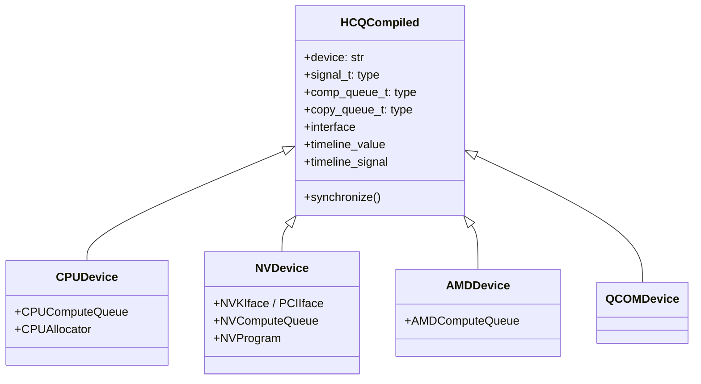

# tinygrad · 值得偷學的設計

## Pattern 1: 單一 IR（UOp）貫穿全管線

**是什麼**:

tinygrad 使用 **一種** IR（`UOp` DAG）貫穿排程→編譯→執行三階段的整個 pipeline。排程器的輸出是 UOp DAG，編譯器的輸入也是 UOp DAG，執行器的 dispatch table 也匹配 UOp 的 Ops 類型。

**為什麼有效**:

典型的 DL compiler（如 PyTorch 的 Inductor、TVM）使用多層 IR：high-level IR（如 TorchIR）→ mid-level（如 TIR）→ low-level（如 LLVM IR），每層有自己的變換 pass。tinygrad 的單一 IR 避免了：
- **IR 轉換成本** — 不需要寫 IR-to-IR converter
- **除錯斷層** — 不需要同時追蹤多層 IR 來理解一個 bug
- **維護負擔** — `PatternMatcher` + `UOp` 是唯一需要理解的抽象

**程式碼位置**: `UOp` dataclass 在 [`uop/ops.py:127`](https://github.com/tinygrad/tinygrad/blob/149a87d/tinygrad/uop/ops.py#L127)，`Ops` enum 在 [`uop/__init__.py:13`](https://github.com/tinygrad/tinygrad/blob/149a87d/tinygrad/uop/__init__.py#L13)

**何時可以借用**:

- 當你的 compiler 或 framework 的 IR 層次數少於 3 層時 — 單一 IR 省下的程式碼量非常可觀
- 當 hackability 比 peak performance 更重要時 — 單一 IR 讓新人可以在一個週末內理解完整 pipeline
- 當你的 pipeline 不需要高度專業化的低階優化（如 LLVM 的 mem2reg、GVN、LICM）

**替代方案**:

| 方案 | 代表 | 優點 | 缺點 |
|------|------|------|------|
| 單一 IR（UOp） | tinygrad | 簡單、可讀、無轉換成本 | 無法對特定階段深度優化 |
| 多層 IR | TVM / PyTorch Inductor | 每層可做最佳化 | IR converter 維護成本高 |
| 嵌入 compiler（MLIR） | TensorFlow / JAX | 共用生態系、強力優化 | 依賴複雜的 C++ codebase |

**注意事項**:

單一 IR 的 scalability 瓶頸在於：當你需要在不同 stage 保留不同語意時，所有 Ops 都必須 `UOp` 的結構。這意味著 schedule 階段的 `Ops.SINK`/`Ops.LINEAR` 跟 codegen 階段的 `Ops.LOAD`/`Ops.STORE` 共用同一個命名空間。當 Ops 數量成長到上百個時，命名衝突和 pattern matching 的 ambiguity 會成為問題。

---

## Pattern 2: PatternMatcher 作為統一的變換引擎

**是什麼**:

tinygrad 幾乎所有程式變換都是用 `PatternMatcher` + `graph_rewrite` 完成的 — 排程、編譯優化、代碼生成、autograd gradient 計算，甚至執行 dispatch。

```python
# 一個典型的 PatternMatcher 規則
pm_gradient = PatternMatcher([
  (UPat(Ops.ADD), lambda ctx: (ctx, ctx)),  # 加法梯度: 上游梯度分給兩個輸入
  (UPat(Ops.MUL, name="ret"), lambda ctx, ret: (ctx * ret.src[1], ctx * ret.src[0])),
])
```

**為什麼有效**:

- **規則可以被組合**：`pm1 + pm2` 合併為一個 `PatternMatcher`，不需要手動協調
- **新增優化 pass 的邊際成本極低**：只需要寫 `(UPat(...), lambda ...)` 一行
- **graph_rewrite 保證收斂**：使用 bottom-up/top-down walk，直到沒有匹配為止（fixed point iteration）
- **每個規則都是獨立的**：移除/新增一個規則不會影響其他規則（不像手寫的 AST visitor 那樣 fragile）

**程式碼位置**: `PatternMatcher` 類別在 [`uop/ops.py:1299`](https://github.com/tinygrad/tinygrad/blob/149a87d/tinygrad/uop/ops.py#L1299)，`graph_rewrite` 在 [`uop/ops.py:1584`](https://github.com/tinygrad/tinygrad/blob/149a87d/tinygrad/uop/ops.py#L1584)

**何時可以借用**:

- 當你有大量 tree/graph 上的變換規則（常見於 compiler、query optimizer、gradient system）
- 當你需要使用者或 plugin 擴充變換規則
- 當你的規則數 > 10 時，PatternMatcher 比手寫 visitor 好維護

**替代方案**:

- **Visitor pattern**（PyTorch FX）：手寫 `visit_Node` 方法，每種 node type 一個 method。優點是型別安全，缺點是新增規則需要改 class
- **TIR in TVM**：類似 pattern matching 但綁定 TVM 的 IR
- **MLIR Rewrite**：C++ template-based，效能極好但學習曲線陡

**注意事項**:

PatternMatcher 使用 Python lambda/Python function 作為 rewrite handler，每個規則都是單獨的函式呼叫。在數千個規則的場景下（像 LLVM 的 pass manager），Python 的 dispatch overhead 可能成為瓶頸。tinygrad 目前約 50-100 個規則，還在可接受範圍。

---

## Pattern 3: 內建 BEAM Search（Autotuning 整合進編譯器）

**是什麼**:

tinygrad 的 codegen 內建 BEAM search 自動調優機制。給定一個 kernel AST，它會：
1. 產生 N 種可能的 schedule 變體（不同 UPCAST、LOCAL memory、UNROLL 參數組合）
2. 對每個變體執行快速編譯（`_try_compile`）
3. 對前幾名變體實際在 GPU 上計時
4. 選取最快的作為最終 kernel

```python
# codegen/opt/search.py:114 — beam_search 核心
def beam_search(scheduler, amt, allow_test=True, ...):
  while True:
    candidates = [(s, to_program(s.ast)) for s in get_kernel_actions(scheduler)]
    times = [time_program(p) for p in candidates]
    keep top `amt` candidates
```

**為什麼有效**:

- **對硬體拓撲完全無知也可找出優化策略** — 不需要知道 SIMT width、shared memory size、register pressure
- **跨 GPU 架構的優化自動適應** — 同一份 kernel 在 A100 vs H100 vs RTX 4090 上會自動選取不同的 schedule
- **比 heuristic 穩定** — 不需要維護 GPU-specific 的優化規則

**程式碼位置**: BEAM search 核心在 [`codegen/opt/search.py:114`](https://github.com/tinygrad/tinygrad/blob/149a87d/tinygrad/codegen/opt/search.py#L114)，heuristic fallback 在 [`codegen/opt/heuristic.py:8`](https://github.com/tinygrad/tinygrad/blob/149a87d/tinygrad/codegen/opt/heuristic.py#L8)

**何時可以借用**:

你的 code generator 滿足以下條件時：
- 有明確的 schedule 參數空間（UPCAST 寬度、LOCAL memory 大小、UNROLL 因數等）
- kernel 執行時間是穩定的（non-preemptive GPU 排程）
- 編譯/排程頻率低於執行頻率（BEAM 成本划算）

**替代方案**:

| 方案 | 例子 | 優點 | 缺點 |
|------|------|------|------|
| BEAM search | tinygrad | 自適應強、無需手動規則 | 編譯時間不定 |
| Heuristic | 手寫規則 | 編譯時間可預測 | 需 GPU arch 知識、可能 suboptimal |
| ML-based | AutoTVM | 可跨 shape 泛化 | 需要收集訓練資料 |
| Expert-written | cuBLAS | peak performance | 開發成本極高 |

**注意事項**:

BEAM search 的早期（BEAM=1）只有 2-3x overhead，BEAM=2 約 5-10x。對會被多次重複執行的 kernel（如 attention in LLM inference），這點成本可忽略。但對 single-shot ops（如 dataset loading transform），關閉 BEAM 或只用 heuristic 才是正解。tinygrad 用 `JITBEAM` env var 區分 JIT 前後的 BEAM 設定。

---

## Pattern 4: HCQ — 跨裝置的統一硬體命令佇列抽象

**是什麼**:

HCQ（Hardware Command Queue）提供一個統一的抽象層，讓 CPU、NVIDIA（透過 GPFIFO）、AMD（透過 ROCr/KFD）、Qualcomm（透過 KGSL）共用同一套 timeline-based 同步模型。



**為什麼有效**:

- **多介面選擇**：NVIDIA 後端可以透過 kernel driver (`NVKIface`，使用 `/dev/nvidia*`) 或直接 PCI BAR 存取（`PCIIface`，開源 GSP firmware） 
- **Timeline signal 取代 blocking sync**：每個提交操作產生一個 signal，依賴用 signal 表示，無需 `cudaDeviceSynchronize`
- **Peer group + RDMA**：支援跨 GPU vendor 的 graph（如 NVIDIA→AMD via RDMA queue）
- **HCQGraph**：支援多裝置圖執行，統一的依賴解析

**程式碼位置**: `HCQCompiled` 類別在 [`runtime/support/hcq.py:383`](https://github.com/tinygrad/tinygrad/blob/149a87d/tinygrad/runtime/support/hcq.py#L383)，`NVDevice` 介面選擇在 [`ops_nv.py:582`](https://github.com/tinygrad/tinygrad/blob/149a87d/tinygrad/ops_nv.py#L582)，`HCQGraph` 在 [`graph/hcq.py`](https://github.com/tinygrad/tinygrad/blob/149a87d/tinygrad/runtime/graph/hcq.py)

**何時可以借用**:

- 你的專案需要支援多個 GPU vendor，但不想依賴 CUDA/HIP/etc 的生態系
- 你需要一個統一的非同步執行模型（submit → signal → wait → next submit）
- 你正在建構一個從底層硬體抽象上來的 runtime

**替代方案**:

- **CUDA + HIP 抽象層**：提供 Metal/AMD 的標準抽象（如 Google 的 TFLite GPU delegate），但綁定各 vendor 的 runtime API
- **SYCL**：Khronos 標準，支援多 vendor，但 C++-only 且生態偏弱
- **直接寫 vendor API**：CUDA/cuGraph + Metal + ROCr 各自分開，確保 peak performance，但維護成本高

**注意事項**:

HCQ 是 tinygrad 中最新且最複雜的抽象。對 CUDA 裝置，使用者仍可選擇傳統的 `Compiled` 模式（較簡單）。HCQ 的代價是 abstraction overhead（signal pool management、interface negotiation）和更陡的學習曲線。對單一裝置的使用者，Direct 模式是更務實的選擇。

---

## Pattern 5: Lazy Evaluation 搭配 3-Phase JIT

**是什麼**:

tinygrad 的 lazy evaluation 跟 JIT 編譯形成一個三階段生命週期：

| Phase | 行為 | codegen 觸發？ |
|-------|------|---------------|
| cnt=0（run） | 正常執行，Tensors 如同在 eager mode | 是（無 catch） |
| cnt=1（capture） | `TinyJit` capture 所有 `realize()` 呼叫 | 是（但結果被 capture） |
| cnt>=2（replay） | 重播已編譯的 `LINEAR` DAG | 否（跳過編譯直接 launch） |

```python
# engine/jit.py:257 — TinyJit.__call__ 的三階段 switch
class TinyJit:
  def __call__(self, *args, **kwargs):
    if self.cnt == 0:
      # phase 0: 正常執行，收集 kernel 序列
      ret = self.fxn(*args, **kwargs)
    elif self.cnt == 1:
      # phase 1: capture — 將所有 realize() 合併為單一 LINEAR DAG
      self.linear = jit_lower(big_linear, ...)
    else:
      # phase 2+: replay — 跳過編譯直接執行
      run_linear(self.linear, var_vals, jit=True)
    self.cnt += 1
```

**為什麼有效**:

- **無需 tracing 機制**：JIT capture 只需觀察哪些 `realize()` 被呼叫，不需要 function tracing（跟 JAX 的 `jax.jit` 用的 trace 機制不同）
- **cold start 成本只發生一次**：capture phase 做完整編譯（包括 BEAM search），之後的每一次 replay 幾乎零 overhead
- **Graph batching 是 bonus**：連續的 kernel calls 可被自動打包成 `CUSTOM_FUNCTION("graph")`

**程式碼位置**: `TinyJit` 在 [`engine/jit.py:236`](https://github.com/tinygrad/tinygrad/blob/149a87d/tinygrad/engine/jit.py#L236)，`CapturedJit` 在 [`engine/jit.py:181`](https://github.com/tinygrad/tinygrad/blob/149a87d/tinygrad/engine/jit.py#L181)，graph batching 在 [`engine/jit.py:31-60`](https://github.com/tinygrad/tinygrad/blob/149a87d/tinygrad/engine/jit.py#L31)

**何時可以借用**:

當你的系統滿足：
- 有明確的「warm-up → steady state」邊界
- kernel 或運算在 steady state 時會被重複執行（如 training loop、repeated inference）
- 編譯/codegen 成本高於執行成本（有 BEAM search 時更明顯）

**不適用的場景**:

- Single-shot 運算（不同 shape 的運算只跑一次）
- Dynamic shape 變化劇烈（capture 時的 shape 跟 replay 時不同，需要 recapture）
- 需要 eager mode 的互動開發

**替代方案**:

- **JAX 的 `jit`**：使用 `tracing` (trace-and-compile) 機制，可以處理 dynamic shapes，但 tracing 本身有限制（tracer-leak、control flow 複雜度）
- **PyTorch 的 `torch.compile`**：使用 Dynamo bytecode analysis + 多層 compilation，更靈活但更複雜
- **TVM 的 `relay.build`**：圖級編譯，將整個計算圖提前編譯

tinygrad 的方法是最簡單的（不需要 function tracing），代價是只能在 capture 時看到一個 specific input shape — shape 改變就需要 recapture。

---

## ML 工程品味的觀察

**對 abstraction 的態度**:

tinygrad 在抽象層級上採取**「適度抽象，不跨層」**的策略。UOp IR 是唯一的抽象，但不會為此建構優雅的型別系統或形式化語意。PatternMatcher 的規則可以寫 inline lambda，只要有註解說明即可。這跟 PyTorch 的「為每個元件建構抽象 API」和 micrograd 的「零抽象」形成光譜上的中間位置。

**對效能跟可讀性的取捨**:

明顯偏向可讀性，但有個例外：**BEAM search**。BEAM search 引入了大量非確定性行為（編譯時間、kernel 選擇），這對可讀性是有害的。tinygrad 的解法是讓 BEAM 只在 JIT capture 時才啟用（`JITBEAM` env var），capture 後就不變了 — 所以行為仍然確定。

**對可重現性的重視**:

中等。seed 用 `getenv`（environment variable-driven config），沒有像 PyTorch 那樣全面的 `torch.use_deterministic_algorithms()`。process replay（`test/external/process_replay/README.md`）是主要的回歸測試機制，但只針對 kernel 生成，不涵蓋浮點數行為。
