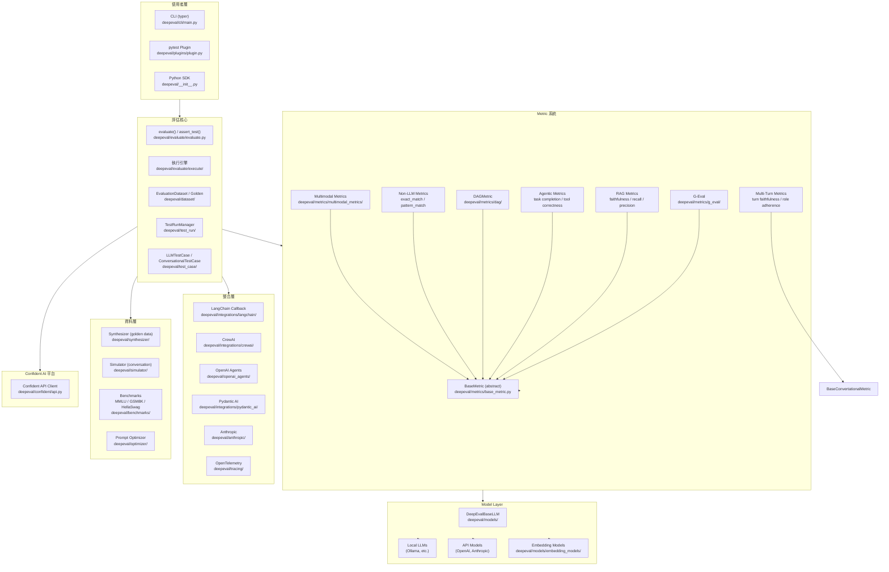
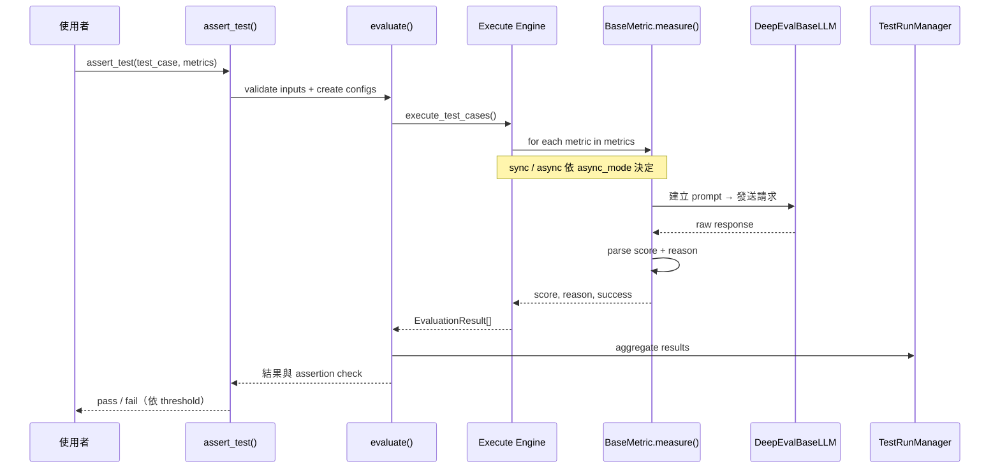

# DeepEval · 架構

## 高層架構

### 圖意說明

上方是使用者接入層的三種方式：CLI（typer-based）、pytest plugin（deepeval 註冊為 pytest11 plugin）、以及 Python SDK 直接調用 `assert_test()` / `evaluate()`。核心是評估引擎（`evaluate.py` + 子模組 `execute/`），它接受一組 `LLMTestCase`（或 `ConversationalTestCase`）和多個 `BaseMetric`，執行評估、收集結果到 `TestRunManager`。

Metric 系統是最豐富的層次——所有 metric 繼承自 `BaseMetric`（或 `BaseConversationalMetric`），包括 G-Eval、DAG、RAG 相關、agentic、multi-turn、multimodal 等。底層的 model layer 透過 `DeepEvalBaseLLM` 統一抽象，支援本地模型（Ollama）與 API 模型（OpenAI、Anthropic）。

值得注意的是資料層包含了 **synthesizer**（自動生成 golden dataset）、**simulator**（對話模擬）、**benchmarks**（標準 benchmark 執行）、和 **optimizer**（prompt 優化），這讓 DeepEval 不只是評估工具，更像一個評估工作檯。

## 資料流評估路徑

### 逐層模組說明

### `deepeval/evaluate/` — 評估引擎

- **職責**: 協調 test case 與 metric 的執行、結果彙總、assertion 判斷
- **位置**: [`deepeval/evaluate/evaluate.py`](https://github.com/confident-ai/deepeval/blob/17e676f/deepeval/evaluate/evaluate.py)
- **子模組**:
  - `execute/e2e.py` — end-to-end 評估執行（sync + async）
  - `execute/agentic.py` — agentic loop 評估
  - `execute/trace_scope.py` — trace-scoped assert_test
  - `configs.py` — `AsyncConfig`, `DisplayConfig`, `CacheConfig`, `ErrorConfig`
  - `compare.py` — 跨實驗比較
- **對外依賴**: metrics (LLM calls), test_run (結果彙總), dataset

### `deepeval/metrics/` — Metric 系統

- **職責**: 定義評估的衡量標準，每個 metric 封裝一個評估維度
- **位置**: [`deepeval/metrics/`](https://github.com/confident-ai/deepeval/blob/17e676f/deepeval/metrics/)
- **關鍵設計**: `BaseMetric` 是核心抽象（[`base_metric.py:17`](https://github.com/confident-ai/deepeval/blob/17e676f/deepeval/metrics/base_metric.py#L17)），要求實作 `measure()` / `a_measure()` / `is_successful()`
- **自動追蹤**: `__init_subclass__` hook 自動為所有 metric subclass 加上 tracing decorator
- **G-Eval**（[`deepeval/metrics/g_eval/g_eval.py`](https://github.com/confident-ai/deepeval/blob/17e676f/deepeval/metrics/g_eval/g_eval.py)）是旗艦 metric，實作 arXiv 2303.16634

### `deepeval/models/` — Model 抽象層

- **職責**: 統一套接不同 LLM provider，讓 metric 不直接依賴特定 API
- **位置**: [`deepeval/models/llms/`](https://github.com/confident-ai/deepeval/blob/17e676f/deepeval/models/llms/)
- **DeepEvalBaseLLM** 定義了 `get_model_name()`, `generate()`, `a_generate()` 等接口
- 內建 OpenAI / Anthropic / Ollama / local model adapter

### `deepeval/dataset/` — 資料集管理

- **職責**: 管理評估用的 test cases（`Golden` / `EvaluationDataset`）
- **位置**: [`deepeval/dataset/`](https://github.com/confident-ai/deepeval/blob/17e676f/deepeval/dataset/)
- `Golden` 是單輪評估的最小資料單元，含 input / actual_output / expected_output / context
- `EvaluationDataset` 支援批量和 golden data 的載入

### `deepeval/test_run/` — 結果管理

- **職責**: 評估結果的彙總、序列化、上傳至 Confident AI 平台
- **位置**: [`deepeval/test_run/`](https://github.com/confident-ai/deepeval/blob/17e676f/deepeval/test_run/)
- `global_test_run_manager` 是 singleton，追蹤當前 test run 的所有 metric data
- 自動將結果寫入暫存檔（`TEMP_FILE_PATH`）以支援 crash recovery

## 設計決策與取捨

### 決策 1: 為什麼用 pytest plugin 而不是獨立執行器？

**選擇**: DeepEval 註冊為 pytest11 plugin（[`pyproject.toml:15`](https://github.com/confident-ai/deepeval/blob/17e676f/pyproject.toml#L15)），讓 `assert_test()` 直接使用 pytest 的 assertion 機制。

**理由**:
- 開發者已經熟悉 pytest 的工作流程（`pytest -v`, `--cov`, fixture 等）
- 評估 test case 的「斷言」語意與 pytest 的 `assert` 一致
- CI/CD 整合零成本——任何支援 pytest 的 pipeline 都能跑

**取捨**:
- 不支援非 Python 的 LLM 應用（Node.js 等）的原生評估
- pytest 的 fixture 生命週期管理增加了評估的複雜度（需要處理 session / module / function scope）
- 評估結果不透過 pytest 回報——用 `rich` console 列印而非 pytest 的 assertion 訊息

### 決策 2: sync / async 雙模式 vs 純 async

**選擇**: DeepEval 同時提供 `measure()`（sync）和 `a_measure()`（async），透過 `async_mode` 參數切換（[`base_metric.py:26`](https://github.com/confident-ai/deepeval/blob/17e676f/deepeval/metrics/base_metric.py#L26)）。

**理由**:
- Jupyter notebook 使用者無法跑 `asyncio.run()`（event loop 衝突），需要 sync fallback
- 同步模式對 debugging 更友善（stack trace 直觀）
- `nest_asyncio` 套件解決了部分 event loop 問題，但不是萬能

**取捨**:
- 每個 metric 需實作兩套邏輯，增加維護成本
- 部分 metric 的 `a_measure()` 只是 `asyncio.run(self.measure())` 的包裝，沒有真正的 async 收益
- 執行引擎需要同時處理 sync 和 async 的併發控制（`AsyncConfig` 中的 `max_concurrent`、`throttle_value`）

### 決策 3: 為什麼支援多種 metric 註冊方式（subclass / config / DSL）？

**選擇**: 除了 `BaseMetric` subclass 外，還提供 `DAGMetric`（圖式組合）、`GEval`（參數化）、`ArenaGEval`（對戰式）。

**理由**:
- **subclass** 適合完全自訂的評估邏輯
- **GEval 參數化** 適合單一評估維度但需自訂 criteria / rubric
- **DAG** 適合需要將多個 metric 條件組合的複雜場景（例如「faithfulness 必須 > 0.8 且 answer relevancy > 0.7」）

**取捨**:
- 三種註冊方式的使用者介面不一致，新使用者需要學習三種模式
- DAG 的圖形 DSL 增加框架複雜度（序列化 / 反序列化 / 驗證）
- 類型系統複雜——`BaseMetric`、`BaseConversationalMetric`、`BaseArenaMetric` 三是分立的，無法統一處理

## 擴充機制

- **擴充類型**: `BaseMetric` subclass（最常用）、framework integration callback、custom model adapter
- **Metric 註冊方式**: 直接 import 並傳入 `assert_test()` / `evaluate()`——無中央註冊表，而是執行時組合
- **Framework 整合註冊**: 每個 integration（LangChain callback、OpenAI Agents wrapper）有自己的 `__init__` 方法
- **Plugin 系統**: pytest plugin 透過 `pytest11` entry point 註冊（[`pyproject.toml:15`](https://github.com/confident-ai/deepeval/blob/17e676f/pyproject.toml#L15)）

## 公開 vs 內部界線

- **`__all__` exports**: [`deepeval/__init__.py:82-90`](https://github.com/confident-ai/deepeval/blob/17e676f/deepeval/__init__.py#L82-L90) — `login`, `evaluate`, `assert_test`, `compare`, `on_test_run_end`, `log_hyperparameters`, `instrument`
- **被視為內部的東西**: `deepeval/confident/`（平台 API client）、`deepeval/telemetry/`、`deepeval/key_handler.py`
- **破壞性變更的處理**: SemVer 嚴格遵循，deprecation 使用 Python `DeprecationWarning`（如 [`test_case/__init__.py:45`](https://github.com/confident-ai/deepeval/blob/17e676f/deepeval/test_case/__init__.py#L45) 的 `LLMTestCaseParams` → `SingleTurnParams` 更名）

## 配置系統

- **Config 入口**: [`deepeval/config/settings.py`](https://github.com/confident-ai/deepeval/blob/17e676f/deepeval/config/settings.py) — 使用 `pydantic-settings`（`DeepevalSettings`）
- **配置來源優先級**: environment variable > `.env` file > 預設值
- **CLI config store**: `.deepeval/.deepeval` JSON 檔案（存放 provider model name / endpoint，但不放 secret）
- **Secret**: API key 只透過環境變數或 `.env.local` 傳遞，`pydantic.SecretStr` 保護

## 跟外部世界的接觸面

- **CLI**: `deepeval`（typer），支援 `login`, `test`, `generate`, `inspect`, `set-*`, `unset-*` 等子命令
- **環境變數**: `OPENAI_API_KEY`, `DEEPEVAL_API_KEY`, `DEEPEVAL_GRPC_LOGGING`, `GRPC_VERBOSITY` 等
- **檔案系統**: `.deepeval/`（config store）、`deepeval test` 的結果暫存檔、`deepeval login` 的 API key cache
- **網路請求**: LLM API 呼叫（OpenAI / Anthropic / Ollama 等）、Confident AI 平台 API、sentry 錯誤回報
- **gRPC**: OpenTelemetry span export 使用 gRPC（`grpcio` 依賴）

## 測試策略

- **單元測試覆蓋面**: `tests/test_core/` 涵蓋 CLI、config、datasets、evaluation、models、optimization、prompts、tracing 等
- **整合測試**: `tests/test_integrations/` 針對各 framework（LangChain、CrewAI、OpenAI Agents 等）的實際整合
- **Metrics 測試**: `tests/test_metrics/` 專屬資料夾
- **e2e 測試**: `tests/test_docs/` — 文件中的範例直接作為測試案例
- **CI 矩陣**: 在 GitHub Actions 中測試（[`.github/workflows/test_core.yml`](https://github.com/confident-ai/deepeval/blob/17e676f/.github/workflows/test_core.yml)）

## 發布與版本管理

- **版本策略**: 嚴格 SemVer（當前 v4.0.3）
- **Changelog**: 自動化生成（`.github/workflows/changelog.yml` + `.scripts/changelog/`）
- **Release 流程**: 透過 GitHub Actions 自動化
- **支援 Python**: >= 3.9, < 4.0
