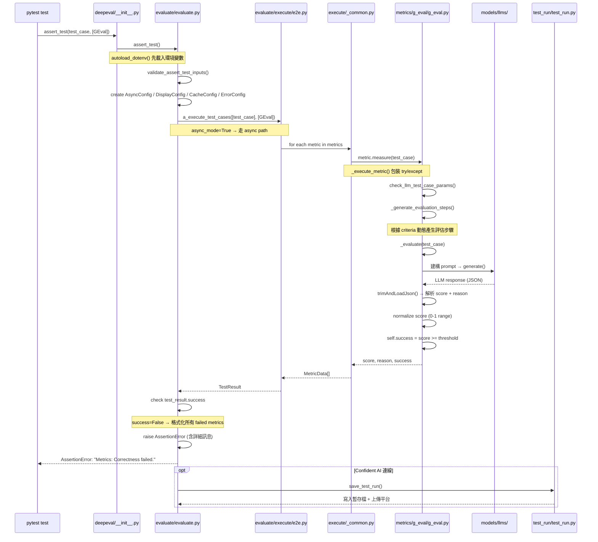

# DeepEval · 程式碼追蹤

## 追蹤的場景

我們追蹤一個最常見的情境：開發者寫一個 pytest test case，用 `assert_test()` 搭配 `GEval` metric 來評估 LLM 輸出。

```python
from deepeval import assert_test
from deepeval.metrics import GEval
from deepeval.test_case import LLMTestCase, SingleTurnParams

def test_chatbot():
    correctness_metric = GEval(
        name="Correctness",
        criteria="Determine if the 'actual output' is correct based on the 'expected output'.",
        evaluation_params=[SingleTurnParams.ACTUAL_OUTPUT, SingleTurnParams.EXPECTED_OUTPUT],
        threshold=0.5
    )
    test_case = LLMTestCase(
        input="What if these shoes don't fit?",
        actual_output="You have 30 days to get a full refund at no extra cost.",
        expected_output="We offer a 30-day full refund at no extra costs.",
        retrieval_context=["All customers are eligible for a 30 day full refund at no extra costs."]
    )
    assert_test(test_case, [correctness_metric])
```

## 流程圖



## 逐步追蹤

### Step 1: Python 模組匯入與環境初始化

[`deepeval/__init__.py:11-12`](https://github.com/confident-ai/deepeval/blob/17e676f/deepeval/__init__.py#L11-L12)

DeepEval 在 package 載入時先呼叫 `autoload_dotenv()`，確保 `OPENAI_API_KEY` 等環境變數在任何其他 import 之前就載入。這是刻意設計的**載入順序**——metric 的初始化依賴 model provider，而 model provider 需要 API key。如果順序錯誤，`GEval(..., model="gpt-4o")` 會因為尚未讀到 `OPENAI_API_KEY` 而失敗。

值得注意：`_expose_public_api()` 函式（[`deepeval/__init__.py:15`](https://github.com/confident-ai/deepeval/blob/17e676f/deepeval/__init__.py#L15)）將所有對外 API 放在一個巢狀函式中延後 import，確保 env 載入優先於任何 provider 模組。這是一個「lazy init」的模式。

### Step 2: assert_test() 入口 — 輸入驗證

[`deepeval/evaluate/evaluate.py:66-118`](https://github.com/confident-ai/deepeval/blob/17e676f/deepeval/evaluate/evaluate.py#L66-L118)

`assert_test()` 接受三種參數組合：
- `test_case + metrics` — 最常見，直接傳入 LLMTestCase
- `golden only` — trace-scoped assert_test（由 pytest plugin 使用）
- 參數不足 → `validate_assert_test_inputs()` 會拋出錯誤

然後建立四個 config 物件：

```python
async_config = AsyncConfig(throttle_value=0, max_concurrent=100)
display_config = DisplayConfig(verbose_mode=..., show_indicator=True)
error_config = ErrorConfig(ignore_errors=..., skip_on_missing_params=...)
cache_config = CacheConfig(write_cache=..., use_cache=...)
```

**設計決策**: Config 物件是獨立的 dataclasses（[`deepeval/evaluate/configs.py`](https://github.com/confident-ai/deepeval/blob/17e676f/deepeval/evaluate/configs.py)），而非單一的大型 config dict。這讓每個 config 有自己的驗證邏輯，且易於單獨擴充。取捨是呼叫端需要管理多個 config 物件。

### Step 3: 分派給執行引擎

[`deepeval/evaluate/evaluate.py:104-119`](https://github.com/confident-ai/deepeval/blob/17e676f/deepeval/evaluate/evaluate.py#L104-L119)

若 `run_async=True`（預設），`assert_test()` 透過 `get_or_create_event_loop()` 取得 event loop，然後跑 `a_execute_test_cases()`。這條路徑使用了 `nest_asyncio` 來處理 Jupyter notebook 中 event loop 已存在的情況。

```python
loop = get_or_create_event_loop()
test_result = loop.run_until_complete(
    a_execute_test_cases([test_case], metrics, ...)
)[0]
```

同步路徑（`run_async=False`）直接呼叫 `execute_test_cases()`，但在實際使用中很少見——絕大多數 metric 都預設 `async_mode=True`。

### Step 4: Metric 執行 — _execute_metric()

[`deepeval/evaluate/execute/_common.py:243-295`](https://github.com/confident-ai/deepeval/blob/17e676f/deepeval/evaluate/execute/_common.py#L243-L295)

這是最關鍵的錯誤處理層。`_execute_metric()` 做的事很單純——呼叫 `metric.measure(test_case)`——但包了三層 try/except：

1. **第一層 catch `MissingTestCaseParamsError`** — test case 缺少 metric 需要的參數時，根據 `error_config.skip_on_missing_params` 決定跳過還是拋錯
2. **第二層 catch `TypeError`** — 相容性處理：如果 metric 不接受 `_show_indicator` / `_in_component` 等 keyword argument，fallback 到舊式 `metric.measure(test_case)` 簽名
3. **第三層 catch 所有其他例外** — 根據 `error_config.ignore_errors` 決定吞掉還是拋出

這三層反映了一個重要的設計取捨：**DeepEval 預設讓評估繼續跑而不是失敗**。在 CI 環境中，一個 metric 的 failure 不應該中斷整個測試套件。但同時也意味著錯誤可能被默默吞掉——詳細資訊只有在 `verbose_mode=True` 時才看得到。

### Step 5: GEval.measure() — 核心評估邏輯

[`deepeval/metrics/g_eval/g_eval.py:81-155`](https://github.com/confident-ai/deepeval/blob/17e676f/deepeval/metrics/g_eval/g_eval.py#L81-L155)

GEval 的 `measure()` 是 sync 入口。雖然方法是 sync 的，但內部偵測到 `self.async_mode=True` 時會啟動自己的 event loop 跑 `a_measure()`。sync path 則直接呼叫 `_evaluate()`。

**`_generate_evaluation_steps()`**: 根據初始化時傳入的 `criteria` 自動產生 chain-of-thought 評估步驟。這是一項 G-Eval 論文中的關鍵技術——不直接讓 LLM 給分，而是先產生評估步驟再逐步評分，以提高評分的一致性和可解釋性。

**`_evaluate()`**: 建構 G-Eval 的評估 prompt（包含 criteria、evaluation steps、test case 內容），呼叫 model 產生 JSON 格式的評估結果，然後 `trimAndLoadJson()` 解析出 `score` 和 `reason`。

**評分標準化**: 

```python
self.score = (float(g_score) - self.score_range[0]) / self.score_range_span
self.success = self.score >= self.threshold
```

預設 `threshold=0.5`，但在 `strict_mode=True` 時 threshold 被設為 1.0（[`g_eval.py:73`](https://github.com/confident-ai/deepeval/blob/17e676f/deepeval/metrics/g_eval/g_eval.py#L73)）——這實際上讓任何小於滿分的結果都視為失敗。

### Step 6: 結果判斷與 AssertionError

[`deepeval/evaluate/evaluate.py:132-154`](https://github.com/confident-ai/deepeval/blob/17e676f/deepeval/evaluate/evaluate.py#L132-L154)

`assert_test()` 檢查 `test_result.success`。若任一 metric 失敗，它會收集所有失敗的 metric data，格式化為詳細字串（含 name / score / threshold / strict / error / reason），然後 `raise AssertionError(...)`。

這個 AssertionError 會直接被 pytest 捕捉，顯示在測試報告中。這也是 DeepEval 與 pytest 整合的關鍵——評估結果以 pytest 的 assertion 機制回報，而非自訂報告格式。

### Step 7 (Optional): Confident AI 平台同步

`assert_test()` 不像 `evaluate()` 那樣自動上傳——它主要用於 local test。但 `global_test_run_manager` 仍然會記錄結果到暫存檔（`TEMP_FILE_PATH`），方便後續的 `on_test_run_end()` callback 上傳。

## 想學更多時，在哪裡下中斷點

- 公開 API 入口: [`deepeval/__init__.py:23`](https://github.com/confident-ai/deepeval/blob/17e676f/deepeval/__init__.py#L23)（`evaluate` 與 `assert_test` 的 import）
- assert_test 核心: [`deepeval/evaluate/evaluate.py:66`](https://github.com/confident-ai/deepeval/blob/17e676f/deepeval/evaluate/evaluate.py#L66)
- metric 執行分派: [`deepeval/evaluate/execute/_common.py:243`](https://github.com/confident-ai/deepeval/blob/17e676f/deepeval/evaluate/execute/_common.py#L243)
- GEval 核心評分: [`deepeval/metrics/g_eval/g_eval.py:81`](https://github.com/confident-ai/deepeval/blob/17e676f/deepeval/metrics/g_eval/g_eval.py#L81)
- LLM 呼叫的 retry policy: [`deepeval/models/retry_policy.py`](https://github.com/confident-ai/deepeval/blob/17e676f/deepeval/models/retry_policy.py)
- AssertionError 產生: [`deepeval/evaluate/evaluate.py:132`](https://github.com/confident-ai/deepeval/blob/17e676f/deepeval/evaluate/evaluate.py#L132)

## 沒追蹤到但值得留意

- **Trace-scoped assert_test**: 當 pytest plugin 檢測到 trace context 時，`assert_test()` 的執行路徑完全不同——它透過 `_assert_test_from_current_trace()` 讀取當前 trace 的 LLM 呼叫作為 test case，無需使用者手動建立 `LLMTestCase`
- **Cache 路徑**: 若 `cache_config.use_cache=True`，執行引擎會先檢查 `global_test_run_cache_manager` 是否有快取結果，避免重複呼叫 LLM
- **ConversationalTestCase**: 多輪對話的執行路徑走 `_a_execute_conversational_test_cases()`，會逐 turn 評估而非一次評估整個對話
