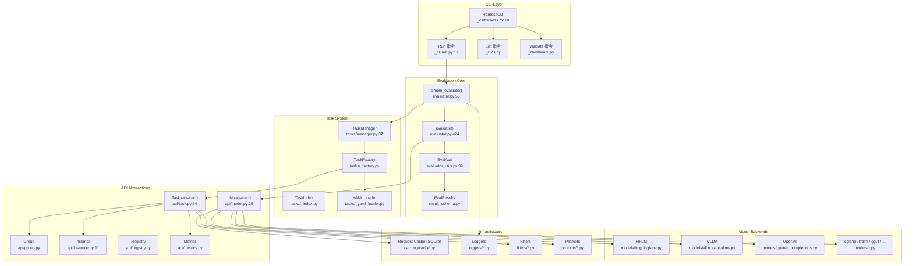
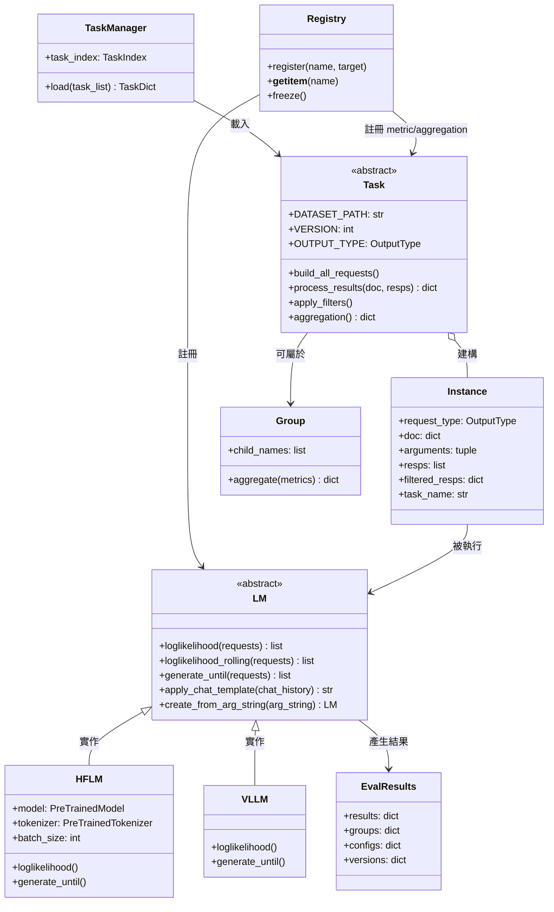

# LM Evaluation Harness · 架構

## 高層架構



**圖意說明**: 這張圖展示 Harness 的五層架構。CLI 層將使用者輸入的參數（model + tasks）傳遞給 evaluation core 的 `simple_evaluate()`。`simple_evaluate()` 負責模型初始化、task 載入、參數套用，然後呼叫 `evaluate()` 進行實際評估。Task System 負責從 YAML 檔案發現、解析、實例化 task；API Abstractions 層定義了所有核心介面；Model Backends 是 LM 抽象的具體實作。

### 核心類別關係



**圖意說明**: 這張 class diagram 展示核心抽象類別與它們的關係。`LM` 是 model adapter 的介面，`HFLM` 和 `VLLM` 是其具體實作。`Task` 是評估任務的抽象，它建構 `Instance`（評估的最小單位）並處理結果。`TaskManager` 負責從 YAML 檔案載入 Task。`Registry` 是中央化的元件註冊系統。

## 公開 API 結構

| 進入點 | 用途 | 位置 |
|---|---|---|
| `lm_eval.simple_evaluate(model, tasks, ...)` | 快速評估：傳 model name + task list，回傳結果 dict | [`evaluator.py:55`](https://github.com/EleutherAI/lm-evaluation-harness/blob/95d5806/lm_eval/evaluator.py#L55) |
| `lm_eval.evaluate(lm, task_dict, ...)` | 低階評估：傳已初始化的 LM + 已載入的 task dict | [`evaluator.py:424`](https://github.com/EleutherAI/lm-evaluation-harness/blob/95d5806/lm_eval/evaluator.py#L424) |
| `lm_eval.api.registry.get_model(name)` | 從 registry 取得 model class | [`api/registry.py`](https://github.com/EleutherAI/lm-evaluation-harness/blob/95d5806/lm_eval/api/registry.py) |
| `TaskManager(include_path=...).load(tasks)` | 載入 task 到可執行的 Task 物件 | [`tasks/manager.py:37`](https://github.com/EleutherAI/lm-evaluation-harness/blob/95d5806/lm_eval/tasks/manager.py#L37) |
| `lm_eval.tasks._yaml_loader.load_yaml(path)` | 載入單一 YAML task config | [`tasks/_yaml_loader.py`](https://github.com/EleutherAI/lm-evaluation-harness/blob/95d5806/lm_eval/tasks/_yaml_loader.py) |

### 典型用法

```bash
# CLI 介面（最常見）
lm-eval run --model hf --model_args pretrained=gpt2 --tasks hellaswag

# 程式化介面
from lm_eval import simple_evaluate
results = simple_evaluate(
    model="hf",
    model_args={"pretrained": "gpt2"},
    tasks=["hellaswag"],
    num_fewshot=5,
)
```

## 內部分層

### 1. CLI 層（`_cli/`）

- **職責**: 解析命令列參數、分派子命令（run / ls / validate）
- **位置**: [`lm_eval/_cli/harness.py`](https://github.com/EleutherAI/lm-evaluation-harness/blob/95d5806/lm_eval/_cli/harness.py)
- **對 evaluation core 的依賴**: 呼叫 `simple_evaluate()` 與 `evaluate()`
- **設計觀察**: `HarnessCLI.parse_args()` 會自動偵測「沒指定子命令但傳了參數」的情況，向後相容地插入 `run` 子命令（[`harness.py:48-51`](https://github.com/EleutherAI/lm-evaluation-harness/blob/95d5806/lm_eval/_cli/harness.py#L48-L51)）

### 2. Evaluation Core（`evaluator.py`、`evaluator_utils.py`）

- **職責**: 協調整個評估流程：模型初始化 → task 載入 → request 建構 → 執行 → 結果聚合
- **位置**: [`evaluator.py`](https://github.com/EleutherAI/lm-evaluation-harness/blob/95d5806/lm_eval/evaluator.py)、[`evaluator_utils.py`](https://github.com/EleutherAI/lm-evaluation-harness/blob/95d5806/lm_eval/evaluator_utils.py)
- **資料流**: `simple_evaluate()` → 初始化模型 → `TaskManager.load()` 載入 tasks → 疊加 CLI 參數 override → `evaluate()` → 對每個 task 建構 `Instance` → 依 request type grouping → 批次送給 LM → 收集結果 → `_process_results()` 計算 metric → 回傳 `EvalResults`

### 3. Task System（`tasks/`）

- **職責**: 發現、載入、實例化 task 定義
- **位置**: [`tasks/manager.py`](https://github.com/EleutherAI/lm-evaluation-harness/blob/95d5806/lm_eval/tasks/manager.py)
- **關鍵子系統**:
  - `TaskIndex`: 掃描目錄建立所有 task/group 的索引（[`tasks/_index.py`](https://github.com/EleutherAI/lm-evaluation-harness/blob/95d5806/lm_eval/tasks/_index.py)）
  - `TaskFactory`: 根據 YAML 或 Python class 建立 Task 實例（[`tasks/_factory.py`](https://github.com/EleutherAI/lm-evaluation-harness/blob/95d5806/lm_eval/tasks/_factory.py)）
  - `_yaml_loader`: YAML 解析器，支援 `!function` tag 載入 Python 函式（[`tasks/_yaml_loader.py`](https://github.com/EleutherAI/lm-evaluation-harness/blob/95d5806/lm_eval/tasks/_yaml_loader.py)）
- **設計觀察**: Harness 同時支援 YAML-only task 和 Python Task subclass，但 YAML 是主要路徑。`!function` tag 讓 YAML 能在必要時引用 Python 函式（如 `process_docs`、`doc_to_text`）

### 4. API Abstractions（`api/`）

- **LM**（[`api/model.py:25`](https://github.com/EleutherAI/lm-evaluation-harness/blob/95d5806/lm_eval/api/model.py#L25)）: 抽象基底類別。4 個 abstract method 定義了所有評估所需的模型互動
- **Task**（[`api/task.py:64`](https://github.com/EleutherAI/lm-evaluation-harness/blob/95d5806/lm_eval/api/task.py#L64)）: 1800+ 行的核心類別。包辦 dataset 載入、few-shot 範例建構、prompt 格式化、metric 計算、filter 套用
- **Instance**（[`api/instance.py:11`](https://github.com/EleutherAI/lm-evaluation-harness/blob/95d5806/lm_eval/api/instance.py#L11)）: 評估的最小單位——一個 (request_type, doc, arguments) 三元組
- **Registry**（[`api/registry.py`](https://github.com/EleutherAI/lm-evaluation-harness/blob/95d5806/lm_eval/api/registry.py)）: 泛用註冊系統，管理 model / metric / aggregation / filter 的註冊與查詢

## 擴充機制

- **擴充類型**: 多點擴充 — YAML config / registry decorator / class inheritance
- **Model 註冊**: `@register_model("my-model")` decorator（[`api/registry.py`](https://github.com/EleutherAI/lm-evaluation-harness/blob/95d5806/lm_eval/api/registry.py)）或 `MODEL_MAPPING` 懶載入對照表（[`models/__init__.py:25-61`](https://github.com/EleutherAI/lm-evaluation-harness/blob/95d5806/lm_eval/models/__init__.py#L25-L61)）
- **Metric 註冊**: `@register_metric` / `@register_aggregation`（[`api/metrics.py`](https://github.com/EleutherAI/lm-evaluation-harness/blob/95d5806/lm_eval/api/metrics.py)）
- **Task 定義**: 在 `lm_eval/tasks/` 下新增子目錄 + `task.yaml`（最簡單）或 Python `Task` subclass（進階）

## 公開 vs 內部界線

- **`__all__` exports**: [`__init__.py:29`](https://github.com/EleutherAI/lm-evaluation-harness/blob/95d5806/lm_eval/__init__.py#L29) — 只 expose `evaluate`、`simple_evaluate`、`__version__`，採用 lazy loading 優化 CLI 啟動速度
- **被視為內部的東西**: `_cli/`（前綴 `_` 明確標記為內部實作）、`caching/`、`filters/`、`prompts/`
- **破壞性變更的處理**: 不嚴格。0.4.x 版本對 CLI 做了大幅重構（加入子命令），但保留了向後相容的 fallback（自動插入 `run`）

## 配置系統

- **Config 入口**: [`config/task.py`](https://github.com/EleutherAI/lm-evaluation-harness/blob/95d5806/lm_eval/config/task.py) — `TaskConfig` dataclass 定義所有 YAML task config 可用的欄位
- **FewshotConfig**: [`config/task.py:21`](https://github.com/EleutherAI/lm-evaluation-harness/blob/95d5806/lm_eval/config/task.py#L21) — 獨立於 TaskConfig 的 few-shot 設定，允許少樣本範例與測試範例使用不同的 prompt 格式
- **配置來源優先級**: CLI 參數 override YAML config values（e.g. `--num_fewshot 5` 會覆寫 YAML 中的預設值，但 `num_fewshot=0` 的 task 不會被覆寫）
- **驗證機制**: 在 `evaluate()` 中做 validation check：檢查 multimodal 相容性、unsafe code 確認

## 核心設計決策與 trade-off

### 決策 1: YAML as Config vs 純 Python API

**選擇**: 用 YAML 定義 task，支援 `!function` tag 在必要時引用 Python

**理由**: 13,556 個 YAML task 檔中，絕大多數只需要指定 dataset path、prompt template、metric list。如果全部用 Python 定義，程式碼重複會很嚴重。YAML 讓「新增一個 benchmark」變成「寫 20 行 YAML + 一個可選的 `utils.py`」。

**trade-off**: YAML 的可程式化能力受限。複雜的 prompt 邏輯（條件式格式化、多步驟處理）需要 fallback 到 `!function`。且 YAML 無法在編輯器獲得 type checking 支援。

**替代方案**: DeepEval 用 Python decorator 定義評估metric；Inspect AI 用 Python Solver chain。YAML 方案在簡單場景勝出，但在複雜場景需要額外的冗餘機制（`!function`）。

### 決策 2: 4 個 abstract method 的 LM 介面

**選擇**: `LM` abstract class 只定義 `loglikelihood`、`loglikelihood_rolling`、`generate_until`、`apply_chat_template` 四個方法

**理由**: 所有 LLM 評估可以歸納為三種計算需求：
1. 「給定 context + continuation，算 log prob」→ `loglikelihood`
2. 「給定整段文字，算 per-token log prob」→ `loglikelihood_rolling`
3. 「給定 context，生成到停止字元」→ `generate_until`
4. chat template 格式化 → `apply_chat_template`

這四種涵蓋了從 MMLU（multiple choice via loglikelihood）到 GSM8K（free-form generation）到 perplexity（rolling）的所有場景。

**trade-off**: 介面非常簡潔，但實作方（HFLM、VLLM 等）需要承擔所有實作細節（batch size 管理、分散式同步、KV cache 控制）。`apply_chat_template` 非強制實作（`raise NotImplementedError`），導致某些模型類型無法使用 chat template 功能。

**替代方案**: 更細粒度的介面（如分開 `tokenize` / `forward` / `generate`）會給 adapter 更多控制，但也會讓介面變複雜。Harness 選擇的 trade-off 是「介面簡單，adapter 內部複雜」。

### 決策 3: SQLite Request Cache

**選擇**: 用 SQLite（透過 `sqlitedict`）做 model request 快取

**理由**: LLM 評估中最耗時的部分是 model inference。同一個模型對同一個 prompt 的 loglikelihood 如果在多次評估中重複計算，造成大量浪費。SQLite 提供輕量級、持久化、可跨程序存取的 key-value 儲存。

**trade-off**: SQLite 不是為高併發設計的。在分散式評估中，每個 rank 需要自己的 cache db（檔名為 `{cache_path}_rank{N}.db`）。快取 key 基於 request hash，但有時 prompt 模板的小改變會 invalidate 整個 cache。

**替代方案**: Redis / Memcached（overkill for a CLI tool）、in-memory dict（無法跨 session 持久化）、檔案系統-based cache。SQLite 在輕量級與持久化之間取得了好的平衡。

### 決策 4: 分散式評估的 rank 管理

**選擇**: 每個 task 在所有 rank 上建構完整 requests，每個 rank 只處理屬於自己的部分（基於 `rank` + `world_size`），最後 rank 0 聚合

**理由**: 這是「每個 rank 先知曉全域」的方法——每個 rank 都知道總共有多少 doc 要評估，然後只處理 `rank % world_size == my_rank` 的那份。避免了 master-worker 模式的序列化瓶頸。

**trade-off**: 所有 rank 都需要載入完整的 task（包括 dataset），記憶體消耗較大。對於上千個 doc 的 task，rank 0 的聚合過程（gather_object）需要把所有 rank 的結果收攏到一個節點，可能成為瓶頸。

**替代方案**: 真正的 map-reduce 架構（Spark、Ray）需要額外的依賴。Harness 的取捨是「在單機多 GPU 場景最佳化，不追求大規模跨節點擴充」。

## 跟外部世界的接觸面

- **CLI**（主要接觸面）: [`_cli/`](https://github.com/EleutherAI/lm-evaluation-harness/blob/95d5806/lm_eval/_cli/)
- **HuggingFace Datasets**: 所有 task 透過 `datasets.load_dataset(DATASET_PATH, DATASET_NAME)` 下載資料
- **HuggingFace Hub**: 模型權重下載（HF 後端）、tokenizer 下載
- **API 呼叫**: OpenAI / Anthropic / TextSynth / LiteLLM 等 remote API（僅限對應 model type）
- **SQLite 檔案**: request cache 寫入本機檔案系統
- **W&B / 檔案**: 結果輸出（JSON + 可選 W&B logging）

## 測試策略

- **單元測試**: [`tests/`](https://github.com/EleutherAI/lm-evaluation-harness/blob/95d5806/tests/) — 包含 `test_version_stable.py`（task integrity test）、model-specific tests
- **執行方式**: `pytest tests/`
- **CI**: GitHub Actions — 跨 Python 版本、跨平台（Ubuntu / macOS）測試
- **Task validation**: `lm-eval validate --tasks hellaswag` 用於驗證 task YAML 的正確性
- **Coverage 觀察**: tests 目錄含 `testconfigs/`、`testdata/`、`testyamls/`、`test_configs/`，覆蓋了 YAML parser、task loading、evaluation pipeline

## 發布與版本管理

- **版本策略**: 寬鬆語意版本。0.4.x 系列，pre-release 頻繁（0.4.13.dev0）
- **Changelog**: 寫在 GitHub Release 中，非獨立 `CHANGELOG.md`
- **Release 流程**: 半手動 — maintainer 在 GitHub 上打 tag + Release
- **支援範圍**: PyPI 套件 `lm_eval`，base install 已不含 transformers/torch（需額外 `lm_eval[hf]`、`lm_eval[vllm]` 等）
