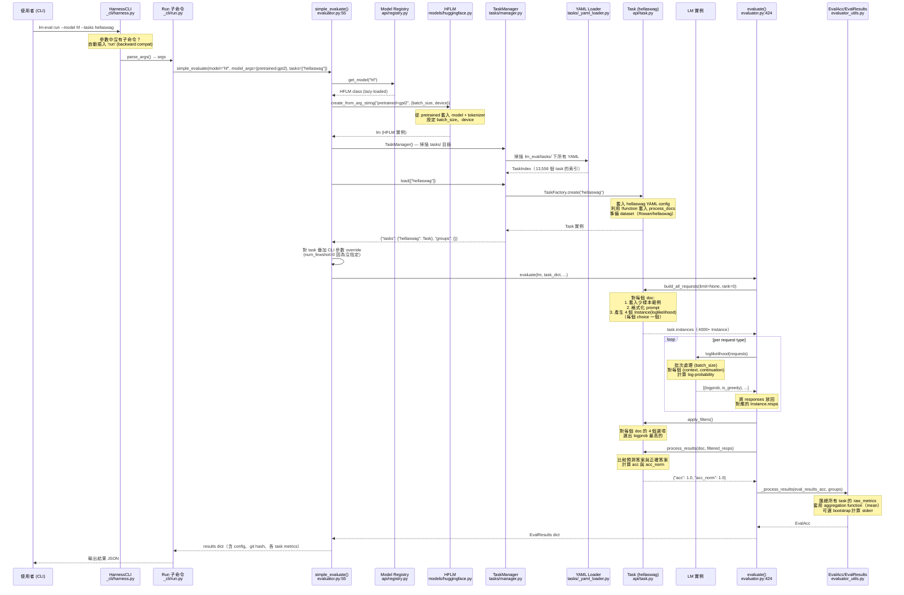

# LM Evaluation Harness · 程式碼追蹤

## 追蹤的場景

**使用者指令**:
```bash
lm-eval run --model hf --model_args pretrained=gpt2 --tasks hellaswag
```

選擇這個場景的理由：
1. `hf`（HuggingFace transformers）是最常用的模型後端
2. hellaswag 是 `multiple_choice` output type 的代表——它透過 `loglikelihood` 為每個選項計算機率，選出最高的
3. 這條路徑涵蓋了 CLI 解析 → 模型初始化 → task 載入 → request 建構 → model inference → 結果聚合的完整流程

## 流程圖



**圖意說明**: 這張 sequence diagram 追蹤了 `lm-eval run --model hf --model_args pretrained=gpt2 --tasks hellaswag` 的完整路徑。從 CLI 解析開始（向後相容地自動插入 `run` 子命令），經過 model 初始化（registry lookup → HFLM 建立）、task 載入（TaskManager 掃描索引 → TaskFactory 建立 hellaswag 實例），到核心評估迴圈（`build_all_requests` → `loglikelihood` → `process_results`），最後到結果聚合與輸出。

## 逐步追蹤

### Step 1: CLI 接入 (`_cli/harness.py:10`)

```
HarnessCLI.__init__()
  ├── 建立 argparse 主解析器，設定 prog="lm-eval"
  ├── 註冊三個子命令：Run、List、Validate
  └── 預設 fallback：印 help

HarnessCLI.parse_args()
  └── if sys.argv 沒有合法子命令 → 自動插入 "run" 為第一個參數
      （這讓 lm-eval --model hf --tasks hellaswag 等同於 lm-eval run ...）
```

**值得注意**:
- 向後相容的 hack 在 [`_cli/harness.py:48-51`](https://github.com/EleutherAI/lm-evaluation-harness/blob/95d5806/lm_eval/_cli/harness.py#L48-L51)
- `Run` 類別在 [`_cli/run.py:18`](https://github.com/EleutherAI/lm-evaluation-harness/blob/95d5806/lm_eval/_cli/run.py#L18) 負責定義所有 CLI 參數（這個函式有近 500 行）

### Step 2: 進入 `simple_evaluate()` (`evaluator.py:55`)

`simple_evaluate()` 是整個評估流程的中央調度器。它做以下事情：

1. **初始化模型**（[`evaluator.py:233-271`](https://github.com/EleutherAI/lm-evaluation-harness/blob/95d5806/lm_eval/evaluator.py#L233-L271)）
   - 因為 `model` 是字串 `"hf"`，從 registry 取得 `HFLM` class
   - `HFLM.create_from_arg_string()` 解析 `"pretrained=gpt2"` → 呼叫 HuggingFace `AutoModelForCausalLM.from_pretrained("gpt2")`
   - 結果是一個 `HFLM` 實例，包含已載入的 model、tokenizer、config

2. **設定 caching**（[`evaluator.py:277-289`](https://github.com/EleutherAI/lm-evaluation-harness/blob/95d5806/lm_eval/evaluator.py#L277-L289)）
   - 若指定 `use_cache`，會用 `CachingLM` wrapper 包住 LM
   - 每個 rank 有自己的 cache db（`_rank{N}.db`），避免寫入衝突

3. **載入 tasks**（[`evaluator.py:302`](https://github.com/EleutherAI/lm-evaluation-harness/blob/95d5806/lm_eval/evaluator.py#L302)）
   - `TaskManager()` 在建構時掃描 `lm_eval/tasks/` 下的所有 YAML，建立索引
   - `task_manager.load(["hellaswag"])` 回傳 `{"tasks": {"hellaswag": Task}, "groups": {}}`

4. **套用 CLI override**（[`evaluator.py:308-342`](https://github.com/EleutherAI/lm-evaluation-harness/blob/95d5806/lm_eval/evaluator.py#L308-L342)）
   - 如果 CLI 有指定 `--gen_kwargs`，套用到 `generate_until` task
   - 如果 CLI 有指定 `--num_fewshot`，覆寫 task 預設值（但 task 設為 0 的例外）

5. **呼叫 `evaluate()`**（[`evaluator.py:358-373`](https://github.com/EleutherAI/lm-evaluation-harness/blob/95d5806/lm_eval/evaluator.py#L358-L373)）

### Step 3: `TaskManager` 載入 hellaswag (`tasks/manager.py:37`)

TaskManager 的載入流程：

1. 查 `task_index` 找到 hellaswag 的 Entry → 路徑為 `lm_eval/tasks/hellaswag/hellaswag.yaml`
2. `_yaml_loader.load_yaml()` 讀取 YAML 內容（[`tasks/_yaml_loader.py`](https://github.com/EleutherAI/lm-evaluation-harness/blob/95d5806/lm_eval/tasks/_yaml_loader.py)）
   - 支援 `!function` tag：`process_docs: !function utils.process_docs` 會從同目錄的 `utils.py` 載入 `process_docs` 函式
3. `TaskFactory` 根據 YAML 建立 Task 實例：
   - `TaskConfig.dataset_path = "Rowan/hellaswag"` → `datasets.load_dataset("Rowan/hellaswag")`
   - `TaskConfig.output_type = "multiple_choice"` → 決定使用 `loglikelihood` 而非 `generate_until`
   - `TaskConfig.metric_list = [{"metric": "acc", "aggregation": "mean", ...}]` → 定義評估 metric

**hellaswag YAML config** 完整內容：
```yaml
tag:
  - multiple_choice
task: hellaswag
dataset_path: Rowan/hellaswag
dataset_name: null
output_type: multiple_choice
training_split: train
validation_split: validation
test_split: null
process_docs: !function utils.process_docs
doc_to_text: "{{query}}"
doc_to_target: "{{label}}"
doc_to_choice: "choices"
metric_list:
  - metric: acc
    aggregation: mean
    higher_is_better: true
  - metric: acc_norm
    aggregation: mean
    higher_is_better: true
metadata:
  version: 1.0
```

### Step 4: `evaluate()` 核心迴圈 (`evaluator.py:424-710`)

這是評估的實際執行者，最關鍵的部分：

**階段 A: 建構 Requests**（[`evaluator.py:534-580`](https://github.com/EleutherAI/lm-evaluation-harness/blob/95d5806/lm_eval/evaluator.py#L534-L580)）

```python
for task_name, task in eval_tasks.items():
    task.build_all_requests(limit=limit, rank=lm.rank, world_size=lm.world_size, ...)
    for instance in task.instances:
        reqtype = instance.request_type
        requests[reqtype].append(instance)
```

`task.build_all_requests()` 在 `api/task.py` 中執行：
- 對每個 doc：載入 few-shot 範例（若有指定 `num_fewshot`）→ 格式化 prompt（`doc_to_text` + `doc_to_choice`）→ 產生 `Instance`
- 對 hellaswag（`multiple_choice`），每個 doc 產生 4 個 `Instance`，每個的 `request_type = "loglikelihood"`，代表一個選項
- `requests` dict 被組織成 `{request_type: [Instance, ...]}`，方便後續批次送給 LM

**階段 B: 執行 LM**（[`evaluator.py:584-603`](https://github.com/EleutherAI/lm-evaluation-harness/blob/95d5806/lm_eval/evaluator.py#L584-L603)）

```python
for reqtype, reqs in requests.items():
    cloned_reqs = [req for req in reqs for _ in range(req.repeats)]
    resps = getattr(lm, reqtype)(cloned_reqs)
    for x, req in zip(resps, cloned_reqs, strict=True):
        req.resps.append(x)
```

對 `loglikelihood`，HFLM 實作在 `models/huggingface.py`：
- 批次處理 requests（根據 `batch_size`）
- 對每個 `(context, continuation)`，用 tokenizer encode 後透過 model forward pass 計算 log-probability
- 回傳 `(logprob, is_greedy)` tuple

**階段 C: 收集與計算 Metric**（[`evaluator.py:609-665`](https://github.com/EleutherAI/lm-evaluation-harness/blob/95d5806/lm_eval/evaluator.py#L609-L665)）

```python
for task_name, acc in eval_results_acc.items():
    task = acc["task"]
    task.apply_filters()  # 將多個 responses 轉換為單一 filter_key → filtered_resps
    
    for doc_id, doc in doc_iterator:
        metrics = task.process_results(doc, [req.filtered_resps[filter_key] for req in requests])
        for metric, value in metrics.items():
            acc["raw_metrics"][(metric, filter_key)].append(value)
```

對 hellaswag：
- `apply_filters()`：對每個 doc 的 4 個選項（loglikelihood responses），選出最高機率的作為預測
- `process_results()`：比較預測與正確答案，回傳 `{"acc": 1.0, "acc_norm": 1.0}`
- `acc_norm` 是標準化過的 accuracy（除以 continuation length），對長度不同的選項做公平比較

**階段 D: 結果聚合**（`evaluator_utils.py:173-300`）

```python
res = _process_results(eval_results_acc, groups, bootstrap_iters)
```

- `_collect_results()`：對每個 task 的 raw_metrics 套用 aggregation function（對 acc 是 `mean`）
- 可選 bootstrap 計算 stderr（預設 100k iters，但對 BLEU/CHRF 等昂貴 metric 降為 100）
- `aggregate_groups()`：若 task 屬於某個 group，自底向上計算 group metrics
- 最終回傳 `EvalResults` dict

### Step 5: 結果包裝回傳

`simple_evaluate()` 在 rank 0 上（[`evaluator.py:380-418`](https://github.com/EleutherAI/lm-evaluation-harness/blob/95d5806/lm_eval/evaluator.py#L380-L418)）：
- 加入 model config、batch sizes、random seeds、git hash、環境資訊、tokenizer 資訊
- 回傳完整 `EvalResults` dict

Run 子命令將結果輸出為 JSON（到 stdout 或檔案，根據 `--output_path`）。

## 想學更多時，在哪裡下中斷點

- CLI 入口: [`_cli/harness.py:10`](https://github.com/EleutherAI/lm-evaluation-harness/blob/95d5806/lm_eval/_cli/harness.py#L10) (HarnessCLI class)
- 評估主調度: [`evaluator.py:55`](https://github.com/EleutherAI/lm-evaluation-harness/blob/95d5806/lm_eval/evaluator.py#L55) (simple_evaluate)
- 核心評估迴圈: [`evaluator.py:584`](https://github.com/EleutherAI/lm-evaluation-harness/blob/95d5806/lm_eval/evaluator.py#L584) (LM execution loop)
- Request 建構: [`api/task.py`](https://github.com/EleutherAI/lm-evaluation-harness/blob/95d5806/lm_eval/api/task.py) (build_all_requests method)
- Loglikelihood 實作: [`models/huggingface.py`](https://github.com/EleutherAI/lm-evaluation-harness/blob/95d5806/lm_eval/models/huggingface.py) (HFLM.loglikelihood)
- 結果聚合: [`evaluator_utils.py:173`](https://github.com/EleutherAI/lm-evaluation-harness/blob/95d5806/lm_eval/evaluator_utils.py#L173) (_compute_task_aggregations)

## 沒追蹤到但值得留意

- **generate_until 路徑**: 本追蹤追的是 `multiple_choice`（用 loglikelihood）。`generate_until` 的路徑（如 GSM8K、MMLU generative）會進入 HFLM 的 `generate_until()` 方法，使用 `model.generate()` 而非 `forward()`，並處理 `until` stopping conditions
- **分散式路徑**: 本追蹤假設單機單 GPU。在多 GPU 場景下（`world_size > 1`），task 建構時會進行 padding 以確保各 rank 的 batch 數量一致，結果聚合需要使用 `all_gather` + `gather_object`
- **error path**: 若 task 不可用（dataset 無法下載、YAML 語法錯誤），`TaskManager.load()` 會拋出 `ValueError`
- **multimodal path**: `hf-multimodal` 和 `vllm-vlm` 模型類型會將圖片也納入 inputs
