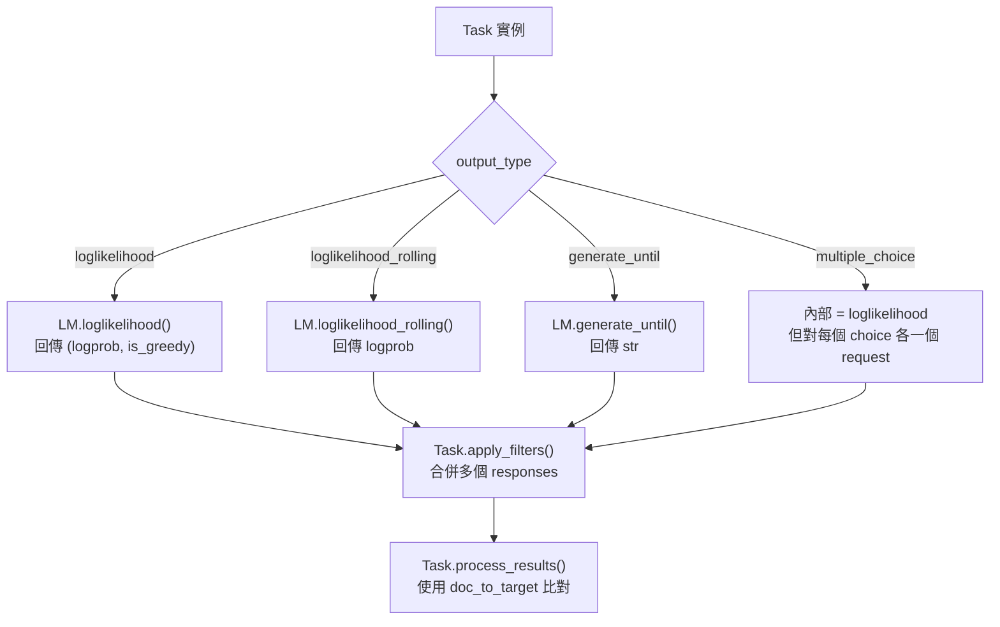

# LM Evaluation Harness · 值得偷學的設計

## Pattern 1: Declarative Task Config with `!function` Fallback

**是什麼**: 用 YAML 定義 task 的所有參數（dataset path、prompt template、metric list），只在需要程式化邏輯時用 `!function` tag 引用 Python 函式。

**為什麼有效**: 13,556 個 YAML task 中，絕大多數只需要設定組態值。YAML 消除了重複的 Python boilerplate（不用每新增一個 benchmark 就寫一個 class），而 `!function` 提供了完整的可程式化逃生門。

**程式碼位置**:
- YAML loader 實作: [`tasks/_yaml_loader.py`](https://github.com/EleutherAI/lm-evaluation-harness/blob/95d5806/lm_eval/tasks/_yaml_loader.py)
- `!function` tag 處理: [`tasks/_yaml_loader.py:18-24`](https://github.com/EleutherAI/lm-evaluation-harness/blob/95d5806/lm_eval/tasks/_yaml_loader.py#L18-L24) — 從 YAML 值 `"utils.process_docs"` 解析出模組路徑並 import
- 實際 YAML 範例: [`tasks/hellaswag/hellaswag.yaml`](https://github.com/EleutherAI/lm-evaluation-harness/blob/95d5806/lm_eval/tasks/hellaswag/hellaswag.yaml)

**何時可以借用**:
- 你的系統有大量「結構相同、參數不同」的任務定義（多個 benchmark / dataset / metric 組合）
- 使用者需要在不寫程式碼的前提下貢獻新任務
- 你需要一個「可分享的 config 格式」來交換任務定義（Harness 的 YAML task 可以從 GitHub repo 直接 import）

**注意事項**:
- 不要低估 `!function` 的使用頻率。Harness 中不少 task 仍然需要 `utils.py` 來處理複雜的 prompt 邏輯
- YAML 的型別系統有限。`doc_to_choice: "choices"` 是字串（去 task 屬性 lookup），不是 list literal。新貢獻者容易寫錯
- 沒有 YAML schema validation（只有 Python runtime check），config 寫錯要到 runtime 才發現

**替代方案**: DeepEval 用 Python decorator 定義評估；Inspect AI 用 Python Solver chain。YAML 方案在簡單場景勝出，但複雜場景需要 `!function` 來補償 YAML 的表達力限制。

---

## Pattern 2: Instance-Based Request/Response Decoupling

**是什麼**: 用 `Instance` dataclass 將 request 的定義、參數、結果、過濾結果包裝成一個物件，在評估流程中從建構 → 執行 → 過濾 → 計算指標，一個 Instance 貫穿全程。

```mermaid
flowchart LR
    subgraph "建構階段"
        Task --> I1[Instance<br/>request_type: loglikelihood<br/>doc: {...}<br/>arguments: (...)]
    end
    subgraph "執行階段"
        I1 --> LM
        LM --> I1
        I1 -.-> |req.resps.append()| I1_resps[Instance.resps = [logprob, is_greedy]]
    end
    subgraph "過濾階段"
        I1_resps --> I1_filtered[Instance.filtered_resps = {filter_key: result}]
    end
    subgraph "計算階段"
        I1_filtered --> Process[process_results<br/>讀取 filtered_resps]
    end
```

**為什麼有效**: Instance 是一個 shared mutable object，在 4 個階段被不同的程式碼 append 資料。這個模式避免了「維護多個平行 list 來追蹤哪個 request 對應哪個 response」的麻煩。

**程式碼位置**:
- Instance 定義: [`api/instance.py:11-38`](https://github.com/EleutherAI/lm-evaluation-harness/blob/95d5806/lm_eval/api/instance.py#L11-L38)
- 使用流程（建構 → 執行 → 過濾 → 計算）: [`evaluator.py:534-665`](https://github.com/EleutherAI/lm-evaluation-harness/blob/95d5806/lm_eval/evaluator.py#L534-L665)
- `resps.append`: [`evaluator.py:599-600`](https://github.com/EleutherAI/lm-evaluation-harness/blob/95d5806/lm_eval/evaluator.py#L599-L600)
- `filtered_resps` 生成: 在 `Task.apply_filters()` 中

**何時可以借用**:
- pipeline 有「多個階段處理相同資料單位」的情況（如 request → response → filter → score）
- 你需要在不同步驟之間傳遞 metadata，不想被「key-value dict」的型別不安全困擾

**注意事項**:
- Instance 是 mutable dataclass，這意味著 multi-threaded 處理需要小心 shared state
- `resps` 和 `filtered_resps` 的 append 順序依賴於實作（`cloned_reqs` 的展開），容易出錯
- 若之後要支援真正的 lazy evaluation / streaming，這個 shared mutable pattern 會成為瓶頸

**替代方案**: 純函數式 pipeline（每個階段 input → output，不修改原始物件）更容易測試和並行化，但程式碼會更冗長（需要定義大量中間類型）。Harness 的選擇是 pragmatism over purity。

---

## Pattern 3: Registry-Based Lazy Loading

**是什麼**: 一個中央化的 `Registry` class，支援 decorator-based registration 和 string-based lazy loading。model、metric、aggregation、filter 全部透過同一個機制註冊和查詢。

```python
# 註冊
@register_model("hf")
class HFLM(LM):
    ...

# 查詢（觸發實際 import）
model_cls = get_model("hf")  # 第一次存取時 import lm_eval.models.huggingface

# 懶載入對照表（不 import，僅註冊字串路徑）
model_registry.register("vllm", target="lm_eval.models.vllm_causallms:VLLM")
```

**為什麼有效**: CLI 啟動時不需要 import 所有 20+ 個 model 模組。只有當使用者指定 `--model vllm` 時，`vllm_causallms.py` 才會被實際 import。這對 CLI 啟動速度影響很大——`transformers` import 就要好幾秒。

**程式碼位置**:
- Registry 實作: [`api/registry.py`](https://github.com/EleutherAI/lm-evaluation-harness/blob/95d5806/lm_eval/api/registry.py)
- Model 懶載入對照表: [`models/__init__.py:25-61`](https://github.com/EleutherAI/lm-evaluation-harness/blob/95d5806/lm_eval/models/__init__.py#L25-L61)
- 實際使用（`get_model("hf")`）: [`evaluator.py:242`](https://github.com/EleutherAI/lm-evaluation-harness/blob/95d5806/lm_eval/evaluator.py#L242)

**何時可以借用**:
- 你的套件有大量可選的 plugin / backend / adapter，每個都有重量級 import（如 torch、transformers、boto3）
- CLI 工具的啟動速度對使用者體驗有影響
- 你希望第三方貢獻者能「註冊自己的實作」而不需要改核心程式碼

**注意事項**:
- 懶載入讓靜態分析工具（mypy、pyright）無法知道註冊的 class 是否存在，需要在 registry 實作中處理 `KeyError`
- `threading.Lock` 在 [`api/registry.py`](https://github.com/EleutherAI/lm-evaluation-harness/blob/95d5806/lm_eval/api/registry.py) 中保證 lazy import 的 thread safety
- `freeze_all()` 機制可以在載入完成後鎖定 registry，防止後續意外覆寫

**替代方案**: 使用 Python entry point 機制（`pyproject.toml [project.entry-points]`）做 plugin discovery，如 pytest 的做法。但 entry point 需要安裝套件，對 local task 定義不友善。Harness 的 Registry 更輕量、更直接。

---

## Pattern 4: 分散式評估的 Rank-Aware Data Partitioning

**是什麼**: 每個 rank 獨立建構完整的 task requests，但只處理 `rank % world_size == my_rank` 的那些 doc。結果透過 `gather_object` 聚合到 rank 0。

**為什麼有效**: 避免了 master-worker 模式的瓶頸（master 需要序列化所有資料分發給 worker），每個 rank 直接從相同的 dataset 載入資料，處理自己的部分。這在單機多 GPU 場景下特別有效，因為所有 rank 共享相同的檔案系統和記憶體池。

**程式碼位置**:
- Task-level partition: [`api/task.py`](https://github.com/EleutherAI/lm-evaluation-harness/blob/95d5806/lm_eval/api/task.py) (e.g. doc_iterator with rank/world_size filtering)
- 跨 rank 結果聚合: [`evaluator.py:667-697`](https://github.com/EleutherAI/lm-evaluation-harness/blob/95d5806/lm_eval/evaluator.py#L667-L697)
- Padding 確保各 rank batch 數量一致: [`evaluator.py:564-580`](https://github.com/EleutherAI/lm-evaluation-harness/blob/95d5806/lm_eval/evaluator.py#L564-L580)
- Cache db 隔離（`_rank{N}.db`）: [`evaluator.py:276-289`](https://github.com/EleutherAI/lm-evaluation-harness/blob/95d5806/lm_eval/evaluator.py#L276-L289)

**何時可以借用**:
- 你的 workload 是「每份資料處理成本高但資料本身小」（LLM inference cost >> dataset loading cost）
- 所有 worker 都在同一台機器上（共享檔案系統）
- 你需要 data parallelism 但不想引入 Spark/Ray

**注意事項**:
- 每個 rank 需要載入完整的 dataset，記憶體消耗 = `world_size * dataset_size`
- Padding 實作（`padding_requests[reqtype] += numpad`）是一個 hack——它複製最後一個 request 來補齊 batch。這意味著 rank 之間有冗餘計算
- `gather_object` 在 rank 0 處理所有結果，對大型 task 可能造成 OOM
- rank 身份判斷混合了 `lm.rank` 和 `LOCAL_RANK` 環境變數，易混淆

**替代方案**: 真正的 map-reduce（Ray、Spark Dataframe）更適合大規模跨節點場景，但對單機多 GPU 來說太重了。Harness 的方案在單機場景下接近最佳。

---

## Pattern 5: Config Drive with FewshotConfig Separation

**是什麼**: 將 Task 的「評估設定」和「few-shot 範例設定」分為 `TaskConfig` 和 `FewshotConfig` 兩個獨立的 dataclass。Few-shot 範例可以有不同的 prompt 模板、分隔符、target delimiter。

**為什麼有效**: 同一個 benchmark 在不同設定下（few-shot vs zero-shot、不同 prompt 模板）評估結果可能差很多。將 few-shot config 獨立出來，允許 task 定義者為「測試範例」和「少樣本範例」設定不同的格式化規則，而不必複寫整個 task config。

**程式碼位置**:
- `FewshotConfig` dataclass: [`config/task.py:21-78`](https://github.com/EleutherAI/lm-evaluation-harness/blob/95d5806/lm_eval/config/task.py#L21-L78)
- `TaskConfig` dataclass: [`config/task.py`](https://github.com/EleutherAI/lm-evaluation-harness/blob/95d5806/lm_eval/config/task.py)
- `FewshotConfig.from_dict()` 方法: [`config/task.py:50-78`](https://github.com/EleutherAI/lm-evaluation-harness/blob/95d5806/lm_eval/config/task.py#L50-L78)

**何時可以借用**:
- 你的 config 系統中有「子設定需要覆寫父設定中某些欄位」的情況
- 同一個實體在不同模式下使用不同參數
- 你需要讓使用者可以為特定情境微調設定，而不影響全局

**注意事項**:
- `FewshotConfig.from_dict()` 的 `**overloads` 參數讓設定來源變得難以追蹤（YAML → TaskConfig → FewshotConfig.from_dict → 最終值）
- `split` 與 `samples` 同時設定時，`split` 優先但有 warning（[`config/task.py:44-47`](https://github.com/EleutherAI/lm-evaluation-harness/blob/95d5806/lm_eval/config/task.py#L44-L47)）— 這是潛在的隱晦行為

**替代方案**: 單一 dataclass + `Optional` 欄位（更簡單但更混亂），或巢狀 config 樹（如 Hydra/OmegaConf 的組合式 config）。Harness 的方案是「夠用就好」的中間路線。

---

## Pattern 6: OutputType-Gated Evaluation Pipeline

**是什麼**: 四種 `OutputType`（`loglikelihood`、`loglikelihood_rolling`、`generate_until`、`multiple_choice`）決定了 task 使用哪個 LM method、如何處理結果、以及何時應用 filters。



**為什麼有效**: 對 task 作者來說，只需要設定 `output_type`，不需要知道底層的 LM method dispatch 邏輯。對 LM adapter 實作者來說，只需要實作 3 個 method（`loglikelihood`、`loglikelihood_rolling`、`generate_until`），不需要知道 task 的評估邏輯。

**程式碼位置**:
- `OutputType` 定義: [`api/instance.py:5-7`](https://github.com/EleutherAI/lm-evaluation-harness/blob/95d5806/lm_eval/api/instance.py#L5-L7)
- Dispatch 到對應 LM method: [`evaluator.py:584-596`](https://github.com/EleutherAI/lm-evaluation-harness/blob/95d5806/lm_eval/evaluator.py#L584-L596)
- `multiple_choice` 的內部處理（用 loglikelihood 對每個選項算機率）: [`api/task.py`](https://github.com/EleutherAI/lm-evaluation-harness/blob/95d5806/lm_eval/api/task.py)

**何時可以借用**:
- 你的系統需要讓「任務定義者」和「後端實作者」兩群人各自專注於自己的層次
- 你有一組有限的計算類型（這裡是 4 種），各類型有專屬的處理邏輯
- 你希望新增一個計算類型時不需要改動所有已有的任務

**注意事項**:
- `multiple_choice` 其實是 `loglikelihood` 的語法糖——它在內部產生 K 個 loglikelihood requests（K = 選項數）。這意味著 K 個選項的 task 會有 K 倍的 evaluation cost
- 新的 output type（如 code execution、multimodal generation）需要同時修改 Task 和 LM 介面
- `generate_until` 的結果後處理比其他類型複雜——需要處理 stop tokens、trimming、格式比對

**替代方案**: 使用 trait/mixin 系統（每個 output type 是一個獨立的 trait）更 module，但會增加學習成本。Harness 的 enum-gated pipeline 易於理解和擴充。

---

## API 設計品味的觀察

- **偏好字串參數勝過物件**: CLI 參數幾乎都接受字串（`model_args="pretrained=gpt2"`），內部再用 `simple_parse_args_string()` 或 `create_from_arg_string()` 解析。這讓 CLI 使用簡潔，但犧牲了型別安全
- **@positional_deprecated**: 對所有關鍵函式（`simple_evaluate`、`evaluate`）使用 `@positional_deprecated` decorator，鼓勵呼叫者使用 keyword arguments。這是維護大型 API 的好習慣
- **Lazy import 為主**: `__init__.py` 使用 `__getattr__` 進行 lazy loading，`models/__init__.py` 使用字串路徑的懶註冊。啟動效能是優先考量
- **錯誤訊息詳細**: 對常見錯誤給出具體指引（如 "You may be passing an initialized Hugging Face PreTrainedModel without having wrapped it in HFLM"）

## 對相容性的態度

- 0.4.0 做了 CLI 大重構（從 `lm_eval --model hf` 變成 `lm-eval run --model hf`），但保留了向後相容的 fallback（插入 `run` 子命令）
- 對 task 的 config 欄位不保證向後相容——新的 config 欄位會加入但舊的 YAML 可能無法在舊版 Harness 執行
- VERSION 欄位在每個 Task 上加上（`hellaswag VERSION=1.0`），但僅用於記錄而非版本協商
- deprecation 流程不明確——基本上「新版就取代舊版，沒有正式的 deprecation period」
