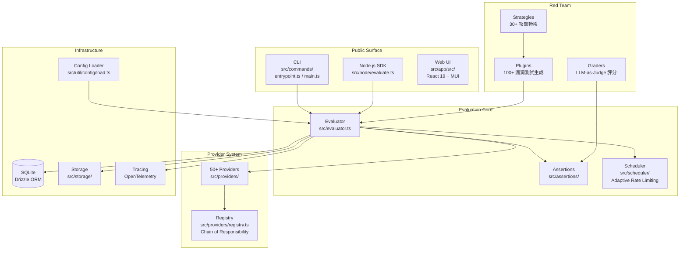

# promptfoo · 架構

## 高層架構

promptfoo 是 monorepo，依 `architecture/layers.json` 分為 10 層：

### 圖意說明

這張圖揭示了 promptfoo 的四個核心層次：

- **Public Surface** 層提供三種使用方式：CLI（主要入口）、Node.js SDK（程式化使用）、Web UI（結果瀏覽）
- **Evaluation Core** 是所有資料的樞紐：Evaluator 協調 provider 呼叫、assertion 評分、排程控制
- **Provider System** 是最大的子系統，透過 Chain-of-Responsibility 模式把 `openai:gpt-4` 字串解析成對應的 provider instance
- **Red Team** 是獨立卻緊密整合的子系統：plugins 生成測試輸入、strategies 轉換成攻擊變體、graders 評分攻擊是否成功

## 內部分層

### CLI 層 (`src/entrypoint.ts`, `src/main.ts`)

- 職責: Commander.js 註冊 20+ 子命令，環境設定的初始化
- 位置: [`src/entrypoint.ts`](https://github.com/promptfoo/promptfoo/blob/1205a2a2be77beb8505731515d0af1ee893cacb0/src/entrypoint.ts) / [`src/main.ts`](https://github.com/promptfoo/promptfoo/blob/1205a2a2be77beb8505731515d0af1ee893cacb0/src/main.ts)
- 設計亮點: entrypoint 故意零依賴 — 在 import 任何模組前先檢查 Node.js 版本（[`src/entrypoint.ts:16-24`](https://github.com/promptfoo/promptfoo/blob/1205a2a2be77beb8505731515d0af1ee893cacb0/src/entrypoint.ts#L16-L24)），避免因相依套件使用 ES2024 語法產生費解的 syntax error
- 對其他層的依賴: 所有 command handlers 都跨層（commands/eval → evaluator, commands/config → config loader）

### 評分層 — Evaluator (`src/evaluator.ts`) + Assertions (`src/assertions/`)

- 職責: 執行評估管線 — prompt 渲染、provider 呼叫、assertion 評分、結果匯總
- 位置: [`src/evaluator.ts`](https://github.com/promptfoo/promptfoo/blob/1205a2a2be77beb8505731515d0af1ee893cacb0/src/evaluator.ts)
- 設計亮點: 4700 行單一檔案的巨型類別 — 是歷史累積而非刻意設計。所有 `(test × var_combo × repeat × provider × prompt)` 組合展開成扁平陣列，用 `async.forEachOfLimit` + 自適應 rate limiting 併發執行
- 對其他層的依賴: providers、assertions、scheduler、storage、tracing、models（db）

### Provider 系統 (`src/providers/`)

- 職責: 50+ LLM provider 的統一抽象與執行
- 位置: [`src/providers/`](https://github.com/promptfoo/promptfoo/blob/1205a2a2be77beb8505731515d0af1ee893cacb0/src/providers/)
- 核心介面: ApiProvider — 只有一個必要方法 `callApi(prompt, context?, options?)`，回傳 `ProviderResponse`（fat response 模式，含 output、error、tokenUsage、cost 等 20+ 欄位）
- 註冊機制: Chain-of-Responsibility 模式 — [`src/providers/registry.ts`](https://github.com/promptfoo/promptfoo/blob/1205a2a2be77beb8505731515d0af1ee893cacb0/src/providers/registry.ts) 的 `providerMap` 陣列依序 match provider path prefix

### Red Team 系統 (`src/redteam/`)

- 職責: 自動化安全測試 — 生成攻擊測試、套用攻擊策略、評分攻擊是否成功
- 位置: [`src/redteam/`](https://github.com/promptfoo/promptfoo/blob/1205a2a2be77beb8505731515d0af1ee893cacb0/src/redteam/)
- 架構: Pipeline (Plugin → Strategy → Grading)，各階段透過 metadata 傳遞上下文
- 對其他層的依賴: providers（呼叫 LLM 生成測試）、evaluator（執行評分）、database（儲存結果）

### Config 系統 (`src/util/config/`)

- 職責: 從 YAML/JSON/JS 設定檔載入並驗證配置
- 位置: [`src/util/config/load.ts`](https://github.com/promptfoo/promptfoo/blob/1205a2a2be77beb8505731515d0af1ee893cacb0/src/util/config/load.ts)
- 設計亮點: 二階段載入 — 先讀 raw config、dereference JSON `$ref`、渲染 `{{ env.VAR }}` 模板 → Zod schema 驗證 → 再 resolve 成 TestSuite

## 跨模組通訊模式

| 模式 | 用途 | 位置 |
|---|---|---|
| **扁平陣列 + forEachOfLimit** | 所有 eval 步驟展開成 RunEvalOptions[]，非同步併發執行 | [`src/evaluator.ts:3520-3594`](https://github.com/promptfoo/promptfoo/blob/1205a2a2be77beb8505731515d0af1ee893cacb0/src/evaluator.ts#L3520-L3594) |
| **Chain-of-Responsibility** | Provider 字串依序通過 factory 的 test() | [`src/providers/registry.ts:125-1704`](https://github.com/promptfoo/promptfoo/blob/1205a2a2be77beb8505731515d0af1ee893cacb0/src/providers/registry.ts#L125-L1704) |
| **Template Method** | RedteamPluginBase 定義 generateTests 骨架，子類別實作 getTemplate/getAssertions | [`src/redteam/plugins/base.ts:41-370`](https://github.com/promptfoo/promptfoo/blob/1205a2a2be77beb8505731515d0af1ee893cacb0/src/redteam/plugins/base.ts#L41-L370) |

## 狀態管理

Eval 結果存於 SQLite（Drizzle ORM），schema 透過 migration 管理（[`drizzle/`](https://github.com/promptfoo/promptfoo/blob/1205a2a2be77beb8505731515d0af1ee893cacb0/drizzle/)）。此外也支援 JSONL 即時輸出。沒有 cluster-level 的分散式狀態 — 所有資料在單機。

## 配置系統

- **Config 入口**: [`src/util/config/load.ts:650-976`](https://github.com/promptfoo/promptfoo/blob/1205a2a2be77beb8505731515d0af1ee893cacb0/src/util/config/load.ts#L650-L976)（resolveConfigs）
- **配置來源優先級**: CLI 參數 > 指定 config 檔 (`-c`) > 自動偵測 (`promptfooconfig.yaml`)
- **驗證機制**: Zod schema（[`src/types/index.ts`](https://github.com/promptfoo/promptfoo/blob/1205a2a2be77beb8505731515d0af1ee893cacb0/src/types/index.ts)：CommandLineOptionsSchema、TestSuiteSchema）
- **模板系統**: Nunjucks — prompt、assertion value 都支援模板變數插值

## 測試策略

- **單元測試**: Vitest，~995 `.ts` + 524 `.tsx` 測試檔案
- **整合測試**: `vitest.integration.config.ts`，需要 API key
- **Smoke test**: `vitest.smoke.config.ts`
- **CI 矩陣**: GitHub Actions — 跨 Node.js 版本、跨 OS（Linux/macOS/Windows 推測）

## 發布與版本管理

- **版本策略**: SemVer 寬鬆（0.x 階段）
- **Changelog**: [`CHANGELOG.md`](https://github.com/promptfoo/promptfoo/blob/1205a2a2be77beb8505731515d0af1ee893cacb0/CHANGELOG.md) — release-please 自動生成
- **Release 流程**: 自動化 — GitHub Actions + release-please（[`.github/workflows/release-please.yml`](https://github.com/promptfoo/promptfoo/blob/1205a2a2be77beb8505731515d0af1ee893cacb0/.github/workflows/release-please.yml)）
- **package manager**: pnpm workspaces（monorepo: `src/app`, `site`）

## 關鍵設計決策

### 決策 1: 扁平展開 vs 巢狀執行

所有 `(test × var_combo × repeat × provider × prompt)` 組合被展開成 RunEvalOptions[] 陣列，用 `async.forEachOfLimit` 併發執行。這讓 resume、retry、watch-mode 都能靠 `(testIdx, promptIdx)` pair 精準定位未完成的工作。代價是 4700 行的 evaluator.ts 巨型檔案。

### 決策 2: Chain-of-Responsibility 代替 Map Lookup

Provider 解析不用 `Map<string, Factory>` 而用陣列依序 match prefix。這讓 `openai:` 單一 prefix 可以內含複雜的 subtype routing（chat / completion / embedding / responses / realtime / ...），但如果兩個 factory 都 match 同個 prefix，先註冊者贏。相較 LiteLLM 的 mapping table，更靈活但 prefix 順序敏感。

### 決策 3: Redteam 用 LLM 生成測試 + LLM 評分

Promptfoo 的 redteam 不走「預先定義攻擊字典」的路線，而是利用 LLM（預設 gpt-5.5）根據 system prompt 動態生成攻擊輸入。好處是攻擊品質高、可針對特定應用；缺點是依賴 LLM 的生成品質，且多了一層 LLM 呼叫成本。

## 跟外部世界的接觸面

- **CLI**: 主要入口，`promptfoo` / `pf` 二進位（[`package.json:34-36`](https://github.com/promptfoo/promptfoo/blob/1205a2a2be77beb8505731515d0af1ee893cacb0/package.json#L34-L36)）
- **Node.js SDK**: `import { evaluate } from 'promptfoo'`（[`src/index.ts`](https://github.com/promptfoo/promptfoo/blob/1205a2a2be77beb8505731515d0af1ee893cacb0/src/index.ts)）
- **Web UI**: `promptfoo view` 啟動 local server + React app
- **環境變數**: 各 provider 的 API key（`OPENAI_API_KEY`等）、`PROMPTFOO_DISABLE_UPDATE`、`REQUEST_TIMEOUT_MS` 等
- **網路請求**: 所有 provider API 呼叫（LLM inference）、remote redteam generation（若啟用）、telemetry 事件
