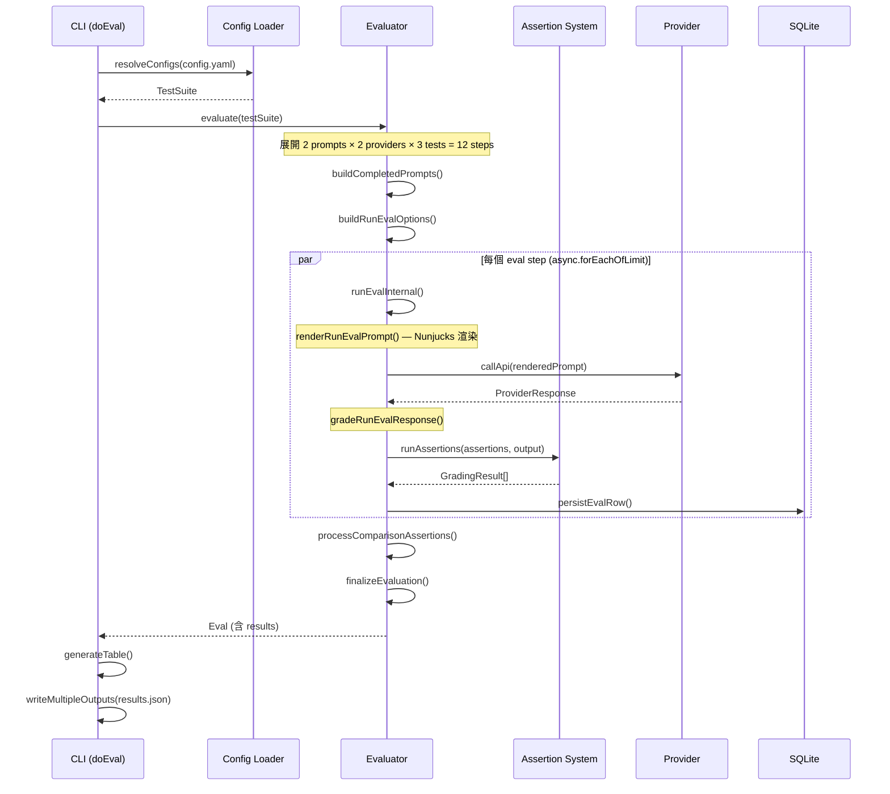

# promptfoo · 程式碼追蹤

## 追蹤的場景

**使用者執行**: `promptfoo eval -c promptfooconfig.yaml -o results.json`

其中 `promptfooconfig.yaml` 包含 2 個 prompts、2 個 providers、3 個 tests：

```yaml
prompts:
  - "Translate to French: {{input}}"
  - "You are a translator. Output: {{input}}"
providers:
  - openai:gpt-4o
  - anthropic:claude-3-5-sonnet
tests:
  - vars: { input: "Hello" }
    assert: [{ type: "contains", value: "Bonjour" }]
  - vars: { input: "Goodbye" }
  - vars: { input: "Thank you" }
```

## 流程圖



### 圖意說明

這張 sequence diagram 展示了 promptfoo eval 的完整路徑：

- **Config 載入**是第一步，把 YAML + prompt 檔案 + provider 字串解析成結構化的 `TestSuite`
- **Evaluator** 把所有組合展開（這裡是 2×2×3=12 步），用 `async.forEachOfLimit` 搭配自適應 rate limiting 併發執行
- 每個 eval step 獨立完成「模板渲染 → provider 呼叫 → assertion 評分 → 寫入資料庫」
- 所有步驟完成後才做跨 row 的比較型 assertion（如 select-best）與最終化

## 逐步追蹤

### Step 1: CLI 入口 — doEval()

[`src/commands/eval.ts:200-428`](https://github.com/promptfoo/promptfoo/blob/1205a2a2be77beb8505731515d0af1ee893cacb0/src/commands/eval.ts#L200-L428)

`doEval()` 是 eval 命令的處理函式。它接收 Commander.js 解析後的 options，執行以下動作：

1. 設定環境（`setupEnv()`）
2. 檢查 API keys 是否存在
3. 呼叫 `resolveConfigs()` 將 YAML config 解析為 `TestSuite`
4. 若開啟 watch mode，啟動檔案監聽（chokidar）
5. 呼叫 `evaluate()` 執行評估

值得注意:

- 使用 `chalk` 渲染終端輸出，`ora` 顯示進度條（spinner 動畫）
- 所有錯誤透過 `failEvalRun()` 處理 — CLI 模式下設 `process.exitCode = 1`，SDK 模式下 throw `EvalRunError`
- `handleRecoverableWatchError()`（[`src/commands/eval.ts:135-149`](https://github.com/promptfoo/promptfoo/blob/1205a2a2be77beb8505731515d0af1ee893cacb0/src/commands/eval.ts#L135-L149)）在 watch mode 下讓特定錯誤（ConfigResolutionError、EmailValidationError）不中斷監聽

### Step 2: Config 解析 — resolveConfigs()

[`src/util/config/load.ts:650-976`](https://github.com/promptfoo/promptfoo/blob/1205a2a2be77beb8505731515d0af1ee893cacb0/src/util/config/load.ts#L650-L976)

這是 config 載入的核心，將 `UnifiedConfig` 轉為執行期 `TestSuite`：

1. **readConfig()**: 載入 YAML/JSON/JS/TS 檔案，支援 JSON `$ref` dereference 與 `{{ env.VAR }}` 模板渲染
2. **readPrompts()**: 載入 prompt 模板（支援內嵌字串、檔案路徑、glob pattern）
3. **loadApiProviders()**: 將 provider 字串（如 `openai:gpt-4o`）轉為 `ApiProvider` 實例
4. **readTests()**: 載入測試案例 — 支援內嵌、外部檔案、CSV、HuggingFace dataset
5. **validateAssertions()**: 驗證 assertion 配置是否合法
6. **validateTestProviderReferences()**: 確保 test-level provider override 指向有效 provider

此步驟後產出 `TestSuite` 結構 — 包含 `prompts[]`、`providers[]`、`tests[]`、`defaultTest`、`scenarios`、`extensions` 等。

### Step 3: 評估展開 — Evaluator._runEvaluation()

[`src/evaluator.ts:4292-4556`](https://github.com/promptfoo/promptfoo/blob/1205a2a2be77beb8505731515d0af1ee893cacb0/src/evaluator.ts#L4292-L4556)

評估主循環，最關鍵的步驟：

1. **buildCompletedPrompts()**: 建立 provider × prompt 的組合矩陣
2. **buildTestsFromSuite()**: 展開 scenarios（產生多個 test）、合併 defaultTest 到每個 test
3. **prepareTestVariables()**: 處理 multi-var 組合（Cartesian product of vars）、執行 transformVars
4. **buildRunEvalOptions()**: 產生所有 `(test × var_combo × repeat × provider × prompt)` 組合，每個組合是一個 `RunEvalOptions`
5. **adjustConcurrencyForSerialFeatures()**: 若包含 `_.conversation` 或 delay，強制 concurrency=1
6. **executeEvalSteps()**: 分三步執行 — serial steps → concurrent steps → grouped grading steps

### Step 4: 單一步驟執行 — runEvalInternal()

[`src/evaluator.ts:1337-1524`](https://github.com/promptfoo/promptfoo/blob/1205a2a2be77beb8505731515d0af1ee893cacb0/src/evaluator.ts#L1337-L1524)

每個 eval step 的核心處理：

```
renderRunEvalPrompt()     → Nunjucks 模板 + 變數 → 最終 prompt
callProviderForRunEval()  → 透過 rateLimitRegistry.execute() 呼叫 provider.callApi()
applyProviderDelayIfNeeded() → 若有設定 delay，執行等
gradeRunEvalResponse()    → 對 response 執行 transform → 跑 assertions → 計算分數
createEvaluateResult()    → 封裝結果（含 grading result、token usage、latency）
processEvalRows()         → 寫入 DB + JSONL + update metrics
```

**渲染 prompt**: [`src/evaluatorHelpers.ts`](https://github.com/promptfoo/promptfoo/blob/1205a2a2be77beb8505731515d0af1ee893cacb0/src/evaluatorHelpers.ts) 的 `renderPrompt()` 使用 Nunjucks 模板引擎，支援變數插值（`{{ varName }}`）、自訂 filter、對話歷史變數（`_conversation`）。

**Provider 呼叫**: 經過 `rateLimitRegistry.execute()`（[`src/scheduler/rateLimitRegistry.ts:22-149`](https://github.com/promptfoo/promptfoo/blob/1205a2a2be77beb8505731515d0af1ee893cacb0/src/scheduler/rateLimitRegistry.ts#L22-L149)），這是自適應併發控制的核心 — 從 response header 學習 rate limit，動態增減 concurrency。

### Step 5: Assertion 評分 — runAssertions()

[`src/assertions/index.ts:718-836`](https://github.com/promptfoo/promptfoo/blob/1205a2a2be77beb8505731515d0af1ee893cacb0/src/assertions/index.ts#L718-L836)

Assertion 系統分三層：

1. **ASSERTION_HANDLERS** registry（[`src/assertions/index.ts:224-313`](https://github.com/promptfoo/promptfoo/blob/1205a2a2be77beb8505731515d0af1ee893cacb0/src/assertions/index.ts#L224-L313)）: 47 種 assertion type → handler 的 dispatch map
2. **runAssertion()**（[`src/assertions/index.ts:403-669`](https://github.com/promptfoo/promptfoo/blob/1205a2a2be77beb8505731515d0af1ee893cacb0/src/assertions/index.ts#L403-L669)）: 執行單一 assertion，包含 file:// 腳本載入、Nunjucks 值渲染、GradingResult 回傳
3. **AssertionsResult**（[`src/assertions/assertionsResult.ts`](https://github.com/promptfoo/promptfoo/blob/1205a2a2be77beb8505731515d0af1ee893cacb0/src/assertions/assertionsResult.ts)）: 多 assertion 結果的聚合、加權、threshold 計算，支援巢狀 AND/OR 語意

### Step 6: 結果輸出

Eval 完成後，doEval() 產生三種輸出：

1. **CLI 表格**: `generateTable()`（[`src/table.ts:7-48`](https://github.com/promptfoo/promptfoo/blob/1205a2a2be77beb8505731515d0af1ee893cacb0/src/table.ts#L7-L48)）— cli-table3 渲染，[PASS]/[FAIL] 著色
2. **摘要**: `generateEvalSummary()`（[`src/commands/eval/summary.ts`](https://github.com/promptfoo/promptfoo/blob/1205a2a2be77beb8505731515d0af1ee893cacb0/src/commands/eval/summary.ts)）— 統計 pass/fail/error 數量、token usage
3. **檔案輸出**: `writeMultipleOutputs()` — JSON、JSONL、CSV 格式

## 想學更多時，在哪裡下中斷點

- Config 解析: `src/util/config/load.ts:650` — resolveConfigs 入口
- Eval 展開: `src/evaluator.ts:4292` — _runEvaluation 主循環
- 單一 step 執行: `src/evaluator.ts:1337` — runEvalInternal
- Assertion dispatch: `src/assertions/index.ts:403` — runAssertion
- Rate limiting: `src/scheduler/rateLimitRegistry.ts:22` — RateLimitRegistry.execute

## 沒追蹤到但值得留意

- **錯誤路徑**: 當 provider 回傳 `{ error: "rate limit" }` 時，schedule 層的 retry policy 會根據 HTTP status code 決定是否重試
- **Watch mode**: 檔案變更時自動重新執行 eval，透過 chokidar 監聽 config/prompt/test 檔案的變更
- **Resume mode**: `--resume` 參數跳過已完成的 `(testIdx, promptIdx)` pair
- **Redteam 路徑**: `promptfoo redteam run` 分支走 `src/redteam/commands/run.ts` → `doGenerateRedteam()` → `synthesize()` → 呼叫標準 eval pipeline 做評分
