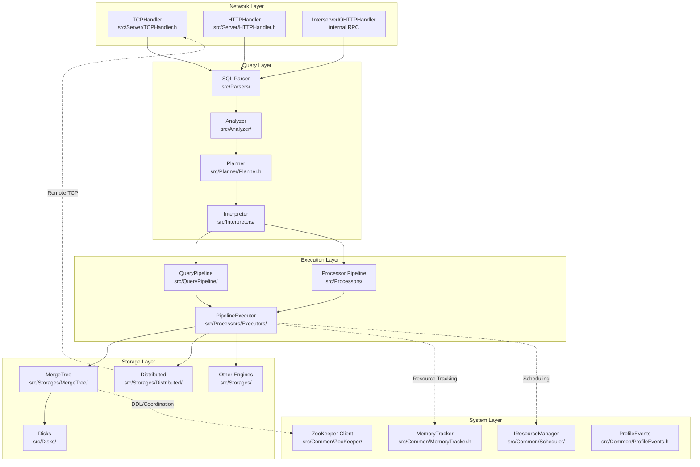
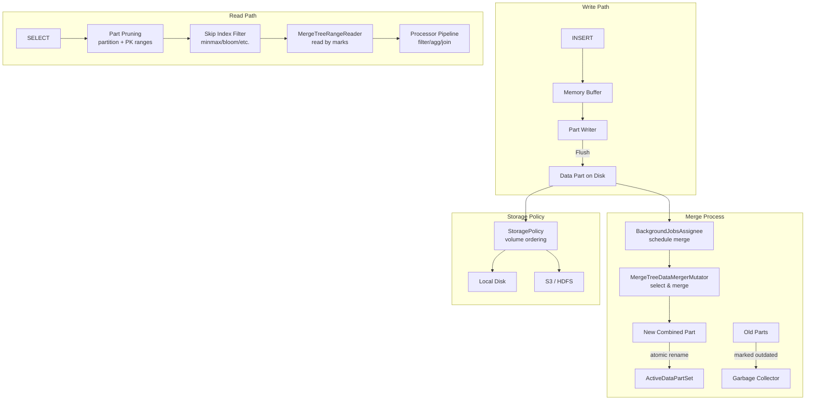

# ClickHouse · 架構

## 高層架構

ClickHouse 是一個 **shared-nothing 分散式 OLAP 資料庫**。下圖顯示單個 ClickHouse server 的程序內部架構：



**圖意說明**：請求從網路層進入（TCP 或 HTTP），經 parse → analyze → plan → interpret 四階段轉換為可執行的 processor pipeline。PipelineExecutor 驅動整個管線，從 storage layer 讀取資料、轉換、最後輸出結果。Storage layer 支援多種引擎（MergeTree 為核心），透過 Disk abstraction 支援本地磁碟與 S3。系統層的 MemoryTracker 與 ResourceManager 在查詢執行期間即時監控資源。

## 查詢執行管線：五階段的轉換

ClickHouse 的查詢執行不是「parse → execute」這樣簡單，而是經過五階段的**逐步下推（lowering）**：

```mermaid
flowchart LR
  SQL[SQL String\nSELECT count(*)\nFROM events\nWHERE date > '2025-01-01']
  AST[AST\nParser AST\n(select, table, where)]
  QT[QueryTree\nSemantic representation\nAnalyzer output]
  QPlan[QueryPlan\nStep DAG\n(ReadFromMergeTree,\nFilter, Aggregate)]
  Pipe[Pipeline\nProcessors connected\nby ports]
  Result[Result Block\n(is->os stream)]

  SQL -->|parseQuery| AST
  AST -->|Analyzer| QT
  QT -->|Planner| QPlan
  QPlan -->|QueryPlanBuilder| Pipe
  Pipe -->|PipelineExecutor| Result
```

### 階段 1: Parse — SQL 字串 → AST

[`parseQuery()`](https://github.com/ClickHouse/ClickHouse/blob/72b4ed7227d/src/Parsers/parseQuery.h) 將 SQL 字串解析為抽象語法樹（Abstract Syntax Tree, AST）。Parser 使用**遞迴下降**（recursive descent）實作，每個 SQL 子句對應一個 parser（`src/Parsers/ParserSelectQuery.h`、`ParserInsertQuery.h` 等）。AST 的節點以 `IAST` 為基底（[`src/Parsers/IAST.h`](https://github.com/ClickHouse/ClickHouse/blob/72b4ed7227d/src/Parsers/IAST.h)）。

**設計選擇 vs 替代方案**：ClickHouse 的 parser 是手寫遞迴下降而非 yacc/bison 產生的 LALR parser。這讓錯誤訊息更好看、語法擴充更靈活（例如 `SELECT ... FORMAT ...` 這種非標準子句），代價是維護成本較高。

### 階段 2: Analyze — AST → QueryTree

經過 Analyzer（[`src/Analyzer/`](https://github.com/ClickHouse/ClickHouse/blob/72b4ed7227d/src/Analyzer/)），AST 被轉換為語意層級的 QueryTree。這是 ClickHouse 新 query pipeline（2023 年引入）的核心抽象。不同於 AST（純語法層），QueryTree 已經過**名稱解析**（name resolution）、**型別推導**（type inference）、**別名展開**。例如 `SELECT *` 中的 `*` 在 QueryTree 中已展開為具體欄位清單。

### 階段 3: Plan — QueryTree → QueryPlan

[`Planner`](https://github.com/ClickHouse/ClickHouse/blob/72b4ed7227d/src/Planner/Planner.h) 將 QueryTree 轉換為一個由 `IQueryPlanStep` 組成的有向無環圖（DAG）。每個 step 代表一個執行步驟（例如讀取 MergeTree part、過濾、聚合），step 之間透過 `QueryPlan::Node` 連結。Planner 在 [`buildPlanForQueryNode()`](https://github.com/ClickHouse/ClickHouse/blob/72b4ed7227d/src/Planner/Planner.cpp) 中遞迴遍歷 QueryTree 節點。

**設計選擇**：QueryPlan 是**邏輯計劃而非物理計劃** — 它不指定 PipelineExecutor 的執行細節（如平行度、執行緒分配）。這讓 QueryPlan 可以序列化/反序列化、被不同 executor 消費。

### 階段 4: Build — QueryPlan → Pipeline

QueryPlan 透過 [`QueryPipelineBuilder`](https://github.com/ClickHouse/ClickHouse/blob/72b4ed7227d/src/QueryPipeline/QueryPipelineBuilder.cpp) 轉換為由 `IProcessor` 組成的管線（pipeline）。Pipeline 是一張「processor 圖」，processor 之間透過 `InputPort` / `OutputPort` 連線。

[`IProcessor`](https://github.com/ClickHouse/ClickHouse/blob/72b4ed7227d/src/Processors/IProcessor.h) 的介面設計很有特色：每個 processor 有一個 `prepare()` 階段（告訴排程器「我需要什麼」）和一個 `work()` 階段（實際執行）。這個兩階段設計讓 `PipelineExecutor` 可以**非同步且非搶先地**排程 processor。

### 階段 5: Execute — Pipeline → 結果

[`PipelineExecutor`](https://github.com/ClickHouse/ClickHouse/blob/72b4ed7227d/src/Processors/Executors/PipelineExecutor.h) 驅動整個管線執行。它維護一個「就緒 processor 佇列」，反覆從佇列中取出 processor → `prepare()` → `work()`，直到所有 processor 完成或管線被取消。支援多執行緒（`processors` / `threads` 設定）與動態管線修改（INSERT 情境）。

### 跨模組通訊

| 通訊路徑 | 機制 | 位置 |
|---|---|---|
| 客戶端 ↔ Server | TCP Handler（二進位協定）/ HTTP | `src/Server/TCPHandler.cpp` / `src/Server/HTTPHandler.cpp` |
| Server ↔ Server | Interserver HTTP（二進位 over HTTP） | `src/Server/InterserverIOHTTPHandler.cpp` |
| Server ↔ ZooKeeper | ZooKeeper 客戶端 | `src/Common/ZooKeeper/` |
| Server ↔ Keeper | NuRaft 協定（替代 ZK） | `src/Coordination/KeeperServer.h` |
| Processor ↔ Processor | Port 介面（直接 function call） | `src/Processors/IProcessor.h` |

## 儲存引擎：MergeTree 架構

MergeTree 是 ClickHouse 的**核心儲存引擎**，負責絕大部分 OLAP 場景的資料儲存與讀取：



**圖意說明**：寫入先經記憶體緩衝區，flush 為不可變（immutable）的 data part 寫入磁碟。後台持續進行 merge：將多個小型 part 合併為一個大型 part，達到刪除資料（過期 part 被標記為 outdated）與優化讀取效能的目的。讀取時先透過 partition pruning 和 primary key 範圍過濾 part，再透過 skip indices 跳過不相關的 mark range。

### 關鍵設計：Immutable Data Part

MergeTree 最根本的設計決定是「**資料寫入後永不修改**」。INSERT 產生的 data part 不可變，DELETE/UPDATE 透過 **mutation**（產生新 part 取代舊 part）或 **lightweight delete**（在讀取時過濾）。這個決定的影響：

| 層面 | 好處 | 代價 |
|---|---|---|
| **讀取併發** | 無需鎖 — part 讀取完全平行 | 無 |
| **備份/複製** | 複製 part = 複製目錄，簡單可靠 | 需 ZooKeeper 協調 part 清單 |
| **寫入放大** | — | MERGE 會大量讀寫：大 part 的 merge 可能吃滿 IO |
| **即時更新** | — | 單列更新需重寫整個 part（或 patch parts） |

**設計選擇 vs 替代方案**：
- 相較於 **LSM-tree（如 RocksDB/LevelDB）**：MergeTree 的 key 是 `(partition_id, min_block, max_block)` 而非任意 key，這讓 merge 可以更聰明地選取 part（而非只是 level 或 size），但也讓 merge 選擇邏輯變得複雜。
- 相較於 **Delta Lake/Iceberg**：同樣是 immutable file + metadata 更新，但 ClickHouse 的 metadata 存在 ZooKeeper 而非目錄檔案中，依賴外部協調服務。

## 分散式架構

```mermaid
flowchart TB
  subgraph "Client Side"
    Client[clickhouse-client\n(or HTTP client)]
  end

  subgraph "Initiator Node"
    Init[Server A - Query Initiator]
    Init --> PlannerDist[Distributed Plan]
    PlannerDist --> RemoteQ[RemoteQueryExecutor\nshard-queries]
  end

  subgraph "Worker Nodes"
    subgraph "Shard 1"
      N1[Server B - Worker]
      T1[Table local_events\nMergeTree]
    end
    subgraph "Shard 2"
      N2[Server C - Worker]
      T2[Table local_events\nMergeTree]
    end
  end

  subgraph "Coordination"
    ZK((ZooKeeper / Keeper))
  end

  Client -->|Connect| Init
  RemoteQ -->|SELECT shard 1| N1
  RemoteQ -->|SELECT shard 2| N2
  N1 -->|Partial Result| Init
  N2 -->|Partial Result| Init
  Init -->|Merged| Client

  Init -.->|DDL coordination| ZK
  N1 -.->|Part info / replication| ZK
  N2 -.->|Part info / replication| ZK
```

**圖意說明**：ClickHouse 的分散式查詢採用 **initiator-worker** 模式。Initiator 節點接收查詢，產生「分散式執行計劃」，將子查詢派發到各 shard 的 worker 節點執行，最後在 initiator 合併結果。ZooKeeper（或 ClickHouse Keeper）用於 coordination：複製資訊、DDL 協調、分散式 DDL queue。每個節點運作上是對等的，任何節點都可以當 initiator。

### Sharding 策略

- **利用 Distributed 表引擎**（[`StorageDistributed`](https://github.com/ClickHouse/ClickHouse/blob/72b4ed7227d/src/Storages/StorageDistributed.h)）作為邏輯表，背後指向各 shard 的實體 MergeTree 表
- Sharding key（如 `rand()` 或 `hash(cityHash64(col))`）決定每行資料的去向
- 寫入的資料可選擇同步（直接送達各 shard）或非同步（先寫入本地檔案佇列，背景發送）

### 複製機制

- 同一 shard 內的多個 replica 透過 ZooKeeper 協調
- **ReplicatedMergeTree** 引擎監聽 ZK 路徑，新 part 產生時在 ZK 建立節點，其他 replica 收到通知後下載
- Data part 在 ZK 中以 `(path, checksum)` 清單描述，確保跨節點一致性

### 一致性模型

- **最終一致性**（eventual consistency）— 寫入到一個 replica 後，其他 replica 非同步複製
- 讀取可選 `insert_deduplication`、`select_sequential_consistency` 等參數來調整
- 不做 distributed transaction、不做跨 shard 的 atomic commit

**設計選擇**：ClickHouse 選擇**不要強一致**，這在分析場景（不像銀行轉帳）通常是合理的。代價是開發者需要理解「同一張 Distributed 表在不同節點看到的資料可能不同」這個事實。

## 外部協調的角色：由 ZK 到 Keeper

ZooKeeper 是 ClickHouse 最早的外部依賴，用於：
1. Shard 內 replica 之間的 part 清單同步
2. 分散式 DDL（`ON CLUSTER`）佇列協調
3. ClickHouse Keeper 的 Raft 組成員發現

ClickHouse 團隊後來開發了 **ClickHouse Keeper**（[`src/Coordination/`](https://github.com/ClickHouse/ClickHouse/blob/72b4ed7227d/src/Coordination/)）作為 ZK 的替代方案。Keeper 使用 **NuRaft** 函式庫實作 Raft 共識演算法，完整相容 ZooKeeper 協定（session、ephemeral nodes、watches、sequential nodes）。

**為什麼要做 Keeper？** ZK 是 Java 程序，部署 ClickHouse 叢集時需額外管理一套 Java 環境。Keeper 讓整個叢集只需要一種二進位檔，大幅簡化運維。

## 資源隔離與控制

ClickHouse 的資源管理分三層：

| 層級 | 機制 | 控制點 |
|---|---|---|
| **全域** | `total_memory_tracker` | `max_server_memory_usage` config |
| **查詢** | `query_memory_tracker` | `max_memory_usage` session setting |
| **執行緒** | `thread_memory_tracker` | 自動繼承查詢限制 |
| **CPU** | IResourceManager + scheduler | workload settings |

[`MemoryTracker`](https://github.com/ClickHouse/ClickHouse/blob/72b4ed7227d/src/Common/MemoryTracker.h) 是 ClickHouse 的記憶體監控框架。每個查詢和執行緒都有一個 tracker，形成樹狀結構。當 `amount > hard_limit` 時拋出 `MEMORY_LIMIT_EXCEEDED` 例外。設計上使用 `std::atomic` 而非 mutex 以減少高頻 allocation 的 overhead，cache line 優化（hot/cold fields 拆分）避免 false sharing。

## 測試策略

- **單元測試** — 各模組下的 `tests/` 目錄，使用 gtest
- **功能測試** — `tests/queries/0_stateless/` + `1_stateful/`，共 **數萬個 .sql 檔案**（這也是 clone 時 Windows 路徑過長的原因）
- **模糊測試** — 各元件下 `fuzzers/` 目錄
- **效能測試** — `tests/performance/`，持續 benchmark
- **整合測試** — Docker 環境的叢集測試

## 發布與版本管理

- 版本策略：**CalVer**（YY.M），每月 21 號左右發版
- Changelog：[`CHANGELOG.md`](https://github.com/ClickHouse/ClickHouse/blob/72b4ed7227d/CHANGELOG.md)（極大型檔案，每月數百條記錄）
- 發布流程：自動化 GitHub Actions + 多平台 binary 打包
- 支援 x86_64、ARM64、Linux、macOS、FreeBSD
