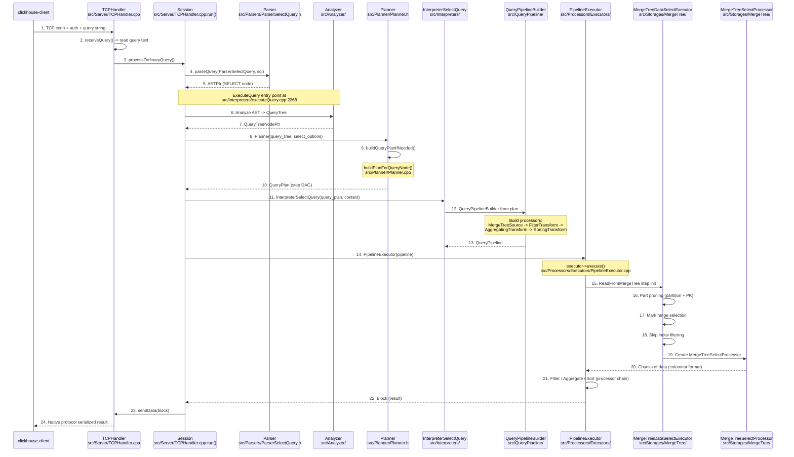

# ClickHouse · 程式碼追蹤

## 追蹤的場景

最典型的 ClickHouse 使用場景：**透過 `clickhouse-client` 執行一條 SELECT 聚合查詢，查詢一個 MergeTree 表**。

**使用者輸入**：
```sql
SELECT region, count(*), avg(amount)
FROM analytics.events
WHERE event_date > '2026-05-01'
GROUP BY region
ORDER BY count(*) DESC
LIMIT 10
```

這條查詢會完整經過：網路層 → Parser → Analyzer → Planner → Interpreter → Processor Pipeline → MergeTree 讀取 → 聚合 → 排序 → 輸出。

## 完整流程圖



## 逐步追蹤

### Step 1: 網路層進入

`clickhouse-client` 透過原生 TCP 協定連接程式。伺服器端的 [`TCPHandler`](https://github.com/ClickHouse/ClickHouse/blob/72b4ed7227d/src/Server/TCPHandler.cpp) 是 `Poco::Net::TCPServerConnection` 的子類別。`TCPHandler::run()` 包含主迴圈 (`:295`)，反覆 `receiveQuery()` → `processOrdinaryQuery()` → `sendData()` / `sendException()`。

**值得注意**：
- TCPHandler 不解析查詢，只接收字串 (`:897` `receiveQuery()` 將 socket 資料讀入 `ReadBuffer`)
- 支援多查詢複用 (`query_count` 計數器)，同一個連線可執行多個查詢
- 協定版本協商在 `run()` 開頭完成

### Step 2: executeQuery 入口

`processOrdinaryQuery()` 內部呼叫 [`executeQuery()`](https://github.com/ClickHouse/ClickHouse/blob/72b4ed7227d/src/Interpreters/executeQuery.cpp#L2268)。這個函式是 ClickHouse 查詢執行的**總入口**：

```cpp
// executeQuery.cpp:2268 (簡化)
void executeQuery(
    ReadBuffer & istr,        // 查詢字串（含 INSERT 資料）
    WriteBuffer & ostr,       // 輸出
    ContextMutablePtr context,
    QueryFlags flags,
    ...)
```

`executeQuery()` 內部依序：
1. `parseQuery()` — 將 SQL 字串解析成 AST (`:2329`)
2. 根據 AST 類型決定 interpreter（`InterpreterFactory::get()`）(`:2375`)
3. 呼叫 `interpreter->execute()` → 得到 `BlockIO` (`:2379`)

**這個階段的失敗模式**：
- SQL 語法錯誤 → `parseQuery()` 拋 `Exception` → 被 `tryLogCurrentException` 記錄 → 客戶端收到錯誤訊息
- 查詢需要 INNER 表但無權限 → `InterpreterFactory::get()` 拋權限錯誤
- 查詢超時 → `InterpreterExecuteQuery` 透過 `QuotaForIntervals` 攔截

### Step 3: 解析（SQL → AST）

[`ParserSelectQuery`](https://github.com/ClickHouse/ClickHouse/blob/72b4ed7227d/src/Parsers/ParserSelectQuery.h) 是遞迴下降 parser。它解析 SELECT 子句的每個部分（FROM、WHERE、GROUP BY、ORDER BY、LIMIT 等），每個子句對應不同的 parser（`ParserSelectQuery::parseImpl()`）。

AST 節點繼承自 [`IAST`](https://github.com/ClickHouse/ClickHouse/blob/72b4ed7227d/src/Parsers/IAST.h)，整個 SELECT 的 AST 由一個 `ASTSelectQuery` 節點（根）和其子節點（`ASTTableExpression`、`ASTFunction` 等）組成。

### Step 4: 分析（AST → QueryTree）

較新的 path 會經過 Analyzer，將 AST 轉換為 **QueryTree**（語意層級表示法）。在這一步：
- `*` 被展開為實際欄位清單
- 別名被解析和套用
- 型別推導完成（`event_date` 是 `Date` 型別，`amount` 是 `Float64`）

QueryTree 以 [`QueryTreeNodePtr`](https://github.com/ClickHouse/ClickHouse/blob/72b4ed7227d/src/Analyzer/QueryTreeNode.h) 為基礎，支援 visitor pattern 遍歷和分析。

### Step 5: 規劃（QueryTree → QueryPlan）

[`Planner`](https://github.com/ClickHouse/ClickHouse/blob/72b4ed7227d/src/Planner/Planner.h#L27) 將 QueryTree 轉換為 [`QueryPlan`](https://github.com/ClickHouse/ClickHouse/blob/72b4ed7227d/src/Processors/QueryPlan/QueryPlan.h)。`buildQueryPlanIfNeeded()` → `buildPlanForQueryNode()` 是核心方法。

對 `SELECT region, count(*), avg(amount) FROM events WHERE event_date > '2026-05-01' GROUP BY region ORDER BY count(*) DESC LIMIT 10`，Planner 會產生類似以下的 step DAG：

**Planning result (conceptual)**:
```
ReadFromMergeTree        ← 讀取 events 表，篩選 event_date > '2026-05-01'
    ↓
FilterTransform          ← 剩餘 WHERE 條件（若有）
    ↓
ExpressionTransform      ← 計算 region, count(*), avg(amount) 表達式
    ↓
AggregatingTransform     ← GROUP BY region (DefaultSorting)
    ↓
SortingTransform         ← ORDER BY count(*) DESC
    ↓
LimitTransform           ← LIMIT 10
```

### Step 6: 組建 Processor Pipeline

QueryPlan 被 `QueryPipelineBuilder` 轉換為 `QueryPipeline`（processor 網路）。每個 QueryPlanStep 對應一個或多個 processor：

- `ReadFromMergeTree` → 建立 `MergeTreeSelectProcessor`，產生資料 chunk
- `FilterTransform` → 過濾不符合條件的行
- `ExpressionTransform` → 計算欄位表達式
- `AggregatingTransform` → 執行分組聚合（使用 hashtable）
- `SortingTransform` → 外部排序（支援大量資料溢寫到磁碟）
- `LimitTransform` → 截斷到指定行數

### Step 7: 執行 Pipeline

[`PipelineExecutor`](https://github.com/ClickHouse/ClickHouse/blob/72b4ed7227d/src/Processors/Executors/PipelineExecutor.h) 驅動執行。其核心迴圈：

```cpp
// PipelineExecutor.h (概念簡化)
while (!isFinished()) {
    auto processor = getReadyProcessor();  // 從就緒佇列取出
    processor->prepare();                  // 告訴排程器下一步要做什麼
    processor->work();                     // 執行實際工作
    updateDependencies();                  // 更新依賴 processor 的狀態
}
```

`executor->execute(number_of_threads)` 讓多個執行緒同時消費就緒 processor 佇列。

### Step 8: MergeTree 讀取

[`MergeTreeDataSelectExecutor::read()`](https://github.com/ClickHouse/ClickHouse/blob/72b4ed7227d/src/Storages/MergeTree/MergeTreeDataSelectExecutor.cpp) 執行以下邏輯：
1. **Part 修剪** — 根據 `event_date` 的 partition 鍵和 primary key 範圍，從 `ActiveDataPartSet` 過濾出不需要掃描的 part
2. **Mark 範圍計算** — 從 primary index 讀取 `event_date > '2026-05-01'` 對應的 mark range
3. **Skip Index 過濾** — 若有 minmax 或 bloom_filter 等跳躍索引，進一步縮小 mark range
4. **建立 MergeTreeSelectProcessor** — 每個 part 的每個 mark range 建立一個讀取工作

### Step 9: 資料輸出

結果透過 `sendData()` 序列化為 ClickHouse 原生二進位格式，經 socket 送回客戶端。

## 最可能出問題的步驟

| 步驟 | 風險 | 徵兆 |
|---|---|---|
| **Part 修剪** (Step 8) | Partition key 設計不當導致掃描過多 part | 查詢慢但 CPU 使用率低（IO bound） |
| **AggregatingTransform** | GROUP BY key 基数過高，hashtable 爆記憶體 | `MEMORY_LIMIT_EXCEEDED` 例外 |
| **SortingTransform** | ORDER BY 資料量過大需溢寫磁碟 | IO 暴增、查詢時間暴增 |
| **PipelineExecutor 執行緒** | 執行緒配置不當（過多或過少） | CPU 使用率異常 |

## 想學更多時，在哪裡下中斷點

- 查詢入口：[`executeQuery()`](https://github.com/ClickHouse/ClickHouse/blob/72b4ed7227d/src/Interpreters/executeQuery.cpp#L2268)
- Query plan 整合點：[`InterpreterSelectQuery::executeQueryPlan()`](https://github.com/ClickHouse/ClickHouse/blob/72b4ed7227d/src/Interpreters/InterpreterSelectQuery.cpp)
- MergeTree 讀取決策：[`MergeTreeDataSelectExecutor::read()`](https://github.com/ClickHouse/ClickHouse/blob/72b4ed7227d/src/Storages/MergeTree/MergeTreeDataSelectExecutor.cpp)
- Pipeline 執行：[`PipelineExecutor::execute()`](https://github.com/ClickHouse/ClickHouse/blob/72b4ed7227d/src/Processors/Executors/PipelineExecutor.cpp)
- Part 選取：[`ActiveDataPartSet::getContainingPart()`](https://github.com/ClickHouse/ClickHouse/blob/72b4ed7227d/src/Storages/MergeTree/ActiveDataPartSet.h)

## 沒追蹤到但值得留意

- **INSERT 路徑**: INSERT 走不同路線 — `InterpreterInsertQuery` → `PushingToViews` + `MergeTreeSink` → `MergeTreeData::insertBlock()`
- **分散式查詢路徑**: 透過 `StorageDistributed`，在 initiator 節點上建立 `RemoteQueryExecutor`，向各 shard 派發子查詢
- **錯誤路徑**: 記憶體限制 (`MEMORY_LIMIT_EXCEEDED`)、ZK 連線失敗 (`KEEPER_EXCEPTION`)、授權失敗
