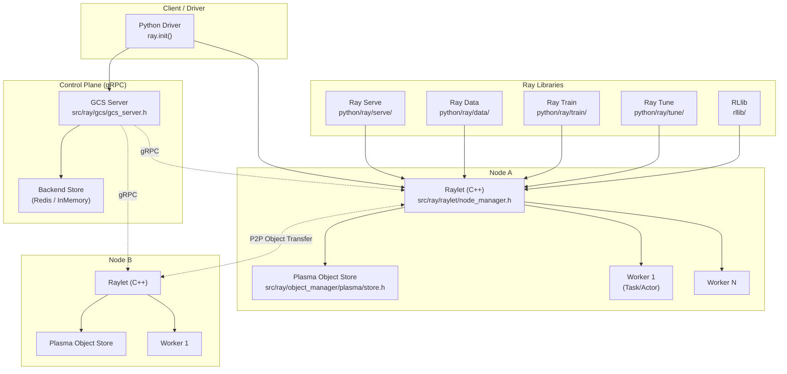
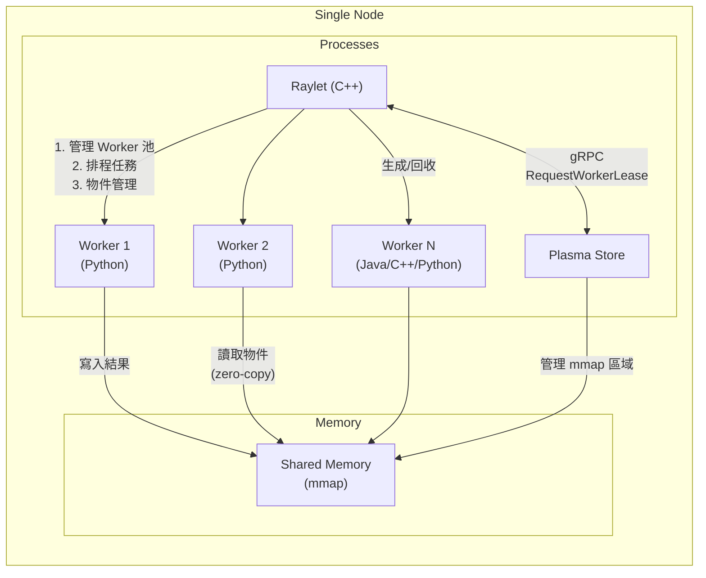

# Ray · 架構

## 高層架構

Ray 採用 **集中式控制面 + 分散式資料面** 的混合架構。控制面由一個 GCS (Global Control Service) 負責管理整個叢集的中繼資料，而資料傳輸（大型物件）則走節點間的點對點 Plasma 共享記憶體通道，不經過中央瓶頸。



**圖意說明**: Ray 的架構可以分為三個層次。(1)**控制面**的 GCS Server 是叢集的大腦，管理節點註冊、演員生命週期、任務事件等中繼資料，後端可選 Redis 或 InMemory 儲存。(2)**資料面**由每個節點上的 Raylet（C++ 行程）和 Plasma 物件儲存構成——Raylet 是本機排程器兼物件管理器，Plasma 則透過共享記憶體實現零拷貝傳輸。(3)**上層 Library**（Serve、Data、Train、Tune、RLlib）全部建在底層的 task/actor/object primitives 之上，沒有任何一個繞過 Raylet 直接呼叫 GCS。

### 節點內部元件關係



**圖意說明**: 每個 Ray 節點上運行至少三個行程群組——Raylet（排程 + 管理）、Plasma Store（共享記憶體服務）、Worker 行程（執行使用者程式碼）。Worker 之間不直接通訊，所有物件傳輸透過 Plasma 的共享記憶體進行。Raylet 負責決定哪個 Worker 執行哪個任務，以及何時需要從遠端 Plasma 拉取物件。

## 公開 API 結構

Ray 提供三組不同層次的 API：

| 層次 | 進入點 | 用途 | 位置 |
|------|--------|------|------|
| **底層 Primitives** | `ray.remote(f)` | 將函數轉為遠端任務 | [`python/ray/_private/worker.py:3580`](https://github.com/ray-project/ray/blob/7ddc3faa761ab533eaff081be4db7dcea683ea56/python/ray/_private/worker.py#L3580-L3811) |
| | `ray.init()` | 啟動或連接 Ray 叢集 | [`python/ray/_private/worker.py:1438`](https://github.com/ray-project/ray/blob/7ddc3faa761ab533eaff081be4db7dcea683ea56/python/ray/_private/worker.py#L1438-L2060) |
| | `ray.get(ref)` | 等待並取得物件 | [`python/ray/_private/worker.py:2869`](https://github.com/ray-project/ray/blob/7ddc3faa761ab533eaff081be4db7dcea683ea56/python/ray/_private/worker.py#L2869) |
| | `ray.put(obj)` | 將物件存入 Plasma | [`python/ray/_private/worker.py`](https://github.com/ray-project/ray/blob/7ddc3faa761ab533eaff081be4db7dcea683ea56/python/ray/_private/worker.py) |
| | `ray.wait(refs)` | 等待一批 object refs | [`python/ray/_private/worker.py`](https://github.com/ray-project/ray/blob/7ddc3faa761ab533eaff081be4db7dcea683ea56/python/ray/_private/worker.py) |
| **Actor 模型** | `@ray.remote class Actor` | 定義有狀態的遠端物件 | [`python/ray/actor.py`](https://github.com/ray-project/ray/blob/7ddc3faa761ab533eaff081be4db7dcea683ea56/python/ray/actor.py) |
| | `actor.handle.method()` | 呼叫 actor 方法 | |
| **高階 Library** | `serve.run(app)` | 部署模型服務 | [`python/ray/serve/api.py`](https://github.com/ray-project/ray/blob/7ddc3faa761ab533eaff081be4db7dcea683ea56/python/ray/serve/api.py) |
| | `ray.data.read_parquet()` | 建立分散式資料集 | [`python/ray/data/dataset.py:196`](https://github.com/ray-project/ray/blob/7ddc3faa761ab533eaff081be4db7dcea683ea56/python/ray/data/dataset.py#L196) |
| | `Trainer.fit()` | 執行分散式訓練 | [`python/ray/train/trainer.py`](https://github.com/ray-project/ray/blob/7ddc3faa761ab533eaff081be4db7dcea683ea56/python/ray/train/trainer.py) |

### 典型用法

```python
import ray

ray.init()  # 啟動或連接叢集

@ray.remote(num_gpus=1, max_retries=3)
def train_model(config):
    result = do_training(config)
    return result

futures = [train_model.remote(c) for c in configs]
results = ray.get(futures)  # 阻塞等待所有完成
```

## 內部分層

### GCS Server (Global Control Service)

- **職責**: 叢集控制面：節點註冊/心跳、演員生命週期管理、任務事件記錄、放置群組管理、KV 儲存、pub/sub 事件
- **位置**: [`src/ray/gcs/gcs_server.h`](https://github.com/ray-project/ray/blob/7ddc3faa761ab533eaff081be4db7dcea683ea56/src/ray/gcs/gcs_server.h)
- **子管理員**: `GcsNodeManager`（節點管理）、`GcsActorManager`（演員管理）、`GcsJobManager`、`GcsPlacementGroupManager`、`GcsResourceManager`、`GcsTaskManager`
- **對其他層的依賴**: 後端可選 Redis 或 InMemory 儲存（`RedisStoreClient`/`InMemoryStoreClient`），儲存中繼資料

### Raylet (C++ Node Manager)

- **職責**: 每個節點一個，同時是**本地排程器**（接受任務租約請求）和**物件管理器**（管理 Plasma 物件傳輸）
- **位置**: [`src/ray/raylet/node_manager.h`](https://github.com/ray-project/ray/blob/7ddc3faa761ab533eaff081be4db7dcea683ea56/src/ray/raylet/node_manager.h)
- **關鍵子元件**:
  - `WorkerPool`——管理 Worker 行程的生成與回收（支援 Python/C++/Java）
  - `ClusterResourceScheduler`——全域資源感知排程（包含 `CompositeSchedulingPolicy` -> `HybridSchedulingPolicy`）
  - `LocalObjectManager`——本地 Plasma 記憶體管理與物件溢出(spill to disk)
- **設計決策 — 二合一設計**: Raylet 為什麼同時做排程和物件管理？因為排程決策需要考量物件 locality（資料本地性）。合併兩者讓排程器能直接感知本機 Plasma 的記憶體壓力與物件位置。**權衡**: 耦合度高，Raylet 當機時整個節點停擺。
- **相關程式碼**: [`src/ray/raylet/scheduling/policy/hybrid_scheduling_policy.h:29-49`](https://github.com/ray-project/ray/blob/7ddc3faa761ab533eaff081be4db7dcea683ea56/src/ray/raylet/scheduling/policy/hybrid_scheduling_policy.h#L29-L49)

### Plasma Object Store

- **職責**: 每個節點上的共享記憶體物件儲存，透過 `mmap` 實現零拷貝資料傳輸
- **位置**: [`src/ray/object_manager/plasma/store.h`](https://github.com/ray-project/ray/blob/7ddc3faa761ab533eaff081be4db7dcea683ea56/src/ray/object_manager/plasma/store.h)
- **核心類別**: `PlasmaStore`（主事件迴圈）、`ObjectStore`（CRUD）、`EvictionPolicy`（LRU 淘汰）、`PlasmaAllocator`（記憶體分配，支援 huge pages 與 disk fallback）
- **通訊方式**: Unix domain socket（`plasma_store_socket_name`），客戶端透過 `PlasmaClient` 連接
- **設計決策**: 選擇共享記憶體而非透過網路傳送有兩個理由：(1)大資料（>100KB）的序列化成本遠高於 mmap 讀取；(2)同一個節點上的多個 Worker 可以直接讀取同一記憶體頁面。**權衡**: 有限於單節點實體記憶體；記憶體不足時需 spill to disk 或從遠端拉取。

### Core Worker

- **職責**: 每個任務/演員行程一個，負責序列化函數與參數、提交任務到 Raylet、從 Plasma 取得物件
- **位置**: Python 層在 `python/ray/_private/worker.py`，C++ 層在 `src/ray/core_worker/`
- **內部路徑**: `core_worker.submit_task()` → gRPC `RequestWorkerLease` → 透過 Raylet 排程

### Driver

- 即 `ray.init()` 後的使用者程式行程，透過 `global_worker`（`CoreWorker` 實例）與叢集互動

### 高階 Library 層

建在底層 primitives 之上的四個主要 Library，各自對應不同的 AI workload：

| Library | 用途 | 底層使用方式 | 主要抽象 |
|---------|------|-------------|---------|
| **Serve** | 模型服務 | Actor（replica 是長期 actor） | Deployment → Application → serve.run() |
| **Data** | 分散式資料處理 | Task（每個轉換是一個 task） | Dataset → Transform → Consume |
| **Train** | 分散式訓練 | Actor（worker group by actor） | Trainer(backend=torch) → fit() |
| **Tune** | 超參數調優 | Task（每個 trial 是一個 task） | Tuner(config, search_alg, scheduler) |

## 擴充機制

Ray 的擴充性主要體現在三個層面：

- **Custom Resources**: 使用者可定義任意字串作為資源名稱（`resources={"my_accelerator": 1}`），Raylet 的排程器原生支援
- **Scheduling Strategy**: 可透過 `@ray.remote(scheduling_strategy=...)` 指定 `PlacementGroupSchedulingStrategy`、`NodeAffinitySchedulingStrategy` 等
- **Ray Serve AutoscalingPolicy**: [`python/ray/serve/autoscaling_policy.py:1`](https://github.com/ray-project/ray/blob/7ddc3faa761ab533eaff081be4db7dcea683ea56/python/ray/serve/autoscaling_policy.py) — 公開介面，使用者可自訂擴縮邏輯。內建有基於 `target_ongoing_requests` 的預設政策

## 公開 vs 內部界線

- **`ray/__init__.py`**: [`python/ray/__init__.py:175`](https://github.com/ray-project/ray/blob/7ddc3faa761ab533eaff081be4db7dcea683ea56/python/ray/__init__.py#L175-L205) — `__all__` 明確定義了公開 API
- **被視為內部的**: `ray._private/`、`ray/_internal/`、函數名以底線開頭者（如 `_configure_system`）
- **自動初始化機制**: [`python/ray/_private/auto_init_hook.py`](https://github.com/ray-project/ray/blob/7ddc3faa761ab533eaff081be4db7dcea683ea56/python/ray/_private/auto_init_hook.py) — 部分 API（如 `ray.get()`、`ray.put()`、`ray.wait()`）在呼叫時會自動觸發 `ray.init()`，降低新手門檻。但也有 API（如 `ray.remote()`、`ray.shutdown()`）不會自動 init，因為它們在沒有叢集時也有語意

## 跨節點通訊協定

- **gRPC**: Worker → Raylet、Raylet ↔ Raylet、Raylet → GCS 之間的所有控制訊息
- **Protocol Buffers**: 所有跨行程資料使用 protobuf 序列化（`src/ray/protobuf/` 定義了 gRPC service 與 message 的 scheme）
- **直接記憶體存取**: 同節點內，大型物件透過 Plasma 共享記憶體（mmap）傳輸，不經過 gRPC
- **Raylet gRPC 服務**: `src/ray/protobuf/node_manager.proto` — 定義 `RequestWorkerLease`、`WaitForActorOutOfScope`、`PrepareBundleResources` 等 RPC

## 測試策略

- **單元測試**: Python 端以 pytest 為主（`python/ray/tests/`），使用 `ray.cluster_utils.Cluster` 模擬多節點
- **C++ 單元測試**: 在 Bazel 中定義（`src/ray/*:tests` target），gtest framework
- **Release tests**: [`release/`](https://github.com/ray-project/ray/tree/7ddc3faa761ab533eaff081be4db7dcea683ea56/release) — 大規模的效能測試與壓力測試，在實際多節點叢集上執行
- **CI**: Buildkite（主要）+ GitHub Actions（輔助）

## 發布與版本管理

- **版本策略**: 語意化版本 (SemVer)，但 major version 增加不頻繁（目前仍在 2.x）
- **發布頻率**: 每月一次 minor release
- **Changelog**: 每次 release 有對應的 release note，但未見集中的 CHANGELOG.md 檔案
- **支援 Python 版本**: `>=3.10`（在 pyproject.toml 中設定）
