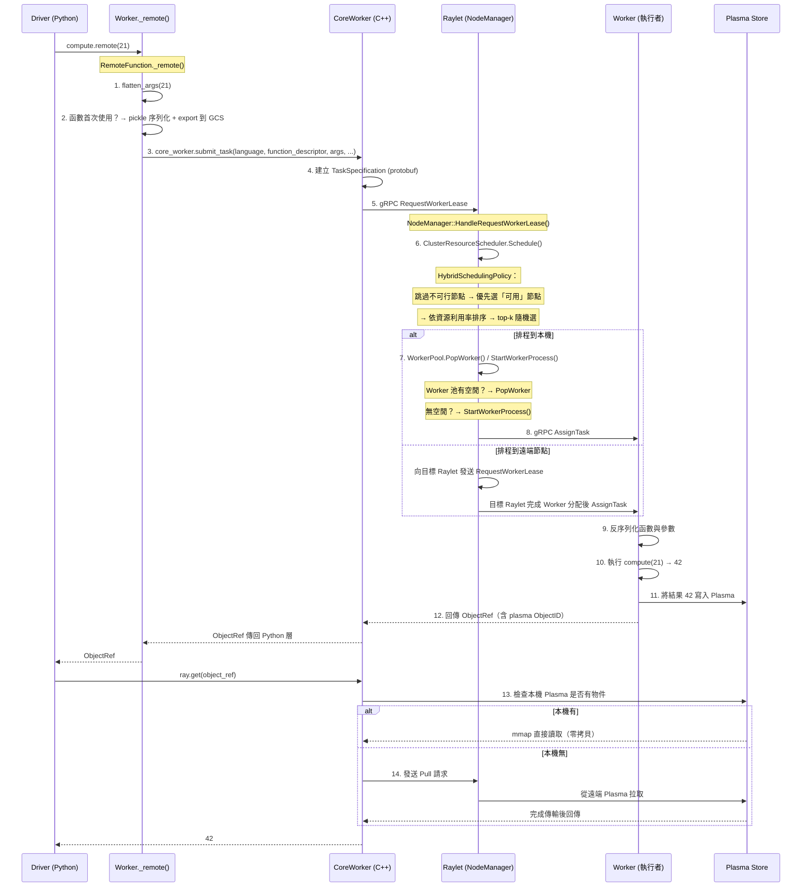

# Ray · 程式碼追蹤

## 追蹤的場景

**`ray.remote(f).remote(args)` — 從 Python 裝飾器到任務實際在 Worker 中執行並回傳結果的完整路徑。**

這條路徑是 Ray 最重要的控制流。理解它等於理解整個 Ray runtime 的任務調度機制。

```python
import ray

ray.init()

@ray.remote(num_cpus=1, max_retries=3)
def compute(x: int) -> int:
    return x * 2

future = compute.remote(21)    # 提交任務
result = ray.get(future)       # 等待結果
assert result == 42
```

## 流程圖



## 逐步追蹤

### Step 1: `compute.remote(21)` — 使用者呼叫

當使用者執行 `compute.remote(21)`，實際呼叫的是 `RemoteFunction` 實例上的代理方法。這個實例是在 `@ray.remote` 裝飾階段建立的。

### Step 2: `RemoteFunction._remote()` — 任務提交入口

[`python/ray/remote_function.py:314-523`](https://github.com/ray-project/ray/blob/7ddc3faa761ab533eaff081be4db7dcea683ea56/python/ray/remote_function.py#L314-L523)

這個方法做三件事：

1. **扁平化參數**（`flatten_args`）：將 Python 的 `*args, **kwargs` 轉為一個 list，因為 protobuf 不支援 dict 型別的可變參數。
2. **檢查是否需要匯出函數定義**：如果是該函數首次在叢集中被呼叫，則以 `pickle.dumps()` 序列化函數並透過 `worker.function_actor_manager.export()` 將定義註冊到 GCS。這確保工作節點可以反序列化函數。
3. **核心呼叫**：`worker.core_worker.submit_task(language, function_descriptor, args, num_returns, resources, ...)`——這就是從 Python 進入 C++ 層的交接點。

**值得注意**: 參數見的驗證幾乎不做在這層，而是留給 Raylet 在排程時判斷資源是否足夠。這是一種「快速提交、排程時才檢查」的設計——好處是呼叫端不需要等待，缺點是資源不足時任務會在排程佇列中阻塞。

### Step 3: `CoreWorker.submit_task()` — Python 到 C++ 的邊界

[`python/ray/_private/worker.py:3580-3811`](https://github.com/ray-project/ray/blob/7ddc3faa761ab533eaff081be4db7dcea683ea56/python/ray/_private/worker.py#L3580-L3811) → C++ `src/ray/core_worker/core_worker.cc`

CoreWorker 建立一個 `TaskSpecification` protobuf 訊息，填入：
- `function_descriptor`（哪個函數、哪個 module）
- `args`（扁平化後的參數，已序列化）
- `resources`（`num_cpus=1`）
- `max_retries=3`、`scheduling_strategy` 等

然後透過 gRPC 向**本機 Raylet** 發送 `RequestWorkerLease`。

**值得注意**: 這是**非同步**呼叫——`submit_task()` 立即回傳一個 `ObjectRef`，Driver 不會阻塞等任務真正開始執行。

### Step 4: Raylet `NodeManager::HandleRequestWorkerLease()` — 排程決策

[`src/ray/raylet/node_manager.cc`](https://github.com/ray-project/ray/blob/7ddc3faa761ab533eaff081be4db7dcea683ea56/src/ray/raylet/node_manager.cc)

Raylet 收到 gRPC 請求後，進入排程器：

1. `ClusterResourceScheduler.Schedule()` 取得叢集所有節點的資源狀態
2. 套用 `CompositeSchedulingPolicy`，預設為 `HybridSchedulingPolicy`

**HybridSchedulingPolicy 的決策邏輯**（[`src/ray/raylet/scheduling/policy/hybrid_scheduling_policy.h:29-49`](https://github.com/ray-project/ray/blob/7ddc3faa761ab533eaff081be4db7dcea683ea56/src/ray/raylet/scheduling/policy/hybrid_scheduling_policy.h#L29-L49)）:
1. 跳過資源不足的不可行節點
2. 剩餘節點分為兩類：**可用**（已有 worker，可立即執行）vs **可行**（有資源但需冷啟動 worker）
3. 先從「可用」節點中，按**關鍵資源利用率**排序，選出 top-k，再**隨機選擇一個**
4. 若無「可用」節點，才從「可行」節點中選擇

**設計假設**（來自程式碼註解）：(1) 新節點冷啟動昂貴；(2) 過載節點有吵鬧鄰居問題；(3) 資料本地性好處 < 前兩者的成本。因此優先選「已有 worker 的節點」。

這是一個**不顯然**的決定——大多數分散式框架（如 Spark）會優先將任務排程到資料所在的節點。但 Ray 的設計者認為在 AI workload 中，啟動 Worker 行程的開銷遠大於傳輸少量資料的開銷。

### Step 5: `WorkerPool.PopWorker()` — Worker 分配

若排程到本機：
- `WorkerPool.PopWorker()`: 檢查是否有已啟動的空閒 Worker
- 有 → 直接取用；無 → `WorkerPool.StartWorkerProcess()`，執行 `python default_worker.py ...` 啟動新行程

StartWorkerProcess 的啟動命令在 [`python/ray/_private/services.py:1588-1828`](https://github.com/ray-project/ray/blob/7ddc3faa761ab533eaff081be4db7dcea683ea56/python/ray/_private/services.py#L1588-L1828) 中構建。

**值得注意**: GPU 任務的 Worker `max_calls` 預設為 1（GPU memory leak protection），CPU 任務則無限。這是一個實務考量——GPU 記憶體分配不容易完全回收，讓 Worker 定期退出是保險作法。

### Step 6: `AssignTask` — 任務分派

Raylet 透過 gRPC 將 `TaskSpecification` 分配給 Worker。Worker 的 `default_worker.py` 啟動後不斷監聽來自 Raylet 的 gRPC 請求。

### Step 7: Worker 執行

Worker 接收任務後：
1. **反序列化函數**：從 GCS 取得 pickle 序列化的函數定義
2. **反序列化參數**：如果參數是 `ObjectRef` 形式，先從 Plasma 拉取實際值
3. **執行使用者函數**：`compute(21)` → 42
4. **寫入結果**：將回傳值透過 `ray.put()` 寫入本機 **Plasma Object Store**（共享記憶體）
5. **回傳 ObjectRef**：將包含 plasma Object ID 與 owner 資訊的 `ObjectRef` 透過 gRPC 傳回 Driver

### Step 8: `ray.get(object_ref)` — 結果讀取

[`python/ray/_private/worker.py:2869`](https://github.com/ray-project/ray/blob/7ddc3faa761ab533eaff081be4db7dcea683ea56/python/ray/_private/worker.py#L2869)

Driver 取得 `ObjectRef` 後可隨時呼叫 `ray.get(ref)`：

1. **本機檢查**: CoreWorker 先檢查本機 Plasma 是否存在該物件
2. **本機有** → `mmap` 直接讀取，**零拷貝**
3. **本機無** → 發送 `Pull` 請求，透過 Raylet 之間的物件管理器從 Owner Worker 所在的節點拉取

### 整個路徑經過的序列化/反序列化次數

| 步驟 | 序列化 | 反序列化 |
|------|--------|---------|
| 函數定義 (pickle) | 1 | 1 |
| 參數扁平化 | 1 | 0 |
| TaskSpec protobuf | 1 | 1 |
| 結果寫入 Plasma | 1 | 0 |
| 結果從 Plasma 讀取 | 0 | 1 |
| **總計** | **4 次序列化** | **3 次反序列化** |

以本地任務（同一節點）而言，這條路徑的全部延遲約在 **微秒到毫秒級別**（不含實際計算時間），其中 gRPC 呼叫佔主導。

## 想學更多時，在哪裡下中斷點

- 公開 API 入口: [`python/ray/remote_function.py:487`](https://github.com/ray-project/ray/blob/7ddc3faa761ab533eaff081be4db7dcea683ea56/python/ray/remote_function.py#L487) — `core_worker.submit_task()` 呼叫處
- 排程決策核心: [`src/ray/raylet/node_manager.cc`](https://github.com/ray-project/ray/blob/7ddc3faa761ab533eaff081be4db7dcea683ea56/src/ray/raylet/node_manager.cc) — `HandleRequestWorkerLease` 和 `Schedule`
- Worker 池管理: [`src/ray/raylet/worker_pool.h`](https://github.com/ray-project/ray/blob/7ddc3faa761ab533eaff081be4db7dcea683ea56/src/ray/raylet/worker_pool.h) — `PopWorker` / `StartWorkerProcess`
- 物件傳輸: [`src/ray/object_manager/plasma/store.h`](https://github.com/ray-project/ray/blob/7ddc3faa761ab533eaff081be4db7dcea683ea56/src/ray/object_manager/plasma/store.h) — `PlasmaStore`

## 沒追蹤到但值得留意

- **Actor 路徑**: 跟 task 路徑不同——Actor 首次呼叫需要向 GCS 註冊，GCS 任務 `GcsActorManager::RegisterActor()` 負責決定在哪個節點建立 Actor，這是一個獨立的排程決策
- **錯誤路徑**: 如果 Worker 崩潰，Raylet 的`NodeManager` 會偵測 `WorkerDead` 事件並觸發任務重試（如果 `max_retries > 0`）
- **物件溢出路徑**: 當 Plasma 記憶體不足時，`EvictionPolicy` 選擇要淘汰的物件並觸發 spill to disk（`src/ray/object_manager/plasma/eviction_policy.h`）
- **串流 generator**: `ObjectRefGenerator` / `DynamicObjectRefGenerator` — 用於 task 回傳 iterator 的場景，結果分批透過多個 ObjectRef 傳回
