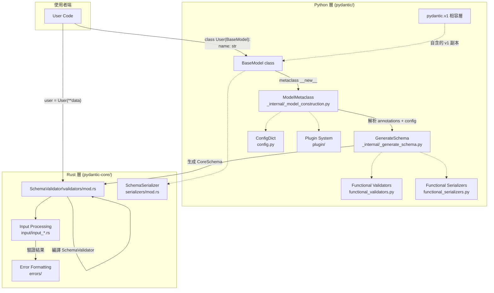

# Pydantic · 架構

## 高層架構

Pydantic v2 最核心的設計決定是：**拆成 Python 層與 Rust 層**。Python 層負責「理解 type hints，轉換成 schema」，Rust 層（pydantic-core）負責「執行 schema 的驗證與序列化」。



### 圖意說明

這張圖展示 Pydantic 的雙層架構與資料流。左半是 Python 層的**建置階段**：`ModelMetaclass.__new__` 在 class definition 時觸發，收集 type annotations 傳給 `GenerateSchema`，後者把 Python 型別樹轉換為 `CoreSchema`（pydantic-core 定義的 schema IR）。這個 schema 傳給 Rust 層的 `SchemaValidator` 進行編譯。右半是**執行階段**：當使用者呼叫 `User(**data)`，Rust 的 `SchemaValidator` 直接處理輸入資料。Python 層在建置後幾乎不再介入驗證流程。

---

## 內部分層

### ModelMetaclass (`_internal/_model_construction.py:89`)

核心入口。這是一個自訂的 `ABCMeta` 子類，攔截 Python 的 class 建立流程。在 `__new__` 中：

1. 收集 raw annotations（處理 Python 3.14+ 的 `annotationlib` 差異）
2. 從 bases 繼承 field names 與 class_vars
3. 解析 `model_config`（`ConfigWrapper.for_model`）
4. 收集 private attributes
5. 建立 DecoratorInfos（`@field_validator`、`@model_validator` 等）
6. 調用 `GenerateSchema` 產生 `CoreSchema`
7. 透過 pydantic-core 建立 `SchemaValidator` 與 `SchemaSerializer`
8. 合成 `__init__` 簽名（`generate_pydantic_signature`）

### GenerateSchema (`_internal/_generate_schema.py:1`)

全 repo 最大的單一模組（~2900 行），核心任務是實現一個函式：`Python type → CoreSchema`。採用**責任鏈（chain of responsibility）**模式：

```
GenerateSchema._known_schema_functions = {
    int: self.int_schema,
    str: self.str_schema,
    list: self.list_schema,
    dict: self.dict_schema,
    BaseModel: self.model_schema,
    ... 30+ 型別處理器
}
```

每個 handler 根據自己的型別規則，產出對應的 `pydantic_core.core_schema.*` 結構。特別的設計：

- **`Annotated[T, ...]` 支援**：遍歷 metadata，檢查是否有 `AfterValidator`、`BeforeValidator`、`Field` 等 Pydantic 內建 annotation
- **`__get_pydantic_core_schema__` protocol**：讓第三方型別可以定義自己的 schema 產生邏輯
- **forward reference 解析**：透過 `NsResolver` 延遲解析尚未定義的型別

### pydantic-core (`pydantic-core/src/`)

Rust crate，透過 PyO3 綁定到 Python。主要結構：

| Rust 模組 | 職責 | 對應 Python 匯出 |
|---|---|---|
| `validators/mod.rs` | `SchemaValidator` — compiled schema validator | `pydantic_core.SchemaValidator` |
| `serializers/mod.rs` | `SchemaSerializer` — compiled schema serializer | `pydantic_core.SchemaSerializer` |
| `validators/typed_dict.rs` | TypedDict 驗證邏輯 | 內部 |
| `validators/model.rs` | BaseModel 驗證邏輯 | 內部 |
| `validators/union.rs` | Union 驗證（含 discriminated union） | 內部 |
| `validators/chain.rs` | chain validator（lax + strict） | 內部 |
| `input/input_python.rs` | Python 物件輸入標準化 | 內部 |
| `input/input_json.rs` | JSON 輸入標準化 | 內部 |
| `errors/` | 驗證錯誤格式化 | `pydantic_core.ValidationError` |

### Plugin 系統 (`plugin/`)

不同於常見 middleware 或 hook 模式，Pydantic 的 plugin 是**protocol-based**：

```python
class PydanticPluginProtocol(Protocol):
    def new_schema_validator(self, schema, schema_type, schema_type_path, schema_kind, config, plugin_settings) -> tuple[handler | None, handler | None, handler | None]:
        ...
```

回傳三個 handler（Python validate / JSON validate / Strings validate），每個 handler 可以在對應的 validate 方法被呼叫時攔截輸入並轉發給原始的 pydantic-core validator。這種設計讓 plugin 可以 wrapping validator 而非取代整個流程。

使用於 Pydantic Logfire 作為監控 hook。

### pydantic.v1 (`pydantic/v1/`)

一個完整的 Pydantic v1.10 clone，作為 sub-package 嵌在 v2 內。共有 `pydantic/v1/main.py`、`pydantic/v1/fields.py` 等 30+ 個模組，幾乎是 v1 原始碼的 snapshot。使用者可 `from pydantic import v1` 逐步遷移。

### ConfigDict (`config.py`)

配置系統採用 **單一 dict 介面**，不像 v1 用多個 class attribute。`ConfigDict` 是 `TypedDict`，所有 config 項目可在 class 定義時用 `model_config = ConfigDict(...)` 設定。支援：

- `extra: str` (allow / forbid / ignore) — 額外欄位處理策略
- `frozen: bool` — 是否不可變
- `strict: bool` — 是否嚴格模式
- `validate_default: bool` — 是否驗證預設值
- `ser_json_timedelta: str` — timedelta 序列化格式
- 共 50+ 參數

---

## 擴充機制

| 機制 | 說明 | 位置 |
|---|---|---|
| `Annotated[T, validator]` | 用 `Annotated` 添加驗證/序列化 metadata | `functional_validators.py`、`_generate_schema.py` |
| `__get_pydantic_core_schema__` | 型別自訂 schema protocol | `_generate_schema.py` |
| Plugin system | `PydanticPluginProtocol` + `new_schema_validator` hook | `plugin/__init__.py` |
| `RootModel` | 單一 field 的 model（wrapper pattern） | `root_model.py` |
| `TypeAdapter` | 非 model 型別的 validator/serializer | `type_adapter.py` |

---

## 公開 vs 內部界線

- **`__all__` exports**：定義在 `pydantic/__init__.py:73-246`，列出所有公開 API
- **內部模組**：以底線開頭 — `_internal/` 是主要的內部實作，`pydantic/v1/` 是相容層但也不鼓勵直接使用
- **動態 import 機制**：`__init__.py` 使用 `__getattr__` + `_dynamic_imports` dict 延遲載入（lazy loading）公開 API 的名稱；type checking 時則用 `TYPE_CHECKING` 區塊預先匯入以支援 IDE
- **破壞性變更處理**：使用多層 deprecation warnings — `PydanticDeprecatedSince20`、`PydanticDeprecatedSince26`、...、`PydanticDeprecatedSince212`，對應不同版本的 deprecated items

---

## 配置系統

- **Config 入口**：`model_config: ClassVar[ConfigDict]`。參考 [`config.py:1`](https://github.com/pydantic/pydantic/blob/86f6bbf/pydantic/config.py#L1)
- **配置來源優先級**：class `model_config` > namespace kwargs > base class config > default
- **解析實現**：`ConfigWrapper.for_model()` — 從 `namespace`、`kwargs`、`bases` 合併配置。參考 `_internal/_config.py`

---

## 測試策略

- **單元測試**：位於 `tests/`，約 40+ 測試檔。涵蓋 `tests/test_main.py`、`tests/types/`、`tests/benchmarks/` 等
- **屬性測試**：使用 Hypothesis（classifiers 中標記 `Framework :: Hypothesis`）
- **Benchmark**：使用 `pytest-benchmark` + `pytest-codspeed`，位於 `tests/benchmarks/`
- **CI 矩陣**：測試 Python 3.10 ~ 3.14，跨平台（Linux / macOS / Windows）


---

## 發布與版本管理

- **版本策略**：寬鬆 SemVer（minor 可以有 breaking change，但透過 deprecation warnings 預警）
- **Release 頻率**：約每月 1-2 次 minor，不定期 patch。v2 從 2023 中發布至今已到 v2.14
- **Changelog**：`HISTORY.md`（在 PyPI README 中合併）
- **pydantic-core 版本鎖定**：`pydantic-core==2.47.0`（hard pin，版本號需同步）
