# Pydantic · 程式碼追蹤

## 追蹤的場景

追蹤一個最典型的 Pydantic 使用流程：**使用者定義 model → 傳遞 dict 建立 instance → 型別轉換 + 驗證**。

```python
from pydantic import BaseModel
from typing import Optional
from datetime import datetime

class User(BaseModel):
    id: int
    name: str = 'John Doe'
    signup_ts: Optional[datetime] = None
    friends: list[int] = []

external_data = {
    'id': '123',
    'signup_ts': '2017-06-01 12:22',
    'friends': [1, '2', b'3'],
}
user = User(**external_data)
```

預期結果：
- `id` 從 `'123'` 字串轉成 `123` int
- `signup_ts` 從 `'2017-06-01 12:22'` 字串轉成 `datetime` 物件
- `friends` 中 `'2'` 轉成 `2`、`b'3'` 轉成 `3`

## 流程圖

```mermaid
sequenceDiagram
    participant U as User Code
    participant MC as ModelMetaclass.__new__
    participant GS as GenerateSchema
    participant PC as pydantic-core
    participant BM as BaseModel.__init__

    rect rgb(30, 40, 60)
        Note over U,PC: Phase 1: Class Definition (metaclass time)
        U->>MC: class User(BaseModel):\n  id: int
        MC->>MC: 解析 raw_annotations
        MC->>MC: 收集 config + decorators
        MC->>GS: generate_schema(cls)
        GS->>GS: 遍歷 type hints tree
        GS-->>PC: CoreSchema\n(e.g. model_fields_schema)
        PC->>PC: compile SchemaValidator
        PC-->>BM: __pydantic_validator__
        PC->>PC: compile SchemaSerializer
        PC-->>BM: __pydantic_serializer__
        Note over BM: User(**external_data) callable
    end

    rect rgb(40, 30, 50)
        Note over U,PC: Phase 2: Instance Creation (runtime)
        U->>BM: User(**external_data)
        BM->>BM: object.__setattr__ bypass
        BM->>PC: __pydantic_validator__\n.validate_python(data)
        PC->>PC: 型別轉換 + 驗證
        alt 驗證成功
            PC-->>BM: validated dict
            BM->>BM: __dict__ = validated dict
            BM->>BM: __pydantic_fields_set__
            BM-->>U: User instance
        else 驗證失敗
            PC-->>BM: ValidationError
            BM-->>U: raise
        end
    end
```



### 圖意說明

這張 sequence diagram 展示了 Pydantic 的兩個截然不同的階段。Phase 1（藍色）發生在 **class 被定義時** — Python 會呼叫 `ModelMetaclass.__new__`，在這之中完成 schema 的生成與編譯。Phase 2（紫色）發生在 **instance 被建立時** — Rust 的 `SchemaValidator` 接手，Python 層幾乎不介入。

---

## 逐步追蹤

### Phase 1 — Class Definition（Metaclass 時間）

#### Step 1: ModelMetaclass.__new__ 觸發

當 Python 執行 `class User(BaseModel)` 時，因為 `BaseModel` 使用了 `ModelMetaclass` 作為 metaclass，Python 會呼叫 `ModelMetaclass.__new__`。

入口位置：[`_internal/_model_construction.py:90`](https://github.com/pydantic/pydantic/blob/86f6bbf/pydantic/_internal/_model_construction.py#L90)

```python
class ModelMetaclass(ABCMeta):
    def __new__(mcs, cls_name, bases, namespace, ...):
        if bases:  # 不是 BaseModel 本身，而是子類
            raw_annotations = ...  # 處理 3.10~3.14 的 annotation 差異
            ...
```

**值得注意**：
- `if bases:` — 這個判斷很重要：`BaseModel` 定義時 `bases` 為空，不執行 Pydantic 邏輯；只有子類定義時才觸發
- `raw_annotations` 的獲取在 Python 3.10–3.13 用 `namespace.get('__annotations__')`，到了 **3.14 必須改用 `annotationlib`** 的 `call_annotate_function`（`_model_construction.py:119-133`）。這是因為 Python 3.14 改了 annotation 的儲存方式，Pydantic 必須同步處理

#### Step 2: Config 與 Decorators 收集

[`_model_construction.py:135-182`](https://github.com/pydantic/pydantic/blob/86f6bbf/pydantic/_internal/_model_construction.py#L135)

```python
config_wrapper = ConfigWrapper.for_model(bases, namespace, raw_annotations, kwargs)
namespace['model_config'] = config_wrapper.config_dict
```

同時收集所有 `@field_validator`、`@model_validator`、`@field_serializer`、`@model_serializer` 等 decorator 資訊，存在 `DecoratorInfos` 中。

**值得注意**：decorators 是在 **metaclass 中一次收集**，執行時不再重複解析。這是效能關鍵。

#### Step 3: 產生 CoreSchema

[`_generate_schema.py`](https://github.com/pydantic/pydantic/blob/86f6bbf/pydantic/_internal/_generate_schema.py) — 全 repo 最大的模組。

```python
# `_model_construction.py` 中呼叫：
collected_schemas = GenerateSchema(config_wrapper, types_namespace).generate_schema(cls)
```

`GenerateSchema` 的設計是用責任鏈（chain of responsibility）：對每個 type hint，按順序嘗試 handler，直到匹配。例如：

- `int` → `self.int_schema()` → 產出 `core_schema.int()`
- `str` → `self.str_schema()` → 產出 `core_schema.str()`
- `Optional[datetime]` → 先解包 Optional，再 `self.datetime_schema()` → 產出 `core_schema.union([core_schema.datetime(), core_schema.none()])`
- `list[int]` → `self.list_schema()` → 產出 `core_schema.list(core_schema.int())`
- `BaseModel` → `self.model_schema()` → 遞迴產生整個 model 的 schema

對於我們的 `User` model，產出的 `CoreSchema` 大致為（簡化）：

```json
{
  "type": "model-fields",
  "fields": {
    "id": {"schema": {"type": "int"}, "required": true},
    "name": {"schema": {"type": "str"}, "default": "John Doe"},
    "signup_ts": {"schema": {"type": "union", "variants": [
      {"type": "datetime"},
      {"type": "none"}
    ]}, "default": null},
    "friends": {"schema": {"type": "list", "items_schema": {"type": "int"}}, "default": []}
  }
}
```

#### Step 4: pydantic-core 編譯

`CoreSchema` 被傳給 pydantic-core：

[`_model_construction.py` — via `create_schema_validator`](https://github.com/pydantic/pydantic/blob/86f6bbf/pydantic/_internal/_model_construction.py#L400-L420)

```python
cls.__pydantic_validator__ = create_schema_validator(
    schema=core_schema,
    schema_type=cls,
    schema_type_path=SchemaTypePath(cls),
    schema_kind='BaseModel',
    config=core_config,
    plugin_settings={},
)
```

`create_schema_validator` 會：
1. 調用所有 plugin 的 `new_schema_validator`（如果有 plugin 註冊）
2. 最後呼叫 `pydantic_core.SchemaValidator(schema, config)` — 這在 Rust 層編譯成一個高效的驗證器

**[UNVERIFIED]** 這個編譯過程可能包括：將 schema tree flatten 成連續的 validator chain、pre-compute 欄位 layout、建立 lazy union dispatch table。

### Phase 2 — Instance Creation（Runtime）

#### Step 5: 使用者呼叫 User(**external_data)

[`main.py` BaseModel.__init__](https://github.com/pydantic/pydantic/blob/86f6bbf/pydantic/main.py#L400-L450)

```python
def __init__(self, /, **data: Any) -> None:
    # 注意：這個 __init__ 是 metaclass 合成的
    ...
```

**關鍵設計決策**：`BaseModel.__init__` **不是**傳統的 Python `__init__`。Pydantic 用 metaclass 合成一個全新的 `__init__`，簽名根據 model 的 fields 動態產生（IDE 補全可以正確顯示參數名和型別）。

實作上，Pydantic 不直接調用 pydantic-core 就繞過了 `__init__`，而是：

```python
# 簡化版（實際在 TypeAdapter 或 validator 內部）
self.__dict__.update(self.__pydantic_validator__.validate_python(data))
```

注意這裡使用了 `object.__setattr__` 或直接操作 `__dict__` — **不使用 `self.field = value`**，避免觸發 `__setattr__` 中的 validate_assignment 邏輯（只有在 assignment 時才需要 validate）。

#### Step 6: pydantic-core validate_python

Rust 層的 `SchemaValidator::validate_python`([`pydantic-core/src/validators/mod.rs`](https://github.com/pydantic/pydantic/blob/86f6bbf/pydantic-core/src/validators/mod.rs)) 處理輸入：

1. **Input 標準化**：[`input/input_python.rs`](https://github.com/pydantic/pydantic/blob/86f6bbf/pydantic-core/src/input/input_python.rs) 把 Python dict 轉成 Rust 內部表示的 `ValIterator`
2. **逐欄位驗證**：對每個 field：
   - `id`: 輸入 `'123'` → `validators/int.rs` 嘗試字串解析 → 成功 → `123`
   - `signup_ts`: 輸入 `'2017-06-01 12:22'` → `validators/datetime.rs` 解析 → 成功 → `datetime(2017, 6, 1, 12, 22)`
   - `friends`: 輸入 `[1, '2', b'3']` → `validators/list.rs` 逐項處理：
     - `1` → `validators/int.rs` → 已是 int，直接通過
     - `'2'` → `validators/int.rs` → 字串解析 → 2
     - `b'3'` → `validators/int.rs` → bytes 解析 → 3
   - `name`: 未提供 → 使用預設值 `'John Doe'`

3. **Extra field 檢查**：根據 config 的 `extra` 設定決定是否允許未宣告的欄位

4. **Post-validator 執行**：`@model_validator(after=...)` 在這裡被觸發

#### Step 7: 結果包裝回傳

驗證成功後，pydantic-core 回傳一個 Python dict (validated data)，Pydantic 將它設為 `__dict__`：

```python
# 實際在 _model_construction.py 的 complete_model_class 附近
self.__dict__.update(validated_data)
self.__pydantic_fields_set__ = fields_set  # 記錄哪些欄位被顯式設定
```

同時處理：
- `model_post_init`（如果定義了）
- `__pydantic_private__` 初始化（如果 model 有 private attributes）

---

## 想學更多時，在哪裡下中斷點

| 中斷點位置 | 時機 | 觀察什麼 |
|---|---|---|
| `_internal/_model_construction.py:100` (ModelMetaclass.__new__) | class 定義時 | entire schema gen 流程 |
| `_internal/_generate_schema.py:GenerateSchema.generate_schema` | class 定義時 | Python type → CoreSchema 的轉換 |
| `internal/_model_construction.py` create_schema_validator 附近 | class 定義後 | schema 傳入 Rust 層 |
| `pydantic-core/src/validators/mod.rs` validate_python | `User(**data)` 時 | Rust 層的 validate 邏輯 |
| `main.py BaseModel.__init__` | instance 建立時 | __init__ 合成結果 |

---

## 沒追蹤到但值得留意

- **validate_assignment 路徑**：當 `model_config['validate_assignment']=True`，對已存在的 instance 設值時會走不同的 validator 路徑（`__pydantic_validator__.validate_assignment` 而非 `__pydantic_validator__.validate_python`）
- **JSON 驗證路徑**：`User.model_validate_json(json_str)` 使用 `validate_json` 而非 `validate_python`，Rust 層會走 `input/input_json.rs` 的路徑
- **Lax vs Strict 模式**：pydantic-core 支援 `lax_or_strict` validator chain，lax 模式失敗後自動降級到 strict
- **Recursive model 處理**：自我參照的 model（如 `class Category(BaseModel): children: list[Category]`）使用 `PydanticRecursiveRef` 延遲 schema 產生
