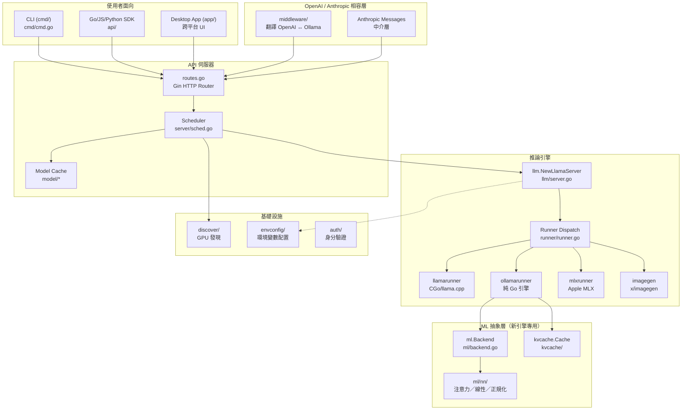
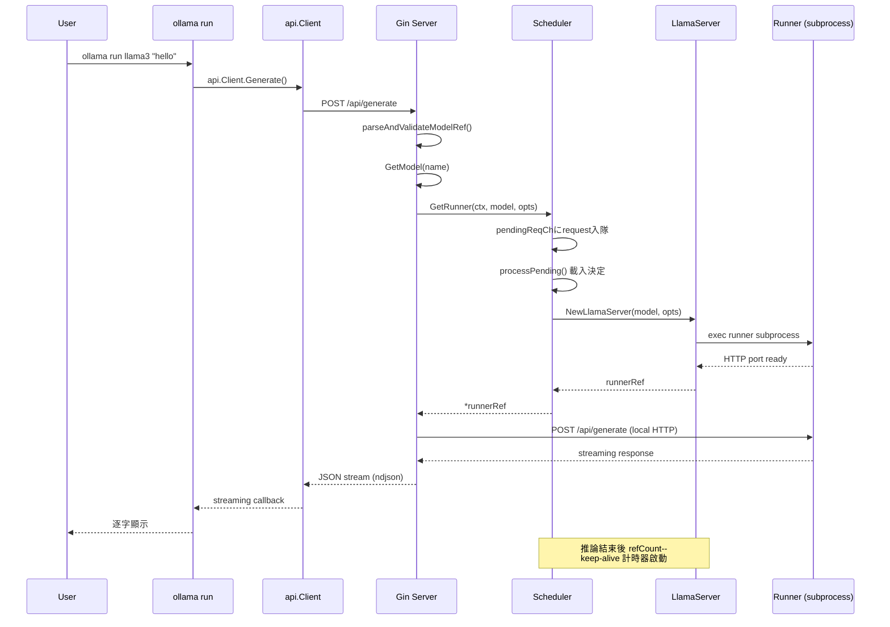
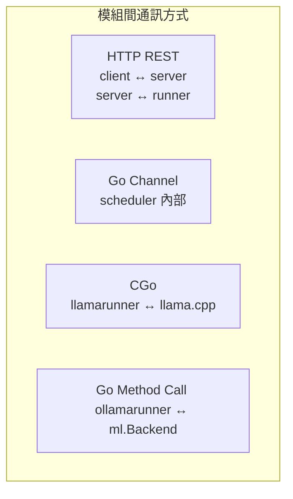
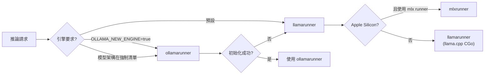

# Ollama · 架構

## 系統高層圖



**圖意說明**：這張圖展示 Ollama 的四層架構。最上層是多種使用者介面（CLI、Desktop App、語言 SDK），
透過 Gin HTTP server 統一接入。API 伺服層的核心是 `Scheduler`，它管理所有模型的生命週期——
決定何時載入、卸載、分配到哪個 GPU。真正的推論工作在第四層完成：
Ollama 支援**四種推論引擎**，透過 `runner/runner.go` 依參數分派：
`llamarunner`（預設，CGo/llama.cpp）、`ollamarunner`（新引擎，純 Go）、
`mlxrunner`（Apple Silicon 專用）、`imagegen`（圖片生成）。
其中 ollamarunner 使用全新的 `ml/` 張量抽象層與 `kvcache/` 抽象。

## 資料流 — 一次 Chat 請求的完整路徑



**圖意說明**：這個 sequence diagram 展示一次 `ollama run` 請求的完整路徑。
從 CLI 到 API client 到 HTTP server，關鍵轉折在 Scheduler 的 `GetRunner` 呼叫——
若模型已載入則直接回傳 runnerRef（refCount++），否則觸發載入流程：
`NewLlamaServer` 建立 `llm.Server` 結構，啟動 runner 子行程（透過 exec），
子行程啟動 HTTP server 監聽隨機 port，回傳 port number。
之後所有推論請求直接發到 runner 的本地 port，繞過主 server 的排程系統。

## 關鍵設計決策

### 決策 1：子行程隔離 vs CGo 嵌入

**選擇**：Ollama 選擇將推論引擎以**子行程（subprocess `exec.Cmd`）**方式啟動，
而非直接以 CGo link 到主行程。

**trade-off**：
- ✅ **崩潰隔離** — 如果 runner 段錯誤（C++ 中常見），主 server 不受影響，可自動重啟
  [`llm/server.go:358`](https://github.com/ollama/ollama/blob/f63eea3/llm/server.go#L358)
- ✅ **模型隔離** — 不同模型在不同行程，一個模型的記憶體洩漏不影響其他
- ✅ **動態選擇引擎** — 子行程參數可動態決定用 llamarunner 或 ollamarunner
  [`runner/runner.go:11`](https://github.com/ollama/ollama/blob/f63eea3/runner/runner.go#L11)
- ❌ **通訊成本** — 序列化/反序列化每步推論請求（HTTP + JSON）
- ❌ **啟動延遲** — 每次載入新模型都要啟動新行程，冷啟動 ~500ms-2s
- ❌ **資源管理複雜** — 主行程需管理子行程生命週期、備援、清理 zombie process

**比較**：vLLM 使用 Python 同行程（in-process）的 GPU kernel 呼叫，沒有行程通訊成本，
但崩潰會帶走整個 server。llama.cpp 本身是單行程設計。

### 決策 2：事件驅動排程器（Go channel）vs 輪詢模型

**選擇**：Scheduler 採用純 Go channel 的事件驅動設計，而非輪詢或鎖定模型。

**trade-off**：
- ✅ **無鎖設計** — Scheduler 核心只有一個 goroutine 處理 `pendingReqCh`，
  [`server/sched.go:38`](https://github.com/ollama/ollama/blob/f63eea3/server/sched.go#L38)
  用 `loadedMu sync.Mutex` 僅保護 `loaded` map 的讀取
- ✅ **清晰的狀態機** — 所有模型狀態（idle / loading / active / expiring）透過 channel 訊號轉換，
  沒有複雜的命週期狀態枚舉
- ✅ **可測試性** — 可注入 `loadFn`、`newServerFn`、`getGpuFn` 進行單元測試
  [`server/sched.go:54`](https://github.com/ollama/ollama/blob/f63eea3/server/sched.go#L54)
- ❌ **單點瓶頸** — 所有排程決策由單一 goroutine 處理，請求量大時可能阻塞
- ❌ **通道緩衝有限** — `pendingReqCh` 緩衝 = `OLLAMA_MAX_QUEUE`（預設 512），
  超量直接回傳 `ErrMaxQueue`

### 決策 3：雙引擎策略（llamarunner + ollamarunner）

**選擇**：Ollama 同時維護兩套推論引擎，以 `--ollama-engine` 標誌切換。

**trade-off**：
- ✅ **無痛遷移** — 傳統模型（Llama 2/3、Mistral）繼續跑 llamarunner，
  新模型（Gemma 3/4、Llama 4、Qwen 3）強制使用 ollamarunner
  [`llm/server.go:148`](https://github.com/ollama/ollama/blob/f63eea3/llm/server.go#L148)
- ✅ **可降級** — 若 ollamarunner 初始化失敗，自動 fallback 到 llamarunner
- ✅ **新引擎可獨立演進** — `ml/` 抽象層、`kvcache/`、`nn/` 全部用純 Go 實作，
  不需理解 llama.cpp 的 C++ 程式碼
- ❌ **維護成本雙倍** — 需要同時追蹤 llama.cpp upstream 改動和新引擎的 bug
- ❌ **行為不一致風險** — 兩套引擎的 sampling、KV cache 管理、batch 排程細節不同，
  可能產生不同輸出

## 模組通訊架構



- **HTTP REST**：API client ↔ server（`api/client.go`），以及 server ↔ runner substprocess
  （runner 啟動後監聽隨機 port，主 server 透過 HTTP 發送推論請求）
- **Go Channel**：Scheduler 內部使用 channel 作為事件匯流排
  （`pendingReqCh`、`finishedReqCh`、`expiredCh`、`unloadedCh`）
- **CGo**：llamarunner 透過 `#include "llama.h"` 的 CGo binding 呼叫 llama.cpp 的 C API
- **Go Method Call**：ollamarunner 直接呼叫 `ml.Backend` 的 `NewContext()` / `Compute()`

## 狀態管理

**模型狀態**：由 Scheduler 的 `runnerRef` 結構管理，關鍵欄位：
- `refCount`（atomic counter）— 目前有多少請求在使用此 runner
- `expireTimer` — keep-alive 到期計時器
- `sessionDuration` — 從 `OLLAMA_KEEP_ALIVE` 或請求中的 `keepAlive` 欄位決定

**狀態轉換**：
```
Idle (refCount=0) --[新請求]--> Active (refCount++)
Active --[請求完成]--> Idle (refCount--)
Idle --[timer expired]--> Expiring --[unloaded]--> Removed
Expiring --[新請求]--> Active (timer reset)
```

## 引擎選擇決策樹



## 平台支援

| 平台 | GPU 後端 | Runner 支援 |
|---|---|---|
| macOS | Metal（透過 MLX 或 Metal GGUF） | llamarunner + mlxrunner |
| Linux x86_64 | CUDA / ROCm / Vulkan | llamarunner + ollamarunner |
| Linux ARM64 | Vulkan | llamarunner + ollamarunner |
| Windows | CUDA / Vulkan | llamarunner + ollamarunner |
| Docker | 依主機 GPU | llamarunner + ollamarunner |

## 關鍵超參數與配置

| 環境變數 | 預設值 | 作用 |
|---|---|---|
| `OLLAMA_NUM_PARALLEL` | 1 | 每模型的並行請求數 |
| `OLLAMA_MAX_LOADED_MODELS` | 0 (= 3 × GPU 數) | 最大同時載入模型數 |
| `OLLAMA_MAX_QUEUE` | 512 | 最大排隊請求數 |
| `OLLAMA_KEEP_ALIVE` | 5m | 模型閒置保留時間 |
| `OLLAMA_LOAD_TIMEOUT` | 5m | 模型載入逾時 |
| `OLLAMA_GPU_OVERHEAD` | 0 bytes | GPU 保留記憶體 |
| `OLLAMA_FLASH_ATTENTION` | 隨模型 | Flash attention 開關 |
| `OLLAMA_KV_CACHE_TYPE` | f16 | KV cache 量化類型 |
| `OLLAMA_CONTEXT_LENGTH` | 0 | 預設 context length |
| `OLLAMA_NEW_ENGINE` | false | 啟用新推論引擎 |

## 失敗模式與降級策略

1. **runner 子行程崩潰** → `llama.Ping()` 檢測失敗 → `needsReload()` 回傳 true →
   下次請求時重新啟動 runner
2. **GPU 記憶體不足** → `createLayout()` 嘗試不同分配 → 若失敗，
   `findRunnerToUnload()` 驅逐其他模型 → 等待 `waitForVRAMRecovery`（預設 5s）→ 重試
3. **佇列滿** → 直接回傳 HTTP 503 `ErrMaxQueue`
4. **引擎初始化失敗** → ollamarunner 降級到 llamarunner
5. **模型格式不支援** → 新引擎回傳 `"not yet implemented"` error → 自動 fallback
